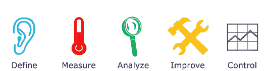

# 如何在数据质量改进中使用六适马

> 原文：<https://towardsdatascience.com/how-to-use-six-sigma-in-data-quality-improvements-f6d4d49838d9?source=collection_archive---------41----------------------->

## DMAIC 可以成为数据治理计划中一个有用的框架

我们到处都能听到数据的高度重要性。我们甚至称之为新石油。由于我们生活在一个数据驱动的时代，我们需要知道如何跟上数据趋势，并保持允许使用它的某种质量。[一旦你理解了目的](https://www.solution-tailor.com/post/10-reasons-why-you-need-reliable-data-quality)，你就可以开始在数据质量改进计划中采取行动。

[@钳工](https://unsplash.com/@benchaccounting)在 [Unsplash](https://unsplash.com/s/photos/dashboard?utm_source=unsplash&utm_medium=referral&utm_content=creditCopyText) 上的照片

在组织中拥有高质量数据的关键是意识和防弹过程。这里我们来关注第二个。当考虑过程时，DMAIC 循环非常方便，这个六适马框架确实是为过程改进而设计的。

*DMAIC 是一个数据驱动的改进周期，旨在应用于业务流程。在您的组织中实施将让您发现缺陷或低效——尤其是导致输出缺陷的缺陷——并与之斗争。目标是改进、优化或稳定现有流程。*

这听起来非常适合帮助提高数据质量，事实也确实如此。它可以帮助改进数据管理过程，并发现数据条目中的“缺陷”。该框架本身符合 5 个步骤，将引导您获得值得信赖的数据:

图片由[丹尼尔·彭菲尔德](https://commons.wikimedia.org/wiki/User:DanielPenfield)

1.**定义—** 从挑战业务需求开始。寻找受数据质量影响的主要利益相关者——他们可以是职能、部门、项目等。(示例—销售营销、人力资源、法律)

建立联系，与他们交谈，了解他们在流程中使用了哪些数据元素。创建调查并安排采访。你的目标是找出什么是相关的，这样你就不会最终创建一堆没人关心的指标和报告。识别数据管理流程和数据流—将它们放到地图上。

使用设计思维方法，如强调和构思，寻找要解决的问题和高效的改进机会。发出调查问卷并安排面试。

**输出:确定的机会**

**2。测量-** 尝试用数字描述流程，收集数据并执行数据分析活动，使其与数据质量维度保持一致。获得成效(取决于您组织的成熟度，但首先要关注数据合规性、一致性和唯一性)。用数字，而不只是空洞的论文。你可以阅读[如何设置数据质量仪表板](https://www.solution-tailor.com/post/data-quality-dashboard-your-cornerstone-in-improving-data-quality)

例如:

*   10 %的顾客是重复的。
*   20%的客户邮政编码具有有效的格式

尝试绘制数字并显示相关性，在此建立一个业务案例，并显示可以带来的好处—可以是报告准确性、减少浪费或法规遵从性。估计差的数据质量会在维护或罚款上花费多少。

**输出:过程性能测量**

**3。分析—** 数据管理流程应该能够产生满足最低数据质量要求的结果。这是你应该评估结果的地方。使用流程图、数据流、来源、确定的入口点，并在此基础上执行根本原因分析以下是一些有用的技术:

*   **5 个为什么**

这是一个非常简单的入门技巧。基本概念是问“为什么？”五次深入挖掘问题的根源。其背后的逻辑是，在前几个问题中，您将找到问题的原因之一，到第 5 个问题时，您将看到问题背后的流程失败。这个来自[维基百科](https://en.wikipedia.org/wiki/5_Whys)的例子很好地解释了这个问题:

1.  *为什么？—电池没电了。(第一个为什么)*
2.  *为什么？—交流发电机不起作用。(第二个为什么)*
3.  *为什么？—交流发电机皮带断裂。(第三个为什么)*
4.  *为什么？—交流发电机皮带远远超过其使用寿命，且未更换。(第四个为什么)*
5.  *为什么？—车辆没有按照推荐的维修* *计划进行维护。(第五个为什么是根本原因)*

*   **鱼骨图—石川图**

它显示了比 5whys 更全面的情况。这是一个高度可视化和头脑风暴的技术，引发了根本原因的进一步的例子。问题显示为右侧的鱼头，原因延伸到左侧的鱼骨。

*   **帕累托图**

帕累托原理广为人知。这个练习的目的是发现哪些变化对我们的输出影响最大。这种技术更多的是对变量进行加权，而不是寻找潜在的根本原因，帕累托图允许我们对根本原因本身进行优先排序。它显示了您应该首先处理哪些变化才能产生最大的影响，以及哪些变化不值得花费精力。

Pareto 的目标不是找到 x，而是找到正确的 x。它代表了最常见的缺陷来源、发生率最高的缺陷类型或客户投诉最常见的原因。

问自己一个问题，变异的可能来源是什么。查看历史数据，找出决定性因素，确定哪些进程或供给系统正在创建大部分垃圾记录。

**输出:问题**陈述**和确定的关键变量**

**4。改进** —一旦你发现流程中的薄弱环节，调查它们如何影响结果，并找出如何修复它们。尝试用价值比努力的方法去获得唾手可得的成果和快速的胜利。根据组织的成熟度，可以通过简单的调整(如用户界面应用程序中的数据输入验证)来修复流程。更复杂的可以使用弹性搜索或重复数据删除，甚至是实施新的主数据工具和流程的项目。

主要步骤是:

*   头脑风暴和设计解决方案-
*   确定预期结果
*   规划和实施解决方案

**输出:实施的解决方案。预测和测试结果**

**5。控制** —解决问题这不是最后一步。持续监控您的数据，以确保改进得以实施和保持。

创建数据质量指标，定期监控您的数据，并对任何相关变化做出反应。控制并信任这个过程，以确认你的改变是可持续的。

*   验证因问题陈述而导致的故障减少
*   确定是否需要其他改进
*   吸取的教训

**输出:性能监控、稳定性计划**

现在相信这个过程，你可以通过寻找下一个改进的机会重新开始这个循环。如果您迷失在数据质量度量中，遵循 DMAIC 步骤可以帮助组织您的项目并协调组织中数据清理计划的工作。这是一个坚实的框架，可以为您指明正确的方向，并让您了解数据质量之旅中的高层次计划。

*原载于 2021 年 4 月 13 日 https://www.solution-tailor.com***。**