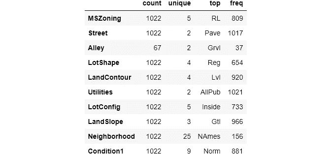

# 如何将 Sklearn 管道用于极其简洁的代码

> 原文：<https://towardsdatascience.com/how-to-use-sklearn-pipelines-for-ridiculously-neat-code-a61ab66ca90d?source=collection_archive---------2----------------------->

## 我喜欢的关于 Scikit-Learn 的一切，都在一个地方


**照片由**<https://www.pexels.com/@abhiram2244?utm_content=attributionCopyText&utm_medium=referral&utm_source=pexels>****[**像素**](https://www.pexels.com/photo/man-sitting-on-edge-facing-sunset-915972/?utm_content=attributionCopyText&utm_medium=referral&utm_source=pexels) 组成****

## ****为什么需要管道？****

****数据清理和准备很容易成为机器学习中最耗时、最无聊的任务。所有的 ML 算法都很繁琐，有些想要标准化或规范化的特征，有些想要编码的变量，有些则两者都想要。然后，还有一个总是存在的缺失值的问题。****

****处理它们一点都不好玩，更不用说在所有的训练、验证和测试集上重复相同的清理操作所带来的额外好处了。幸运的是，Scikit-learn 的`Pipeline`是促进这一过程的主要生产力工具，它清理代码并将所有预处理和建模步骤压缩到一行代码中。来，看看这个:****

****上图中，`pipe_lasso`是这种管道的一个实例，它填充了`X_train`中缺失的值，并通过拟合套索回归对数字列和一次性编码分类变量进行了特征缩放。当你调用`.predict`时，同样的步骤也适用于`X_test`，这真是太棒了。****

****管道结合了我喜欢的 Scikit-learn 的一切:简洁、一致和易于使用。所以，事不宜迟，让我在几分钟内展示如何构建自己的管道。****

****从这个[链接](https://raw.githubusercontent.com/BexTuychiev/medium_stories/master/2021/february/6_pipelines/Untitled.ipynb)下载笔记本或者在 Kaggle [这里](https://www.kaggle.com/bextuychiev/lasso-regression-with-pipelines-tutorial)运行。****

****<https://ibexorigin.medium.com/membership>  

获得由强大的 AI-Alpha 信号选择和总结的最佳和最新的 ML 和 AI 论文:

<https://alphasignal.ai/?referrer=Bex>  

## Scikit 简介-学习管道

在本部分和接下来的部分中，我们将为 [Ames Housing 数据集](https://www.kaggle.com/c/home-data-for-ml-course/data)一起构建上述`pipe_lasso`管道，该数据集用于 Kaggle 上的[班级竞赛](https://www.kaggle.com/c/home-data-for-ml-course/overview)。该数据集包含 81 个变量，几乎涉及房子的每个方面，利用这些变量，你必须预测房子的价格。让我们加载训练集和测试集:


除了最后一列— `SalePrice`之外的所有内容都用作特征。在我们做任何事情之前，让我们将训练数据分成训练集和验证集。我们将使用最终的`X_test`集进行预测。

现在，让我们对训练集做一个基本的探索:



19 个特征有 NaNs。

现在，开始预处理。对于数字列，我们首先使用平均值用`SimpleImputer`填充缺失值，使用`MinMaxScaler`填充特征比例。对于类别，我们将再次使用`SimpleImputer`用每一列的模式来填充缺失的值。最重要的是，我们在一个管道中完成所有这些工作。让我们导入所有内容:

我们为数字和分类特征创建了两个小管道:

> 将`handle_unknown`设置为`ignore`以跳过之前未看到的标签。否则，如果测试集中有不在训练集中的标签，则`OneHotEncoder`抛出错误。

`[sklearn.pipeline.Pipeline](https://scikit-learn.org/stable/modules/generated/sklearn.pipeline.Pipeline.html)`类接受一组转换器作为它的`steps`参数。每个元组应该具有以下模式:

```
('name_of_transformer`, transformer)
```

然后，每个元组被称为一个*步骤*，包含一个类似`SimpleImputer`的转换器和一个任意的名称。每个步骤都将被链接起来，并以给定的顺序应用于传递的数据帧。

但是，如果我们不知道它们应该应用于哪些列，这两条管道就没有用。为此，我们将使用另一个变压器— `ColumnTransformer`。

## 柱式变压器

默认情况下，所有的`Pipeline`对象都有`fit`和`transform`方法，可以用来转换输入数组，如下所示:

上面，我们在使用`fit_transform`的`X_train`上使用了新的数字预处理器。我们用`select_dtypes`指定列。但是，以这种方式使用管道意味着我们必须在选定的列上分别调用每个管道，这不是我们想要的。我们希望有一个单一的预处理器，它能够在一行代码中执行数值和分类转换，如下所示:

```
full_processor.fit_transform(X_train)
```

为了实现这一点，我们将使用`ColumnTransformer`类:

> 记住`numerical_features`和`categorical_features`包含了`X_train`中各个列的名称。

类似于`Pipeline`类，`ColumnTransformer`取一个变形金刚元组。每个元组应该包含一个任意的步骤名、转换器本身和应该应用转换器的列名列表。在这里，我们使用数值和分类预处理管道创建了一个包含 2 个步骤的列转换器。现在，我们可以用它来完全改造`X_train`:

注意，大多数转换器返回`numpy`数组，这意味着索引和列名将被删除。

最后，我们设法将所有预处理步骤压缩成一行代码。然而，我们可以走得更远。我们可以将预处理和建模结合起来，得到更整洁的代码。

## 具有估计器的最终流水线

向管道中添加一个估计器(模型)就像创建一个包含上面的列转换器和模型本身的新管道一样简单。让我们导入并实例化`LassoRegression`，并用`full_processor`将其添加到新管道中:

> 警告！步骤的顺序很重要！估计器应该总是管道正确工作的最后一步。

就是这样！我们现在可以像调用任何其他模型一样调用`lasso_pipeline`。当我们调用`.fit`时，管道在拟合估计器之前应用所有转换:

```
_ = lasso_pipeline.fit(X_train, y_train)
```

让我们在验证集上评估我们的基本模型(记住，我们有一个单独的测试集，到目前为止我们还没有接触过):

太好了，我们的基地管道工程。管道的另一个优点是，它们可以被视为任何其他模型。换句话说，我们可以把它插入任何我们会使用 Scikit-learn 估计器的地方。因此，我们将在下一节中使用网格搜索中的管道来寻找最佳超参数。

## 到处使用你的管道

`Lasso`的主要超参数是α，范围从 0 到无穷大。为简单起见，我们将仅以 0.05 为步长对 0 和 1 之间的值进行交叉验证:

现在，我们打印出`Lasso`的最佳分数和参数:

如你所见，best `alpha`是 0.95，这是我们给定区间的终点，即步长为 0.05 的[0，1]。我们需要再次搜索，以防最佳参数位于更大的区间:

使用最好的超参数，我们得到了 MAE 的显著下降(这是好的)。让我们用`Lasso(alpha=76)`重新定义我们的管道:

将其安装到`X_train`，在`X_valid`进行验证，并使用`X_test`提交比赛预测:

## 结论

总之，管道为您的日常工作流程带来了几个优势，例如代码简洁快速、易于使用以及多个步骤的就地修改。在示例中，我们使用简单的套索回归，但是我们创建的管道可以用于几乎任何模型。去用它来建造一些令人敬畏的东西吧！****