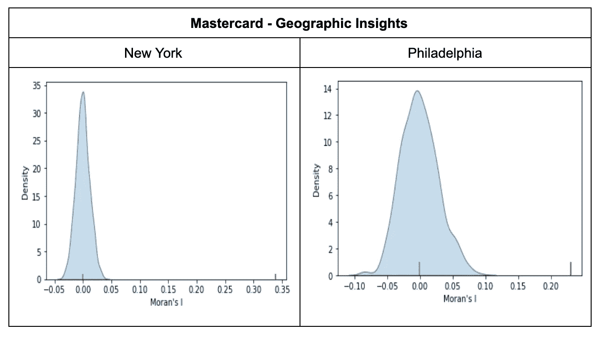

# 如何利用空间数据识别 CPG 需求热点

> 原文：<https://towardsdatascience.com/how-to-use-spatial-data-to-identify-cpg-demand-hotspots-c7ad6dfafd55?source=collection_archive---------58----------------------->

## [实践教程](https://towardsdatascience.com/tagged/hands-on-tutorials)

## 使用空间分析检测包装消费品的需求热点。

近年来，属于有机/天然/本地类别的产品的消费和促销急剧增加。这些是特定类型的产品，没有经过任何工业加工或缺乏某些食品添加剂和防腐剂。在美国，有机产品的营销显著增长，吸引了寻找健康产品和植物性食品的新一代消费者。根据[有机贸易协会](https://ota.com/hotspots)【1】，有机食品是美国食品工业中增长最快的部门:

> *有机食品是美国食品工业中增长最快的部分。有机食品的销售额以每年两位数的速度增长，远远超过了整个食品市场的增长率。现在，一项前所未有的结论性研究将经济健康与有机农业联系起来。*

对有机产品需求的增长与文化、社会经济和健康因素密切相关。在本案例研究中，我们对这些因素进行了空间分析，以了解哪些特征和城市区域可能有助于 [CPG](https://carto.com/industries/consumer-packaged-goods/) 数据和营销专业人员确定在纽约和费城这两个美国大城市推广分销和确定某些有机食品的 POS(销售点)时的优先顺序。

# 数据

为了做到这一点，我们从 CARTO 的[数据观测站](http://www.carto.com/data)【2】中选择了不同的数据源，这些数据源可以帮助我们确定城市中的哪些区域更适合有机产品的分销。我们用于此分析的数据集如下:

*   [万事达卡](https://www.mastercard.com) — [地理洞察](https://carto.com/spatial-data-catalog/browser/dataset/mc_geographic__7980c5c3/):提供一个地点基于销售的动态数据，这些数据衡量信用卡消费、交易数量、平均门票等的变化。随着时间的推移在零售领域发生的；
*   [Spatial.ai](https://www.spatial.ai/) — [地理社交细分](https://carto.com/spatial-data-catalog/browser/dataset/spa_geosocial_s_d5dc42ae/):基于分析带有位置信息的社交媒体馈送的行为细分；
*   [d stilley](https://dstillery.com/)—[行为受众](https://carto.com/spatial-data-catalog/browser/dataset/dst_behavioral__bd45b789/):来源于网络行为的受众；
*   [Pitney Bowes](https://www.pitneybowes.com/) — [兴趣点](https://carto.com/spatial-data-catalog/browser/dataset/pb_points_of_i_5509f8a7/):具有按类别和行业组分类的企业和其他兴趣点的位置的数据库；
*   [AGS](https://appliedgeographic.com/) — [社会人口统计](https://carto.com/spatial-data-catalog/browser/dataset/ags_sociodemogr_a7e14220/):当前年度和未来 5 年的基本社会人口统计和社会经济属性。

# 方法学

我们的分析遵循三个主要步骤:

1.  确定有机产品成功推广的高潜力目标领域。
2.  分析表征和驱动目标区域选择的不同因素
3.  根据在纽约和费城选择的区域来识别旧金山的孪生区域。

# 确定分销有机产品的目标区域

一般来说，有机产品或“生物”产品被认为是优质产品，通常价格较高。例如，在底特律，有机牛奶比普通牛奶贵 88%。这意味着最好将这些产品放在消费者愿意支付额外费用的商店里，无论是他们生活、工作还是休闲的地方。

因此，为了确定推广此类产品的潜在领域，我们遵循以下 3 个步骤:

1.  基于万事达卡数据识别杂货店中平均票价较高的区域；
2.  通过探索社交媒体帖子(使用 Spatial.ai 地理社会细分)和互联网搜索行为(使用 Dstillery 的受众数据)，确定有机食品潜在需求较高的领域；
3.  上述两个步骤中确定的区域的交集；这些将是案例研究剩余部分的最终选定目标区域。

请注意，我们在此阶段使用的所有三个来源都提供了在人口普查区块组级别聚合的特征。

步骤 1 考虑了基于杂货店中每个人口普查区块组的信用卡交易的月平均票据的指数，并查看票据大小较高的区域。这背后的基本原理是基于这样一个事实，即有机产品被认为是“优质的”，正如本节开始时所提到的。因此，购物者必须有能力和意愿花额外的钱购买有机产品。

首先，我们检查这个变量是否是空间相关的(计算它在两个城市中的莫兰 I 测度)，评估表达的模式是聚集的、分散的还是随机的。结果显示了某个位置的值受附近位置的值影响的空间模式。因此，作为下一步，我们将空间滞后计算为某个位置及其邻近区域的平均门票指数的平均值；这基本上就像一个平滑的空间。

然后，基于 [FisherJenks 算法](https://en.wikipedia.org/wiki/Jenks_natural_breaks_optimization) [4]将平均标签的空间滞后量化为 5 个不同的 quants，以努力最小化每个类与类均值的平均偏差，同时最大化每个类与其他组均值的偏差。从结果中，我们选择了前 2 组作为普查区块组，从信用卡消费的角度来看，它们更有可能“盈利”。

下一步是根据行为数据确定对有机产品更感兴趣的领域。为此，使用 Spatial.ai 和 Dstillery 的数据集。前者有一个有机食品的亲和力指数，我们按照与万事达卡指数相同的程序进行分析。由于 Spatial.ai 索引的值范围是从 0 到 100，因此使用的量化方法是分位数。

从 Dstillery 数据集中，我们选择名为“有机和本地食物”的兴趣类型，并遵循用于 Mastercard 和 Spatial.ai 索引的类似分析。同样，观察到了空间相关性，并发现其具有统计学意义。但是，在这种情况下，相关性比 Spatial.ai 中的先前数据集中的相关性低得多。

基于每个数据源，我们已经确定了销售有机产品的最相关区域，我们选择最后一组目标区域作为后两个区域(来自行为数据)与第一个区域(来自信用卡交易数据)的外部合并的交集:

{选定区域} = { master card ∩{ spatial . ai∪d stillery } }

下图说明了每个城市的选择过程。在每个图中，显示了 4 个子图，每个子图分别显示了使用 Mastercard、Spatial.ai、Dstillery 和最终选择选择的区域。

纽约市选定的人口普查区块组

费城选定的人口普查区块组

# 表征所选区域

已经确定了感兴趣的区域，我们现在想进一步了解哪些因素是它们的特征，并检查使一个区域吸引放置有机产品的驱动属性。为此，我们分析了 AGS 提供的所选区域的社会人口统计和社会经济因素、Pitney Bowes(现在准确地说是)数据库中按业务组汇总的兴趣点(POI)数量，以及 Spatial.ai 中的地理社会细分。我们将比较这些因素在所选区域和未选区域之间的表现。请注意，就社会人口统计和社会经济属性而言，我们选择了数据集中可用的属性作为 5 年预测。

为了识别驱动因素，首先我们计算并比较选择区域和非选择区域的每个特征的分布。为了对它们进行比较，我们执行了一个 [t 检验](https://en.wikipedia.org/wiki/Student%27s_t-test)，以评估两组面积的平均值是否存在显著差异。我们丢弃那些在选定区域和非选定区域中具有相同分布的特征。

此外，对于空间地理社会片段，为了减少特征的维度，遵循额外的过程，以便识别在选择区域和非选择区域之间存在较大差异的片段。为此，选择区域和非选择区域内的平均值以及这些平均值的比率被用作特征。下表显示了整个城市和选定地区的平均指数以及这两个值之间的比率。这些计算出来的特征被进一步聚类，我们选择了两个反直径边中的地理社会段。这种选择的基本原理是，在中心，特征在选定区域和非选定区域之间显示相似的行为，而在侧边，观察到高或低值，使得它们之间的区别很明显。

在上述过程之后，忽略了常数和相关特征。对于相关特征，使用 80%阈值。

这些表格显示了前 5 名和后 5 名特性的值，这些值基于城市平均值与各自城市中所选区域平均值之间的比率。有趣的是，地理社交细分市场"*ED06 _ ingredient _ attention*"出现在费城，而" *ED03_trendy_eats* "出现在纽约。

# 选择驱动因素

在形成和清理了特征之后，我们然后构建一个分类器，以便导出每个所选特征的最终影响。但首先，我们需要解决数据不平衡的问题，因为与其他地区相比，选定地区的数量要少得多:纽约选定了 5389 个地区，而费城选定了 623 个地区，1043 个地区，而费城选定了 35 个地区。

为了实现这一点，使用了一种上采样技术【5】来生成人工数据。对训练集进行上采样，生成“新”数据。这样做的原因是为每个类别创建足够的样本，以便分类器可以识别和纠正，同时不会被主要类别、不同的驱动因素及其影响淹没。

上采样过程之后是分类过程，其中使用随机森林分类器。执行超参数调整，试图最小化错误识别的“选择”区域，并保持良好的准确性。作为分类的性能指标，混淆矩阵和接收到的操作曲线在下图中报告。

对于这两个城市，我们可以看到分类方法的性能是好的。有些人可能会认为过度拟合已经发生，但是因为成功地识别了所选区域，所以在不平衡数据集之上的适当分类器的置信度增加了。

查看每个城市前 20 个特征的重要性，使用 [Shapley 值](https://en.wikipedia.org/wiki/Shapley_value) [6]，可以提取关于主要驱动因素重要性的信息。此外，可以观察到两个城市的驱动因素之间的相似性。从前 20 个特征中，可以找出城市之间的 10 个共同特征。

纽约市的 20 大特色

费城的 20 大特色

看看纽约最重要的特征，我们可以看到，收入较高的地区，存在“LGTB 文化”和“艺术欣赏”地理社会细分市场，以及与优质食品和饮料相关的细分市场，最适合有机产品的分销。我们在费城看到了类似的趋势，这两个城市的大多数驾驶特征都是相同的。

# 识别不同城市中的孪生区域

在分析了纽约和费城地区选择背后的驱动因素后，我们在[以前的一篇文章](https://carto.com/blog/spatial-data-science-site-planning/) [7]中描述的双地区方法可以应用于在美国其他地区确定有机产品分销的目标地区。作为这个练习的例子，我们选择了旧金山。

现在，我们假设已经在纽约市建立了有机产品的分销策略，并发现了在产品销售方面产生最佳结果的人口普查区块组。双区法的目的是帮助我们利用上一节中确定的驱动因素(即特征)来确定不同城市中的相似区域。

作为表现最好的地区，我们选择了曼哈顿的人口普查区块组:

纽约市的人口普查区块组，我们将在旧金山寻找两个地区

将用作双区方法标准的特征是上一节中确定的纽约和费城的共同特征:

*   人均收入(预计，五年)'，
*   平均家庭收入(预计，五年)'，
*   ' EB03_lgbtq_culture '，
*   ED09 _ 啤酒花和啤酒，
*   ED08 _ 葡萄酒 _ 爱好者'，
*   ED04 _ 威士忌 _ 商务'，
*   家庭收入中位数(预计，五年)'，
*   ED02 _ 咖啡 _ 鉴赏家'，
*   法律服务，
*   “ED01_sweet_treats”

下面的地图展示了双区域方法的结果，显示了旧金山相似性得分大于 0 的人口普查区块组。我们可以使用直方图小部件过滤区域，根据上面列出的特征识别最相似的双胞胎。

旧金山地点的相似性得分(SS)。仅显示具有正 SS 的位置。

# 结论

在本案例研究中，我们展示了如何利用新型空间数据，如聚合信用卡交易和社交媒体行为，以定义一种方法来选择和描述在纽约市和费城推广有机产品的最佳区域，使 CPG 公司能够看到他们的 POS 网络中可能存在的差距。最后，我们还应用了双区域法，以便根据在其他两个城市确定的驱动因素来确定旧金山的最佳区域，这两个城市与高收入区域、不同类型零售店的更大集中度以及与优质食品相关的地理社会细分密切相关。

新的位置数据流和空间数据科学技术的结合开辟了一系列新的机会，为消费品的分配确定更优化的策略；允许更好地了解基于消费者细分的不同零售区域，因此 CPG 公司可以将产品尽可能放在潜在需求最大的区域，以确保 CPG 品牌的销售额和投资回报增加。

# 参考

[1][https://ota.com/hotspots](https://ota.com/hotspots)

[2]http://www.carto.com/data

[3][https://www . market watch . com/story/heres-why-of-organic-food-is-dropping-2019-01-24 #:~:text = Last % 20 year % 2C % 20 organic % 20 food % 20 and，percent % 20more % 2C %据%20to%20Nielsen。&text = % 20a 的% 20 平均% 20 价格% 20，a % 20gallon % 20of %普通% 20 牛奶](https://www.marketwatch.com/story/heres-why-prices-of-organic-food-are-dropping-2019-01-24#:~:text=Last%20year%2C%20organic%20food%20and,percent%20more%2C%20according%20to%20Nielsen.&text=The%20average%20price%20for%20a,a%20gallon%20of%20regular%20milk)

[4][https://en . Wikipedia . org/wiki/Jenks _ natural _ breaks _ optimization](https://en.wikipedia.org/wiki/Jenks_natural_breaks_optimization)

[5][https://en . Wikipedia . org/wiki/over sampling _ and _ under sampling _ in _ data _ analysis # SMOTE](https://en.wikipedia.org/wiki/Oversampling_and_undersampling_in_data_analysis#SMOTE)

[https://en.wikipedia.org/wiki/Shapley_value](https://en.wikipedia.org/wiki/Shapley_value)

[https://carto.com/blog/spatial-data-science-site-planning/](https://carto.com/blog/spatial-data-science-site-planning/)

*原载于 2021 年 1 月 12 日 https://carto.com*<https://carto.com/blog/how-to-use-spatial-data-to-identify-cpg-demand-hotspots/>**。**