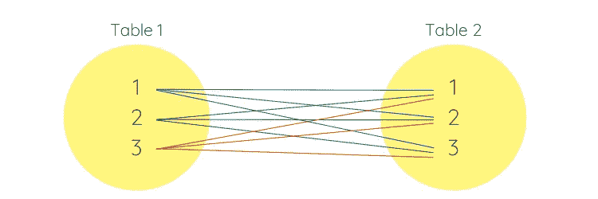
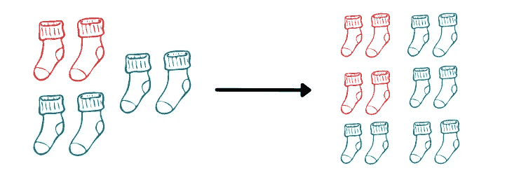
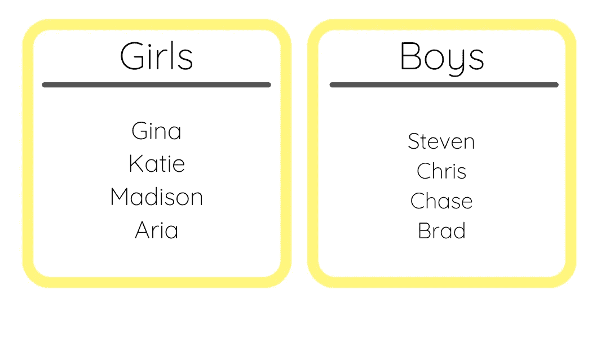
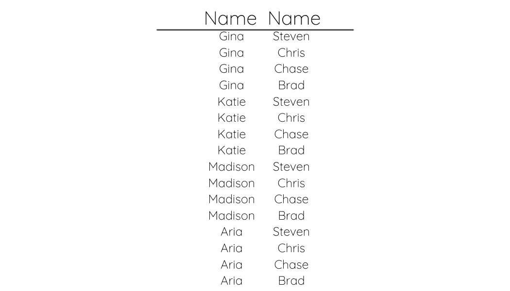

# 如何使用 SQL 交叉连接

> 原文：<https://towardsdatascience.com/how-to-use-sql-cross-joins-5653fe7d353?source=collection_archive---------8----------------------->

## 您从来不知道存在的 SQL 连接


惠普科赫在 [Unsplash](https://unsplash.com/s/photos/weaving?utm_source=unsplash&utm_medium=referral&utm_content=creditCopyText) 上的照片

我一直在通读旧代码，并试图以更有效的方式重写它。我遇到过很多奇怪的逻辑，但对我来说最陌生的是交叉连接。

我使用过左连接、右连接和内连接，但从未使用过交叉连接。我总是把成为 SQL 忍者作为我的目标，所以很自然，我很好奇为什么我以前从来没有听说过这个。

当我谷歌它是什么时，我发现它是“**一种连接，从连接**的表中返回行的笛卡尔乘积”。

交叉连接的结果最好用图片来解释。当您交叉连接表 1 和表 2 时，会得到如下所示的结果。



作者图片

这里，第一个表中的第一列与第二个表中的每一列连接，产生三个新行，其组合如下:

*   1 和 1
*   1 和 2
*   1 和 3

因此，对于表 2 中的每一行，该值都与表 1 中的每个值相结合。

当我想到这个输出时，我想到了统计课上的经典组合问题。如果度假只允许带两双，有三种不同颜色的可能性，你能做出多少种不同的袜子组合？



作者图片

对于每一双红色的鞋，你都可以搭配一双蓝色或绿色的。对于每一对绿色的，你可以把它和一对蓝色或红色的配对。对于每一双蓝色的，你可以把它和一双红色或绿色的配对。这类似于交叉连接的输出！

让我们看一个实际的 SQL 查询。假设我们有两个不同的表，代表教室里孩子的名字。一个写着女生名字，一个写着男生名字。



作者图片

```
SELECT
   girls.name,
   boys.name
FROM girls 
CROSS JOIN boys
```

当交叉连接女孩表和男孩表并从两个表中选择姓名时，您将得到如下所示的输出。



作者图片

你可以看到每个女孩的名字都与每个男孩的名字配对。您实际上是在两个表之间创建了一个很大的可能组合列表。

对于交叉连接，您还可以包含一个指定某种连接条件的`where`子句。这在处理数字列时最为常见。

```
SELECT
   schedule.event,
   calendar.number_of_days
FROM schedule
CROSS JOIN calendar
WHERE schedule.total_number < calendar.number_of_days
```

这里，查询将只连接`schedule`表中的行和`calendar`表中满足指定条件的行。

当您添加`where`子句时，交叉连接的行为类似于`inner join`，除了您没有在任何指定的列上连接它。交叉连接查询中不需要 on 语句！

现在，这种连接似乎是低效的。然而，它实际上比解决我们在这里试图做的事情的大多数其他逻辑运行得更快。我决心找到一个更好的交叉连接的解决方案，但我找不到。

所以，也就是说，如果你知道一个运行更快的技巧，请在下面的评论中留下你的建议。

如果你有兴趣学习更多关于 SQL 的知识，可以看看我写的关于[窗口函数](/how-to-use-sql-window-functions-5d297d29f810)、[排名](/how-to-use-sql-rank-and-dense-rank-functions-7c3ebf84b4e8)和[面试问题](/top-skills-to-ace-every-sql-interview-question-33356b08845a)的文章。