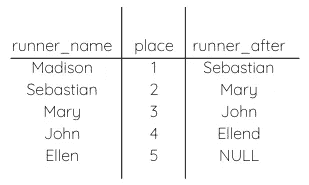
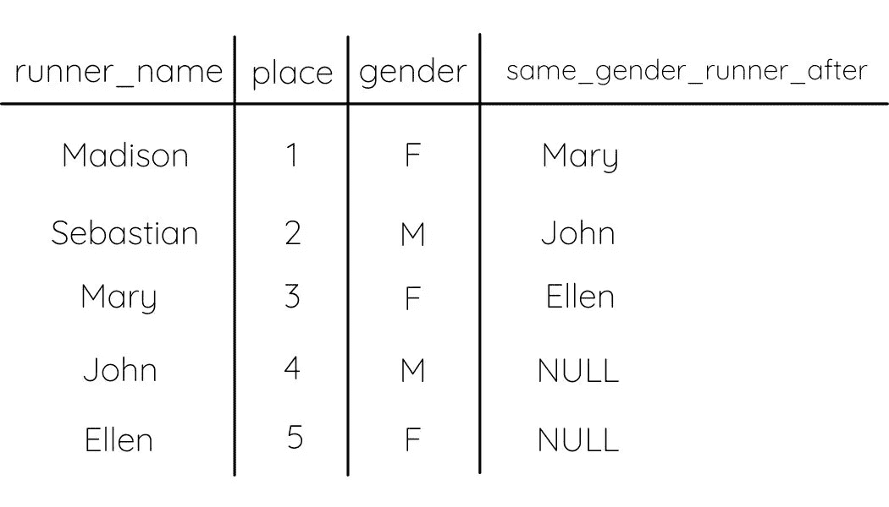
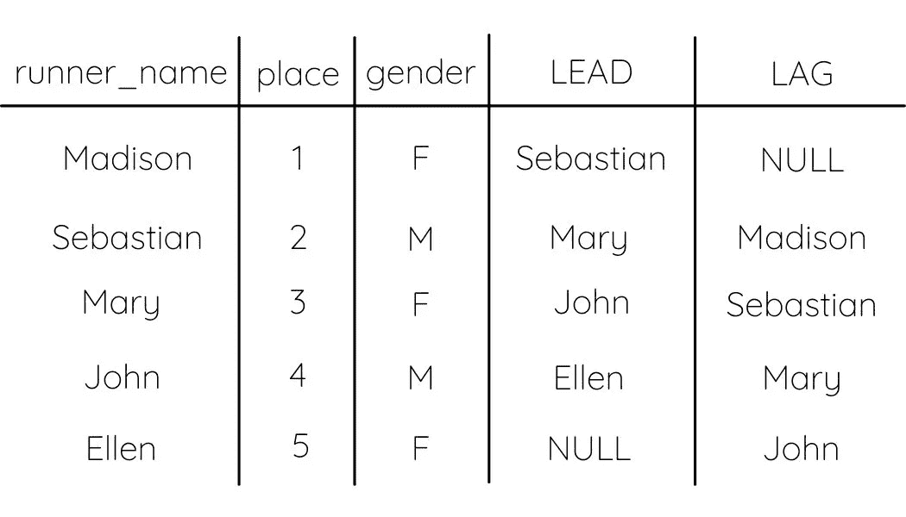
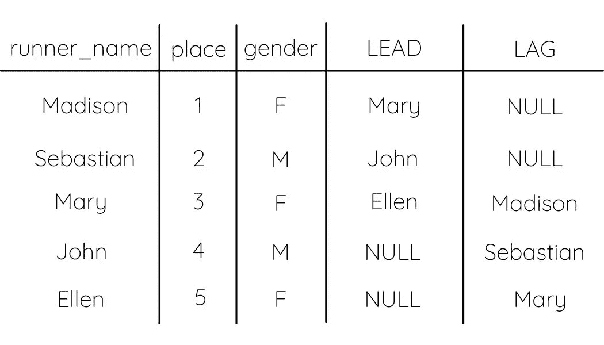

# 如何使用 SQL 超前和滞后函数

> 原文：<https://towardsdatascience.com/how-to-use-sql-lead-and-lag-functions-35c0db633c5e?source=collection_archive---------2----------------------->

## 使用窗口函数简化 SQL 解决方案的教程


(本·斯特恩在 [Unsplash](https://unsplash.com/s/photos/runners-finishing?utm_source=unsplash&utm_medium=referral&utm_content=creditCopyText) 上拍照)

如果你一直在虔诚地练习你的 SQL，就像我在[的顶级技巧中建议的那样，去面对每一个 SQL 面试问题](/top-skills-to-ace-every-sql-interview-question-33356b08845a)，那么你可能会遇到使用窗口函数的问题。或者你已经在 Leetcode 上的讨论或解决方案页面中遇到了他们。

窗口函数可能很复杂，但它们使许多问题更容易解决。一旦你学会了最常用的窗口函数，你就可以轻而易举地将它们应用到你的解决方案中。

今天，我将讨论两个有助于简化解决方案的函数——领先和滞后。虽然这些函数以相同的方式使用，但它们会给你相反的结果。一个会找到上一条记录，另一个会找到下一条记录。但是哪个做哪个呢？

# 他们做什么

超前和滞后将显示与您正在查看的当前行相比的前一个值或后一个值。与其他窗口函数一样，您必须指定运行该函数的列，还可以指定作为分区依据的列和作为排序依据的列。但是，在使用这些函数时，您很可能希望使用 ORDER BY。

例如，假设您有马拉松比赛中运动员的终点订单。你想找到在你之前和之后完成的人。您可以使用这些函数来查找这些人的名字，方法是在跑步者姓名上运行这些函数，并按完成位置排序。

# 如何使用它们

这两个函数都使用 OVER()子句以及 PARTITION BY 和 ORDER BY。部分函数的划分是可选的，但是 ORDER BY 几乎总是必需的。唯一不希望使用它的情况是在表中查找目标行之前/之后的行。

```
SELECT runner_name, place, LEAD(runner_name) OVER(ORDER BY place ASC) AS runner_after FROM race_results
```



作者图片

这里需要注意的是表最后一行的空值。因为 Ellen 之后没有 runner，所以 LEAD 函数将返回 NULL。

**ORDER BY** 指定表格中行的排序依据列。在这种情况下，我们按位置排序，从第一个位置开始，到最后一个位置结束。根据您想要的结果，在这里选择 ASC 还是 DESC 订单也很重要。请记住，ASC 表示当您向下滚动表格的行时，数字会变大，而 DESC 表示数字会从最高值开始变小。

**由**划分充当分组逻辑。它将只查看在指定列中具有相同值的行。例如，如果我们按性别划分比赛结果，领先和落后只会给我们之前和之后的赛跑者与讨论中的那一排相同的性别。

```
SELECT runner_name, place, gender, LEAD(runner_name) OVER(PARTITION BY gender ORDER BY place ASC) AS same_gender_runner_after
```



作者图片

这里我们可以看到，same_gender_runner_after 列给出了与目标行性别类别相同的下一个跑步者的姓名。还可以注意到，John 和 Ellen 在该列中具有空值，因为他们之后没有与其性别相同的跑步者。

# 超前和滞后的区别

LEAD 将给出您正在查找其值的行之后的行。LAG 将给出您要查找其值的行之前的行。

考虑这些术语与您的目标行的关系。使用 lead 函数时，目标行位于返回行的开头。使用 LAG 函数时，目标行落后于返回的行。

请记住，如果使用 PARTITION BY 语句，它可能不会返回目标行之前或之后的确切行。它将返回在该语句指定的列中具有相同值的行之前或之后的行。

让我们先在不分区的情况下比较超前和滞后的结果。



作者图片

当我们不使用 PARTITION BY 时，我们得到的是在目标行之前/之后的真实行，只要在这种情况下它们是按位置排序的。此外，当使用 LEAD 函数时，最后一行为 NULL，而当使用 LAG 函数时，第一行为 NULL。查看滞后列，Madison 在这里的值为空，因为没有人在她之前完成。

现在我们来比较一下按性别分区时的两个函数。



作者图片

在这里，我们可以看到 LEAD 和 LAG 为我们提供了相同性别的之前/之后的行，如果性别与目标行的性别不匹配，则跳过“真实”的下一行。同样，我们可以看到最后两行 LEAD 为空，前两行 LAG 为空。由于按性别划分，这里是前/后两行。

如果你正在为 SQL 面试而学习，一定要看看我的文章[获得每一个 SQL 面试问题的顶级技巧](/top-skills-to-ace-every-sql-interview-question-33356b08845a)以及[如何使用 SQL RANK 和 DENSE_RANK 函数](/how-to-use-sql-rank-and-dense-rank-functions-7c3ebf84b4e8)，以便更仔细地了解 SQL 的排名函数。

查询愉快！