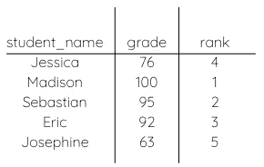
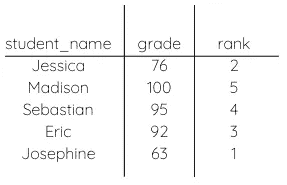
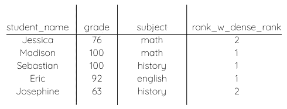
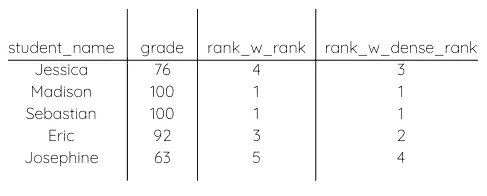

# 如何使用 SQL RANK 和 DENSE_RANK 函数

> 原文：<https://towardsdatascience.com/how-to-use-sql-rank-and-dense-rank-functions-7c3ebf84b4e8?source=collection_archive---------0----------------------->

## 一个关于你为什么想要使用它们以及它们的主要区别的教程

由[乔舒亚·戈德](https://unsplash.com/@joshgmit?utm_source=unsplash&utm_medium=referral&utm_content=creditCopyText)在 [Unsplash](https://unsplash.com/s/photos/podium?utm_source=unsplash&utm_medium=referral&utm_content=creditCopyText) 上拍摄的照片

如果你一直在虔诚地练习你的 SQL，就像我在[顶级技巧中建议的那样，去面对每一个 SQL 面试问题](/top-skills-to-ace-every-sql-interview-question-33356b08845a)，那么你可能会遇到使用窗口函数的问题。或者你已经在 Leetcode 上的讨论或解决方案页面中遇到了他们。

窗口函数可能很复杂，但它们使许多问题更容易解决。一旦你学会了最常用的窗口函数，你就可以轻而易举地将它们应用到你的解决方案中。

今天我要讲两个对任何类型的排名问题都有帮助的函数——RANK 和 DENSE_RANK。虽然这些功能相似，但它们确实有所不同。在很多情况下，两者都可以解决你的问题。然而，当你确实需要一个特殊的解决方案时，知道其中的区别仍然是很重要的。

# 他们做什么

RANK 和 DENSE_RANK 用于对值进行排序，并根据它们相对于彼此的位置为它们分配编号。

例如，假设你有三个学生，他们有三个不同的考试分数——一个学生得了 100 分，另一个得了 85 分，最后一个得了 72 分。这些函数将根据您希望的排名顺序为每个学生分配 1、2 或 3。

# 如何使用它们

这两个函数都使用 OVER()子句以及 PARTITION BY 和 ORDER BY。函数的 part BY 是可选的，但是 ORDER BY 总是必需的。

`SELECT student_name, RANK() OVER(ORDER BY grades DESC) AS grade_ranking`

作者图片

在这里，您可以看到最高等级的等级为 1，最低等级为 5，因为它们是按降序排列的。

**ORDER BY** 指定要对其值进行排序的列。在前面的示例中，等级是在 ORDER BY 之后指定的。您可以按降序或升序排列值。

在上面的代码片段中，我们从最高等级到最低等级排序(DESC)，下面我们从最低等级到最高等级排序(ASC)。

`SELECT student_name, RANK() OVER(ORDER BY grades ASC) AS grade_ranking`

作者图片

在这里，您可以看到最低等级的等级为 1，最高等级的等级为 5，因为等级是按升序排列的。

**分区由**组排名。当此处指定的列的值发生变化时，排名会重新开始。假设我们在学生的考试成绩中增加了科目。如果你把数据按主题分类，它会给你每个分数的排名，按主题分组。

`SELECT student_name, DENSE_RANK() OVER(PARTITION BY subject ORDER BY grades DESC) AS grade_ranking`

作者图片

正如你所看到的，每门课的最高分被定为 1 分，其余的分数也根据他们在这门课中的位置进行排名。

# 秩和 DENSE_RANK 的区别

这两个函数的区别在于它们如何处理相同的值。假设我们有两个成绩相同的学生。两人的数学考试都得了 90 分。

RANK 和 DENSE_RANK 将根据等级与其他值相比的排名情况为等级分配相同的排名。然而，RANK 将跳过下一个可用的排名值，而 DENSE_RANK 将仍然使用下一个按时间顺序排列的排名值。

因此，对于等级，如果两个 90 的等级为 2，下一个最低值将被分配为 4，跳过 3。使用 DENSE_RANK，下一个最低的值将被分配等级 3，而不会跳过任何值。

让我们比较一下这两个函数的结果。

`SELECT student_name, RANK() OVER(ORDER BY grades DESC) AS rank_w_rank, DENSE_RANK() OVER(ORDER BY grades DESC) AS rank_w_dense_rank`

作者图片

同样，您可以看到使用 rank 的列中没有 rank 2，而 DENSE_RANK 列包含 rank 2 并以 rank 4 结尾，尽管表中有 5 行。

希望你现在明白如何使用 RANK 和 DENSE_RANK 以及何时使用它们。通常，我使用 DENSE_RANK 作为我在 SQL 中的默认排名函数。我发现更多的问题希望你按照时间顺序排列，不要跳过一个数字。但是，请确保您仔细阅读了问题，并考虑了您试图实现的输出。

如果你正在准备 SQL 面试，一定要看看我的文章[每一个 SQL 面试问题的顶级技巧](/top-skills-to-ace-every-sql-interview-question-33356b08845a)。

查询愉快！

通过订阅我的电子邮件列表，了解更多关于 SQL 和分析工程师使用的其他工具的信息。