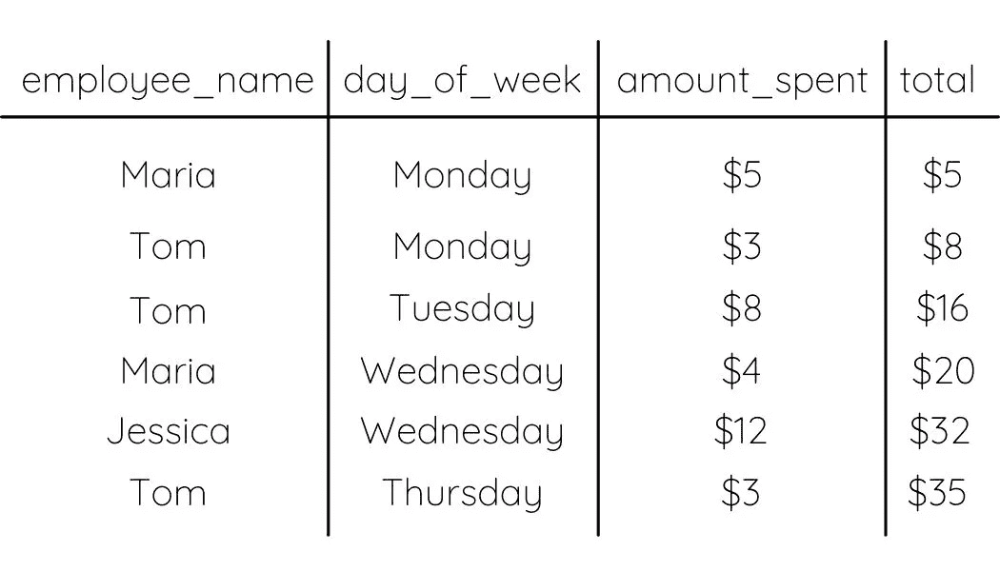
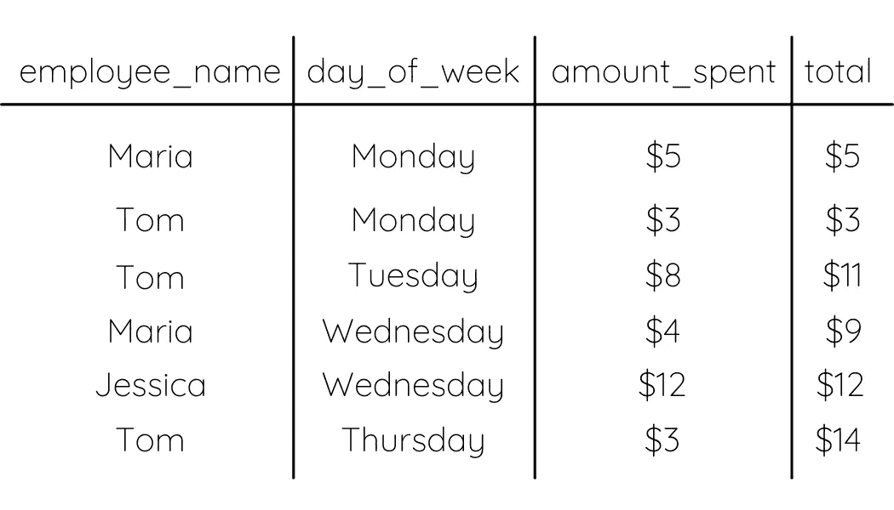
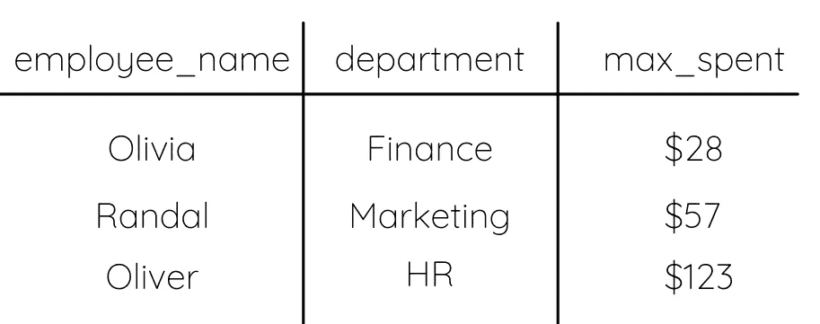
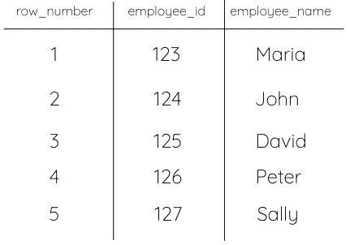
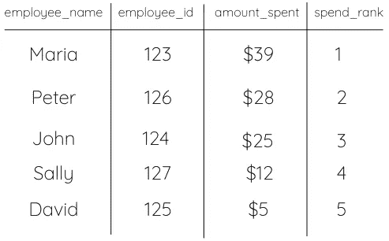

# 如何使用 SQL 窗口函数

> 原文：<https://towardsdatascience.com/how-to-use-sql-window-functions-5d297d29f810?source=collection_archive---------26----------------------->

## 最常见的例子有代码示例


范妮·拉斯科在 [Unsplash](https://unsplash.com/s/photos/windows?utm_source=unsplash&utm_medium=referral&utm_content=creditCopyText) 上的照片

无论您是在解决一个复杂的问题，还是正在面试一个需要高级 SQL 知识的技术职位，了解如何使用 SQL 窗口函数都很重要。

虽然在工作面试过程中并不总是必要的，但知道如何使用它们肯定会给面试官留下深刻印象，并在解决编码问题时节省你的时间。这些功能通常会将非常复杂的解决方案简化为更快、更容易理解的解决方案。

## 什么是窗口函数？

窗口函数是在各种表格行中执行的函数。这些函数不是像“正常”函数那样单独查看每一行，而是通常查看前面和/或后面的行，以便计算目标行。

## 最流行的窗口函数

1.  总和
2.  最大
3.  行号
4.  军阶
5.  超前/滞后

让我们分别来看看它们的作用以及在 SQL 代码中使用它们的最佳方式。

## 总和

Sum 就像它听起来的那样。它把你指定给它的任何东西加起来，或者取总和。sum window 函数与典型 sum 函数的主要区别在于，它对每一行进行累计求和，而不是对所有行进行累计求和。

例如，假设您想要创建一周内花费的累计总额。你希望看到你在一周的每一天都花了多少钱，而不是一周结束时的总数。你可以使用求和窗函数。

```
SELECT
   employee_name,
   day_of_week,
   amount_spent,
   SUM(amount_spent) OVER (ORDER BY date) AS total
FROM personal_finances 
```

这将产生如下所示的输出:



作者图片

如果我们是一家公司，正在查看我们的员工花费了多少钱，那么在报表中添加一个分区可能会有所帮助。

```
SELECT
   employee_name,
   day_of_week,
   amount_spent,
   SUM(amount_spent) OVER (ORDER BY date PARTITION BY employee_name) AS total
FROM personal_finances
```

该查询的输出如下所示:



作者图片

## 最大

就像 sum 一样，max 的工作方式类似于“普通”SQL max 函数。它采用您指定的列的最大值，并取决于您对 ORDER BY 和 PARTITION BY 使用的条件。但是，请记住，这些函数是可选的。

以下是如何从每个部门中找出在公司卡上花费最多的员工:

```
SELECT
   employee_name,
   department,
   MAX(total_spent) OVER(ORDER BY total_spent PARTITION BY   department) as max_spent
FROM personal_finances
```

结果将如下所示:



作者图片

## 行号

行号和等级非常相似，经常互换使用。就我个人而言，我更多地使用排名方式，因为我认为它更适用于我正在解决的问题。行号用于根据行在表中的顺序为行分配编号。您不必在括号中使用列名，因为您只是返回订单。

这里，我们按照雇员 id 对雇员进行排序，并根据雇员在表中的顺序为每一行分配一个行号。

```
SELECT
    ROW_NUMBER() OVER(ORDER BY employee_id),
    employee_id,
    employee_name
FROM org_chart
```

这将产生如下所示的输出:



作者图片

## 军阶

Rank 用于根据某个列值对行进行排序。这对于任何类型的排序问题都非常有用，并且由于 ORDER BY 和 PARTITION BY 子句的缘故，非常有用。Rank 可能是所有窗口函数中我最喜欢和最常用的！

在这里，我们可以用它来找出公司里花钱最多的人:

```
SELECT
    employee_name,
    employee_id,
    amount_spent,
    RANK(amount_spent) OVER(ORDER BY amount_spent DESC) AS spend_rank
FROM employees
```

请注意，我在 ORDER BY 子句后包含了 DESC。这在使用 rank 时极其重要。必须指定是按列 ASC(值变大)还是按列 DESC(值变小)排序。如果不指定这一点，查询可能会返回与预期相反的结果。



作者图片

让我们看看同一个例子，但是使用 PARTITION BY。

```
SELECT
    employee_name,
    employee_id,
    department_id,
    RANK(amount_spent) OVER(ORDER BY amount_spent DESC PARTITION BY department_id) AS spend_rank
FROM employees
```

现在，我们正在对每个部门的最高支出者进行排名。每次检测到不同的 department_id 时，排名将从停止的排名号继续。输出将如下所示:

请注意，它并不一定要对行进行分组或重新排序，但是排名是由 department_id 和每个员工在其部门内的支出金额顺序决定的。

如果您有兴趣深入研究 rank 窗口函数，甚至了解 rank 和 dense rank 之间的区别，请查看我的文章[如何使用 SQL RANK 和 DENSE_RANK 函数](/how-to-use-sql-rank-and-dense-rank-functions-7c3ebf84b4e8)。

## 超前/滞后

当你第一次了解它们的时候，理解起来会很困惑。实际上，我写了一整篇文章来解释它们的不同之处，以及记住它们的含义的技巧。查看[如何使用 SQL 超前和滞后函数](/how-to-use-sql-lead-and-lag-functions-35c0db633c5e)了解更多信息。

第一次使用窗口函数时，尽量不要沮丧。你能做的最好的事情就是练习、练习、练习，然后将你的输出与你期望你的代码产生的结果进行比较。这是了解代码如何工作的最好方法。

请务必查看我的另一篇关于 SQL 窗口函数的文章，以消除您可能有的任何困惑。查询愉快！