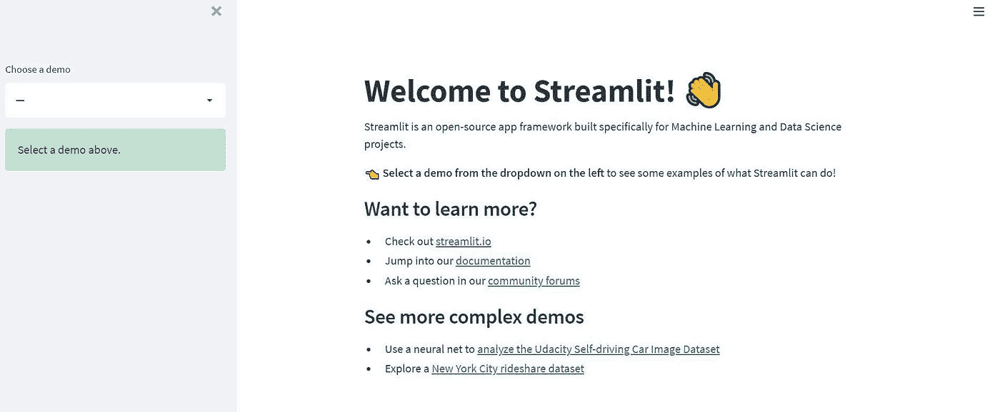
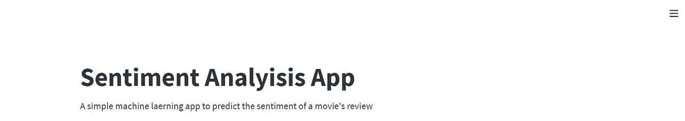
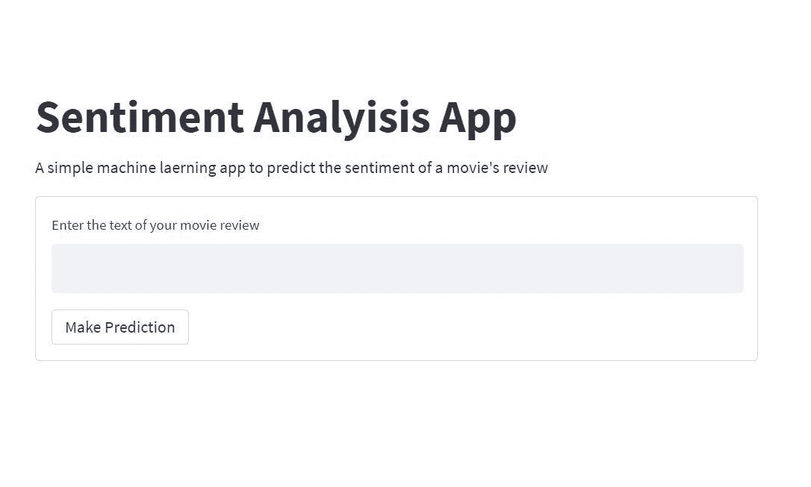
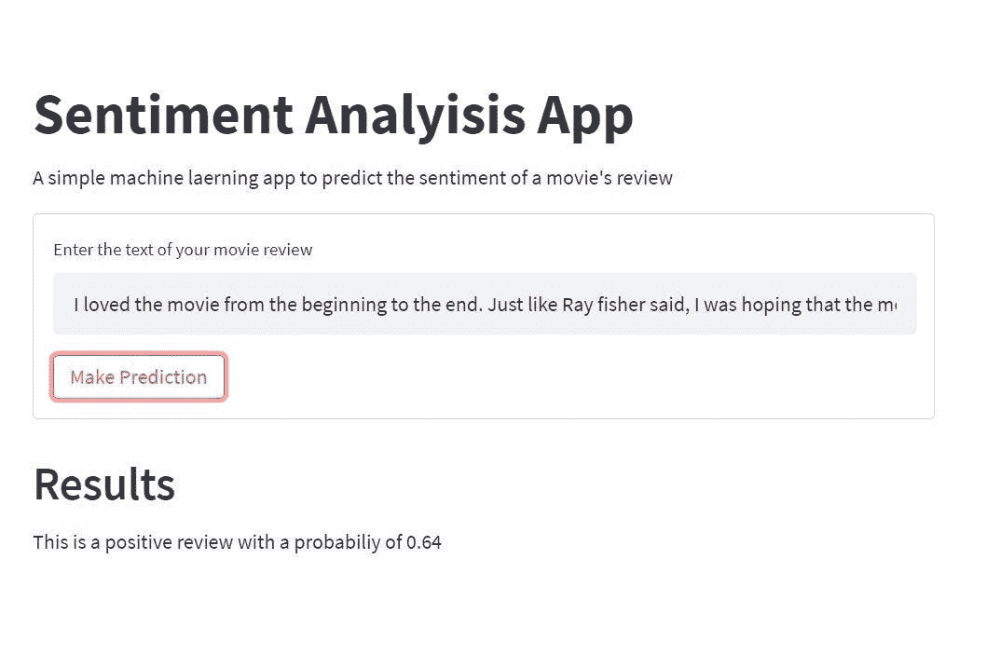

# 如何使用 Streamlit 和 Python 构建数据科学应用程序

> 原文：<https://towardsdatascience.com/how-to-use-streamlit-and-python-to-build-a-data-science-app-d74b0d28ca8?source=collection_archive---------13----------------------->

## 用几行代码部署您的数据科学解决方案


照片由来自[佩克斯](https://www.pexels.com/photo/software-engineer-standing-beside-server-racks-1181354/?utm_content=attributionCopyText&utm_medium=referral&utm_source=pexels)的[克里斯蒂娜·莫里洛](https://www.pexels.com/@divinetechygirl?utm_content=attributionCopyText&utm_medium=referral&utm_source=pexels)拍摄

Web 应用仍然是数据科学家向用户展示其数据科学项目的有用工具。由于我们可能没有 web 开发技能，我们可以使用 Streamlit 这样的开源 python 库，在短时间内轻松开发 web apps。

# 目录

1.  Streamlit 简介
2.  安装和设置
3.  开发 Web 应用程序
4.  测试 Web 应用程序
5.  结论

# 1.Streamlit 简介

Streamlit 是一个开源 python 库，用于为数据科学和机器学习项目创建和共享 web 应用程序。该库可以帮助您用几行代码在几分钟内创建和部署您的数据科学解决方案。

Streamlit 可以与数据科学中使用的其他流行 python 库无缝集成，如 NumPy、Pandas、Matplotlib、Scikit-learn 等等。

注意:Streamlit 使用 React 作为前端框架在屏幕上呈现数据。

# 2.安装和设置

Streamlit 要求您的计算机中的 python >= 3.7 版本。

要安装 streamlit，您需要在终端中运行以下命令。

```
pip install streamlit
```

您还可以使用以下命令检查您的计算机上安装的版本。

```
streamlit --version
```

streamlit，版本 1.1.0

成功安装 streamlit 后，您可以通过在终端中运行以下命令来测试该库。

```
streamlit hello
```

Streamlit 的 Hello 应用程序将出现在 web 浏览器的新选项卡中。



这表明一切都运行良好，我们可以继续使用 Streamlit 创建我们的第一个 web 应用程序。

# 3.开发 Web 应用程序

在这一部分中，我们将使用经过训练的 NLP 模型来预测电影评论的情绪(正面或负面)。你可以在这里访问源代码和数据集[。](/how-to-build-and-deploy-an-nlp-model-with-fastapi-part-1-9c1c7030d40?source=user_profile---------15-------------------------------)

数据科学 web 应用程序将显示一个文本字段来添加电影的评论，以及一个简单的按钮来提交评论并进行预测。

**导入重要包**

第一步是创建一个名为 app.py 的 python 文件，然后为 streamlit 和经过训练的 NLP 模型导入所需的 python 包。

```
# import packages
import streamlit as st
import os
import numpy as np

from sklearn.feature_extraction.text import TfidfVectorizer, CountVectorizer

# text preprocessing modules
from string import punctuation

# text preprocessing modules
from nltk.tokenize import word_tokenize

import nltk
from nltk.corpus import stopwords
from nltk.stem import WordNetLemmatizer
import re  # regular expression
import joblib

import warnings

warnings.filterwarnings("ignore")
# seeding
np.random.seed(123)

# load stop words
stop_words = stopwords.words("english")
```

**功能清理审查**

评论可能会有我们在做预测时不需要的不必要的单词和字符。

我们将通过删除停用词、数字和标点来清理评论。然后我们将使用 NLTK 包中的词汇化过程将每个单词转换成它的基本形式。

在做出预测之前， **text_cleaning()** 函数将处理所有必要的步骤来清理我们的评论。

```
# function to clean the text
@st.cache
def text_cleaning(text, remove_stop_words=True, lemmatize_words=True):
    # Clean the text, with the option to remove stop_words and to lemmatize word

    # Clean the text
    text = re.sub(r"[^A-Za-z0-9]", " ", text)
    text = re.sub(r"\'s", " ", text)
    text = re.sub(r"http\S+", " link ", text)
    text = re.sub(r"\b\d+(?:\.\d+)?\s+", "", text)  # remove numbers

    # Remove punctuation from text
    text = "".join([c for c in text if c not in punctuation])

    # Optionally, remove stop words
    if remove_stop_words:
        text = text.split()
        text = [w for w in text if not w in stop_words]
        text = " ".join(text)

    # Optionally, shorten words to their stems
    if lemmatize_words:
        text = text.split()
        lemmatizer = WordNetLemmatizer()
        lemmatized_words = [lemmatizer.lemmatize(word) for word in text]
        text = " ".join(lemmatized_words)

    # Return a list of words
    return text
```

**功能进行预测**

名为 **make_prediction()** 的 python 函数将完成以下任务。

1.  收到评论并清理。
2.  加载训练好的 NLP 模型。
3.  做个预测。
4.  估计预测的概率。
5.  最后，它将返回预测的类及其概率。

```
# functon to make prediction
@st.cache
def make_prediction(review):

    # clearn the data
    clean_review = text_cleaning(review)

    # load the model and make prediction
    model = joblib.load("sentiment_model_pipeline.pkl")

    # make prection
    result = model.predict([clean_review])

    # check probabilities
    probas = model.predict_proba([clean_review])
    probability = "{:.2f}".format(float(probas[:, result]))

    return result, probability
```

**注:**如果训练好的 NLP 模型预测 1，表示正，预测 0，表示负。

**创建应用标题和描述**

您可以使用 streamlit 中的 title()和 write()方法创建 web 应用程序的标题及其描述。

```
# Set the app title
st.title("Sentiment Analyisis App")
st.write(
    "A simple machine laerning app to predict the sentiment of a movie's review"
)
```

要显示 web 应用程序，您需要在终端中运行以下命令。

```
streamlit run app.py
```

然后，您将看到 web 应用程序在您的 web 浏览器中自动弹出，或者您可以使用创建的本地 URL[http://localhost:8501。](http://about/:blank?ref=hackernoon.com)



**创建一个接收电影评论的表单**

下一步是使用 streamlit 创建一个简单的表单。该表单将显示一个文本字段来添加您的评论，在文本字段下方，将显示一个简单的按钮来提交添加的评论，然后进行预测。

```
# Declare a form to receive a movie's review
form = st.form(key="my_form")
review = form.text_input(label="Enter the text of your movie review")
submit = form.form_submit_button(label="Make Prediction")
```

现在，您可以在 web 应用程序上看到该表单。



**进行预测并显示结果**

我们的最后一段代码是，每当用户添加一部电影的评论并单击表单部分的“make prediction”按钮时，就进行预测并显示结果。

点击按钮后，web app 将运行 **make_prediction()** 函数，并在浏览器中的 web app 上显示结果。

```
if submit:
    # make prediction from the input text
    result, probability = make_prediction(review)

    # Display results of the NLP task
    st.header("Results")

    if int(result) == 1:
        st.write("This is a positive review with a probabiliy of ", probability)
    else:
        st.write("This is a negative review with a probabiliy of ", probability)
```

# 4.测试 Web 应用程序

通过几行代码，我们创建了一个简单的数据科学 web 应用程序，它可以接收电影评论，并预测它是正面评论还是负面评论。

要测试 web 应用程序，请通过添加您选择的电影评论来填充文本字段。我补充了以下关于 2021 年上映的**扎克·施奈德版正义联盟**电影的影评。

> “我从头到尾都很喜欢这部电影。就像雷·费舍说的，我希望这部电影不会结束。乞讨的场景令人激动，我非常喜欢那个场景。不像《正义联盟》这部电影展示了每个英雄最擅长自己的事情，让我们热爱每一个角色。谢谢扎克和整个团队。”

然后单击进行预测按钮并查看结果。



正如你在我们创建的 web 应用程序上看到的，经过训练的 NLP 模型预测添加的评论是**正面**的概率为 **0.64。**

我建议您在我们创建的数据科学 web 应用程序上添加另一个电影评论，并再次测试它。

# 5.结论

Streamlit 提供了许多功能和组件，您可以使用这些功能和组件按照自己的方式开发数据科学 web 应用程序。您在这里学到的是 streamlit 的一些常见元素。

要了解更多信息，您可以访问他们设计精美的文档页面[这里。](https://docs.streamlit.io/?ref=hackernoon.com)

如果你学到了新的东西或者喜欢阅读这篇文章，请分享给其他人看。在那之前，下一篇文章再见！。

你也可以在推特上找到我 [@Davis_McDavid](https://twitter.com/Davis_McDavid?ref=hackernoon.com) 。

*最后一件事:在以下链接中阅读更多类似的文章*

[](https://python.plainenglish.io/how-to-use-google-trends-api-with-python-d00837349369) [## 如何在 Python 中使用 Google Trends API

### 谷歌趋势网站提供了基于各种标准的谷歌搜索不同搜索结果的分析…

python .平原英语. io](https://python.plainenglish.io/how-to-use-google-trends-api-with-python-d00837349369) [](https://medium.datadriveninvestor.com/nlp-datasets-from-huggingface-how-to-access-and-train-them-8852c2aca74) [## 来自 HuggingFace 的 NLP 数据集:如何访问和训练它们

### 拥抱脸的数据集库提供了一个非常有效的方法来加载和处理原始文件或…

medium.datadriveninvestor.com](https://medium.datadriveninvestor.com/nlp-datasets-from-huggingface-how-to-access-and-train-them-8852c2aca74) [](https://medium.datadriveninvestor.com/pycaret-a-faster-way-to-build-machine-learning-models-d4cbce6a6633) [## Pycaret:一种构建机器学习模型的更快方法

### 建立一个机器学习模型需要一系列的步骤，从数据准备，数据清洗，特征…

medium.datadriveninvestor.com](https://medium.datadriveninvestor.com/pycaret-a-faster-way-to-build-machine-learning-models-d4cbce6a6633) 

*本文首发* [*此处*](https://hackernoon.com/how-to-use-streamlit-and-python-to-build-a-data-science-app) *。*