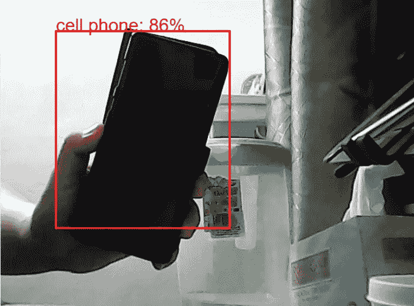

# 如何在 react.js 中使用 tensorflow.js 对象检测

> 原文：<https://towardsdatascience.com/how-to-use-tensorflow-js-in-react-js-object-detection-98b3782f08c2?source=collection_archive---------3----------------------->

## 与 Tensorflow.js 反应

## 使用 COCO-SSD 模型定位和识别单个图像中的多个对象


来自 [Pexels](https://www.pexels.com/photo/person-taking-photo-using-smartphone-4483133/?utm_content=attributionCopyText&utm_medium=referral&utm_source=pexels) 的 [Anna Shvets](https://www.pexels.com/@shvetsa?utm_content=attributionCopyText&utm_medium=referral&utm_source=pexels) 的原始照片

本文是我的 tensorflow.js + react.js 系列的第 3 部分，旨在促进 tensorflow.js 在 react 中的使用。作为对新阅读器的介绍， [Tensorflow.js](https://www.tensorflow.org/js) 或 TF.js 是 Javascript 中的机器学习库，它使 ML 模型可以直接在浏览器或 Node.js 中使用

TF.js 释放了前端开发人员的无限潜力，他们可以利用机器学习的力量，如对象检测、人脸检测、图像分类和[情感分析](/how-to-use-tensorflow-js-in-react-js-sentimental-analysis-59c538c07256)，而无需依赖后端服务器。

本教程的最终产品是通过 COCO-SSD 模型创建一个对象检测，该模型在桌面网络摄像头中工作，可检测 80 种类型的对象。



图 1:来自最终项目的图像

*在这里尝试演示[，在这里](https://objectdetect.manfye.com/)尝试完整代码

*演示尚未针对移动相机(人像)进行优化

# 1.0 理论和了解您的模型

## 什么是物体检测？

目标检测是一项计算机视觉任务，包括两个主要任务:

1.  定位图像中的一个或多个对象，以及
2.  对图像中的每个对象进行分类


图 2:图像分类与目标检测(分类和定位)。来自[佩克斯](https://www.pexels.com/photo/short-coated-gray-cat-20787/?utm_content=attributionCopyText&utm_medium=referral&utm_source=pexels)的克里斯滕·梅里曼和来自[佩克斯](https://www.pexels.com/photo/person-holding-siamese-cat-and-chihuahua-1909802/?utm_content=attributionCopyText&utm_medium=referral&utm_source=pexels)的[莎伦·麦卡琴](https://www.pexels.com/@mccutcheon?utm_content=attributionCopyText&utm_medium=referral&utm_source=pexels)的原始照片

与图像分类(图 2)相反，对象检测的目标是通过边界框和所定位对象的类别来预测对象在图像中的位置，输出可以多于一个类别。

## 基于区域的卷积神经网络和目标检测

CNN 传统上用于图像分类，然而，当图像中有多个对象时，由于输出层的长度不是恒定的，并且将有大量的区域/包围盒用于分类，CNN 不可能对图像中的多个对象进行分类。

Ross gir shick[提出了一种更好的方法](https://arxiv.org/pdf/1311.2524.pdf)，其中通过选择性搜索约 2000 个区域(称为区域建议),现在神经网络只对区域建议进行分类，而不是对大量区域进行分类(图 3)。这种方法被称为 R-CNN，它极大地提高了图像中对象检测的性能，并使自动驾驶汽车技术成为可能。它是 CNN 中目标检测的基础。


图三。来自[5]的 R-CNN 图像的插图

## COCO-SSD 是什么？

[COCO-SSD](https://cocodataset.org/#home) 模型或上下文中的常见对象—单次多盒检测模型检测 COCO 数据集中定义的对象，该数据集中包含大规模对象检测、分割和字幕数据。

该模型能够检测 80 类对象，是移植到 tensorflow.js 的[官方对象检测模型](https://www.tensorflow.org/js/models)之一。它可以将输入作为任何基于浏览器的图像元素(例如，``、`<video>`、`<canvas>`元素)，并返回带有类名和置信度的边界框数组(图 4)。


图 4。返回预测结果

# 2.0 设置您的创建-反应-应用程序

通过终端中的以下命令创建一个 [Create-React-App](https://reactjs.org/docs/create-a-new-react-app.html) :

```
npx create-react-app tfjs-sentiment
cd tfjs-sentiment
```

安装 tensorflow.js 和 COCO-SSD 型号如下:

```
npm install @tensorflow/tfjs
npm install @tensorflow-models/coco-ssd
```

安装 react-网络摄像头，如下所示:

```
npm install react-webcam
```

并启动应用程序

```
npm start
```

# 3.0 编码

所有代码只会发生在 App.js 中，我只会显示重要的代码，完整代码可以参考我的 [GitHub repo](https://github.com/manfye/tfjs-article-objDetection)

## 步骤 1:从导入所需的包开始

```
import React, { useEffect, useState, useRef } from "react";
import * as cocoSsd from "@tensorflow-models/coco-ssd";
import * as tf from "@tensorflow/tfjs";
import Webcam from "react-webcam";
```

## 步骤 2:加载模型

使用 useEffect()在初始化时加载模型，当模型加载时，您将获得“set loaded Model”的控制台日志。它通常看起来大约 1-2 秒，取决于你的 CPU 速度

确保在触发模型加载功能之前，TF 模块已准备就绪

```
const [model, setModel] = useState();async function loadModel() {
try {
const model = await cocoSsd.load();
setModel(model);
console.log("set loaded Model");
} catch (err) {
console.log(err);
console.log("failed load model");
}
}useEffect(() => {
tf.ready().then(() => {
loadModel();
});
}, []);
```

## 步骤 3:构建用户界面

该项目的用户界面包括:

*   按钮—用于启动检测
*   画布-用于绘制边界框，以及
*   网络摄像头—用于输入图像/视频

```
Button:
//Trigger a predictionFunction() on Click<Button
variant={"contained"}
style={{
color: "white",
backgroundColor: "blueviolet",
width: "50%",
maxWidth: "250px",
}}
onClick={() => {
predictionFunction();
}}
>
Start Detect
</Button>Webcam:
const webcamRef = React.useRef(null);
const [videoWidth, setVideoWidth] = useState(960);
const [videoHeight, setVideoHeight] = useState(640);const videoConstraints = {
height: 1080,
width: 1920,
facingMode: "environment",
};<div style={{ position: "absolute", top: "400px" }}>
<Webcam
audio={false}
id="img"
ref={webcamRef}
screenshotQuality={1}
screenshotFormat="image/jpeg"
videoConstraints={videoConstraints}
/>
</div>Canvas:
<div style={{ position: "absolute", top: "400px", zIndex: "9999" }}>
<canvas
id="myCanvas"
width={videoWidth}
height={videoHeight}
style={{ backgroundColor: "transparent" }}
/>
</div>
```

> 注意:画布和网络摄像头的大小和位置必须相同，才能在 HTML 画布中进行绘制。

## 步骤 4:设置预测函数

要使用模型进行预测，代码很简单:

```
const predictions = await model.detect(document.getElementById("img"));
console.log(predictions);
*Do not copy
```

然而，当预测的类必须显示在照片中时，事情就变得复杂了，这就是使用 HTML canvas 的原因。整个预测函数如下所示:

```
async function predictionFunction() {//Clear the canvas for each prediction
var cnvs = document.getElementById("myCanvas");
var ctx = cnvs.getContext("2d");
ctx.clearRect(0,0, webcamRef.current.video.videoWidth,webcamRef.current.video.videoHeight);//Start prediction
const predictions = await model.detect(document.getElementById("img"));if (predictions.length > 0) {
console.log(predictions);for (let n = 0; n < predictions.length; n++) {
console.log(n);
if (predictions[n].score > 0.8) {
//Threshold is 0.8 or 80%//Extracting the coordinate and the bounding box information
let bboxLeft = predictions[n].bbox[0];
let bboxTop = predictions[n].bbox[1];
let bboxWidth = predictions[n].bbox[2];
let bboxHeight = predictions[n].bbox[3] - bboxTop;
console.log("bboxLeft: " + bboxLeft);
console.log("bboxTop: " + bboxTop);
console.log("bboxWidth: " + bboxWidth);
console.log("bboxHeight: " + bboxHeight);//Drawing begin
ctx.beginPath();
ctx.font = "28px Arial";
ctx.fillStyle = "red";
ctx.fillText(
predictions[n].class +": " + Math.round(parseFloat(predictions[n].score) * 100) +
"%", bboxLeft,bboxTop);ctx.rect(bboxLeft, bboxTop, bboxWidth, bboxHeight);
ctx.strokeStyle = "#FF0000";
ctx.lineWidth = 3;
ctx.stroke();console.log("detected");
}
}
}
//Rerun prediction by timeout
setTimeout(() => predictionFunction(), 500);
}
```

这个函数包括 4 个部分，第一部分是清除绘制的 HTML 画布，然后开始对象的模型检测。

如果模型检测到对象，则模型将返回如图 4 所示的预测数据。通过使用边界框数据，我们可以使用 HTML 画布绘制来绘制边界框。

然后使用 500 毫秒的超时重新运行整个功能。

最后，祝贺你！您获得了第一个基于 react 的网络摄像头对象检测。

## 一些问题:

*   除了视频，这个模型也接受 tf。tensor 3d | ImageData | HTMLImageElement | HTMLCanvasElement | HTMLVideoElement。更多信息请参考我的 github 中的评论部分
*   您可以更改基于 CNN 的模型，如 mobilenet_v1、mobilenet_v2，以在 ModelConfig 中获得更好的性能。默认型号是 lite_mobilenet_v2
*   要检测定制对象，这种解决方案并不可行，因为定制模型训练需要经历许多过程

# 4.0 最后的话:

在我看来，react 使得使用 TF.js 的整个过程比官方推荐的 HTML+javascript 的演示更简单。与官方演示中令人困惑的演示相比，只需要不到 100 行代码就可以对基于网络摄像头的检测进行编码。

基于前端的供电 TF 模型可以具有成本效益，因为与服务器供电的 TensorFlow 解决方案相比，大多数前端托管更便宜，此外，它可以保护用户的隐私。这里有一些谷歌关于 TF.js 用例的[演示](https://www.tensorflow.org/js/demos)，关注 [TF youtube 频道](https://www.youtube.com/channel/UC0rqucBdTuFTjJiefW5t-IQ)以获得更多社区分享！

最后，

感谢您的阅读。

希望这篇文章对你有所帮助

# 我的 TF.js + React.js 文章:

</custom-object-detection-using-react-with-tensorflow-js-7f79adee9cd4>  </how-to-use-tensorflow-js-in-react-js-sentimental-analysis-59c538c07256>  </loading-models-into-tensorflow-js-using-react-js-f3e118ee4a59>  

# 参考资料:

1.  [TensorFlow.js 物体检测变得简单](https://www.youtube.com/watch?v=7gOYpT732ow&t=906s)
2.  [https://github . com/tensor flow/models/blob/master/research/object _ detection/readme . MD](https://github.com/tensorflow/models/blob/master/research/object_detection/README.md)
3.  [https://cocodataset.org/#home](https://cocodataset.org/#home)
4.  [视觉系统的深度学习](https://manning.com/books/grokking-deep-learning-for-computer-vision)
5.  丰富的特征层次，通过 [Ross Girshick](https://arxiv.org/pdf/1311.2524.pdf) 实现精确的对象检测和语义分割