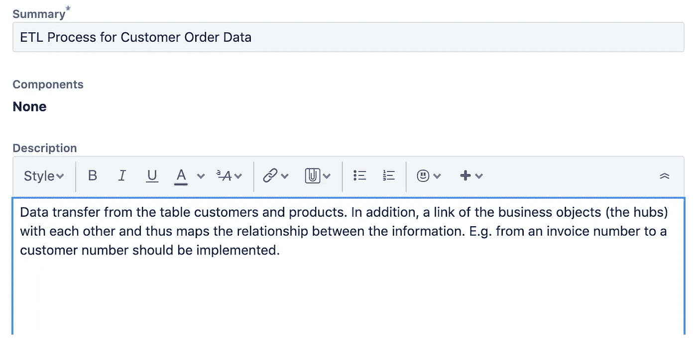

# 如何在数据分析项目中使用束方法

> 原文：<https://towardsdatascience.com/how-to-use-the-beam-approach-in-data-analytic-projects-8a1604015cfd?source=collection_archive---------14----------------------->

## 问正确的问题，在你的敏捷项目和产品中取得成功

照片由 [Unsplash](https://unsplash.com/?utm_source=unsplash&utm_medium=referral&utm_content=creditCopyText) 上的 [Gautier Salles](https://unsplash.com/@yamnez?utm_source=unsplash&utm_medium=referral&utm_content=creditCopyText) 拍摄

business Event Analysis & modeling(BEAM)是一个针对数据仓库的敏捷需求收集工具，其目标是将需求分析与业务流程而不仅仅是报告结合起来。它源于 Lawrence Corr 和 Jim Stagnitto 的敏捷数据仓库设计[1]。

## 原则

这一概念的主要原则是[1][2]:

*   **个人和互动:**商业智能是由用户对其业务的提问所驱动的。技术设置是次要的。
*   业务驱动的:需要数年时间部署的文档完备的数据仓库总是会过时。商业用户会将目光投向别处。我在业务部门的经验:我现在就需要它，否则我宁愿坚持使用 Excel 解决方案…
*   **客户协作**:最终用户对其业务的了解是您最大的资源。
*   **应对变化**:如果你采取了以上所有的行动，变化会自然而然地出现，并导致每周的交付周期。

## 这是关于问正确的问题

BEAM 的作者 Lawrence Corr 描述了一种用于构建“数据故事”的设计模式。
**举例**:业务事件——客户购买产品[3]

*   **订单日期是什么时候？**
*   **在哪里购买的**，会送到哪里？
*   **怎么**买了多少？
*   **被购买的原因是什么？**
*   **哪个**哪个渠道购买的？

通过这些重要的问题，业务流程变得清晰可见，因此可以推导出技术条件。

图片来自 [Pixabay](https://pixabay.com/de/?utm_source=link-attribution&utm_medium=referral&utm_campaign=image&utm_content=2245264) 上的 [Gerd Altmann](https://pixabay.com/de/users/geralt-9301/?utm_source=link-attribution&utm_medium=referral&utm_campaign=image&utm_content=2245264)

## 梁和用户故事

问了正确的问题后，你现在可以很容易地定义用户故事。例如，在回答**谁**和**哪里**:客户从网上商店订购产品时，您可以在您的数据仓库中导出一个累积快照事实表的需求，我需要什么属性以及进一步的需求，如相应的 ETL/ELT 过程的模式。

吉拉的数据故事-作者图片

## 摘要

我现在说到哪里了？对我来说，BEAM 遵循的原则是有意义的，并且非常适合敏捷模式。我也发现提问方式很重要。提出正确的问题并确定业务流程。这揭示了很多被蒙在鼓里的东西。

> *“启发我们的不是答案，而是问题。”—欧仁·尤内斯库*

然而，对我来说，我说我并不严格按照 BEAM 来工作，但是我发现这种描述用户故事的方法很有趣。为此，了解业务流程是必不可少的。当然，这种方法不仅适用于数据仓库设计，也适用于数据领域。例如，如果我想在您的数据湖中提供新的 ML 服务或报告，这总是与 ETL 过程的构造、数据仓库中的模式以及报告或服务的实现有关。

## 资料来源和进一步阅读

[1]optimalbi.com、[阿吉利比 vs BEAM✲ vs 模特风暴](https://optimalbi.com/agilebi-vs-beam%E2%9C%B2-vs-modelstorming/) (2015)

[2] Lawrence Corr，Jim Stagnitto，敏捷数据仓库设计:协作维度建模，从白板到星形模式(2011)

[3] Raphael Branger，[BI-Excellence durch agilitt und Automatisierung](https://www.it-logix.ch/fileadmin/dokumente/events/17MS_SR01_X_MAKE_BI_2017/Session_D2.pdf)(2017)