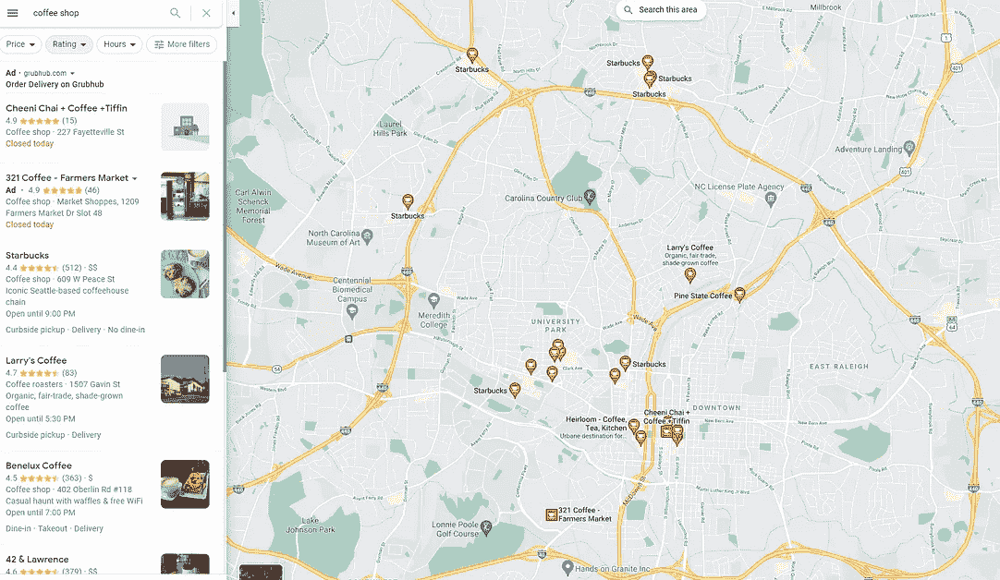
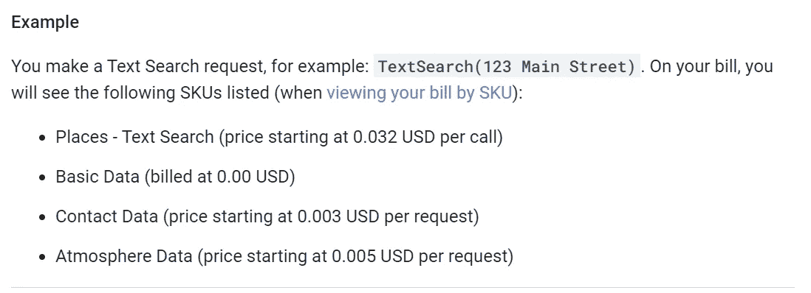

# 如何使用 Google Places API 进行位置分析等等

> 原文：<https://towardsdatascience.com/how-to-use-the-google-places-api-for-location-analysis-and-more-17e48f8f25b1?source=collection_archive---------0----------------------->

## 从谷歌地图获取任何信息的分步指南

我感兴趣的一个分析主题是位置分析，并思考如何将更多数据驱动的方法引入位置搜索，特别是对于没有塔吉特(Target)或星巴克(Starbucks)资源的较小公司。我写了几篇文章([这里](/analyzing-and-predicting-starbucks-location-strategy-3c5026d31c21)、[这里](/predicting-starbucks-location-strategy-part-2-c8803008f42c)和[这里](/creating-a-data-driven-retail-expansion-framework-2229fef33a17))讨论我们可以采取的不同方法以及如何将它们付诸实践的例子。

作为最近一些研究的一部分，我发现自己在搜索兴趣点数据的不同选项。

在这个搜索过程中，我发现了 Google Places API。假设你想找一家附近的咖啡店。你在谷歌地图上自由搜索咖啡。几个大头针弹出与您的搜索匹配的本地结果。

当你点击其中一个时，它会显示一些关于该位置的有用信息，如谷歌评论评级、评论数量、价格类别(评论旁边的单个$号)、地址等等。


搜索北卡罗来纳州罗利市中心附近的一家咖啡店和一个输出示例；作者图片

Google Places API 在指定的参数范围内有效地执行搜索，并返回搜索中出现的每个位置的结果。这使我们能够在谷歌地图运营的任何地方(根据谷歌的说法，包括 200 多个国家和 99%的全球覆盖面)获取谷歌地图搜索中出现的任何商业类型的信息。

作为一个没有编程背景的人，我发现第一次尝试和解释如何使用 API 以及理解定价是如何工作的有点困难(它不是免费的，但他们有每月循环的积分，在你开始付费之前给你大量的访问权)。

下面，我将展示如何访问 API 以将数据用于您自己的项目和目的的简单步骤。作为一个例子，我将介绍用 Python 构建搜索 URL 的过程。

# 入门指南

首先要做的是注册一个[谷歌云](https://cloud.google.com/)账户。注册后，除了每月 200 美元的免费积分外，您还可以获得 300 美元的积分。

一旦你创建了一个帐户，并在谷歌云平台上，你会想去使用左上方的下拉导航，并选择 *API &服务>凭证*。一旦到了那里，你需要点击顶部的*创建凭证*，然后点击 *API 键*。这将生成一个字母数字字符串，在您调用 API 时标识您的 Google Cloud 帐户。


如何创建 API 凭据的示例；作者图片

我们将在稍后调用 Places API 时使用该凭证，但是现在，这就是您需要做的全部工作！

# 如何使用 Google Places API

一旦您有了 API 证书，就可以用您选择的编程语言来完成该过程的下一部分。我使用过 Python，但是如果你是一个 R 用户，你可以很容易地用 R 代码修改这个过程的最后步骤。

虽然一开始有点吓人，但是[放置了 API 文档](https://developers.google.com/maps/documentation/places/web-service/overview)，其中包含了使用指定参数执行 API 调用所需的所有信息。

由于我们将执行一个“不明确的文本字符串”(即不搜索特定的位置，而是搜索一般的咖啡店)，我将介绍如何在 Places 文档/API 中使用文本搜索请求。


API 文档中文本搜索请求的使用示例；作者图片

为了调用 API，我们需要构造一个 URL 字符串。我们要使用的每个必需和可选参数都需要包含在字符串中。我们可以在文档的*可选参数*部分找到每个参数选项、它们是什么以及如何使用它们。


文本搜索 API 的可选参数示例；图片作者。

为了构造字符串，让我们一步一步来看看实际发生了什么以及如何使用它。这些参数中的大部分都是可选的，您可以根据您的使用情况进行切换，但是如何在文档中使用任何参数的本质是相同的。

```
[**https://maps.googleapis.com/maps/api/place/textsearch/**](https://maps.googleapis.com/maps/api/place/textsearch/)
```

上面连接到 Google Maps API(*maps.googleapis.com/maps/api*)并建立了我们想要使用的*地点*API(*/地点*)和地点 API 的*文本搜索*(*/文本搜索*)组件。

```
[https://maps.googleapis.com/maps/api/place/textsearch/**output_type?**](https://maps.googleapis.com/maps/api/place/textsearch/output_type?)
```

*输出 _ 类型？*定义了我们希望如何创建输出。选项是 json 或 xml，您只需替换 *output_type？*跟 *json 哪个？*还是 *xml？取决于你的选择。*

```
[https://maps.googleapis.com/maps/api/place/textsearch/output_type?**query=your_query**](https://maps.googleapis.com/maps/api/place/textsearch/output_type?query=your_query)
```

查询参数定义了我们的“模糊”搜索词。我们用加号来分隔任何单词。因此，为了搜索咖啡店，我们将把 *your_query* 替换为 *coffee+shop* 。

```
[https://maps.googleapis.com/maps/api/place/textsearch/output_type?query=your_query**&location=latitude,longitude**](https://maps.googleapis.com/maps/api/place/textsearch/output_type?query=your_query&location=latitude,longitude)
```

我们用&符号分隔参数。我们可以通过提供纬度和经度坐标来定义我们想要的位置。这将是搜索的中心点。你也可以在搜索词中输入一个地点，跳过纬度/经度，比如“*咖啡+商店+罗利+北卡罗来纳州*”。

```
[https://maps.googleapis.com/maps/api/place/textsearch/output_type?query=your_query&location=latitude,longitude**&radius=number_of_meters**](https://maps.googleapis.com/maps/api/place/textsearch/output_type?query=your_query&location=latitude,longitude&radius=number_of_meters)
```

半径参数定义了搜索的范围。要在经纬度坐标 1000 米范围内搜索，我们可以用 1000 代替米数(字符串中不要用逗号)。更大的半径将覆盖更广的区域。也就是说，它也容易受到丢失位置的影响。

想想当你缩小谷歌地图搜索时，你会得到更大范围的位置，但实际弹出的并不多。看看下面的图片——在右边，我们有一个更大的搜索缩放半径。我们得到了更多的结果，但是左边图像中的一些没有显示出来，尽管它们仍然在搜索区域中。测试几个不同的半径，看看什么最适合您的用例。半径越小，结果越准确，但是运行时间越长，调用 API 的次数越多，成本也越高。



请注意，右侧有更多的位置，但不包括左侧的所有结果。在半径参数和我们是否能够捕获某个地理区域的所有相关结果之间存在权衡。图片作者。

```
[https://maps.googleapis.com/maps/api/place/textsearch/output_type?query=your_query&location=latitude,longitude&radius=number_of_meters&**region=region_code**](https://maps.googleapis.com/maps/api/place/textsearch/output_type?query=your_query&location=latitude,longitude&radius=number_of_meters&region=region_code&)
```

区域代码是您要搜索的国家的 2 位数代码。例如，与一家英国公司合作，我使用代码*英国*，而在美国，我们可以使用区域代码*美国*。

```
[https://maps.googleapis.com/maps/api/place/textsearch/output_type?query=your_query&location=latitude,longitude&radius=number_of_meters&region=region_code&**type=establishment_type**](https://maps.googleapis.com/maps/api/place/textsearch/output_type?query=your_query&location=latitude,longitude&radius=number_of_meters&region=region_code&type=establishment_type&)
```

type 参数允许我们指定 Google 数据中标记的机构类型。对于咖啡店，我们可以提供 bakery 和 café作为类型，以确保我们不会得到不相关的结果。类型的完整列表[可以在这里找到](https://developers.google.com/maps/documentation/places/web-service/supported_types)。我们用逗号分隔类型，不加空格。对于面包店和咖啡馆，类型参数将是*面包店，咖啡馆*。

```
[https://maps.googleapis.com/maps/api/place/textsearch/output_type?query=your_query&location=latitude,longitude&radius=number_of_meters&region=region_code&type=establishment_type&**key=YOUR_API_KEY**](https://maps.googleapis.com/maps/api/place/textsearch/output_type?query=your_query&location=latitude,longitude&radius=number_of_meters&region=region_code&type=establishment_type&key=YOUR_API_KEY)
```

最后但同样重要的是输入 API 密钥。使用之前在该参数中创建的 API 键。

把所有这些放在一起，你就会得到这个项目所用的类似这样的东西:

```
"https://maps.googleapis.com/maps/api/place/textsearch/json?query=coffee+shop&location=35.792491,-78.653009&radius=2000&region=us&type=cafe,bakery&key=MY_API_KEY"
```

其中许多是可选参数，可能与您的使用相关，也可能不相关，但是 API 的本质是选择您的相关参数，输入所需的值，并用&符号分隔您的参数。所有必需和可选参数可在[文档页面](https://developers.google.com/maps/documentation/places/web-service/search)的文本搜索标题下找到。

# 从 API 收集数据

一旦我们构建了我们的 URL 字符串，我们就使用基本编码和 web 抓取的组合来访问和解析信息。下面是我如何接近它，但可能有更有效的方法拉它。您将需要*请求、json 和时间*包。

在下面的代码中，我首先建立一个空列表来放置结果和一个空字典用于将来的参数，然后建立我们刚刚创建的 URL 作为它自己的变量。

我使用 *requests.get* 发送一个 URL 请求，然后，因为我使用了一个 json 输出，所以在结果上使用 *json.loads* 将 URL 输出转换成一个可用的 json 输出。我将结果添加到我创建的空列表中，然后在使用 *time.sleep(2)* 进行下一个调用之前暂停一下。

对 API 的每次调用每页最多返回 20 个结果，总共 3 页，总共 60 个结果。time.sleep 参数是必需的，因为如果您尝试一次不间断地发送所有请求，API **将不会返回结果**。

```
import requests
import json
import time

endpoint_url = "https://maps.googleapis.com/maps/api/place/textsearch/json?query=coffee+shop&location=35.7790905,-78.642413&radius=2000&region=us&type=cafe,bakery&key=MY_API_KEY"

res = requests.get(endpoint_url, params = params)
results =  json.loads(res.content)
```

输出是一个字典列表，其中每个字典包含一家咖啡店的信息。

如果您使用 R 或另一种编程语言，您将创建相同的 URL 字符串，然后调整代码来执行 URL 请求，设置与列表相反的空向量，等等。

# 定价和成本

Places API 是 Google Maps API 中比较贵的一个，但是在你不得不自掏腰包之前，有足够的工作可以做。当我注册时，有 300 美元的信用额度，必须在 3 个月内使用。谷歌还提供每月 200 美元的免费信用点数。这不会延续下去，所以你每个月有 200 美元可以使用，然后重置。

API 的大致经验是，每 1000 个 API 请求将花费大约 40 美元。请记住，每个请求最多可以获得 20 个位置，因此您可以花费 40 美元获得 20，000 个位置。每月 200 美元的信用，这相当于在你开始付费之前有大约 5000 个免费请求。

完整的定价细节[可在此处](https://developers.google.com/maps/billing/gmp-billing#text-search)获得，但以下是文本搜索 API 的示例。我们无法控制返回哪些数据点；每个 API 调用都会返回地点、基本数据、联系人数据和氛围数据。



关于定价的最后一个注意事项是，我起初不明白的是，每次你提交一个 URL 字符串来拉取信息，它总共可以达到 3 个请求。我在上面提到过，每个 URL 调用在 3 个页面上提供多达 20 个结果。访问每一个额外的页面都是对 API 的新请求。因此，获得所有 60 个结果将被认为是对 API 的总共 3 个请求。

# **赞成、反对和结论**

通过理解如何访问和使用来自该 API 的数据，我对所释放的可能性感到兴奋。

该 API 的优点是高数据可用性和跨类别和位置的全面覆盖，但缺点主要是许可限制，您必须在使用前仔细阅读这些限制，以确保数据使用方式的合规性。

*有兴趣了解更多信息或建立联系吗？通过 LinkedIn* *或电子邮件在 jordan@jordanbean.com 联系我* [*。*](https://www.linkedin.com/in/jordanbean/)