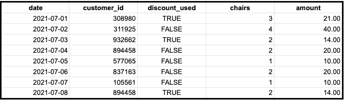
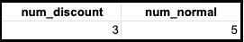
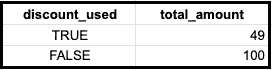
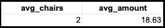

# 如何使用 SQL GROUP BY 子句和聚合函数

> 原文：<https://towardsdatascience.com/how-to-use-the-sql-group-by-clause-and-aggregate-functions-cbaef410be91?source=collection_archive---------3----------------------->

## 让它回到基础


照片由[杜凡](https://unsplash.com/@miinyuii?utm_source=unsplash&utm_medium=referral&utm_content=creditCopyText)在 [Unsplash](https://unsplash.com/s/photos/group?utm_source=unsplash&utm_medium=referral&utm_content=creditCopyText) 上拍摄

> ***请务必*** [***订阅此处***](https://terenceshin.medium.com/membership) ***千万不要错过另一篇关于数据科学指南、诀窍和技巧、生活经验等的文章！***

在本文中，我们将重点关注 SQL 的基础知识，尤其是聚合函数。

# SQL 中的聚合函数是什么？

聚合函数是对一个或多个值执行并返回单个值的函数。当聚合函数与 GROUP BY 子句一起使用时，它可以返回一个**或多个**值。通过本文中的几个例子，您将对此有更好的理解。

对于 SQL 编码来说，有五种主要类型的聚合函数是必不可少的:

1.  计数()
2.  COUNTIF()
3.  最小值()/最大值()
4.  总和()
5.  AVG()

对于这篇文章，我们将继续讨论我们想象中的公司 Sandy Shores(如果你参加了我们关于运营分析各个阶段的[网络研讨会](https://youtu.be/tb4hbsx_cDo)，你一定很了解这家公司)，它出租沙滩椅。

说了这么多，让我们开始吧！

# 1.计数()

COUNT 返回一列中的行数，不包括空值。如果只想计算一列中值的不同数目，可以使用 COUNT(DISTINCT)。

让我们看看 Sandy Shores 如何使用这些功能。假设 Sandy Shores 有一个名为 **transactions** 的表，它跟踪椅子租赁的交易。

*   **日期**代表交易的日期
*   **customer_id** 代表每个不同客户的唯一 id
*   如果客户使用了折扣，则为真，否则为假
*   **椅子**代表租赁的椅子数量
*   **金额**代表交易的总金额



假设 Sandy 想要获得从 7 月 1 日到 7 月 8 日的交易总数。她可以运行以下查询:

```
SELECT COUNT(customer_id) FROM transactions
```

这将返回等于 8 的行数。

简单吧？如果 Sandy 想要获得独立客户的总数，该怎么办？

```
SELECT COUNT(DISTINCT customer_id) FROM transactions
```

这将返回 7，因为 id 为 894458 的客户进行了两次交易，一次在 4 号，一次在 8 号。

我们可以用下面的函数进一步扩展 COUNT:

> ***务必*** [***订阅此处***](https://terenceshin.medium.com/membership) ***千万不要错过另一篇关于数据科学指南、诀窍和技巧、生活经验等的文章！***

# 2.COUNTIF()

COUNTIF 是 COUNT 的扩展，它返回满足条件的行数。


让我们回到我们的表，**事务。**假设 Sandy 想要计算使用折扣的交易数量和不使用折扣的交易数量。这是使用 COUNTIF 函数的最佳时机:

```
SELECT COUNTIF(discount_used = TRUE) as num_discount
     , COUNTIF(discoun_used = FALSE) as num_normal
FROM transactions
```

这将返回以下输出:



现在您已经知道如何使用 COUNT 和 COUNTIF，让我们深入研究一个相似但不同的函数:

# 3.总和()

SUM 返回非空值的总和，换句话说，它将一列中的所有值相加。不要把这个和计数混淆了。COUNT 返回一列中的行数，而 SUM 将一列中的所有值相加。

使用 SUM 时，您应该了解以下几种特殊情况:

*   如果列只有空值，SUM()返回 NULL
*   如果列没有行，SUM()返回 NULL
*   如果列包含 Inf/-Inf，SUM()返回 Inf/-Inf
*   如果列包含 NaN，SUM()返回 NaN
*   如果列有 Inf 和-Inf 的组合，SUM()返回 NaN

当你想知道任何事物的总数时，SUM()是非常有价值的。让我们看看 Sandy Shores 如何使用 SUM()来更好地了解她的业务。


假设桑迪想得到她从 7 月 1 日到 7 月 8 日的总收入。她可以简单地运行以下查询:

```
SELECT SUM(amount)
FROM transactions
```

这将总共返回 149 美元。如果她想在有折扣和没有折扣的情况下合计总金额，该怎么办？

```
SELECT discount_used, SUM(amount) as total_amount
FROM transactions
GROUP BY discount_used
```

这将返回以下内容:



如果我们把这两个数字加起来，也是 149 美元！太棒了！

# 4.AVG()

AVG 只返回非空值列的平均值。从数学上来说，AVG 对给定列的值求和，然后除以相应的行数。

AVG 计算了一个叫做平均值的集中趋势。当您想知道特定指标的平均表现时，这是非常有用的。例如，在商业环境中，您可能希望了解以下信息:

*   你想知道每笔交易的平均 T21 金额是否随着时间的推移而增长
*   您希望了解呼叫中心的平均响应时间是否在减少
*   你想知道生产的平均错误率是否在下降

让我们看看桑迪·肖尔斯如何利用 AVG 来推动她的商业决策。


假设 Sandy 想要获得每笔交易的平均椅子数量，以及每笔交易的平均金额。她可以运行以下查询:

```
SELECT AVG(chairs) as avg_chairs
     , AVG(amount) as avg_amount
FROM transactions
```



这太棒了。但是为了进一步扩展这个分析，让我们来看看我们可以在 AVG 中使用的另外两个函数:

> ***务必*** [***订阅此处***](https://terenceshin.medium.com/membership) ***千万不要错过另一篇关于数据科学指南、诀窍和技巧、生活经验等的文章！***

# 5.最小值()/最大值()

MIN 和 MAX 只是分别返回列的最小值和最大值。

我们之前讨论了 AVG 以及它如何提供给定列的中心趋势。MIN 和 MAX 是补充 AVG 的非常有用的函数，因为它们提供了给定列的**范围**，允许您理解方差和均值。


现在，让我们获取椅子和数量的最小值和最大值，这样，除了她已经计算出的平均值之外，Sandy 还可以得到每个值的范围:

```
SELECT MIN(chairs) as min_chairs
     , MAX(chairs) as max_chairs
     , MIN(amount) as min_amount
     , MAX(amount) as max_amount
FROM transactions
```

这将导致以下结果:


现在，Sandy 知道她预计每位顾客平均会有 2 把椅子，最少 1 把，最多 4 把。同样，她可以期望平均金额为 18.63 美元，最少 10 美元，最多 40 美元。

# 感谢阅读！

> ***一定要*** [***订阅这里***](https://terenceshin.medium.com/membership) ***千万不要错过另一篇关于数据科学的指南、诀窍和技巧、生活经验等文章！***

不确定接下来要读什么？我为你挑选了另一篇文章:

[](/22-new-data-science-interview-questions-for-2022-964c687f735b) [## 2022 年的 22 个新数据科学面试问题

### 来自谷歌、脸书和网飞等顶级科技公司的问题

towardsdatascience.com](/22-new-data-science-interview-questions-for-2022-964c687f735b) 

**还有一个:**

[](/all-machine-learning-algorithms-you-should-know-in-2022-db5b4ccdf32f) [## 2022 年你应该知道的所有机器学习算法

### 最流行的机器学习模型的直观解释

towardsdatascience.com](/all-machine-learning-algorithms-you-should-know-in-2022-db5b4ccdf32f) 

# -特伦斯·申

*   ***如果你喜欢这个，*** [***订阅我的媒介***](https://terenceshin.medium.com/membership) ***获取独家内容！***
*   ***同样，你也可以*** [***跟我上***](https://medium.com/@terenceshin)
*   [***报名我的个人简讯***](https://terenceshin.substack.com/embed)
*   ***跟我上***[***LinkedIn***](https://www.linkedin.com/in/terenceshin/)***其他内容***