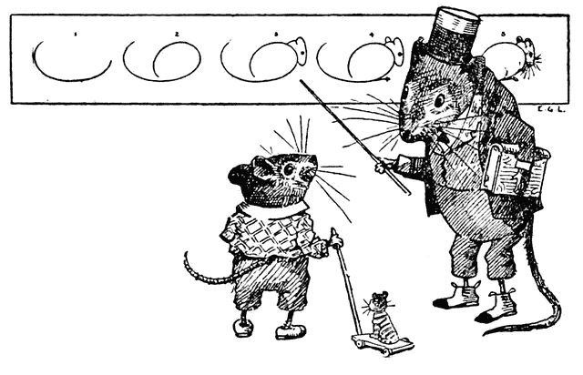
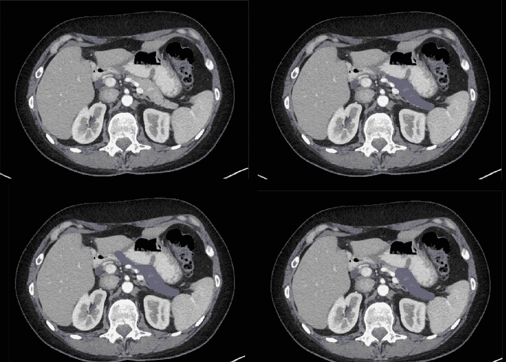
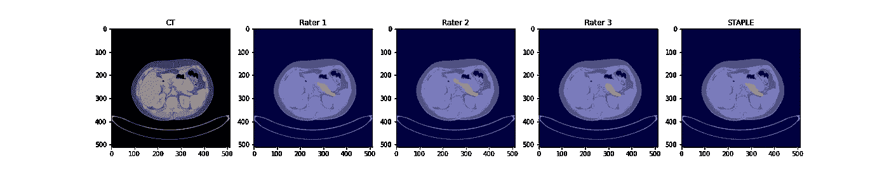
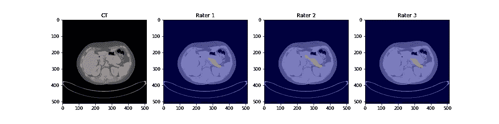

# 如何使用 STAPLE 算法合并多个图像分割

> 原文：<https://towardsdatascience.com/how-to-use-the-staple-algorithm-to-combine-multiple-image-segmentations-ce91ebeb451e?source=collection_archive---------15----------------------->

## 此代码示例显示了如何对医学图像数据集使用 STAPLE 算法

[例如，Lutz(公共领域)](https://commons.wikimedia.org/wiki/File:What_To_Draw_Image_1.png)

医学图像包含丰富的信息，有助于我们了解患者的健康状况。为了解开这些信息，第一步通常是*分割*，或者追踪重要结构。

分割是医学图像分析中最重要的步骤，但却经常被忽视。有关分割过程的更多信息，请查看我的[胰腺分割简介](/how-to-segment-ct-pancreas-3a390acb3c70)。

**定义地面真相**

医学成像和数据科学领域的研究人员面临的最大挑战之一是，我们如何定义什么是“真正的”分割？

从表面上看，这似乎是一个简单的问题。我们要求房间里最聪明的人(通常是放射科医生)尽最大努力分割胰腺，这是我们的基本原则，对吗？

这种方法有几个问题。首先，医生非常忙。让一名放射科专家完成几百次(甚至几十次)扫描是一项艰巨的任务。其次，如果同一个项目有多个放射科医生，我们怎么说哪个是最“专家”的呢？一名放射科专家在结束一天的工作时真的比一名拿着一壶咖啡的医科学生更准确吗？

顺便说一下，这是人工智能(AI)可以改善放射学的方法之一。研究表明，虽然人工智能模型可能不总是比人类专家更准确，但在大多数情况下，它们更精确，这意味着人工智能每次都会给出相同的预测，而人类专家往往会在他们为一个项目投入的时间和精力上有所不同。

要是有一种*民主*的方式来创造我们的基本事实分割就好了。如果多个示踪剂分割相同的扫描，可能会有个人之间的小错误或差异，但这些错误平均起来会成为比任何单个人的工作更好的决定。

输入 STAPLE 算法，这是我最喜欢的算法之一，也可能是医学成像领域中最有用的代码。

在这篇文章中，我将简要描述 STAPLE，并展示一个如何在 Python 中使用它的例子。

**装订算法**

STAPLE 代表“同步事实和性能水平评估”，由 Warwick 等人于 2004 年出版。STAPLE 因其完善的理论和易用性而在医学成像领域被广泛接受。

让我们以我们的 [CT 胰腺分割任务](/how-to-segment-ct-pancreas-3a390acb3c70])为例。提醒一下，这是通过[癌症成像档案馆](https://wiki.cancerimagingarchive.net/display/Public/Pancreas-CT)公开的数据集。假设我们有一个腹部 CT 扫描，其中胰腺被三位不同的放射科医生分割了三次。胰腺的每个像素都被标记为“1”(胰腺)或“0”(无胰腺)。图 1 显示了一个放射科医师的分割示例。

**图一**。三位放射科医生在腹部 CT 中对胰腺进行分割的示例。蓝色标记为“1”(“胰腺”)。背景(透明)标记为“0”。图片作者。

乍一看，所有三个细分可能看起来差不多。但是如果你仔细观察，就会发现它们是不同的。左下的放射科医师有点渴望在整个腹部上绘画(甚至在黑色脂肪组织上绘画)，而右下的放射科医师可能缺少胰腺体的一部分。STAPLE 将帮助我们将这些合并成一个跟踪。

**装订工作原理**

STAPLE 是一种加权投票算法。作为第一步，该算法将通过对每个像素的简单投票，将所有三个组合成一个*测试分割*。STAPLE 将对 3 名放射科医生的准确性进行评级，并与初始测试分段进行比较。然后，它将根据 3 名放射科医生的准确性对他们的投票进行加权，从而重新绘制新的第二次测试分割。如果发现放射科医师 3 的准确率为 90%,而放射科医师 1 和 2 的准确率仅为 30%和 40%,则放射科医师 3 的权重将远远高于其他人。

订书钉是一个迭代的过程；这个估计准确度和重新绘制测试分段的循环将会重复，直到测试分段收敛(停止变化)。STAPLE 保证在合理的时间长度内收敛，通常运行不超过几秒钟。STAPLE 将返回这个最终的测试分段作为“基础事实”。

这些权重是在每个图像的基础上重新计算的。因此，举例来说，如果一个放射科医师倾向于更准确，但碰巧有一个糟糕的病例，该病例不一定会基于先前的准确性被评级为更高。

正如你所料，越多的评分者被用来投票，STAPLE 就变得越准确。在 10 个或 12 个评价者的情况下，钉书钉产生的分割可以被认为是独立于个人贡献的，这使得它成为估计任何给定评价者的准确性的伟大工具。

STAPLE 适用于两个评定者，但我建议你至少使用三个，因为两个评定者不足以评估评定者的准确性，而准确性是使用 STAPLE 的核心优势。

**算法的缺点**

STAPLE 是一个优秀的算法，也是该领域的黄金标准，但也有一些局限性。首先，因为 STAPLE 依赖于多数投票，它可能会倾向于*低估*你试图追踪的结构的边缘。这可能会夸大“假阳性”率的示踪剂相比，主食结合地面真相。

其次，STAPLE 是一种简单的投票算法，它没有考虑图像的语义或潜在属性。如果多个示踪剂标记了某个东西，它将在最终版本中显示出来，而不管实际的解剖。当多个追踪器发现随机变化或错误时，这可能会导致小的像素错误(相信我，这种情况会发生)。

当使用 STAPLE 进行多标记分割时，这些问题往往是一致的。在[我同事的一个标记大脑解剖的出版物](https://pubs.rsna.org/doi/full/10.1148/ryai.2020190183)中，STAPLE 倾向于在相邻结构之间留下小间隙，没有考虑到大脑是连续的这一事实。这导致了订书钉分割，虽然在技术上是准确的，但看起来与用于生成它的分割非常不同。

因此，对你的基本事实进行一些后处理可能是合适的。例如，您可以选择只保留给定类的最大的单个结构，排除小的像素错误。或者，您可以选择定义一个“背景”类来填补任何空白。例如，在腹部器官分割中，我们将“脂肪”定义为背景，因此器官中的任何间隙都将被填充(这通常与实际情况非常接近)。

只是一定要在你的期末论文中报告这样的后处理步骤，这样其他人就可以从你的共享知识中学习了！

**使用装订的例子**

在 Python 中，STAPLE 可以通过 [SimpleITK](https://simpleitk.org/) 获得。下面的代码片段说明了如何使用 STAPLE 来组合三个分段。我用的是 SimpleITK 版本 2.1.0 和 Python 3.7.8。

例 1。使用 STAPLE 将三个分段合并成一个单一的基本事实

在我们继续之前，对这个简单的 ITK 实现做一些快速的注释，它可能很挑剔。

1.  SimpleITK 要求输入数组是整数，可以是 int16、int32 或 int64。这些数组必须都转换为相同的类型
2.  STAPLE 一次只能在一个类上运行。类别标签被定义为“前景值”(第二个运算符)，所有其他像素被视为背景。
3.  对于多类分段，您必须对每个类单独运行 STAPLE，然后将它们重新组合成一个数组，这是包的一个限制。

现在我们已经生成了我们的主要部分，我们可以使用 matplotlib 与我们的三位评分者并排绘制它:

例 2。使用 matplotlib 绘制我们的主食分割

图二。使用 STAPLE 将 3 个胰腺分段合并为一个单一的基本事实的示例(最左侧)。作者图片

如果你眯着眼睛，你可以分辨出我们的示踪剂和主要的地面事实之间的差异，但是很难看到。让我们强调一下每个评分者和订书钉之间的区别:

例 3。绘制每位评定者与主要评定者之间的差异

图 3。每个评分者和订书钉之间的重叠(真阳性)以红色显示。差异用浅蓝色表示。作者图片

在这里，差异非常明显。在胰腺的边缘有一点变化，但最大的不同是 STAPLE 能够纠正评分员 2 在分割胰腺体时犯的一个错误。

**总结**

在本教程中，我介绍了 STAPLE 算法，并展示了如何将来自多个跟踪器的简单分段组合成一个单一的基本事实。

本教程展示了一个简单的例子，但是 STAPLE 也适用于大型任务。在一个项目中，我们在一个由 35 个器官组成的数据集上使用了它，涉及 17 个评分者。除了评分者之间的可靠性，这也是我结合集合预测的首选方法，我用它结合了多达 10 个模型的输出。

希望这篇文章有所帮助！如有问题，欢迎评论，我会尽力解答。

**其他链接**

【https://nipy.org/nibabel/】T4—链接到 Nibabel 包，用于读/写 NIFTI 文件

[https://simpleitk.org/](https://simpleitk.org/)—链接到 STAPLE 的 SimpleITK 实现

[Pypi.org/project/staple](http://pypi.org/projects/staple)——我在研究本文时发现的另一个 STAPLE 实现

关于使用 SimpleITK 进行分段的更深入的教程—

 [## 34 _ 细分 _ 评估

### 评估分割算法最常用的方法是使用参考数据来比较结果。在…

insight software consortium . github . io](http://insightsoftwareconsortium.github.io/SimpleITK-Notebooks/Python_html/34_Segmentation_Evaluation.html) 

链接到我其他一些关于医学成像的文章—

 [## 了解 DICOM

### 如何阅读、书写和组织医学图像

towardsdatascience.com](/understanding-dicom-bce665e62b72)  [## 对 DICOM 文件进行排序的 Python 脚本

### 这个脚本将帮助您理解和组织您的医学图像数据集

towardsdatascience.com](/a-python-script-to-sort-dicom-files-f1623a7f40b8)