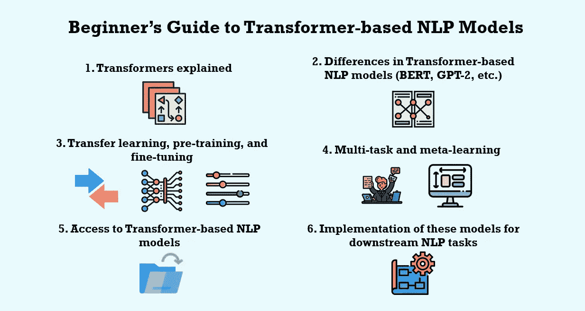

# 如何使用基于变压器的 NLP 模型

> 原文：<https://towardsdatascience.com/how-to-use-transformer-based-nlp-models-a42adbc292e5?source=collection_archive---------7----------------------->

由 Julia Nikulski 创建的图形显示了初学者指南中关于如何使用基于 transformer 的 NLP 模型的主题。由 [Flaticon](https://www.flaticon.com) 制作的 [Becris](https://creativemarket.com/Becris) 、 [Freepik](https://www.freepik.com) 、 [ultimatearm](https://www.flaticon.com/authors/ultimatearm) 、[monk](https://www.flaticon.com/authors/monkik)和[eucalype](https://www.flaticon.com/authors/eucalyp)图标。

## [实践教程](https://towardsdatascience.com/tagged/hands-on-tutorials)

## 理解和实现伯特、GPT-2 和其他用于下游任务的 NLP 模型的初学者指南

几个月前，我开始从事一个涉及文本分类的项目。我以前只使用基本的 NLP 技术来准备文本数据和应用简单的 ML 算法进行分类。然而，我知道基于变压器的 NLP 模型(如 BERT、GPT-3、T5 和 RoBERTa)可以实现最先进的(SOTA)结果。

实际上，让我重新表述这一部分，以准确描述我当时的知识状态:我知道围绕 GPT-3 的发布和这种模型如何能够很好地自行生成文本有着[重大的轰动](https://www.technologyreview.com/2020/07/20/1005454/openai-machine-learning-language-generator-gpt-3-nlp/)。有人告诉我这个模型可以用于文本分类。我该如何“使用这个模型”并让它预测我的数据标签呢？我不知道。

有很多很棒的博客文章解释了变形金刚的技术复杂性，T2 对比了目前可用的许多语言理解和语言生成模型，并提供了 T4 的教程和代码来实现特定的自然语言处理任务。然而，我缺乏基本的信息来理解如何使用这些 NLP 模型。

因此，本文为**提供了一个高层次的概述，传达了围绕**的基础知识**，这些模型如何工作，在哪里可以访问它们，以及如何将它们应用到您自己的数据集和 NLP 任务**。它面向熟悉 NLP 基础知识，但不熟悉更复杂的语言模型和迁移学习的人。为了获得基础知识之外的更多细节，我提供了学术论文、博客文章和代码演练的链接和参考。

劳伦·里奇蒙在 [Unsplash](https://unsplash.com?utm_source=medium&utm_medium=referral) 上的照片

# **1。什么是变压器？**

变压器**是 Vaswani 等人在 2017 年[【1】](http://arxiv.org/abs/1706.03762)开发的一种神经网络架构**。不涉及太多细节，这个模型架构由一个**多头自关注机制结合一个编码器-解码器结构**组成。它可以实现在评估分数( [BLEU 分数](https://machinelearningmastery.com/calculate-bleu-score-for-text-python/))和训练时间方面都优于利用递归( [RNN](https://www.ibm.com/cloud/learn/recurrent-neural-networks) )或卷积神经网络( [CNN](https://lionbridge.ai/articles/difference-between-cnn-and-rnn/) )的各种其他模型的 SOTA 结果。

与其他神经网络(NN)结构相比，转换器的一个**关键优势是，单词**周围的**更长距离的上下文以更高效的计算方式被考虑[【1](http://arxiv.org/abs/1706.03762)，[2】](https://cdn.openai.com/research-covers/language-unsupervised/language_understanding_paper.pdf)。“使……更加困难”这一短语可以在“使登记或投票过程更加困难”这句话中找到，尽管“更加困难”是“使……更加困难”的一个相当遥远的从属词[【1】](http://arxiv.org/abs/1706.03762)。围绕单词的相关上下文的计算可以并行进行，节省了大量的训练资源。**

最初，Transformer 是为 NLP 任务开发的，并由 Vaswani 等人应用于机器翻译[【1】](http://arxiv.org/abs/1706.03762)。然而，它也适用于[图像识别](https://ai.googleblog.com/2020/12/transformers-for-image-recognition-at.html)和其他领域。关于变压器的确切机制和功能的更多细节，请看这些**深入解释**:

*   [变形金刚如何工作](/transformers-141e32e69591#:~:text=Transformers%20are%20a%20type%20of%20neural%20network%20architecture%20that%20have,a%20top%20professional%20Starcraft%20player.)作者[朱利亚诺·吉亚卡利亚](https://medium.com/u/d0de4109e381?source=post_page-----a42adbc292e5--------------------------------)
*   [变形金刚图解指南——逐步解说](/illustrated-guide-to-transformers-step-by-step-explanation-f74876522bc0)作者[迈克尔·皮](https://medium.com/u/1bdc81ea939d?source=post_page-----a42adbc292e5--------------------------------)
*   [什么是变压器](https://medium.com/inside-machine-learning/what-is-a-transformer-d07dd1fbec04)由[格言](https://medium.com/u/ad76d4149790?source=post_page-----a42adbc292e5--------------------------------)可知
*   [插图变压器](http://jalammar.github.io/illustrated-transformer/)作者[杰伊·阿拉玛](http://jalammar.github.io/)

马库斯·斯皮斯克在 [Unsplash](https://unsplash.com?utm_source=medium&utm_medium=referral) 上的照片

# 2.NLP 模型如何利用 Transformer 架构，它们的不同之处是什么？

Transformer 模型结构已经在很大程度上取代了其他 NLP 模型实现，比如 RNNs[【3】](http://arxiv.org/abs/1910.10683)。当前的 SOTA **NLP 模型部分或整体使用变压器架构**。GPT 模型只使用了变换器结构(单向)[【2】](https://cdn.openai.com/research-covers/language-unsupervised/language_understanding_paper.pdf)的解码器，而 BERT 是基于变换器编码器(双向)[【4】](http://arxiv.org/abs/1810.04805)。T5 采用了与原始实现[【3】](http://arxiv.org/abs/1910.10683)非常相似的编码器-解码器转换器结构。这些通用架构在组成编码器或解码器的元素的数量和维度方面也有所不同(即，层数、隐藏大小以及它们采用的自关注头的数量[【4】](http://arxiv.org/abs/1810.04805))。

除了模型结构的这些变化外，**语言模型在用于预训练的数据和任务方面也有差异**，这将在下面的段落中进一步阐述。有关确切模型架构及其预培训设计的更多详细信息，您可以参考介绍这些模型的学术论文:

*   [【2】](https://cdn.openai.com/research-covers/language-unsupervised/language_understanding_paper.pdf):GPT
*   3:T5
*   [ [4](https://arxiv.org/abs/1810.04805) ]:伯特
*   [【5】](https://arxiv.org/pdf/2001.00781.pdf):各种 NLP 模型及其差异的详尽概述

照片由[蒂姆·莫斯霍尔德](https://unsplash.com/@timmossholder?utm_source=medium&utm_medium=referral)在 [Unsplash](https://unsplash.com?utm_source=medium&utm_medium=referral) 上拍摄

# 3.什么是迁移学习、预培训和微调？

许多基于 Transformer 的 NLP 模型是专门为迁移学习而创建的[ [3](http://arxiv.org/abs/1910.10683) ，[4】](http://arxiv.org/abs/1810.04805)。**迁移学习**描述了一种方法，其中首先使用自我监督学习[【5】](https://arxiv.org/pdf/2001.00781.pdf)在大型无标签文本语料库上对模型进行预训练。然后在对特定 NLP(下游)任务[【3】](http://arxiv.org/abs/1910.10683)进行微调的过程中对其进行最小程度的调整。特定 NLP 任务的标注数据集通常相对较小。与预训练版本[【2】](https://cdn.openai.com/research-covers/language-unsupervised/language_understanding_paper.pdf)相比，仅在如此小的数据集上训练模型而不进行预训练会降低结果。相同的预训练模型可以用于微调各种 NLP 下游任务，包括文本分类、摘要或问题回答。

各种未标记的数据源可用于**预训练**。只要数据集足够大，它们在微调期间可以与数据或任务完全无关。使用 40 GB 的文本[ [6](https://cdn.openai.com/better-language-models/language_models_are_unsupervised_multitask_learners.pdf) ]对 GPT-2 进行预训练。因此，预训练非常耗费时间和资源，通常需要使用多个 GPU，耗时数小时甚至数天。在预培训期间实施的数据集和学习目标在不同的模型之间有很大的不同。GPT 使用标准语言建模目标[【2】](https://cdn.openai.com/research-covers/language-unsupervised/language_understanding_paper.pdf)，预测句子中的下一个单词，而伯特则接受掩蔽语言建模(MLM)和下一句预测(NSP)[【4】](http://arxiv.org/abs/1910.10683)的训练。RoBERTa 模型复制了 BERT 模型架构，但使用更多数据改变了预训练，训练时间更长，并删除了 NSP 目标[【7】](https://arxiv.org/pdf/1907.11692.pdf)。

预训练模型的模型检查点作为**微调**的起点。特定下游任务的标记数据集用作训练数据。有几种不同的[微调方法](https://www.analyticsvidhya.com/blog/2020/07/transfer-learning-for-nlp-fine-tuning-bert-for-text-classification/)，包括以下几种:

1.  根据标记的数据训练整个模型。
2.  只训练较高层，冻结较低层。
3.  冻结整个模型并训练一个或多个添加在顶部的附加层。

在[【3】](http://arxiv.org/abs/1910.10683)中解释了另外两种类型的微调(适配器层和逐渐解冻)。无论采用哪种方法，**特定于任务的输出层通常需要附加到模型**上。如果您仅在新的文本数据集上微调模型，但学习目标保持不变，则不需要这一层。如果在特定的文本数据集上使用 GPT-2 进行语言生成，就会出现这种情况。

几篇介绍预训练的基于变压器的模型的研究论文也进行了微调实验，以展示它们的迁移学习性能。**例如，BERT** 接受了 11 个 NLP 任务**的训练，微调整个模型中的所有参数，并将输出提供给特定任务的输出层**。

杰斯·贝利在 [Unsplash](https://unsplash.com?utm_source=medium&utm_medium=referral) 上拍摄的照片

# 4.除了迁移学习还有其他方法吗？

**多任务学习**旨在提高跨任务和领域的模型泛化能力 [8](https://arxiv.org/pdf/2007.16008.pdf) 。同一个模型可以执行各种下游 NLP 任务，而不需要微调或改变模型参数或架构。GPT-2 仅使用语言建模目标在大型和多样化的文本数据集上进行训练。对于各种 NLP 任务，它达到了 SOTA 结果，而没有对这些任务进行微调。在推理期间只提供了几个例子来帮助模型理解所请求的任务。

**元学习**特别适用于特定任务数据集只有少量样本的情况(低资源任务)。它使模型能够开发良好的初始化和广泛的技能，在推理过程中快速适应新的或以前看到的任务[ [9](http://arxiv.org/abs/2005.14165) ， [10](http://arxiv.org/abs/1908.10423) ]。多任务学习和元学习之间的一个关键区别是，多任务学习的性能偏向于具有大数据集的任务。元学习能很好地适应任何任务。类似于多任务学习，元学习模型不需要微调。

**零触发、一次触发和少量触发学习**有时被称为元学习。这些规格指的是在推理时提供给模型[ [9](http://arxiv.org/abs/2005.14165) ]的演示次数。

照片由 [Jazmin Quaynor](https://unsplash.com/@jazminantoinette?utm_source=medium&utm_medium=referral) 在 [Unsplash](https://unsplash.com?utm_source=medium&utm_medium=referral) 拍摄

# 5.在哪里可以获得这些模型？

研究人员开发的大多数基于变压器的模型都是开源的(目前除了 GPT-3)。你可以在 GitHub 上找到他们的模型实现(例如， [BERT](https://github.com/google-research/bert) )。然而，如果您想要将模型应用到您自己的 NLP 任务中，您需要**模型检查点**。你可以通过 [**抱脸**](https://huggingface.co/) 提供的 [**变形金刚库**](https://huggingface.co/transformers/index.html) **来访问这些。这个图书馆给你超过 32 个预先训练的 SOTA 模型。它提供了一个 API，允许您使用 PyTorch 或 TensorFlow 轻松地将模型集成到代码中。**

拥抱脸被谷歌、微软和脸书等组织使用。然而，**它的变形金刚库对初学者来说也很棒**。它有大量的文档和各种 Google Colab 笔记本，提供了使用 [DistilBERT](https://huggingface.co/transformers/model_doc/distilbert.html) 进行文本分类的[示例实现](https://colab.research.google.com/github/huggingface/notebooks/blob/master/examples/text_classification.ipynb#scrollTo=n9qywopnIrJH)。他们还会带你通过[更一般的例子](https://huggingface.co/transformers/training.html)了解如何训练和微调一个模型。

有了[管道](https://huggingface.co/transformers/main_classes/pipelines.html)对象，你只需要写几行代码就可以对各种不同的任务做推理。这些管道利用已经微调过的模型，并且[文档](https://huggingface.co/transformers/main_classes/pipelines.html)解释了哪些模型与哪些特定于任务的管道一起工作。抱抱脸甚至创造了一个 [**零拍分类流水线**](https://huggingface.co/transformers/main_classes/pipelines.html#zeroshotclassificationpipeline) 。它接受任何文本输入和标签数量，并返回每个标签的概率。在微调过程中，没有必要看到这些标签中的任何一个(因此称为零触发)。

照片由[丹尼尔·麦金尼斯](https://unsplash.com/@dsmacinnes?utm_source=medium&utm_medium=referral)在 [Unsplash](https://unsplash.com?utm_source=medium&utm_medium=referral) 上拍摄

# 6.如何将这些模型应用到 NLP 任务中？

如果你知道你想要执行什么 NLP 任务，你将需要**决定哪个基于 Transformer 的模型最适合这个目的**。例如，GPT-2 通过其单向架构为语言生成进行了预训练和设计，使其对语言生成任务最有用。但是，也可以对[序列分类](https://huggingface.co/transformers/model_doc/gpt2.html#gpt2forsequenceclassification)进行微调。

你可以**查阅这些模型的原始学术论文，以了解它们针对哪些任务进行了微调，以及它们在哪些方面表现得特别好**。你也可以查看[拥抱脸变形金刚文档](https://huggingface.co/transformers/index.html)，里面详细介绍了各种模型及其应用领域。

选择型号后，您可以对其进行微调。或者，你可以**选择一个已经调好的模型、多任务或元学习者，然后马上开始推理**(见[管道](https://huggingface.co/transformers/main_classes/pipelines.html)拥抱脸的对象)。抛开拥抱脸提供的 32+预训练模型，其社区提供了超过[9000 种模型规格](https://huggingface.co/models)。

你将**必须熟悉神经网络(NN)和深度学习至少一点点**才能在大多数情况下微调模型。请记住，您通常会在预训练的模型中添加一个特定于任务的 NN 层，并实施一个训练过程。此外，您需要将数据集转换成正确的数据结构，以便与您的训练过程兼容。如果你还没有和 NNs 合作过，我建议你在这里阅读一下:

*   [初学者的机器学习:神经网络介绍](/machine-learning-for-beginners-an-introduction-to-neural-networks-d49f22d238f9)作者 [Victor Zhou](https://medium.com/u/dd190d205cab?source=post_page-----a42adbc292e5--------------------------------)
*   [深度学习简介](https://www.kaggle.com/learn/intro-to-deep-learning)关于 [Kaggle](https://www.kaggle.com/)
*   [第一个神经网络初学者讲解(附代码)](/first-neural-network-for-beginners-explained-with-code-4cfd37e06eaf)作者[阿瑟·阿恩克斯](https://medium.com/u/4aa81c733935?source=post_page-----a42adbc292e5--------------------------------)

为了**开始一个特定的任务并微调你的模型**，看一下这些用于各种下游 NLP 任务的示例实现:

*   [为万智牌风味文本生成微调 GPT-2](https://medium.com/swlh/fine-tuning-gpt-2-for-magic-the-gathering-flavour-text-generation-3bafd0f9bb93)作者[理查德·鲍恩斯](https://medium.com/u/c972b9933eed?source=post_page-----a42adbc292e5--------------------------------)
*   [微调 T5 变压器用于任何摘要任务](/fine-tuning-a-t5-transformer-for-any-summarization-task-82334c64c81)由 [Priya Dwivedi](https://medium.com/u/b040ce924438?source=post_page-----a42adbc292e5--------------------------------)
*   [微调 BERT，使用 HuggingFace 和 PyTorch Lightning 进行多标签文本分类|数据集](https://www.youtube.com/watch?v=wG2J_MJEjSQ)作者[维尼林·瓦尔科夫](https://www.youtube.com/channel/UCoW_WzQNJVAjxo4osNAxd_g)

照片由[缺口缺口](https://unsplash.com/@jannerboy62?utm_source=medium&utm_medium=referral)在[缺口](https://unsplash.com?utm_source=medium&utm_medium=referral)处拍摄

# 结论

起初，利用基于 Transformer 的 NLP 模型似乎令人望而生畏。已经发表了许多文章，非常详细地解释了与这些模型相关的概念。然而，在我深入这些细节之前，我想先有一个更广泛的概述。这是对与模型、训练过程以及将其应用于您自己的 NLP 用例相关的最重要元素的高级概述，希望能阐明如何使用它们。对于我的文本分类任务，我最终使用了 [Longformer](https://huggingface.co/transformers/model_doc/longformer.html) 模型，并使用 [PyTorch Lightning](https://www.pytorchlightning.ai/) 对其进行了微调。

你想在媒体上阅读更多高质量的故事吗？考虑注册一个支持我和其他媒体作者的会员。

 [## 通过我的推荐链接加入 Medium-Julia Nikulski

### 作为一个媒体会员，你的会员费的一部分会给你阅读的作家，你可以完全接触到每一个故事…

medium.com](https://medium.com/@julia.nikulski/membership) 

你想开始使用基于 Transformer 的 NLP 模型，但是你还没有一个具体的项目想法吗？为什么不看看我的关于如何提出独特的数据科学项目想法的 5 步指南:

 [## 开发独特数据科学项目创意的 5 个步骤

### 帮助您识别值得一试的新颖独特的数据项目的指南

towardsdatascience.com](/5-steps-to-develop-unique-data-science-project-ideas-6c2b3a0014b) 

# 学术论文参考文献

[1] Vaswani，a .，Shazeer，n .，Parmar，n .，Uszkoreit，j .，Jones，l .，Gomez，A. N .，Kaiser，l .，& Polosukhin，I. (2017)。你需要的只是关注。ArXiv:1706.03762 [Cs]。[http://arxiv.org/abs/1706.03762](http://arxiv.org/abs/1706.03762)

[2]拉德福德、纳拉辛汉、萨利曼斯和苏茨基弗(2018 年)。*通过生成性预训练提高语言理解*。[https://cdn . open ai . com/research-covers/language-unsupervised/language _ understanding _ paper . pdf](https://cdn.openai.com/research-covers/language-unsupervised/language_understanding_paper.pdf)

[3] Raffel，c .，Shazeer，n .，Roberts，a .，Lee，k .，Narang，s .，Matena，m .，周，y .，Li，w .，，刘，P. J. (2020)。用统一的文本到文本转换器探索迁移学习的局限性。ArXiv:1910.10683 [Cs，Stat]。[http://arxiv.org/abs/1910.10683](http://arxiv.org/abs/1910.10683)

[4] Devlin，j .，Chang，m-w .，Lee，k .，& Toutanova，K. (2019 年)。BERT:用于语言理解的深度双向转换器的预训练。ArXiv:1810.04805 [Cs]。[http://arxiv.org/abs/1810.04805](http://arxiv.org/abs/1810.04805)

[5]阿恩马赫，m .，，霍伊曼，C. (2020 年)。预训练语言模型的可比性。 *ArXiv:2001.00781 [Cs，Stat]* 。[http://arxiv.org/abs/2001.00781](http://arxiv.org/abs/2001.00781)

[6]a .、吴 j .、蔡尔德 r .、栾 d .、阿莫代伊 d .、&苏茨基弗 I. (2019)。语言模型是无人监督的多任务学习者。 *OpenAI 博客*， *1* (8)，9。[https://cdn . open ai . com/better-language-models/language _ models _ are _ unsupervised _ 多任务 _ 学习者. pdf](https://cdn.openai.com/better-language-models/language_models_are_unsupervised_multitask_learners.pdf)

[7]刘，y .，奥特，m .，戈亚尔，n .，杜，j .，乔希，m .，陈，d .，利维，o .，刘易斯，m .，泽特勒莫耶，l .，&斯托扬诺夫，V. (2019)。RoBERTa:稳健优化的 BERT 预训练方法。ArXiv:1907.11692 [Cs]。[http://arxiv.org/abs/1907.11692](http://arxiv.org/abs/1907.11692)

[8] Worsham，j .，& Kalita，J. (2020 年)。面向 21 世纪 20 年代自然语言处理的多任务学习:我们要去哪里？*模式识别字母*、 *136* ，120–126。[https://doi.org/10.1016/j.patrec.2020.05.031](https://arxiv.org/pdf/2007.16008.pdf)

[9] Brown，T. B .，Mann，b .，Ryder，n .，Subbiah，m .，Kaplan，j .，Dhariwal，p .，Neelakantan，a .，Shyam，p .，Sastry，g .，Askell，a .，Agarwal，s .，Herbert-Voss，a .，Krueger，g .，Henighan，t .，Child，r .，Ramesh，a .，Ziegler，D. M .，Wu，j .，Winter，c .，Amodei，D. (2020 年)。语言模型是一次性学习者。ArXiv:2005.14165 [Cs] 。http://arxiv.org/abs/2005.14165

[10]窦，张志勇，于，k .，，阿纳斯塔西索普洛斯，A. (2019).低资源自然语言理解任务的元学习算法研究。*ArXiv:1908.10423【Cs】*。[http://arxiv.org/abs/1908.10423](http://arxiv.org/abs/1908.10423)