# 如何使用变压器网络建立预测模型

> 原文：<https://towardsdatascience.com/how-to-use-transformer-networks-to-build-a-forecasting-model-297f9270e630?source=collection_archive---------3----------------------->

## [实践教程](https://towardsdatascience.com/tagged/hands-on-tutorials)

## 使用变压器和 PyTorch 训练预测模型


由[安东尼·斯克里瓦科斯](https://unsplash.com/@antoskli?utm_source=unsplash&utm_medium=referral&utm_content=creditCopyText)在 [Unsplash](https://unsplash.com/s/photos/mountain-range?utm_source=unsplash&utm_medium=referral&utm_content=creditCopyText) 上拍摄的照片

我最近读了一篇非常有趣的论文，叫做 [**时间序列预测的深度转换模型:流感流行案例**](https://arxiv.org/pdf/2001.08317.pdf) **。**我认为这可能是一个有趣的项目，从头实现类似的东西，以了解更多关于时间序列预测的信息。

# 预测任务:

在时间序列预测中，目标是在给定历史值的情况下预测时间序列的未来值。时间序列预测任务的一些示例如下:

*   预测流感流行案例: [**时间序列预测的深度变换模型:流感流行案例**](https://arxiv.org/pdf/2001.08317.pdf) **e**
*   能源生产预测: [**能源消费预测采用堆叠式非参数贝叶斯方法**](https://arxiv.org/abs/2011.05519)
*   天气预报: [**MetNet:降水预报的神经天气模型**](https://arxiv.org/abs/2003.12140)

例如，我们可以存储一个城市几个月的能源消耗指标，然后训练一个模型，该模型将能够预测该城市未来的能源消耗。这可以用于估计能源需求，因此能源公司可以使用该模型来估计在任何给定时间需要生产的能源的最佳值。

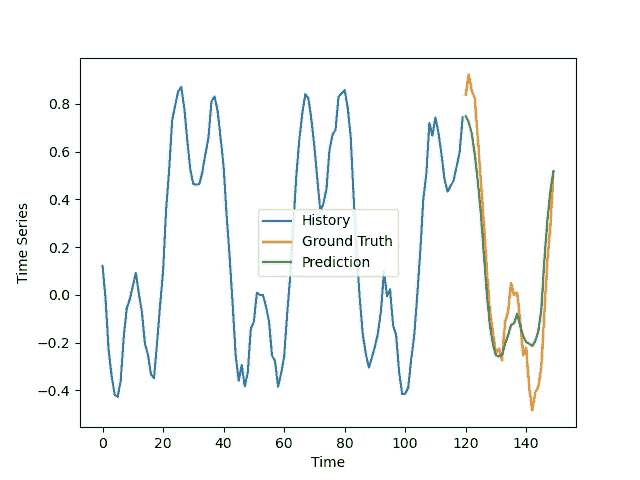

时间序列预测示例

# 型号:

我们将使用的模型是编码器-解码器转换器，其中编码器部分将时间序列的历史作为输入，而解码器部分以自回归方式预测未来值。

解码器使用注意机制与编码器链接。通过这种方式，解码器可以在进行预测之前学会“关注”时间序列历史值中最有用的部分。

解码器使用掩蔽的自我关注，使得网络不能通过向前看并使用未来值来预测过去值而在训练期间作弊。

编码器子网:

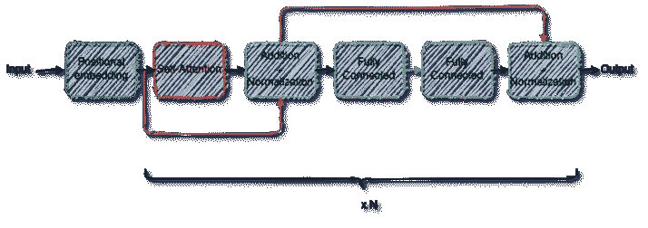

作者提供的编码器/图像

解码器子网络:

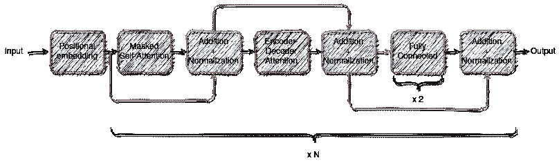

作者的解码器/图像

完整模型:

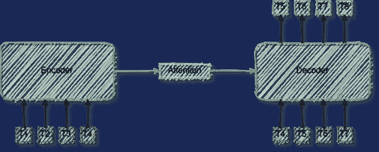

自回归编码器-解码器转换器/作者提供的图像

可以使用 PyTorch 通过以下方式构建该架构:

```
encoder_layer = nn.TransformerEncoderLayer(
    d_model=channels,
    nhead=8,
    dropout=self.dropout,
    dim_feedforward=4 * channels,
)
decoder_layer = nn.TransformerDecoderLayer(
    d_model=channels,
    nhead=8,
    dropout=self.dropout,
    dim_feedforward=4 * channels,
)

self.encoder = torch.nn.TransformerEncoder(encoder_layer, num_layers=8)
self.decoder = torch.nn.TransformerDecoder(decoder_layer, num_layers=8)
```

# 数据:

每次我实现一种新方法，我都喜欢先在合成数据上尝试，这样更容易理解和调试。这降低了数据的复杂性，并且更加关注实现/算法。

我编写了一个小脚本，可以生成具有不同周期、偏移量和模式的非平凡时间序列。

```
def generate_time_series(dataframe):

    clip_val = random.uniform(0.3, 1)

    period = random.choice(periods)

    phase = random.randint(-1000, 1000)

    dataframe["views"] = dataframe.apply(
        lambda x: np.clip(
            np.cos(x["index"] * 2 * np.pi / period + phase), -clip_val, clip_val
        )
        * x["amplitude"]
        + x["offset"],
        axis=1,
    ) + np.random.normal(
        0, dataframe["amplitude"].abs().max() / 10, size=(dataframe.shape[0],)
    )

    return dataframe
```

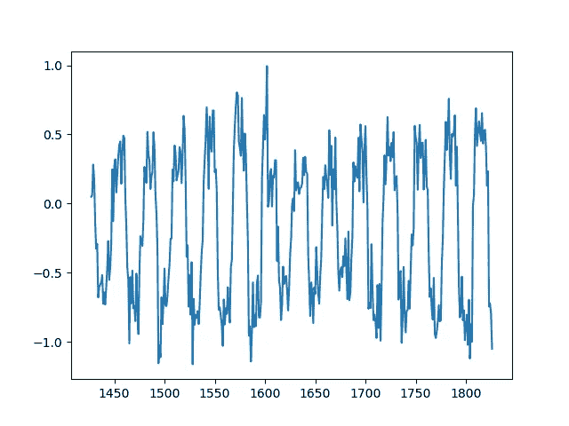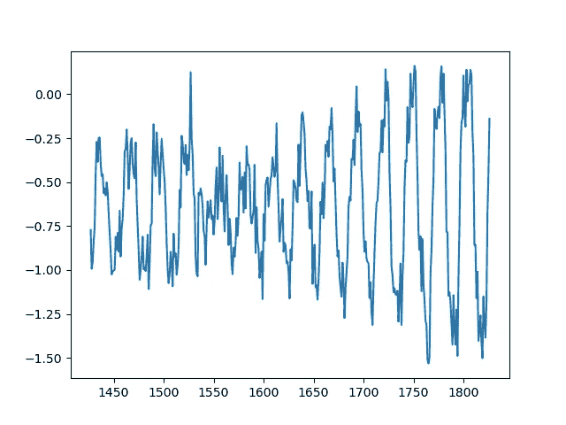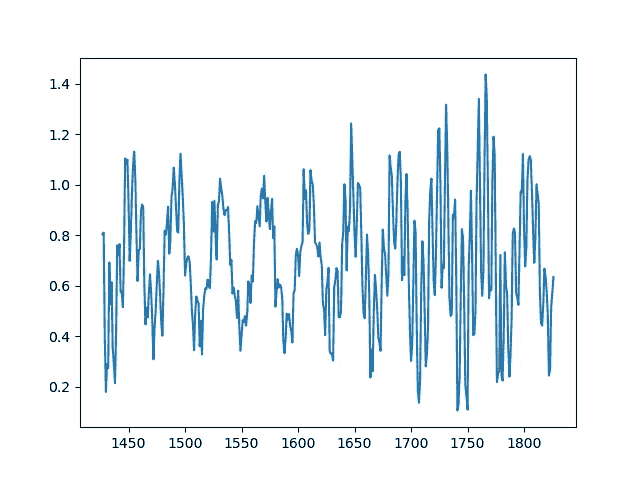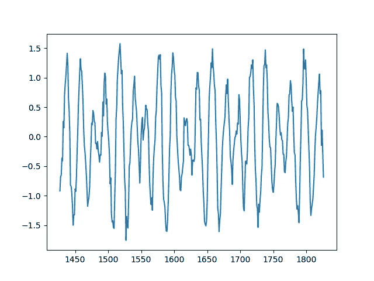

作者生成的时间序列/图像示例

然后在**对模型进行训练，所有这些时间序列同时进行**:

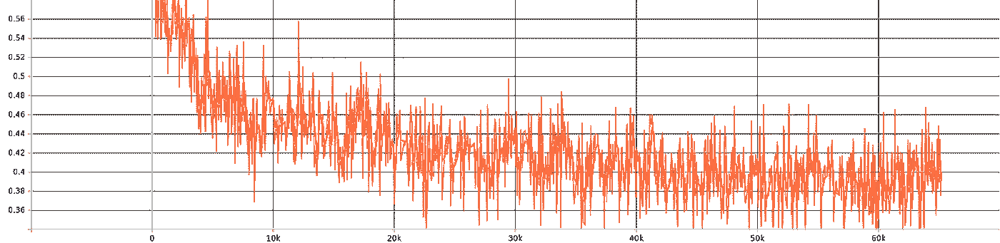

作者培训损失/图像

# 结果:

我们现在使用该模型对这些时间序列的未来值进行预测。结果有些复杂:

坏消息:

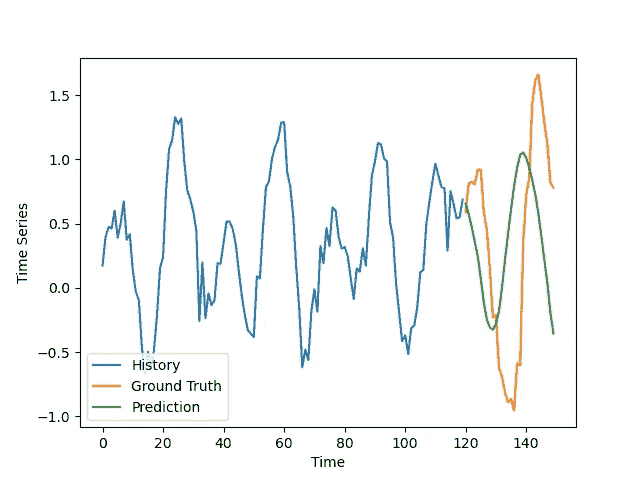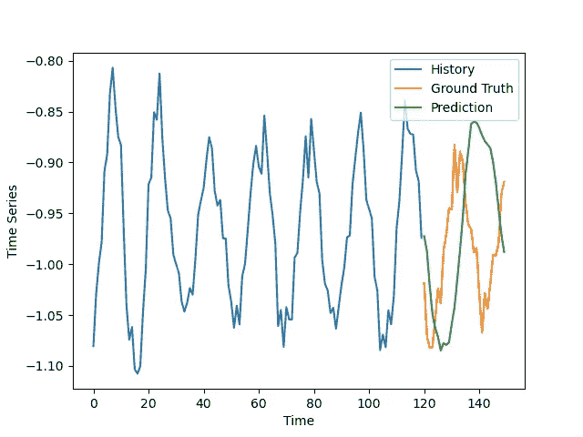

作者的错误预测/图片示例

优点:

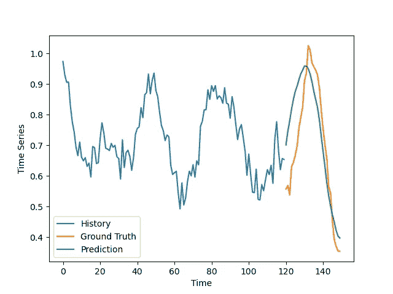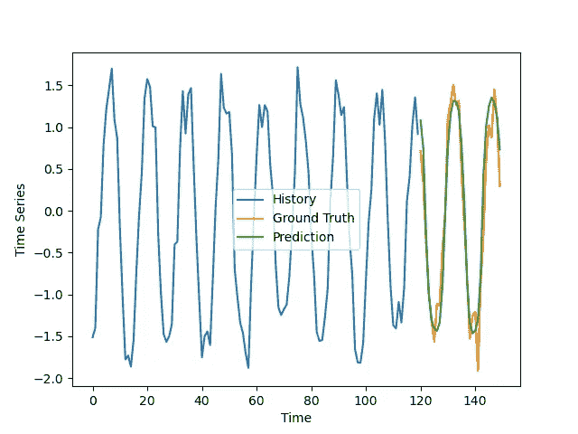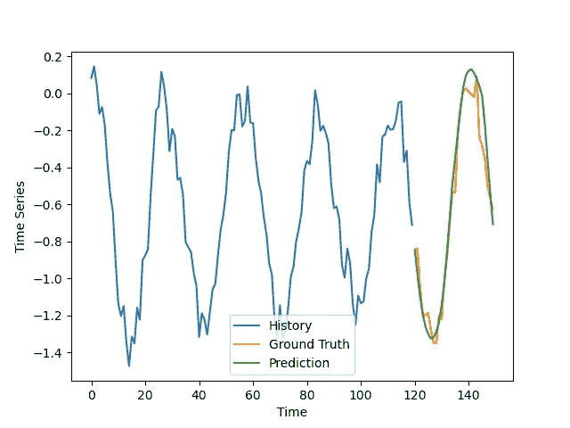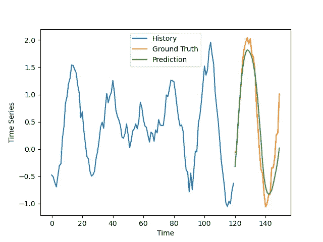

作者的优秀预测/图像示例

结果没有我预期的那么好，特别是考虑到对合成数据做出好的预测通常很容易，但它们仍然令人鼓舞。

该模型的预测有些异相，在一些糟糕的例子中略微高估了振幅。在好的例子中，预测与地面真实情况非常吻合，排除了噪声。

我可能需要对我的代码进行更多的调试，并对超参数进行优化，然后才能期望获得更好的结果。

# 结论:

变压器目前是众多机器学习应用中非常受欢迎的模型，因此它们将用于时间序列预测是很自然的。

在处理时间序列时，Transformers 可能不是您的首选方法，因为它们可能很笨重且需要大量数据，但考虑到它们的多功能性和广泛的应用范围，它们很适合放在您的机器学习工具包中，从它们在 NLP 中的首次引入到音频处理、计算机视觉和时间序列。

如果您有任何问题或建议，请随时发表评论。

https://github.com/CVxTz/time_series_forecasting