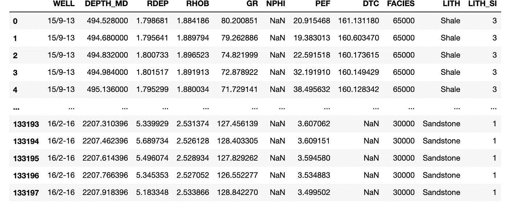
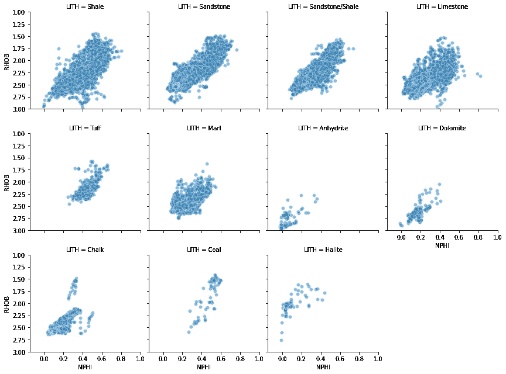
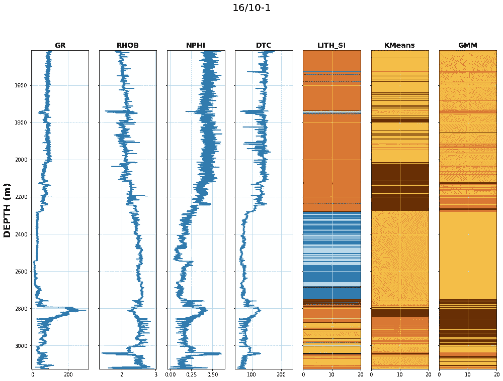
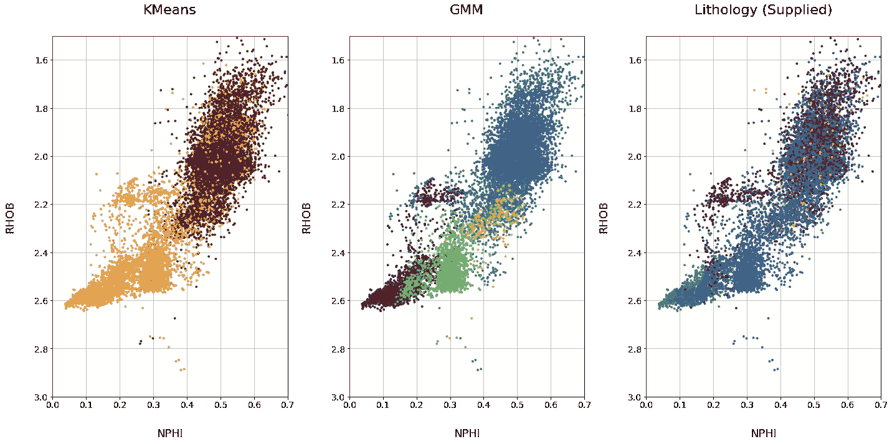
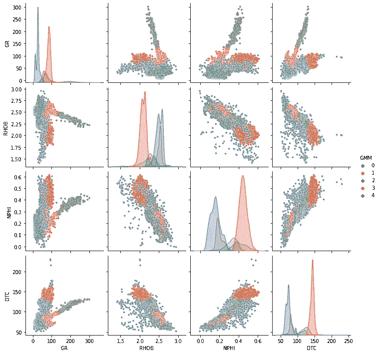

# 如何用 Python 对测井数据进行无监督聚类

> 原文：<https://towardsdatascience.com/how-to-use-unsupervised-learning-to-cluster-well-log-data-using-python-a552713748b5?source=collection_archive---------6----------------------->

## 使用 Python 细分地下


对测井数据进行无监督聚类分析，以识别岩相(图片由作者提供)

了解地下岩性是地球科学和岩石物理学中的一项重要任务。使用由测井技术产生的各种电测量，我们能够推断出下面的地质情况，例如岩性、岩相、孔隙度和渗透率。

机器学习算法通常被用来将测井记录测量值分成不同的岩性组，称为岩相。这个过程可以使用无监督学习或监督学习算法来实现。

**监督学习**是最常见和最实用的机器学习任务，它旨在使用已映射到“正确”输出的输入数据从示例中学习。或者，我们可以使用**无监督学习**运行建模，让算法识别数据中的潜在模式，这些模式在数据探索过程中可能不容易看到。

在本教程中，我们将使用两种聚类方法(K 均值聚类和高斯混合建模)进行无监督学习分类，并将结果与已建立的岩相曲线进行比较。

## 什么是聚类/聚类分析？

数据聚类是探索性数据分析(EDA)的一种常见形式，用于根据共享的特征或属性将数据分成不同的组。彼此相似的数据点被分组在同一个群集中，而不同的数据点被放在另一个群集中。

## k 均值聚类

K-Means 聚类是一种非常常用的无监督机器学习算法。它用于通过最小化数据点和质心之间的距离来将数据分组为 K 个簇。

质心在数据空间中的 k 个随机点处被初始化，并且基于到质心的距离，其周围的所有点被分配给相关的聚类。然后将质心调整到群集的中心点，并重新分配其周围的点。这种情况一直持续到质心没有变化或者这些点保持在同一个簇中，或者直到达到最大迭代次数。

K-Means 是一种硬聚类方法，其中数据点要么属于某个聚类，要么不属于某个聚类。它还通过对数据应用圆(或多维数据集中的超球)来执行聚类。

## 高斯混合模型

GMM 方法也允许对数据点进行聚类，只是它考虑了数据差异，导致了更软的分类，并且它不是基于距离而是基于分布。

此外，被分类的数据点有可能是一个或另一个聚类。

虽然 K-Means 聚类在数据聚类是圆形的情况下效果很好，但是，在岩石物理和地质情况下，数据很少形成良好的圆形模式。GMM 模型使用椭圆形的聚类/决策边界，因此更加灵活。

一篇关于这两种方法之间差异的优秀文章可以在[https://www . analyticsvidhya . com/blog/2019/10/Gaussian-mixture-models-clustering/](https://www.analyticsvidhya.com/blog/2019/10/gaussian-mixture-models-clustering/)找到

## 资料组

我们在本教程中使用的数据集构成了由 [Xeek 和 FORCE 2020](https://doi.org/10.5281/zenodo.4351155) 举办的机器学习竞赛的一部分。竞赛的目的是从现有的标记数据中预测岩性。该数据集由挪威海的 118 口井组成。

本文的数据和笔记本可以在我位于 https://github.com/andymcdgeo/Petrophysics-Python-Series[的 GitHub 仓库中找到。](https://github.com/andymcdgeo/Petrophysics-Python-Series)

## 导入库和数据加载

项目的第一步是导入我们需要的库。对于这个例子，我们将使用 [NumPy](https://numpy.org) 处理数组， [pandas](https://pandas.pydata.org) 存储数据， [seaborn](https://seaborn.pydata.org) 和 [matplotlib](https://matplotlib.org) 显示数据。

然后我们将使用`pd.read_csv`读入数据，然后使用`describe()`方法查看数据细节。


的数据描述

由于这是一个相当大的表，我们可以通过调用`df.columns`来查看列。

这将返回 dataframe 中的列数组:

```
Index(['WELL', 'DEPTH_MD', 'X_LOC', 'Y_LOC', 'Z_LOC', 'GROUP', 'FORMATION', 'CALI', 'RSHA', 'RMED', 'RDEP', 'RHOB', 'GR', 'SGR', 'NPHI', 'PEF', 'DTC', 'SP', 'BS', 'ROP', 'DTS', 'DCAL', 'DRHO', 'MUDWEIGHT', 'RMIC', 'ROPA', 'RXO', 'FORCE_2020_LITHOFACIES_LITHOLOGY', 'FORCE_2020_LITHOFACIES_CONFIDENCE'], dtype='object')
```

在这个例子中，我们不需要所有的列，所以我们将复制一个包含所需测井测量值的数据帧，包括井名和深度曲线。

我们还将把`FORCE_2020_LITHOFACIES_LITHOLOGY`列重命名为更简单的名称，如`FACIES`。

当我们调用 dataframe 时，我们要处理的列数量要少得多。


## 列重新映射/重命名

为了简化绘图，并理解数据中提供的岩性数字的含义，我们可以创建两个字典并将`FACIES`列映射到两个新列。

第一个是为数字的字符串表示创建一个字典。

第二本字典将岩性数字简化为 1 到 12 的范围，而不是原始数据中使用的大范围数字。这将有助于绘制对数图。

为了在我们的数据框架中创建新的列，我们首先定义列名`workingdf['LITH']`，然后使用`.map()`方法分配映射值。

我们对相的字符串和简单数字表示都这样做。

当我们查看数据帧时，我们可以看到现在在末尾有两个新列。



## 将数据可视化

由于已经有一个包含该数据的相列，我们可以快速查看数据在每个岩相中的分布情况。

为了做到这一点，我们可以使用 Seaborn 的`FacetGrid`方法为每种岩性绘制单独的密度-中子交会图(散点图)。

FacetGrid 用于创建地块的基础结构。在这个例子中，FacetGrid 已经被传递了我们正在处理的 data frame(`workingdf`)、我们想要用来拆分图的列(`col`)以及我们想要换行到新行的点(`col_wrap`)。在这种情况下，一旦有 4 列，数据就会换行。

然后我们可以在`FacetGrid`的顶部绘制一个密度中子交会图。



FORCE 2020 XEEK 机器学习数据集内岩性的 FacetGrid。

**创建绘图功能**

在绘制任何数据之前，我们需要创建一些函数。第一个是 create plot 函数，它将接受一些参数和我们的相曲线，并将生成一个常规的测井曲线。

**按井函数拆分数据**

我们将创建的第二种方法将用于按井分割我们的数据帧。这是使用`groupby`函数完成的，它将允许我们将每个数据帧存储在一个列表中，以便于以后访问。

然后，我们可以调用该函数:

这将返回一个索引位置和相关井名的列表

```
index  wellname
0      15/9-13
1      15/9-15
2      15/9-17
3      16/1-2
4      16/1-6 A
5      16/10-1
6      16/10-2
7      16/10-3
8      16/10-5
9      16/11-1 ST3
10      16/2-11 A
11      16/2-16
```

# 无监督聚类

在本节中，我们将建立聚类模型，并在数据集上运行它们。

首先，我们将从 sklearn 库中导入我们的集群模型。

## 寻找最佳聚类数

为了确保 K 均值和高斯混合建模模型有效工作，我们需要为它们提供一个初始的聚类数。如果聚类数选择不正确，算法可能无法很好地执行，或者可能需要更长的时间来解决问题(尤其是当聚类数过高时)。

我们可以尝试使用肘形图来确定最佳聚类数，目标是根据结果中形成的“肘形”或拐点来选择聚类数。还有其他方法，例如用于挑选集群数量的剪影方法。

对于这个例子，我们将使用肘图。为此，我们在给定的聚类范围内评估模型性能，然后从图中确定最合适的数字。

为了进行聚类，我们需要删除任何丢失的值。这是通过使用`dropna()`功能实现的。

然后，我们可以使用`describe()`函数来确保在删除丢失的数据值后，我们的数据仍然是好的。在这个例子中，我们已经从 133，198 到 82，732 个深度级别。


为了使我们的模型简单，我们将使用四个测井测量值(列):伽马射线(GR)、体积密度(RHOB)、中子孔隙度(NPHI)和声波压缩慢度(DTC)。


用于选择最佳聚类数的肘形图(图片由作者提供)

在上面的图中，我们可以看到，随着聚类数量的增加，惯性(到最近的聚类中心的平方距离之和)减小。在该数据集中没有明确定义的间断，但是，我们可以看到斜率从大约 5 个聚类开始变化。该值的选取将取决于解释器，范围可以从 4 到 10。

因此，在本例中，我们将 5 作为最佳聚类数。

## 拟合聚类模型

为了使比较简单，我们将在高斯混合模型中使用相同数量的聚类。对于该模型，簇数参数被称为 n_components。

## 绘制结果

现在已经使用克均值和 GMM 方法计算了聚类，我们可以绘制数据以查看预测与标记岩性的关系。请注意，这些方法是无监督的，并且不使用标记的数据进行训练。我们在这里比较无监督方法在测井数据中的表现。

正如我们在主`workingdf`数据框架中预测的那样，我们需要将数据再次拆分到各个油井中。我们可以通过调用前面创建的简单函数来做到这一点。

```
index  wellname
0      15/9-13
1      15/9-15
2      15/9-17
3      16/1-6 A
4      16/10-1
5      16/10-2
6      16/10-3
7      16/10-5
8      16/2-11 A
9      16/2-16
```

我们要看的第一个图是对数图。我们将传递原始岩相(LITH_SI)列和新计算的 KMeans 和 GMM 结果。



用 Python 生成的测井图显示了不同的无监督学习聚类方法(图片由作者提供)

在上面的图中，我们有原始的岩性，我们计算的 k 均值和 GMM 聚类结果在最后三个子图中。

首先要注意的是，颜色不一定意味着数据来自每种方法的同一组。有很多方法可以映射它们，使得颜色一致，但是为了本教程的目的，我们不会深入讨论这个。

查看 16/10–1 井(索引 4)，我们显示了 10 个独立的相/组，我们可以看到这些主要与测井测量的变化有关。例如，伽马射线(GR)从大约 2300 米下降到大约 2775 米，这与蓝色和浅蓝色组很好地联系在一起。在 KMeans 和 GMM 模型中，这一部分也在两种方法中被突出显示为位于同一聚类中，但是，这一部分没有变化。由于这两种方法都被设置为最多 5 个集群，我们将无法捕获相同程度的变化。

为了解决这个问题，我们可以增加集群的数量。

## 查看散点图/交会图上的结果

查看聚类性能的另一种方式是通过散点图。我们可以使用常见的密度-中子散点图/交会图和 matplotlib 来实现这一点。



无监督学习结果与提供的岩性的交会图(图片由作者提供)

尽管在每种方法中都有聚类的混合，但在测井曲线部分讨论的区间可以在曲线的左下方识别，这里我们有较高的密度值和较低的中子孔隙度值。

在 KMeans 分组中，该聚类显示为一个完整的聚类，然而，在 GMM 方法中，我们可以看到它更接近于所提供的岩性。

## 查看配对图上的结果

因为我们在模型中使用了四条输入曲线，所以我们应该查看所有这些曲线，以了解聚类是如何变化的。最好的方法是使用 seaborn 库中优秀的 pairplot。此图在网格上显示数据集中数据之间的关系。这提供了一种快速简单的方法来识别和可视化数据。沿着对角线，还绘制了按聚类划分的数据分布。

当我们查看 4 号井时，我们需要将该数据帧传递给 pairplot (dfs_wells[4])。


说明每个输入测量的各种聚类的 PairPlot(图片由作者提供)



说明每个输入测量的各种聚类的 PairPlot(图片由作者提供)

这为我们提供了一个更好的图形，也让我们看到数据是如何聚集在其他测井曲线中的。我们可以看到，GMM 模型在定义集群方面提供了一些改进，尤其是在 DTC 与 RHOB 图中。

# 摘要

在本文中，我们介绍了使用两种流行的算法(KMeans 聚类和高斯混合建模)进行无监督聚类分析的基础知识。使用优化方法，我们通过目测确定了最佳聚类数为 5，但是，值得用更多的聚类进行实验，以查看这是否提供了更好的匹配。

一旦聚类完成，我们看到了多种可视化结果的方法:标准对数图设置、散点图和 seaborn 的 pairplot。

由于 K-均值聚类利用球形聚类，它可能并不总是适用于测井数据和地下。然而，高斯混合模型似乎确实在聚类方面提供了一点改进。

***感谢阅读！***

*如果你觉得这篇文章有用，请随时查看我的其他文章，这些文章从不同的角度研究了 Python 和测井数据。你也可以在* [*GitHub*](https://github.com/andymcdgeo) *找到我在这篇文章和其他文章中使用的代码。*

*如果你想联系我，你可以在*[*LinkedIn*](https://www.linkedin.com/in/andymcdonaldgeo/)*或者我的* [*网站*](http://andymcdonald.scot/) *找到我。*

有兴趣了解更多关于 python 和测井数据或岩石物理学的知识吗？跟我上 [*中*](https://medium.com/@andymcdonaldgeo) *。*

如果你喜欢这篇文章或任何其他文章，并想表达你的谢意，欢迎你来[给我买杯咖啡](http://buymeacoffee.com/andymcdonaldgeo)

# 参考

博尔曼，彼得，奥桑德，彼得，迪里布，法哈德，曼拉尔，投降，&迪辛顿，彼得。(2020).机器学习竞赛 FORCE 2020 井测井和岩相数据集[数据集]。芝诺多。[http://doi.org/10.5281/zenodo.4351156](http://doi.org/10.5281/zenodo.4351156)

你需要的最全面的 K-Means 聚类指南[https://www . analyticsvidhya . com/blog/2019/08/Comprehensive-Guide-K-Means-Clustering/](https://www.analyticsvidhya.com/blog/2019/08/comprehensive-guide-k-means-clustering/)