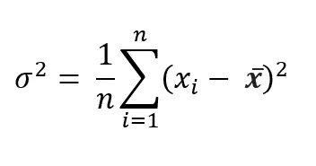
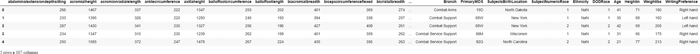
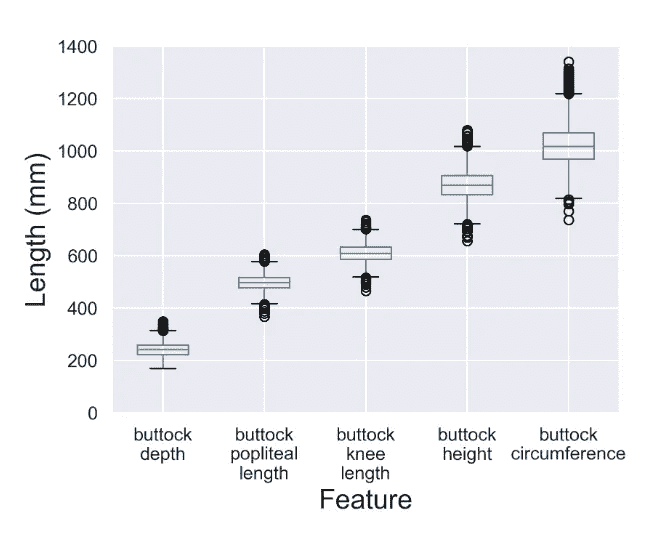

# 如何使用方差阈值进行鲁棒特征选择

> 原文：<https://towardsdatascience.com/how-to-use-variance-thresholding-for-robust-feature-selection-a4503f2b5c3f?source=collection_archive---------2----------------------->

## 即使删除 50 个功能，也能获得相同的性能


**照片由** [**比勒**](https://www.pexels.com/@billelmoula?utm_content=attributionCopyText&utm_medium=referral&utm_source=pexels) **上** [**像素**](https://www.pexels.com/photo/black-and-teal-mountain-540518/?utm_content=attributionCopyText&utm_medium=referral&utm_source=pexels)

## 方差阈值特征选择简介

如今，数据集拥有数百甚至数千个要素是很常见的。从表面上看，这似乎是一件好事——更多的特性提供了关于每个样本的更多信息。但通常情况下，这些额外的功能并不能提供太多的价值，而且会带来不必要的复杂性。

机器学习的最大挑战是通过使用尽可能少的特征来创建具有强大预测能力的模型。但是考虑到当今数据集的庞大规模，很容易忽略哪些特征重要，哪些不重要。

这就是为什么在 ML 领域需要学习一整套技能— **特征选择**。特征选择是选择最重要特征的子集，同时试图保留尽可能多的信息的过程。

举个例子，假设我们有一个身体测量的数据集，比如体重、身高、身体质量指数等。基本的特征选择技术应该能够通过发现身体质量指数可以用体重和身高来表示而去掉身体质量指数。

在本文中，我们将探讨一种这样的特征选择技术，称为方差阈值。这种技术是一种快速和轻量级的方法，用于消除方差非常低的特征，即没有太多有用信息的特征。

[](https://ibexorigin.medium.com/membership) [## 通过我的推荐链接加入 Medium-BEXGBoost

### 获得独家访问我的所有⚡premium⚡内容和所有媒体没有限制。支持我的工作，给我买一个…

ibexorigin.medium.com](https://ibexorigin.medium.com/membership) 

获得由强大的 AI-Alpha 信号选择和总结的最佳和最新的 ML 和 AI 论文:

[](https://alphasignal.ai/?referrer=Bex) [## 阿尔法信号|机器学习的极品。艾总结的。

### 留在循环中，不用花无数时间浏览下一个突破；我们的算法识别…

alphasignal.ai](https://alphasignal.ai/?referrer=Bex) 

## 关于方差的一个注记

对于那些不熟悉的人来说，*方差*顾名思义，表示单个度量中分布的可变性。它显示了分布是如何展开的，并显示了与平均值的平均平方距离:



作者图片

显然，值越大的分布产生的方差越大，因为每个差值都是平方的。但是我们在 ML 中关心的主要事情是分布实际上包含有用的信息。例如，考虑这样的分布:

用 Numpy 计算方差向我们展示了这个分布的方差为零，或者说完全没有用。使用零方差特征只会增加模型的复杂性，而不会增加其预测能力。再考虑一个:

同样，这个几乎是由一个常数组成的。除了少数例外，围绕单个常数的分布也是无用的。换句话说，任何方差接近于 0 的特性或分布都应该被丢弃。

## 如何使用 Scikit-learn 的变量阈值估计器

手动计算方差并设定阈值可能需要大量的工作。幸运的是，Scikit-learn 提供了`VarianceThreshold`估算器，它可以为我们做所有的工作。只要超过一个临界值，低于该临界值的所有要素都将被丢弃。

为了演示`VarianceThreshold`，我们将使用[Ansur 数据集](https://www.kaggle.com/seshadrikolluri/ansur-ii)。这个数据集以各种可以想象的方式记录了人体的尺寸。男性和女性数据集包含近 6000 名(4000 名男性，2000 名女性)美国陆军人员的 108 个特征或测量值。我们将关注男性数据集:



首先，让我们去掉零方差的特征。我们将从`sklearn.feature_selection`进口`VarianceThreshold`:

我们初始化它就像任何其他 Scikit-learn 估计器一样。阈值的默认值始终为 0。此外，估计器显然只对数字数据起作用，如果数据帧中存在分类特征，就会产生错误。这就是为什么现在我们将数字特征划分到另一个数据帧中的原因:

所以，我们有 98 个数字特征。现在让我们将估计值与数据进行拟合，并获得结果:

直接调用`fit_transform`将把数据帧作为一个`numpy`数组返回，去掉一些特性。但是有时，我们不希望结果是这种格式，因为列名会被删除。考虑替代方案:

首先，我们将估计器与数据进行拟合，并调用它的`get_support()`方法。它为没有被删除的列返回一个带有`True`值的布尔掩码。然后，我们可以使用此掩码来划分数据帧的子集，如下所示:

让我们检查数据帧的形状，看看是否有任何常量列:

```
>>> ansur_male_num.shape(4082, 98)
```

不，我们仍然有相同数量的功能。现在，让我们去掉方差接近于 0 的特性:

当`threshold`为 1 时，只有 1 个特性被删除。

## 使用特征标准化进行更公平的方差比较

通常，比较一个特性与另一个特性的差异是不公平的。原因是随着分布中的值变大，方差呈指数增长。换句话说，方差不会在同一个尺度上。考虑这个例子:



上述特征都有不同的中位数、四分位数和范围-完全不同的分布。我们无法将这些特征相互比较。

我们可以使用的一种方法是通过将所有特征除以它们的平均值来归一化它们:


这种方法确保所有方差都在相同的范围内:

现在，我们可以使用阈值较低的估计值，如 0.005 或 0.003:

如您所见，我们能够从数据集中删除 50 个要素。现在，让我们通过放弃这么多特性来测试我们是否做了正确的事情。

我们将通过训练两个 RandomForestRegressor 来预测一个人的体重(以磅为单位)来检查这一点:第一个在最终的要素选择数据集上，第二个在完整的仅包含数字要素的数据集上。

训练和测试分数都显示了一个真正的高性能，而没有过度拟合。现在，让我们在全数字数据集上训练相同的模型:

如你所见，即使去掉 50 个特性，我们也能构建一个非常强大的模型。

## 结论

尽管方差阈值化是一种简单的方法，但在执行特征选择时，它可以走很长的路。但是，请记住，这种技术没有考虑特征之间的关系或特征与目标之间的联系。因此，要像使用 RandomForestRegressor 一样，反复检查使用 VT 是否带来了性能提升，或者至少降低了模型的复杂性。

此外，查看 Scikit-learn 关于特性选择的[官方用户指南](https://scikit-learn.org/stable/modules/feature_selection.html#variance-threshold)——在那里，您可以了解如何在[管道实例](/how-to-use-sklearn-pipelines-for-ridiculously-neat-code-a61ab66ca90d)中插入 VT 估算器。该指南还包含其他特征选择技术的信息。

如果你不知道接下来要读什么，这里，我为你挑选了一些:

[https://towards data science . com/beginners-guide-to-xgboost-for-class ification-problems-50 f 75 AAC 5390](/beginners-guide-to-xgboost-for-classification-problems-50f75aac5390)

[https://towards data science . com/11-times-faster-hyperparameter-tuning-with-halvinggridsearch-232 ed 0160155](/11-times-faster-hyperparameter-tuning-with-halvinggridsearch-232ed0160155)

[https://towards data science . com/intro-to-sci kit-learns-k-nearest-neighbors-classifier-and-regressor-4228 D8 D1 CBA 6](/intro-to-scikit-learns-k-nearest-neighbors-classifier-and-regressor-4228d8d1cba6)