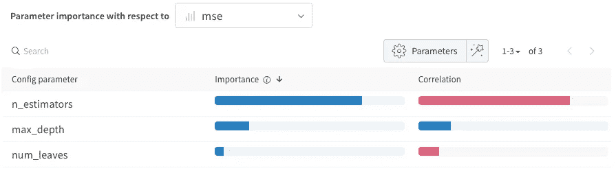
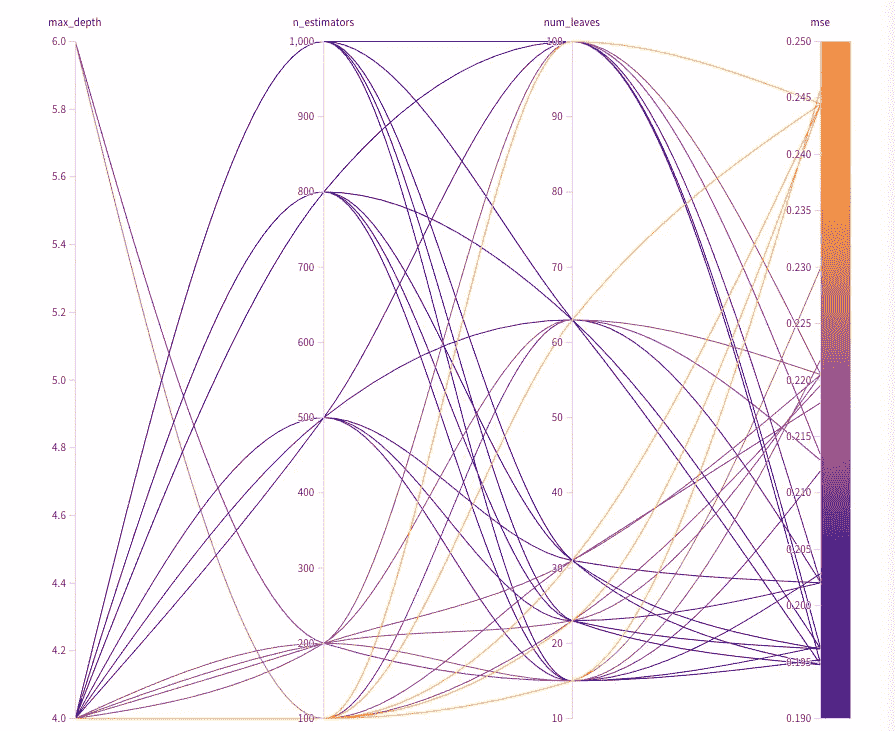

# 如何使用带有 LightGBM 的 W&B 扫描进行超参数调整

> 原文：<https://towardsdatascience.com/how-to-use-w-b-sweeps-with-lightgbm-for-hyperparameter-tuning-b67c3cac435c?source=collection_archive---------20----------------------->

## 了解不同超参数对模型性能的影响

超参数调整是建模过程中的一个重要步骤，可提高模型性能并自定义模型超参数以更好地适应数据集。使用网格、随机或贝叶斯搜索，有不同的有用工具和软件包帮助进行超参数调整。这些搜索函数返回在我们的数据集上用不同超参数训练的模型的输出，但是如何理解在不同超参数排列上训练的成百上千个模型的输出呢？

请允许我介绍一下[权重&偏差](https://wandb.ai/site)，这是一个有用的 MLOps 平台，提供工具来帮助进行模型实验跟踪、模型性能可视化等等。W & B Sweeps 产品旨在帮助超参数调谐。一些要强调的功能包括贝叶斯优化，以优先搜索哪些超参数集，以及强大的可视化功能，以帮助您了解不同超参数的重要性。

在本文中，我将通过一个示例演示如何使用 [W & B 扫描](https://wandb.ai/site/sweeps)对通过 scikit-learn 获得的[加州住房数据集](https://scikit-learn.org/stable/modules/generated/sklearn.datasets.fetch_california_housing.html#sklearn.datasets.fetch_california_housing)上的 LightGBM 进行超参数调优。目标是训练一个回归模型，在给定 8 种不同特征的情况下，以 100，000 为单位估计加利福尼亚的房屋价值。

## I .安装 W&B

创建一个关于[重量&偏差](https://wandb.ai/site)的账户，并完成他们简单的注册过程。

然后，在您的 Python 环境中安装 W&B，将其导入到您的 Python 脚本或笔记本中，并初始化登录过程。

```
!pip install wandb
import wandb
wandb.login()
```

然后，系统会提示您输入 API 密钥，您可以在设置> API 密钥下登录后通过 W&B 网站访问该密钥。

## 二。定义模型训练函数

定义一个创建和训练模型的函数是很重要的，该函数将由 Sweep agent 在后面的步骤中使用。该功能将包含以下几个组件:

*   **设置默认配置:**以字典的形式指定默认配置，在扫描过程中将被覆盖。
*   **启动 W & B:** 初始化新的`wandb`运行。
*   **加载并分割数据集:**记住为您的`train_test_split`函数添加一个种子，以便在不同的运行中进行一致的分割。
*   **训练模型:**在训练集上拟合您的模型，并使用训练好的模型在测试集上进行预测。
*   **评估模型性能:**评估训练好的模型做出的预测。在这种情况下，我选择使用`mean_absolute_error`和`mean_squared_error`作为回归模型的度量。
*   **记录模型性能指标:**使用`wandb.log()`将指标记录到 W & B 中。

以下是该模型训练函数的完整 Python 代码:

## 三。定义扫描配置

下一步是以字典的形式为 W&B Sweep 定义要执行的配置。这里要定义的一些参数包括:

*   `method`:指定您的搜索策略，例如贝叶斯、网格和随机搜索。
*   `metric`:定义指标的`name`和`goal`(最大化或最小化)作为优化的指标。例如，我选择均方误差(MSE)作为我的度量，目标是最小化这个度量。
*   `parameters`:定义作为字典关键字存储的要优化的超参数及其对应的值，以列表形式搜索，作为该字典的值存储。

超参数的结果配置及其相应的搜索值定义如下:

W&B 扫描的配置

参见第[页](https://docs.wandb.ai/guides/sweeps/configuration#search-strategy)了解可定制的扫描配置的完整列表。

## 四。用 W&B 代理初始化并运行 Sweep

定义扫描配置后，我们就可以运行扫描了。首先初始化扫描以启动扫描控制器。将扫描配置字典和项目名称(字符串)作为参数传入初始化的对象，如下所示:

```
sweep_id = wandb.sweep(sweep=sweep_configs, project="california-housing-sweeps")
```

接下来，运行 sweep 代理，并将`sweep_id`和模型训练函数作为参数传入。您还可以提供一个可选参数来指定代理运行的总数`count`。

```
wandb.agent(sweep_id=sweep_id, function=train_model, count=30)
```

## 动词 （verb 的缩写）可视化结果

完成扫描后，您可以返回到 W&B UI 查看结果。对我来说，两个最有用的可视化工具是超参数重要性图和平行坐标图。

**超参数重要性图**

您可以指定要优化的度量，该图表将显示哪些超参数最重要的排序结果。在我们的示例数据集中，迄今为止最重要的超参数是`n_estimators`，负相关性告诉我们，树较少的模型的预测具有较高的 MSE 分数。这是有意义的，因为树较少的模型可能不适合我们的数据集。



在加利福尼亚住房数据集上训练的 LightGBM 模型的超参数重要性图

**平行坐标图**

在 Kaggle 竞赛中，很容易从搜索函数返回的超参数中选择最佳的一组，因为您最关心的是优化您的分数，而不是过度拟合。

在现实中，当模型被用于做出对企业底线有影响的决策时，数据科学家应该并且将会关注优化偏差-方差权衡，以避免过度适应训练集。平行坐标图是一个非常强大的可视化工具，可以帮助您理解不同超参数集的组合效果。

从下面显示我们的示例数据集结果的图中可以看出，有几种不同的超参数组合可以将模型性能提高到大约 0.195 MSE 得分范围，这比带有默认超参数的 LightGBM 模型的基线 MSE 得分 0.208 要好。



在加州住房数据集上训练的 LightGBM 模型的平行坐标图

## 结论

W&B Sweeps 是一个强大的工具，可以帮助数据科学家进行超参数调整过程。可视化有助于理解不同超参数集对模型的影响，从而做出更有根据的猜测以选择超参数集来训练最终模型。要查看我的 python 笔记本，请点击 Github 上的[链接](https://github.com/claudian37/DS_Portfolio/blob/master/WnB_demo.ipynb)。

我希望这是有用的-请在下面留下任何评论。谢谢！