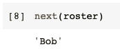

# Python 中“yield”怎么用？

> 原文：<https://towardsdatascience.com/how-to-use-yield-in-python-5f1fbb864f94?source=collection_archive---------13----------------------->


图片由 [kangbch](https://pixabay.com/users/kangbch-3007100/?utm_source=link-attribution&utm_medium=referral&utm_campaign=image&utm_content=1684052) 从 [Pixabay](https://pixabay.com/?utm_source=link-attribution&utm_medium=referral&utm_campaign=image&utm_content=1684052) 拍摄

## Python 生成器——从基本用法到高级用法

如果你是一个 Python 开发者，我相信你一定知道 Python 中的生成器。定义 Python 生成器的关键是使用“yield”关键字。Python 生成器在我们需要大量集合、提高代码可读性以及多线程等特定场景中无处不在。

你可能知道也可能不知道如何正确使用“yield”关键字。在本文中，我将从基本用法开始介绍 Python 生成器。一些更高级的使用模式也将在后面的章节中介绍。

# 1.基础


图片来自 [Pixabay](https://pixabay.com/?utm_source=link-attribution&utm_medium=referral&utm_campaign=image&utm_content=640960) 的 [Pezibear](https://pixabay.com/users/pezibear-526143/?utm_source=link-attribution&utm_medium=referral&utm_campaign=image&utm_content=640960)

让我们在本教程中编一个例子。假设我们公司有一群人，需要一个个随叫随到。所以，这将是一个轮换的花名册。

```
names = ['Alice', 'Bob', 'Chris', 'David', 'Emily']
```

现在，我们想从这个名称列表中定义一个 Python 生成器。代码如下所示。

```
def gen_roster(names):
    for name in names:
        yield name
```

请注意，我们需要使用`yield`关键字而不是`return`，所以我们可以使用这个函数来制作一个生成器。

```
roster = gen_roster(names)
```

对，就是这样。如果你想检查变量`roster`的类型，下面是结果。


现在，我们有了`roster`。Python 生成器也是可迭代的，所以我们可以把它放在一个 for 循环中，一次获得所有的名字。

```
for name in roster:
    print(name)
```


# 2.得到下一个


来自 [Pixabay](https://pixabay.com/?utm_source=link-attribution&utm_medium=referral&utm_campaign=image&utm_content=3474854) 的 [Couleur](https://pixabay.com/users/couleur-1195798/?utm_source=link-attribution&utm_medium=referral&utm_campaign=image&utm_content=3474854) 的图像

好吧，在前面的例子中，在 for 循环中使用生成器没有太大的意义。使用生成器的好处是我们可以一次得到一个值。当我们处理一个巨大的集合时，这可能非常有用。也就是说，当我们创建一个生成器时，这些项不会被读入内存。只有当我们试图获取下一项并点击`yield`关键字时，该项才会生成。

因此，无论如何，获得生成器的“下一个”元素是很重要的。在这种情况下，我们可以使用它的`__next__()`函数。

```
roster.__next__()
```


其实我们也可以这样做，这样更直观，也更容易记忆。

```
next(roster)
```



你是否注意到当我们试图获取“下一个”项目时，“光标”被移动了？还记得我们在生成器的定义中定义了 for 循环吗？我们可以认为 for 循环将一次执行一次，直到到达关键字`yield`。

这也意味着，我们的“光标”现在在第三个名字上。因此，如果我们试图输出所有剩余的项目，“Alice”和“Bob”将被跳过。


现在，“光标”在末尾。如果我们试图获取下一个项目，将会抛出一个错误，因为没有更多的项目。


这实际上不是我们想要的，因为花名册将被用来决定谁将在当前的轮换中待命。换句话说，我们希望“光标”回到开头，这样所有的名字将再次循环。

诀窍是简单地在 for 循环上面放一个`while True`语句。所以，一旦所有的名字都用完了，for 循环就会重新开始。

```
def gen_roster(names):
    while True:
        for name in names:
            yield name
```

现在，假设我们想要一个有 12 个名字的花名册。我们只有 5 名员工。因此，它们将被轮换。

```
for i in range(12):
    print(next(roster))
```


如果我们不输入数字“12”，生成器可以无限期地生成更多的名字。

# 3.发送一个值


图片由[设计](https://pixabay.com/users/congerdesign-509903/?utm_source=link-attribution&utm_medium=referral&utm_campaign=image&utm_content=3431122)来自 [Pixabay](https://pixabay.com/?utm_source=link-attribution&utm_medium=referral&utm_campaign=image&utm_content=3431122)

生成器的一个高级用法是向生成器发送一个值。该值将成为**当前**产出表达式的结果，该方法返回生成器产出的**下一个**值。

所以，不要指望生成器会返回我们刚刚发送的值，因为它会返回下一个值。然而，我们可以用它在生成器内部做一些事情。例如，我们可以通过向一个无限生成器发送某个值来停止它。

```
def gen_roster(names):
    while names:
        for name in names:
            current_name = yield name
            if current_name == 'stop':
                names = None
                break
```

如果从外部发送一个值“stop ”,发生器将终止循环。因此，我们可以验证如下行为。

```
roster = gen_roster(names)for i in range(10):
    if i == 3:
        roster.send('stop')
    print(next(roster))
```


在上面的代码中，我们要求程序循环 10 次。然而，对于第四轮，我们将值“stop”传递给生成器。结果，只有 3 个名字被输出，并且发生器在第 4 轮停止，而不是循环 10 次。

当我们想在多线程编程场景中改变生成器的行为或规则时，send 方法将非常有用。

# 4.停止生成器—抛出异常并关闭


图片来自 [Pixabay](https://pixabay.com/?utm_source=link-attribution&utm_medium=referral&utm_campaign=image&utm_content=3783066) 的[乔拉卡尔穆克](https://pixabay.com/users/jolakalmuk-6823127/?utm_source=link-attribution&utm_medium=referral&utm_campaign=image&utm_content=3783066)

当出现问题时，我们可以使用`throw()`方法在生成器暂停的地方引发一个异常。我们可以自定义错误类型。在本教程中，出于演示的目的，为了方便起见，我将简单地使用一个“类型错误”。

```
roster = gen_roster(names)next_name = roster.throw(TypeError, 'Stop!')
```


如果没有出错，但我们仍然想终止生成器，我们可以使用`close()`方法生成一个生成器。当我们有一个无限大的生成器，并且我们想在某个点停止它时，这将是非常有用的。

```
roster = gen_roster(names)for i in range(10):
    if i == 3:
        roster.close()
    print(next(roster))
```


上面的代码在第四轮关闭了生成器“花名册”，所以当下一个循环试图获取下一个值时，异常被抛出。

# 摘要


图片来自 [Pixabay](https://pixabay.com/?utm_source=link-attribution&utm_medium=referral&utm_campaign=image&utm_content=192179) 的[拉尔夫·昆泽](https://pixabay.com/users/realworkhard-23566/?utm_source=link-attribution&utm_medium=referral&utm_campaign=image&utm_content=192179)

在本文中，我介绍了 Python 中最重要的“Python 式”概念之一——生成器。关键字`yield`的用法是 Python 生成器的关键。

不仅介绍了基本用法，还介绍了一些高级用法，如从外部向生成器发送值、引发异常和关闭生成器。希望它能帮助你了解更多关于 Python 生成器的知识。

[](https://medium.com/@qiuyujx/membership) [## 通过我的推荐链接加入 Medium 克里斯托弗·陶

### 作为一个媒体会员，你的会员费的一部分会给你阅读的作家，你可以完全接触到每一个故事…

medium.com](https://medium.com/@qiuyujx/membership) 

如果你觉得我的文章有帮助，请考虑加入 Medium 会员来支持我和成千上万的其他作者！(点击上面的链接)