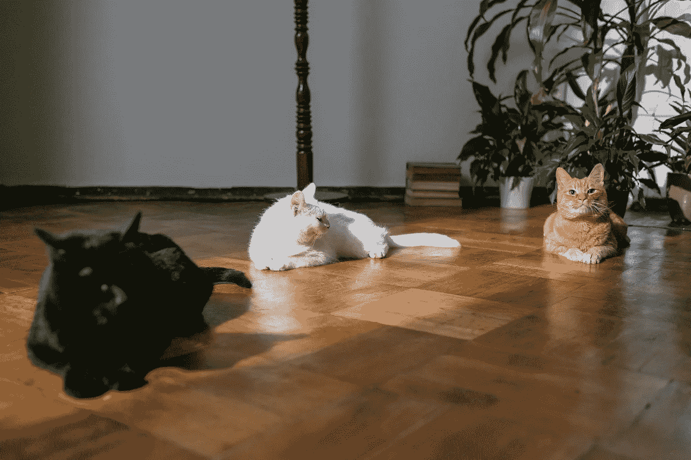

# 如何利用人工贴标劳动力

> 原文：<https://towardsdatascience.com/how-to-utilise-a-manual-labelling-workforce-b30db3ab1e8e?source=collection_archive---------19----------------------->

## 从面试到任务定义再到评估

来自 [Pexels](https://www.pexels.com/photo/crop-faceless-construction-workman-laying-bricks-4509092/?utm_content=attributionCopyText&utm_medium=referral&utm_source=pexels) 的 [Littlehampton Bricks](https://www.pexels.com/@littlehampton-bricks-2717960?utm_content=attributionCopyText&utm_medium=referral&utm_source=pexels) 摄影

# **为什么需要手动贴标**

为了生成机器学习模型，我们首先需要找到数据集来训练它。在许多情况下，我们可以依赖公共数据集(使用数据集搜索索引，如 [Google](https://datasetsearch.research.google.com/) 或 [Kaggle](https://www.kaggle.com/datasets) 来找到我们需要的数据)。但是有些情况需要我们自己生成数据集(由于数据规模、隐私问题或者只是因为用例是一个利基)，如果 ML 任务是由[监督](https://en.wikipedia.org/wiki/Supervised_learning)的，那么我们也需要负责标记数据集。通常，贴标将在内部开始，一旦发现所需的规模过大(可能从 [POC 转移到 MVP](https://www.plainconcepts.com/mvp-poc-differences-use-cases/) )，手动贴标流程将被外包(使用贴标团队或专门的承包商)。一个常见的错误是假设在内部工作的东西会无缝地在外部工作。为了确保贴标过程的输出符合我们的期望，需要避免许多陷阱。从面试候选人，到正式工作，再到评估其质量。一次必要的步行就在前方。

# **开始收集数据**

假设我们的任务是在图像中找到橙色的猫。第一步是搜索相关的现有数据集，但由于我们的用例是一个很小的领域(特别是橙色的猫)，我们决定自己生成所需的数据集。我们首先从网上抓取相关图片(有橘猫的，没有橘猫的，一般图片)。一个常见的初始简化是依靠现有的开源[图像分割](https://en.wikipedia.org/wiki/Image_segmentation)库(如脸书的 [Detectron](https://ai.facebook.com/tools/detectron/) 或谷歌的 [DeepLab](https://github.com/tensorflow/models/tree/master/research/deeplab) )来为图像生成初始标签。使用它，我们可以控制数据集主题的分布(以加强[分层](https://en.wikipedia.org/wiki/Stratified_sampling))。但是，当我们专门寻找橙色的猫时(这种开源库的常见输出将只是一只“猫”)，我们决定雇佣一个标签工作团队来帮助我们满足这一需求。怎么做呢？。

橘猫和几个竞争对手。照片由 [Pexels](https://www.pexels.com/photo/three-cats-on-wooden-flooring-6853515/?utm_content=attributionCopyText&utm_medium=referral&utm_source=pexels) 的 [cottonbro](https://www.pexels.com/@cottonbro?utm_content=attributionCopyText&utm_medium=referral&utm_source=pexels) 拍摄

# **面试**

第一步是找到最适合我们需求的贴标机。令人惊讶的是，高分和漂亮的文凭并不总是与适合工作相关联。此外，我们最好的手工贴标机很少是大学生。虽然乍一看这似乎是反直觉的，但一个可能的解释是，贴标签需要特殊的特征，如注意力、自律、打破常规的思维和愿意为成功付出额外的努力(更不用说并非所有的贴标签任务都具有相同的复杂程度，因此每个任务都需要不同的技能水平)。这些特征很可能与高分有某种关联，但并不一定要结合在一起。这就是为什么面试过程应该调整，以更好地针对这些品质；更少的成绩过滤，更多的动手评估。聪明并不直接表明一个人擅长给猫贴标签。尽量确保你问的问题旨在衡量与标签工作的相关性。朝着这个方向迈出的一小步可以是使用类似手工贴标签的家庭作业。这将有助于对候选人是否适合这份工作做出公正而直接的评价。一次好的面试应该衡量所需的关键绩效指标(比如对重复性体力工作的意愿)，以确保你接受的候选人能够完成所需的任务。

# **介绍需求**

人工贴标在许多情况下是一次性项目，会导致使用范围外的员工，在许多情况下是承包商。这就是为什么倾向于透露尽可能少，降低你分享的背景，假设承包商明天可以为你的竞争对手工作。但这是一个错误，因为这种态度可能会降低贴标签者的参与度。可以很好地定义所需的任务，而不会泄露任何内部最高机密。解释需要什么以及为什么需要。给你的手工贴标员一种感觉，他们的工作是重要的，值得欣赏的。让他们成为你的伙伴。一个除了理解“是什么”之外还理解“为什么”的人，更有可能集中更多的注意力，通常会产生更好的结果。

# **正式确定任务**

大多数情况下，第一个标记数据的是我们自己。在这个过程中，我们可能会遇到特殊的样本和异常的样本，因此我们生成了许多自由文本反馈字段(如关注或评论)来突出它。一旦我们需要向标签员介绍任务，倾向于保持相同的反馈字段结构。但问题是，对我们有用的东西可能会混淆超出范围的标签。因此**任务定义应该尽可能清晰**。封闭列表比自由文本字段更好。就像在我们的例子中，我们可以使用—[橙猫/非橙猫/非猫/？].同样重要的是要求贴标签者填写每个标签**上下文**(在我们的例子中，它可能是被识别物体的位置)。其中的两个主要原因是，提供上下文需要更多的关注，因为它可以实现快速的手动验证路径(奇怪的标签+有问题的上下文可以突出应该双重验证的样本。就像在我们的例子中，在根据我们用于分割的开放源代码应该出现“狗”的位置标记“橙色猫”的情况下)。**‘？’重要的是为了让贴标签者** **一个地方** **到** **承认他们不知道**。例如，考虑一个图像包括橙色和黑色猫的场景。标签应该是什么？。上下文和“杂项”标签(“？”sign)将使贴标机能够以有效的方式标记需要再次检查的样品。错误很可能会发生。将标签输入与定义明确的上下文一起形式化，可以防止错误变得致命。

# **工作范围**

试着把需要的工作分成小批，尤其是在开始的时候，让贴标签的人知道他们能处理好。从我们的经验来看，当一个文件被分割时，标签员比处理合并的文件(以更大的格式)表现出更好的性能。可能面对较小的文件没那么可怕，因此看起来是一个更容易完成的任务。随着时间的推移，文件越来越大。它会向贴标签者反映他们的进步，这是一种隐性的反馈来约束他们。更多的自信会让贴标签的人感觉更好，工作得更好，最终甚至超过你最初的标签，找到你甚至没有意识到的东西。

# **专家差距**

在大多数情况下，你会发现并非所有的“要贴标签的”样本都具有相同的复杂程度；有些会比其他的更难标记。为了更好地利用您的劳动力，找到一种方法，将较容易贴标签的样品交给贴标机，将较难的样品留给您的专家。这一点很重要，因为专家的可用性非常有限，而且贴标机在处理过于复杂的样品时会变得绝望。将更难的样本与其他样本区分开来的一种常见方法是使用代理分类器，即使用已标记数据集的子集训练一个简单的分类器。这个分类器不会是**的**分类器，而是一个通过查看其[预测可能性](https://en.wikipedia.org/wiki/Probability_distribution)来区分样本复杂性的工具(高可能性可以表示一个简单的标签样本应该被发送到标签器)。它还可以用来验证贴标员的工作(查看其输出与贴标员所说的有很大差异的地方)或以[“主动学习”](https://en.m.wikipedia.org/wiki/Active_learning_(machine_learning))的方式；偶尔根据新标记的数据重新训练代理分类器，以突出接下来应该优先处理哪些样本。并非所有样本都同样重要，因此标记力应该指向更需要的地方，指向简单代理分类器未能处理的样本。

# **验证工作**

在进入我们的数据集之前，应该验证带标签的数据。一种常见的方法是给几个贴标签的人相同的任务，然后通过查看标签不同的地方来验证他们的工作。但问题是，它包含一个隐含的失败点，因为潜台词是你不够信任你的标签。对我们来说，当我们尝试时，结果是如此不同，以至于它强调了这样一个事实，即我们有其他问题需要首先解决。内在的动机是把标签员带到一个你可以信任他们工作的地方，就像是你自己在做一样。这并不意味着工作不应该被验证——每个人都会犯错误。找到一种机制来验证贴标机的工作。例如，通过将他们的工作与代理分类器进行比较(像我们前面提到的图像分割工具或代理分类器)。它可以是一个简单的指南针，使您能够专注于需要更多手动验证的更复杂的情况。

# **反馈**

没有人喜欢做不好的工作。尤其不是故意的。尤其是那些根据业绩得到明确奖励的承包商。因此，重要的是要突出标签的错误，以使他们能够改善。错误很可能会发生，尤其是在开始时，因为 data domain 是新领域，还不清楚要做什么和如何做。另一方面，不良标签在初始阶段最容易识别。这就是为什么初学者的错误应该与不适合工作区分开来。一个可能的指标可以是缺乏**标记**<https://en.wikipedia.org/wiki/Repeatability#:~:text=Repeatability%20or%20test%E2%80%93retest%20reliability,the%20same%20conditions%20of%20measurement.&text=A%20measurement%20may%20be%20said,a%20pre%2Ddetermined%20acceptance%20criterion.>**；犯错误是可以的，应该给出如何避免错误的指导。但是，如果同样的错误一再发生，那就麻烦了。如果错误看起来是随机的——相同的上下文有不同的标签，那么它应该敲响警钟。一个学习缓慢但愿意全力以赴的人比一个学习快速但对任务不够专注的人要好得多。**

# ****期末笔记****

**不要低估你的标签。将他们与事业捆绑在一起，让他们成为你的标签任务伙伴。不是所有的任务都是一样的，有些需要专家，有些更简单。但都需要适当的关注。一旦得到指导，标签劳动力可以成为你的模型成功所需的特殊调料。**