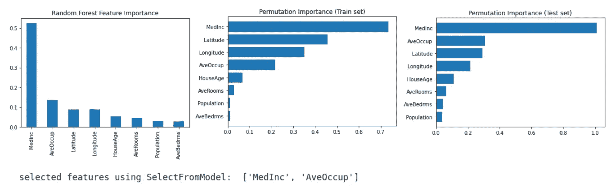
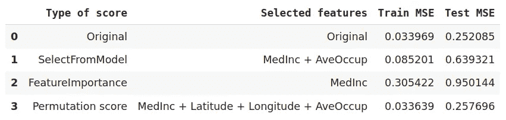
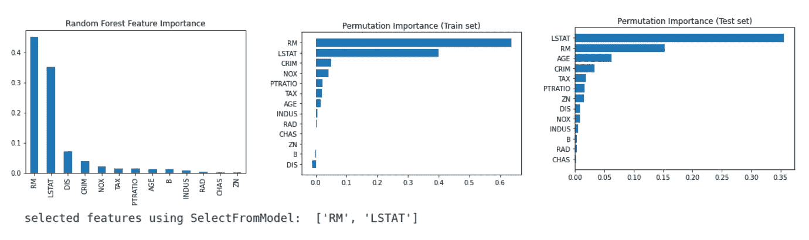
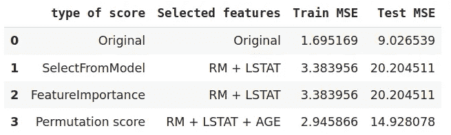
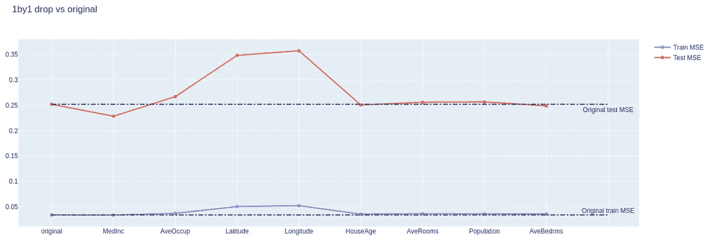
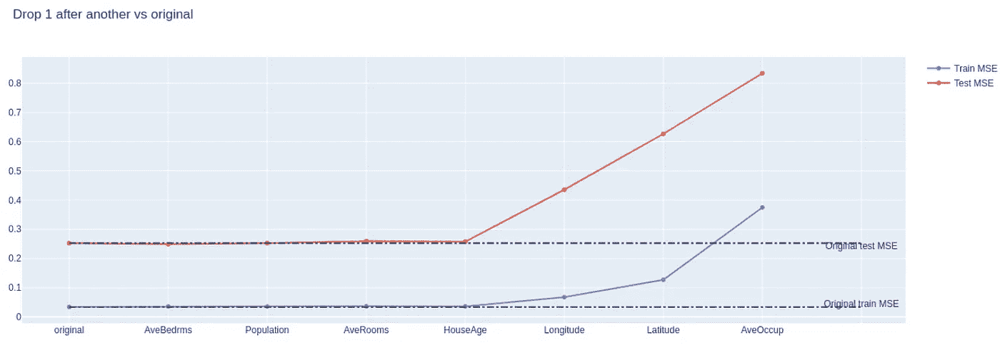
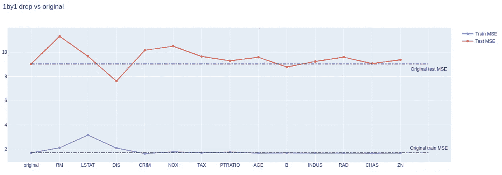
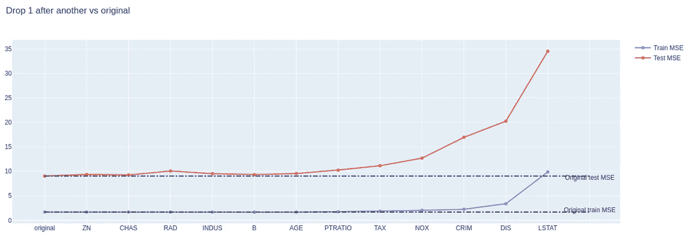

# 如何正确利用特征重要性

> 原文：<https://towardsdatascience.com/how-to-utilize-feature-importance-correctly-1f196b061192?source=collection_archive---------19----------------------->

## 特征重要性是**特征选择的一部分，这是一种对抗维数灾难的**有用方法。如何最大限度地利用它并使它发挥作用是数据科学家的基本工作。

来源:由 [Unsplash](https://unsplash.com/photos/DRs9XsNlAZw) 上的[叶戈尔·迈兹尼克](https://unsplash.com/@vonshnauzer)

# **为什么特写 Importance❓**

在训练机器学习模型时，理想的事情是将训练特征浓缩到一组变量中，这些变量包含尽可能多的信息。这有三个原因。1，减少特征的数量意味着缩小维度，降低稀疏性，增加训练结果的统计显著性。如果我们有太多的特征，我们也需要足够多的样本来进行训练。2、减少稀疏度有助于防止过拟合问题(特征数量越多，模型变得越复杂，因此更容易过拟合)。3，这是显而易见的，是计算能力的有效节省，同时实现可接受的性能。

因此，特征选择是数据预处理的一个重要步骤。在流行的方法中，特征重要性是最流行的方法之一。然而，通过特性重要性选择特性并不总是一帆风顺的。做出正确的选择决定确实需要一些技巧。

然而，根据我的经验，我通常在进行其他数据清理、预处理步骤后使用特征重要性，如下所示。

数据预处理的典型步骤(来源:作者)

# 特征重要性包括什么？✋

有几种方法可以表达特征的重要性。它可以是表示特征相关性的分数(使用基于算法的特征重要性，例如基于树的随机森林，XGBoost，..)、从原始特征降维以将所有信息合成到一个更低的维度(像 Autoencoder 或 PCA)，或者领域知识选择(又名基于自己知识的选择)。面对如此多样的选择，我们应该选择哪一个呢？即使我们选择使用 PCA，选择正确数量的剩余特征似乎也需要很大的努力。难道你不认为我们应该用特性重要性分数或者测试所有东西来看看哪个表现最好吗？

对，没错，测试一切才是准确答案。从我的经验来看，我通常会将基线设置为没有任何选择的原始模型，然后尝试不同退出率的 PCA 并检查度量。然后放弃原来的特性(主要是因为我想限制所需的收集数据量，以及在保持或提高性能的同时优化训练时间)。所以降维是我的第一选择，特征重要性是下一个重要步骤。但是只使用特性重要性分数并不是一个好的选择。让我告诉你为什么。

# 为什么不仅仅显示重要性分数🌓

*特征重要性分数在这里是指从表示特征对目标特征的预测的权重或相关性的训练模型中生成的任何分数。*

下面是基于 RandomForestRegressor 模型计算的随机森林的特征重要性分数(公式细节此处为)，使用 SelectFromModel 选择特征([细节](https://scikit-learn.org/stable/modules/generated/sklearn.feature_selection.SelectFromModel.html))，以及排列分数(公式细节此处为)。用于演示的数据是 sklearn 中的加州住房。

特征重要性分数、排列分数和 SelectFromModel 结果(来源:作者)

看了上面的内容，您有多大把握决定只保留 MedInc 并删除其他(基于第一个图)或基于第二个图保留 MedInc、纬度、经度和 ave occupation，甚至只删除 AveBedrms 和 Population？如果我是你，我只会用这个做任何决定。为什么？因为放弃这个或那个并不能保证更好的性能，如果你无意识地选择，甚至会导致更差的性能。

预测结果(来源:作者)

排列分数的选择比原始数据集稍有改进。让我们看另一个使用波士顿数据集的实验([来源](https://scikit-learn.org/stable/modules/generated/sklearn.datasets.load_boston.html#sklearn.datasets.load_boston))。

波士顿房屋——特征重要性分数、排列分数和选择模型结果(来源:作者)

这看起来比加州的数据集更一致，不是吗？我想保留“RM”和“LSTAT”功能的决定现在更有信心了。让我们看看如果模型在这两个特征上被训练，性能如何变化。

预测结果(来源:作者)

这些选择中没有一个与原始模型的性能相当，这意味着减少要素在这里不起作用。这两个例子显示了如何减少特性数量的不同策略，度量或分数可以帮助我们做出决定。

> “不，我们需要不同的方法！”

有一种方法可以更好地决定应该删除哪些功能。这种技术是传统的，但有效和全面的。

我们通过观察删除特征后模型的性能来决定。

首先，让我们一次放下一个功能，然后一个接一个地放下，测量它们的性能，并确定足够的极限或级别。

加州住房数据集(来源:作者)

在*种群数量、平均数量、种群数量*和*平均数量*中去掉任何一个，性能明显保持与原来相同的水平。然而，移除*药物*会令人惊讶地降低测试 MSE。

当从最不相关的特征到最相关的特征(基于特征重要性分数)累积删除它们时，我们可以清楚地看到，当删除*纬度*和它之前的其他特征时，序列 MSE 中的肘出现，但是在删除*经度*时，过拟合问题恶化。因此，我们更有信心将模型浓缩成四个特征:“*经度*”、“*纬度*”、“*平均占有*”、“*平均占有*”。

让我们来看看波士顿数据集。

波士顿住房数据集(来源:作者)

移除 *RM、LSTAT* 或 *DIS* 中的任何一个都会恶化性能，并且如果我们仅在模型中保留 *RM、LSTAT* 或 *DIS* ，则不仅训练 MSE 而且测试 MSE 都会显著提高。从这个看，我们可以决定保留 *NOX，CRIM，DIS，LSTAT，*和 *RM* 。

# 结论🗽

分数不是唯一的出路。仅使用分数来决定特征选择的方法似乎是主观的和经验性的。使用适当的方法就像为你的模型决定正确的度量标准。确切地知道你为什么这样做，以及它给模型带来了什么影响，是你的机器学习下一次成功的关键。