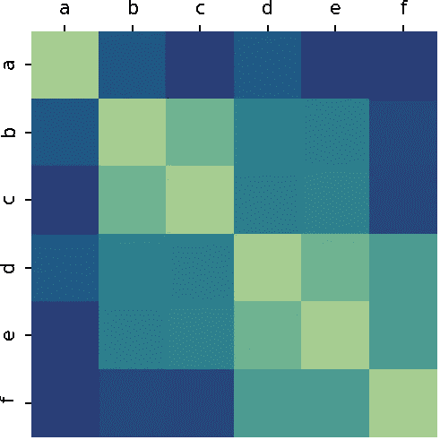

# 如何对成对相似性度量进行矢量化

> 原文：<https://towardsdatascience.com/how-to-vectorize-pairwise-dis-similarity-metrics-5d522715fb4e?source=collection_archive---------7----------------------->

## [实践教程](https://towardsdatascience.com/tagged/hands-on-tutorials)

## 一种简单的模式，用于对所有成对点的度量进行矢量化，如 L1 距离和交集。

您可以在 NumPy、PyTorch 和 TensorFlow 中使用相同的模式对一整类成对(dis)相似性度量进行矢量化。当数据科学或机器学习算法中的一个步骤要求您计算这些成对指标时，这一点非常重要，因为您可能不想在昂贵的嵌套 for 循环中浪费计算时间。

这种模式适用于任何时候，只要您能将成对计算分成两个不同的步骤:扩展和缩减。它同样适用于相似性度量，如两个框之间的交集/并集，以及不相似性度量，如欧几里德距离。这篇文章解释了这种模式，并通过两个真实的例子使其具体化。



成对相异矩阵的热图。

为简洁起见，我有时称“相似性”为相似和相异的简写。我有时也用“点”来表示我们可能在成对比较中使用的任何项目。例如，在计算机视觉中，编码为`(x1, y1, x2, y2)`的盒子可以被视为 4 维空间中的一个点。

**我们为什么要计算成对相似度函数？**

有几种数据科学和机器学习算法需要成对的相似性度量作为它们的步骤之一。事实上，scikit-learn 有一个完整的[模块](https://scikit-learn.org/stable/modules/classes.html#module-sklearn.metrics.pairwise)专门用于这种类型的操作。

以下是一些您可能想要计算成对指标的示例:

*   比较点和质心。在聚类和分类中，将单个点与一组点的类均值进行比较是非常有用的。这些类平均值称为质心，它们本身就是点，这意味着比较是成对操作。
*   创建二部分配的成本矩阵。在[检测跟踪](https://jbencook.com/simple-pytorch-object-tracking/)中，您通常希望通过相似性将新的检测分配给现有对象。匈牙利算法可以通过最小化总成本来创建这些分配，同时要求一个对象被分配给一个检测(最多)，反之亦然。该算法输入是成本矩阵，其中每个元素是对象和新检测之间的差异。不相似性的例子可以是欧几里德距离或并集上交集的倒数。
*   为[高斯过程](/an-intuitive-guide-to-gaussian-processes-ec2f0b45c71d) (GP)回归创建内核。高斯过程中的不确定性由一个函数来定义，该函数将任意点对之间的协方差参数化。使用 GP 进行推理需要为数据集计算成对协方差矩阵。最常见的协方差函数是平方指数。

**为什么两两相似是瓶颈？**

“成对”是指我们必须计算每一对点的相似性。这意味着计算将是`O(M*N)`，其中`M`是第一组点的大小，`N`是第二组点的大小。解决这个问题的简单方法是使用嵌套的 for 循环。不要这样！众所周知，Python 中嵌套的 for 循环非常慢。

NumPy(以及它的兄弟 PyTorch 和 TensorFlow)的美妙之处在于，您可以使用矢量化将循环发送到优化的低级实现。编写快速、科学的 Python 代码主要是为了理解这些包的 API。

那么它是如何工作的呢？

通常，如果您想要对一组形状为`(M, D)`的`M` `D`维点和一组形状为`(N, D)`的`N` `D`维点之间的成对相似性度量进行矢量化，您需要执行两个步骤:

1.  **展开**。利用广播在两个`D`维点之间进行元素运算，产生一个形状为`(M, N, D)`的扩展数组。
2.  **减少**。使用聚合操作减少最后一个维度，创建一个形状为`(M, N)`的矩阵。

这很简单。有几件事需要注意:

*   当您计算点矩阵与其自身之间的成对相似性时，`M`将与`N`相同。
*   有时，您还会希望对相似性度量应用额外的基于元素的计算。这可以在任何时候进行，而不会弄乱结果。

让我们看几个例子，在这些例子中，我们计算点集和它们自身之间的成对相似性，以使这个过程更加具体。

**两两曼哈顿距离**

我们将从两两曼哈顿距离开始，或称 [L1 范数](https://jbencook.com/numpy-norm/)，因为它很简单。然后我们来看一个更有趣的相似度函数。

两点之间的曼哈顿距离是差值的绝对值之和。假设我们有两个四维 NumPy 向量，`x`和`x_prime`。计算它们之间的曼哈顿距离很容易:

```
import numpy as npx = np.array([1, 2, 3, 4])
x_prime = np.array([2, 3, 4, 5])np.abs(x - x_prime).sum()# Expected result
# 4
```

现在，我们将曼哈顿距离扩展到两两比较。设`X`为单位正方形的四个角:

```
X = np.array([
    [0, 0],
    [0, 1],
    [1, 1],
    [1, 0]
])
```


单位正方形上的点。

这些点中的任何一对之间的曼哈顿距离将是 0(如果它们相同)、1(如果它们共用一条边)或 2(如果它们不共用一条边)。比较点集与其自身的成对相异矩阵将具有形状`(4, 4)`。每个点得到一行，每个点得到一列。行和列的顺序将是相同的，这意味着我们应该沿着对角线得到 0，因为一个点和它本身之间的曼哈顿距离是 0。

让我们用一个嵌套的 for 循环，用简单的方法计算这些点和它们之间的成对曼哈顿距离:

```
manhattan = np.empty((4, 4))for i, x in enumerate(X):
    for j, x_prime in enumerate(X):
        manhattan[i, j] = np.abs(x - x_prime).sum()manhattan# Expected result
# array([[0., 1., 2., 1.],
#        [1., 0., 1., 2.],
#        [2., 1., 0., 1.],
#        [1., 2., 1., 0.]])
```

每个元素`manhattan[i, j]`现在是点`X[i]`和`X[j]`之间的曼哈顿距离。很简单。

现在，让我们向量化它。我们需要的第一件事是一个扩展操作，它可以通过成对的点来创建一个`(4, 4, 2)`数组。减法适用于广播，所以这是我们应该开始的地方。

为了正确扩展，我们需要插入维度，以便操作数分别具有形状`(4, 1, 2)`和`(1, 4, 2)`。这是可行的，因为 NumPy broadcasting 在维度中后退，并在必要时扩展轴。这将产生一个距离数组`(4, 4, 2):`

```
deltas = X[:, None, :] - X[None, :, :]
deltas.shape# Expected result
# (4, 4, 2)
```

现在我们已经创建了一组名为`deltas`的 4x4 的二维点。这个结果的工作方式是`deltas[i, j, k]`是`X[i, k] - X[j, k]`的结果。这相当于在上面的嵌套 for 循环中赋值`deltas[i, j, :] = x - x_prime`。

此时，我们可以自由地应用元素绝对值运算，因为它不会改变形状:

```
abs_deltas = np.abs(deltas)
abs_deltas.min()# Expected result
# 0
```

我们仍然需要执行减少步骤来创建`(4, 4)` L1 距离矩阵。我们可以通过对最后一个轴求和来做到这一点:

```
manhattan_distances = abs_deltas.sum(axis=-1)
manhattan_distances# Expected result
# array([[0, 1, 2, 1],
#        [1, 0, 1, 2],
#        [2, 1, 0, 1],
#        [1, 2, 1, 0]])
```

瞧啊。矢量化的成对曼哈顿距离。

顺便说一下，当 NumPy 操作接受一个`axis`参数时，通常意味着您可以选择减少一个或多个维度。因此，要从一个`(4, 4, 2)`增量数组到一个`(4, 4)`带距离的矩阵，我们通过将`axis=-1`传递给`sum()`方法对最后一个轴求和。`-1`是“最后一个轴”的简写。

让我们将上面的代码片段简化为一行代码，它在单位正方形上的所有点对之间生成成对的曼哈顿距离:

```
np.abs(X[:, None, :] - X[None, :, :]).sum(axis=-1)# Expected result
# array([[0, 1, 2, 1],
#        [1, 0, 1, 2],
#        [2, 1, 0, 1],
#        [1, 2, 1, 0]])
```

**并集上的成对交集**

既然您已经看到了如何对成对相似性度量进行矢量化，那么让我们来看一个更有趣的例子。并集上的交集(IoU)是两个方框重叠程度的度量。假设你有两个盒子，每个盒子都通过它的左上角`(x1, y1)`和右下角`(x2, y2)`来参数化。IoU 是两个方框的交集面积除以两个方框的并集面积。


YoloV3 模型中的预测框。来源:pjreddie.com

让我们使用从流行的 YoloV3 模型生成的盒子。我们将使用相对坐标，因此任何坐标的最大可能值为 1.0，最小值为 0.0:

```
bicycle = np.array([0.129, 0.215, 0.767, 0.778])
truck = np.array([0.62 , 0.141, 0.891, 0.292])
dog = np.array([0.174, 0.372, 0.408, 0.941])
```

一个盒子`(x1, y1, x2, y2)`的面积是`(x2 - x1) * (y2 - y1)`。所以如果你有两个盒子`a`和`b`，你可以通过创建一个相交盒子(当它存在的时候)然后计算相交的面积，以及每个盒子的面积来计算 IoU。一旦你有了那个，借据就是`intersection / (a_area + b_area - intersection)`。如果这些框没有重叠(因为相交框不存在)，结果将为 0；如果这些框完全重叠，结果将为 1。

下面是计算自行车-狗对和狗-卡车对的 IoU 的代码:

```
def iou(a, b):
    """
    Intersection over Union for two boxes a, b
    parameterized as x1, y1, x2, y2.
    """
    # Define the inner box
    x1 = max(a[0], b[0])
    y1 = max(a[1], b[1])
    x2 = min(a[2], b[2])
    y2 = min(a[3], b[3])
    # Area of a, b separately
    a_area = (a[2] - a[0]) * (a[3] - a[1])
    b_area = (b[2] - b[0]) * (b[3] - b[1])
    total_area = a_area + b_area
    # Area of inner box
    intersection = max(0, x2 - x1) * max(y2 - y1, 0)
    # Area of union
    union = total_area - intersection
    return intersection / unioniou(bicycle, dog), iou(dog, truck)# Expected result
# (0.2391024221313951, 0.0)
```

为了对 IoU 进行矢量化，我们需要分别对交集和总面积进行矢量化。然后，我们可以将 IoU 作为两个 mat 之间的逐元素运算来计算

首先，堆叠三个盒子，创建一个`(3, 4)`矩阵:

```
X = np.stack([
    dog,
    bicycle,
    truck
])
X.shape# Expected result
# (3, 4)
```

`np.stack()`操作通过添加一个新维度将多个 NumPy 数组放在一起。默认情况下，它会在开头添加一个维度。

接下来，计算所有框对的相交框的坐标:

```
x1 = np.maximum(X[:, None, 0], X[None, :, 0])
y1 = np.maximum(X[:, None, 1], X[None, :, 1])
x2 = np.minimum(X[:, None, 2], X[None, :, 2])
y2 = np.minimum(X[:, None, 3], X[None, :, 3])inner_box = np.stack([x1, y1, x2, y2], -1)
inner_box.shape# Expected result
# (3, 3, 4)
```

这是交叉点的扩展步骤。我们不能一步到位，因为内框是对应坐标之间的最大值，也是其他坐标之间的最小值。但是我们将结果堆叠起来，以表明这一步确实将结果扩展到了一个`(3, 3, 4)`数组。每个元素`inner_box[i, j, k]`是盒子`i`和盒子`j`相交的第`k`个坐标。

现在，计算内盒的面积:

```
intersection = (
    np.maximum(inner_box[..., 2] - inner_box[..., 0], 0) *
    np.maximum(inner_box[..., 3] - inner_box[..., 1], 0)
)
intersection.shape# Expected result
# (3, 3)
```

面积运算减少了最后一个维度。我们通过选择指数来手动减少，但我们仍在减少维度，就像我们对上面的`sum(axis=-1)`所做的那样。

我们需要做另一个成对的运算来得到成对盒子之间的总面积，但是这个有点不同。对于总面积，“点”不再是盒子，而是面积。也就是说，我们将在两组区域之间进行成对操作，而不是在两组`(3, 4)`盒子之间进行成对计算。尽管我们扩展了“点”这个术语，但模式与前面的例子是一样的。

首先，我们计算每个单独盒子的面积来创建面积矢量，然后我们用扩展步骤计算总面积:

```
a_area = (X[:, 2] - X[:, 0]) * (X[:, 3] - X[:, 1])
b_area = (X[:, 2] - X[:, 0]) * (X[:, 3] - X[:, 1])total_area = a_area[:, None] + b_area[None, :]
total_area.shape# Expected result
# (3, 3)
```

想象`total_area`有形状`(3, 3, 1)`，其中每个元素`total_area[i, j, 0]`包含一对盒子之间的面积总和。NumPy 自动压缩最后一个维度，所以实际结果是`(3, 3)`，我们不需要显式执行 reduce 步骤。

其余的 IoU 计算是在`intersection`和`total_area`矩阵之间按元素进行的。这类似于上面的单个盒子的情况:

```
union = total_area - intersection
intersection / union# Expected result
# array([[1\.        , 0.23910242, 0\.        ],
#        [0.23910242, 1\.        , 0.02911295],
#        [0\.        , 0.02911295, 1\.        ]])
```

注意，对角线元素都是 1(完美 IoU)，非重叠元素都是 0。

**结论**

就是这样！在这篇文章中，我们讨论了什么是成对相似性，以及一些重要的用例。我们还谈到了为什么它会成为机器学习算法的瓶颈。然后，我们看到了矢量化这些成对相似性计算的一般方法:1)扩展和 2)缩减。如果你能把成对计算分成这两个步骤，那么你就能把它矢量化。您可以随意添加任何您可能需要的额外的基于元素的操作。这篇文章中的所有例子都使用了 NumPy，但是不要忘记你也可以在 PyTorch 和 TensorFlow 中使用这个技巧。

编程快乐！