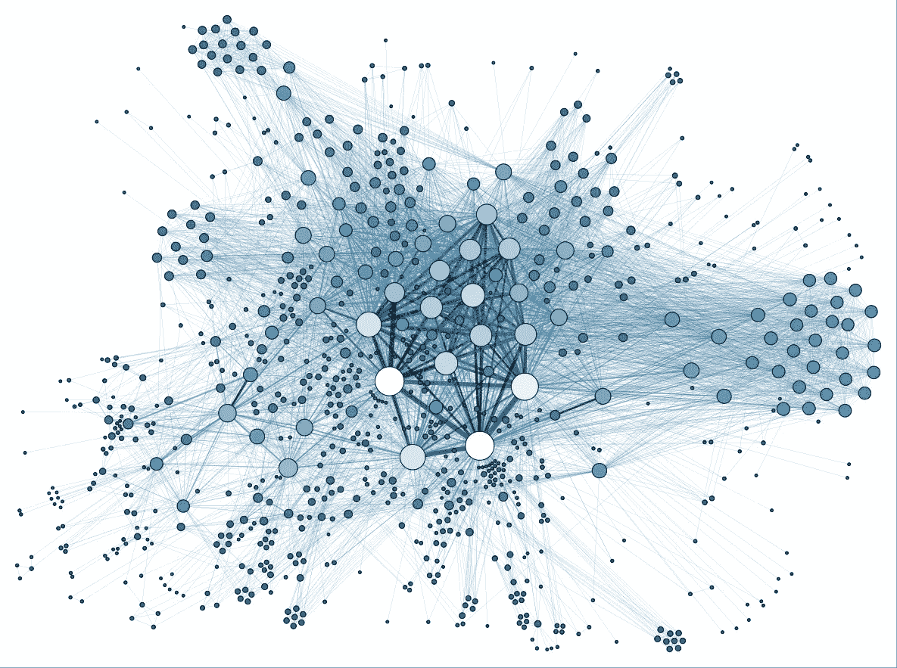

# 如何用图数据库用 Python 可视化一个社交网络:Flask + Docker + D3.js

> 原文：<https://towardsdatascience.com/how-to-visualize-a-social-network-in-python-with-a-graph-database-flask-docker-d3-js-af451db57330?source=collection_archive---------42----------------------->

## [实践教程](https://towardsdatascience.com/tagged/hands-on-tutorials)


照片由[艾莉娜·格鲁布尼亚](https://unsplash.com/@alinnnaaaa?utm_source=unsplash&utm_medium=referral&utm_content=creditCopyText)在 [Unsplash](https://unsplash.com/s/photos/network-graph?utm_source=unsplash&utm_medium=referral&utm_content=creditCopyText) 拍摄

# 介绍

当您考虑 web 应用程序时，通常不会想到图形数据库。相反，大多数人只是走熟悉的路线，使用 SQL 数据库存储信息。虽然这对于大多数用例来说是完全可以接受的，但有时使用图形数据库会带来巨大的好处。在本教程中，我将向您展示如何使用 Flask 创建一个基本的 web 应用程序，将所有信息存储在一个图形数据库中。更准确地说，我们使用的是 **Memgraph DB** ，这是一个内存数据库，可以轻松处理大量信息并快速执行读/写指令。

我们的用例是一个**社交网络图**(为了方便起见，在代码中称为 **SNG** )代表用户和他们之间的联系。通常，这样的图将包含数百万个关系，并且对它们执行的算法不适合存储在关系数据库中的数据。

在本教程中，我将一步一步地向您展示如何自下而上地构建一个简单的 Python web 应用程序，以便您对所使用的技术有一个基本的了解。如果你不想在阅读教程的时候使用它，你也可以在这里找到所有的代码。如果您在本教程中有任何问题或有什么地方不适合您，请随时在标签为`memgraphdb`的 [StackOverflow](https://stackoverflow.com/questions/tagged/memgraphdb) 上发帖。



马丁·格兰让(2014)。 [La connaissance 是一个简历](http://www.cairn.info/resume.php?ID_ARTICLE=LCN_103_0037)。 [CC BY-SA 3.0](https://creativecommons.org/licenses/by-sa/3.0)

# 先决条件

因为我们正在构建一个完整的 web 应用程序，所以在开始之前，您需要安装一些工具:

*   [诗歌](https://python-poetry.org/docs/):Python 中的依赖管理和打包工具。它允许你声明你的项目所依赖的库，它将为你管理(安装/更新)它们。
*   [Flask](https://flask.palletsprojects.com/en/1.1.x/quickstart/) :一个非常强大的 web 框架，为你提供了用于 web 开发的工具、库和技术。Flask 应用程序可以小到一个网页，也可以大到一个管理界面。
*   Docker 和 Compose :一个开发、发布和运行应用程序的开放平台。它使我们能够将应用程序从基础设施(主机)中分离出来。如果您在 Windows 上安装 Docker，Compose 将已经包含在内。对于 Linux 和 macOS，请访问[这个网站](https://docs.docker.com/compose/install/)。
*   [Memgraph DB](https://docs.memgraph.com/memgraph/quick-start) :一个本地完全分布式内存图形数据库，旨在处理企业级的实时用例。遵循快速启动页面上的 **Docker 安装**说明。虽然它是完全可选的，但我鼓励您也安装 [Memgraph Lab](https://memgraph.com/product/lab) ，这样您就可以直接在数据库上执行 **Cypher** 查询，并看到可视化的结果。

# 创建项目结构和处理依赖关系

有时候 Python 中的标准打包系统和依赖管理会让初学者感到困惑，所以我们决定使用诗歌。
要开始构建我们的项目结构，选择一个工作目录并运行:

```
poetry new sng-demo
```

现在，您应该有一个包含以下内容的目录:

```
sng-demo
├── pyproject.toml
├── README.rst
├── sng_demo
│  └── __init__.py
└── tests
   ├── __init__.py
   └── test_poetry_demo.py
```

在本教程中，我们不会使用测试功能，所以继续删除目录`tests`和文件`README.rst`。

现在我们需要为我们的项目添加依赖项。假设我们将在 Docker 容器中运行应用程序，我们不需要在本地安装依赖项，只需要在容器中安装。复制文件`[project.toml](https://github.com/g-despot/sng-demo/blob/master/pyproject.toml)`和`[poetry.lock](https://github.com/g-despot/sng-demo/blob/master/poetry.lock)`，放在项目的根目录下。关于依赖项管理，我们需要做的另一件事是告诉 Docker 如何在启动时运行诗歌，这样它就可以在容器内安装/更新所有必要的依赖项。

# 将申请归档

在项目的根目录下创建两个文件，`Dockerfile`和`docker-compose.yml`。在`Dockerfile`的开始，我们指定 Python 版本，并指示容器安装 **CMake** 、**poem**、 **mgclient、**和 **pymgclient** 。诗歌对于管理我们在容器内部的依赖关系是必要的，而 CMake 和 mgclient 对于 pymgclient 是必需的，pymgclient 是用于 **Memgraph DB** 的 Python 驱动程序。你不必太关注这部分，只需将代码复制到你的`Dockerfile`:

```
FROM python:3.7*#Install CMake*
RUN apt-get update && \
  apt-get --yes install cmake*#Install poetry*
RUN pip install -U pip \
  && curl -sSL https://raw.githubusercontent.com/python-poetry/poetry/master/get-poetry.py | python
ENV PATH="${PATH}:/root/.poetry/bin"*#Install mgclient*
RUN apt-get install -y git cmake make gcc g++ libssl-dev && \
  git clone https://github.com/memgraph/mgclient.git /mgclient && \
  cd mgclient && \
  git checkout 5ae69ea4774e9b525a2be0c9fc25fb83490f13bb && \
  mkdir build && \
  cd build && \
  cmake .. && \
  make && \
  make install*#Install pymgclient*
RUN git clone https://github.com/memgraph/pymgclient /pymgclient && \
  cd pymgclient && \
  python3 setup.py build && \
  python3 setup.py install
```

接下来，我们用以下内容定义工作目录:

```
WORKDIR /app
COPY poetry.lock pyproject.toml /app/
```

第二个命令将使我们能够缓存项目需求，并且只在`pyproject.toml`或`poetry.lock`改变时重新安装它们。

```
RUN poetry config virtualenvs.create false && \
  poetry install --no-interaction --no-ansi
```

我们不需要创建虚拟环境，因为我们的应用程序已经被隔离在 Docker 容器中。要禁用它，需要将`virtualenvs.create`设置为假。
命令中的第二行确保了在安装/更新依赖项时，poem 不会问我们任何交互问题，这使得输出更加日志友好。

```
COPY . /app
EXPOSE 5000
ENTRYPOINT [ "poetry", "run" ]
```

这是我们在容器中创建所有目录和文件的地方。`EXPOSE`命令通知 Docker 容器在运行时监听指定的网络端口。

接下来，我们需要创建一个`docker-compose.yml`文件。 **Compose** 是一个定义和运行多容器 Docker 应用的工具。使用 Compose，您可以使用 YAML 文件来配置应用程序的服务。然后，只需一个命令，您就可以从您的配置中创建并启动所有服务。对于我们的项目，我们需要两个服务。一个是 web 应用程序(`sng_demo`)，另一个是数据库实例(`memgraph`)。

如果您正确遵循了[如何使用 Docker](https://docs.memgraph.com/memgraph/quick-start) 设置 Memgraph DB 中的说明，您只需将以下代码添加到您的`docker-compose.yml`文件中即可运行容器:

```
version: '3'
services:
  memgraph:
    image: "memgraph"
    ports:
      - "7687:7687"
  sng_demo:
    build: .
    volumes:
      - .:/app
    ports:
      - "5000:5000"
    environment:
      MG_HOST: memgraph
      MG_PORT: 7687
    depends_on:
      - memgraph
```

说到`ports`键，在**主机 _ 端口**和**集装箱 _ 端口**之间有一个重要的区别。密钥中的第一个数字是**主机端口**，它可用于从您的主机连接到服务(例如使用 **Memgraph Lab** )。第二个数字指定了用于服务对服务通信的**容器端口**。更准确地说，我们的服务`sng_db`可以使用这个端口访问服务`memgraph`并连接到数据库。

`environment`键包含代表服务容器中环境变量的`MG_HOST`和`MG_PORT`。它们存储建立数据库连接所需的`memgraph`服务地址和端口。`depends_on`键用于按照依赖顺序启动服务，因为我们需要数据库在 web 应用程序之前启动。

`build`键允许我们告诉 Compose 在哪里找到构建指令以及构建过程中使用的文件和/或文件夹。通过使用`volumes`键，我们绕过了不断重启映像以从主机加载新更改的需要。

最后，我们有一个利用诗歌的项目！这种方法非常适合开发，因为它使我们能够在完全不同的操作系统和环境上运行我们的项目，而不必担心兼容性问题。

# 使用 Flask 进行 Web 开发

Flask 使用起来非常简单，所以为什么不创建一个 **Hello World 呢！尝试我们的 Docker+诗歌设置。
在项目根目录下创建一个名为`app.py`的文件，代码如下:**

```
from flask import Flask

app = Flask(__name__)

@app.route('/')
@app.route('/index')
def index():
   return "Hello World"
```

首先，我们导入 Flask 类，然后创建它的一个实例。`route()`装饰器告诉 Flask 哪个 URL 应该触发我们的函数。现在，我们需要告诉 Docker 如何运行我们的应用程序。这可以通过在项目根目录中创建一个简单的脚本来完成。姑且称之为`start.sh`:

```
#!/bin/bash
export FLASK_APP=app.py
export FLASK_ENV=development
flask run --host 0.0.0.0
```

将`FLASK_ENV`设置为`development`将启用调试模式。这使得 Flask 使用交互式调试器和重装程序。
将`FLASK_APP`设置为`app.py`指定如何启动应用程序。
我们需要告诉 Docker 何时以及如何运行该脚本，因此将以下代码放在您的`Dockerfile`中的`EXPOSE 5000`行之后:

```
ADD start.sh /
RUN chmod +x /start.sh
```

命令`chmod +x`通过设置正确的权限使脚本可执行。
要执行该脚本，请在行`ENTRYPOINT [ "poetry", "run" ]`后添加以下命令:

```
CMD ["/start.sh"]
```

就是这样！我们的第一个网页已经准备好了，所以让我们开始我们的应用程序，以确保我们没有任何错误。
在项目根目录下执行:

```
docker-compose build
```

第一次构建需要一些时间，因为 Docker 必须下载和安装许多依赖项。
运行完毕后:

```
docker-compose up
```

我们的 web 应用程序的 URL 是 [http://localhost:5000/](http://localhost:5000/) 。当你打开它时，应该会有一条信息**你好，世界！**这意味着应用程序已启动并正在运行。

现在是时候创建一个更复杂的网页来包含我们的社交网络图了。在项目根目录下创建一个名为`templates`的文件夹，并在其中创建一个名为`base.html`的文件。这将是我们其他页面的基本 HTML 模板。复制代码:

```
<!doctype html>
<html lang="en"><head>
    <meta charset="utf-8">
    <meta name="viewport" content="width=device-width, initial-scale=1, shrink-to-fit=no"><link rel="stylesheet" href="https://stackpath.bootstrapcdn.com/bootstrap/4.3.1/css/bootstrap.min.css">
    <link rel="stylesheet" href="/static/css/style.css"><script src="https://code.jquery.com/jquery-3.3.1.slim.min.js"></script>
    <script src="https://stackpath.bootstrapcdn.com/bootstrap/4.3.1/js/bootstrap.min.js"></script>
    <script src="https://d3js.org/d3.v4.min.js" charset="utf-8"></script><title>Social Network Graph Demo</title>
</head><body>
     
</body></html>
```

我们还需要为实际的登录站点创建一个 HTML 文件，利用这个基本文件和一个附带的 JavaScript 文件。在相同位置创建名为`index.html`的 HTML 文件，并将以下代码复制到其中:

```
 
<div class="container">
  Hello World!
</div>
<script src="/static/js/index.js" charset="utf-8"></script>

```

在项目根目录下创建一个名为`static`的文件夹，其中一个子文件夹名为`js`，另一个名为`css`。`js`文件夹将包含所有需要的本地 JavaScript 文件，而`css`文件夹将包含所有 CSS 样式表。在`js`文件夹中创建一个名为`index.js`的文件，在`css`文件夹中创建一个名为`style.css`的文件。暂时让它们空着。

如果你想了解更多关于 Flask 的 web 开发，我建议你试试这个教程。
你目前的项目结构应该是这样的:

```
sng-demo
├── sng_demo
│  └── __init__.py
├── templates
│  └── index.html
├── static
│  ├── css
│  │  └── style.css
│  └── js
│     ├── base.html
│     └── index.js
├── app.py
├── docker-compose.yml
├── Dockerfile
├── poetry.lock
├── pyproject.toml
└── start.sh
```

# 数据模型和数据库连接

在 app 目录`sng-demo`中创建一个名为`database`的文件夹。该文件夹将包含我们与数据库通信所需的所有模块。你可以在这里找到它们，然后复制它们的内容。它们与数据库驱动程序密切相关，如果你想更深入地研究它们，我建议你在这里查阅驱动程序文档[。在 app 目录`sng-demo`中创建模块`db_operations.py`。这是所有自定义数据库相关命令的位置。
`sng_demo`目录应该是这样的:](https://github.com/memgraph/pymgclient)

```
sng_demo
├── __init__.py
├── db_operations.py
└── database
   ├── __init__.py
   ├── memgraph.py
   ├── connection.py
   └── models.py
```

我们将使用一个非常简单的数据模型，以后可以很容易地升级。
标签为`User`的节点只有一个，每个`User`都有两个属性，一个数字`id`和一个字符串`name`。节点用类型`FRIENDS`的边连接:


作者图片

有几种方法来填充我们的数据库(这里有更多的[和](https://docs.memgraph.com/memgraph/how-to-guides-overview/import-data))，但是我们将通过执行 **Cypher** 查询来手动完成，这样您可以更好地理解如何与数据库通信。您将在文件`[data_big.txt](https://github.com/g-despot/sng-demo/blob/master/resources/data_big.txt)`和`[data_small.txt](https://github.com/g-despot/sng-demo/blob/master/resources/data_small.txt)`中找到填充数据库所需的所有查询。前者只是拥有比后者更大的数据集。在项目根目录下创建一个名为`resources`的文件夹，并将文件放入其中。现在，您可以向您的 web 应用程序添加一个导入方法。
在`db_operations.py`模块中添加以下导入和方法:

```
import jsondef clear(db):
  command = "MATCH (node) DETACH DELETE node"
  db.execute_query(command)def populate_database(db, path):
  file = open(path)
  lines = file.readlines()
  file.close()
  for line in lines:
      if len(line.strip()) != 0 and line[0] != '/':
          db.execute_query(line)
```

方法`clear()`在填充之前删除任何可能留在数据库中的数据。
方法`populate_database()`读取指定文件中的所有**密码**查询并执行它们。
在模块`app.py`中将导入和方法`index()`改为:

```
from flask import Flask, render_template, request, jsonify, make_response
from sng_demo.database import Memgraph
from sng_demo import db_operationsapp = Flask(__name__)@app.route('/')
@app.route('/index')
def index():
    db = Memgraph()
    db_operations.clear(db)
    db_operations.populate_database(db, "resources/data_small.txt")
    return render_template('index.html')
```

现在，每次我们刷新索引页面时，数据库都会被清空并用新数据填充。虽然这不适合生产阶段，但在开发过程中非常有用，因为它使我们能够在不重启整个应用程序或直接处理数据库的情况下更改数据。
如果您想在继续之前检查图形，我建议您打开 **Memgraph Lab** 并运行查询`MATCH (n1)-[e:FRIENDS]-(n2) RETURN n1,n2,e;`。
结果应该是:


作者图片

我们的应用程序中还需要一个方法，在客户端请求时从数据库中获取所有相关数据。
姑且称之为`get_graph()`，将其放入`db_operations.py`模块:

```
def get_graph(db):
   command = "MATCH (n1)-[e:FRIENDS]-(n2) RETURN n1,n2,e;"
   relationships = db.execute_and_fetch(command)

   link_objects = []
   node_objects = []
   added_nodes = []
   for relationship in relationships:
       e = relationship['e']
       data = {"source": e.nodes[0], "target": e.nodes[1]}
       link_objects.append(data)

       n1 = relationship['n1']
       if not (n1.id in added_nodes):
           data = {"id": n1.id, "name": n1.properties['name']}
           node_objects.append(data)
           added_nodes.append(n1.id)

       n2 = relationship['n2']
       if not (n2.id in added_nodes):
           data = {"id": n2.id, "name": n2.properties['name']}
           node_objects.append(data)
           added_nodes.append(n2.id)
   data = {"links": link_objects, "nodes": node_objects}

   return json.dumps(data)
```

首先，我们需要执行**密码**查询`MATCH (n1)-[e:FRIENDS]-(n2) RETURN n1,n2,e;`并从数据库返回结果。这些结果将包含图中的所有边以及连接到这些边的所有节点。没有连接的节点不会被返回，现在还可以。

结果(对象`relationships`)是生成器的形式，我们可以通过使用初始查询中指定的节点/边名(`n1`、`n2`和`e`)迭代并访问其内容。
我们还需要检查一个节点是否已经被添加到`node_objects`列表中，因为多条边可以包含(指向或来自)同一个节点。所有对象都存储在适合以后 JSON 转换的键值对中。
最终结果是一个 JSON 对象，包含:

*   `links`:图中作为`source`和`target` id 属性对的所有关系，
*   `nodes`:图中与其他节点形成关系的所有节点。

在您的`app.py`模块中添加以下方法:

```
@app.route("/get-graph", methods=["POST"])
def get_graph():
   db = Memgraph()
   response = make_response(
       jsonify(db_operations.get_graph(db)), 200)
   return response
```

该方法负责响应来自客户端的 POST 请求。它返回我们在前面的方法中从服务器获取的图形数据。

现在让我们用这些数据做点什么吧！从这里复制您的`index.js`文件[的内容，从这里](https://github.com/g-despot/sng-demo/blob/master/static/js/index.js)复制`style.css`文件[的内容。
我们还需要将实际的 SVG 图形添加到页面中，因此将`index.html`文件改为:](https://github.com/g-despot/sng-demo/blob/master/static/css/style.css)

```
 
<div class="container">
    <svg class="border rounded mt-3" width="960" height="600" style="background-color:white"></svg>
</div>
<script src="/static/js/index.js" charset="utf-8"></script>

```

我不会详细介绍如何使用 **D3.js** ，所以如果你想了解更多，我鼓励你访问[他们的网站](https://d3js.org/)。

简而言之，我们从数据库中获取所有的节点和边，并将它们添加到一个 SVG 元素中。图形的可视化表示是通过模拟物理力如何作用于粒子(电荷和重力)来实现的。您可以拖放节点，将鼠标悬停在节点上以查看其 name 属性的值，放大和缩小图形以及移动 SVG 图形。


作者图片

# 附加功能

继续将文件`[query.js](https://github.com/g-despot/sng-demo/blob/master/static/js/query.js)`复制到目录`static/js`并将`[query.html](https://github.com/g-despot/sng-demo/blob/master/templates/query.html)`复制到目录`templates`。你可以在这里找到更新后的`base.html`文件[。从](https://github.com/g-despot/sng-demo/blob/master/templates/base.html) [db_operations.py](https://github.com/g-despot/sng-demo/blob/master/sng_demo/db_operations.py) 模块和 [app.py](https://github.com/g-despot/sng-demo/blob/master/app.py) 模块中复制必要的方法。
完成更改后，只需打开[http://localhost:5000/query/](http://localhost:5000/query/)即可看到结果。如果你想调试从服务器上获取的数据，这个页面会让你的生活变得更容易。它返回所有节点或边，并以 JSON 突出显示的格式显示它们。


作者图片

您当前的项目结构应该是这样的:

```
sng-demo
├── resources
│  ├── data_big.py
│  └── data_small.txt
├── sng_demo
│  ├── __init__.py
│  ├── db_operations.py
│  └── database
│     ├── __init__.py
│     ├── memgraph.py
│     ├── connection.py
│     └── models.py
├── templates
│  ├── base.html
│  ├── index.html
│  └── query.html
├── static
│   ├── css
│   │  └── style.css
│   └── js
│      ├── index.js
│      └── query.js
├── app.py
├── docker-compose.yml
├── Dockerfile
├── poetry.lock
├── pyproject.toml
└── start.sh
```

# 结论

尽管图形数据库已经存在了很长时间，但是它们仍然没有被认为是软件开发中的主流工具。**关系数据库管理系统**将数据建模为一组预定的结构。当数据集变得过于相互关联时，复杂连接和自连接是必要的。现代数据集需要技术上复杂的查询，这些查询在实时场景中通常非常低效。

**图形数据库**为许多现实世界的问题提供了强大的数据建模和分析能力，如社交网络、业务关系、依赖关系、运输、物流…它们已被许多世界领先的科技公司采用。通过这篇教程，我希望让你明白在你的开发过程中集成一个图形数据库是多么容易，我鼓励你自己去尝试一下。

正如我在开始时说的，欢迎在标签为`memgraphdb`的 [StackOverflow](https://stackoverflow.com/questions/tagged/memgraphdb) 或我们的官方[论坛](https://discourse.memgraph.com/)上向我们提出任何关于本教程或 Memgraph 的问题。祝你的编码好运！


作者图片