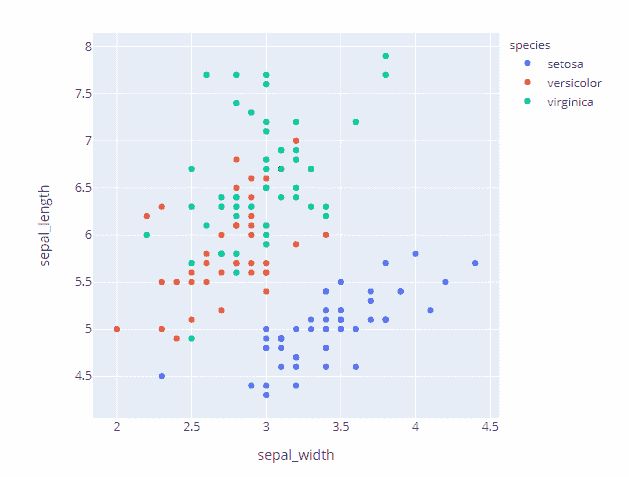
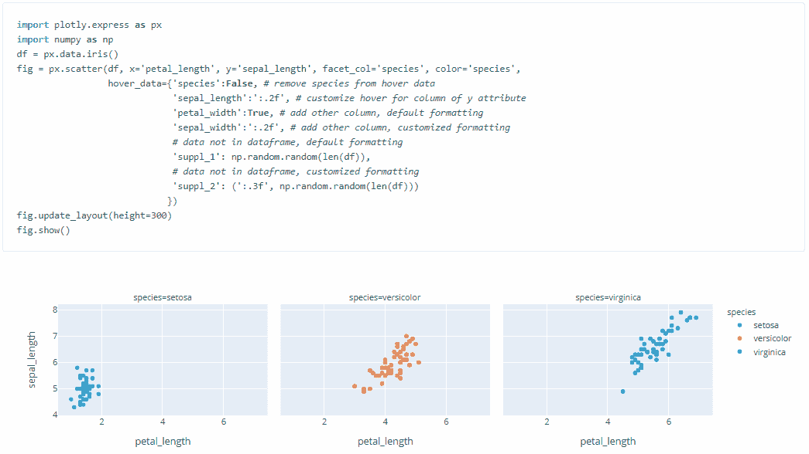
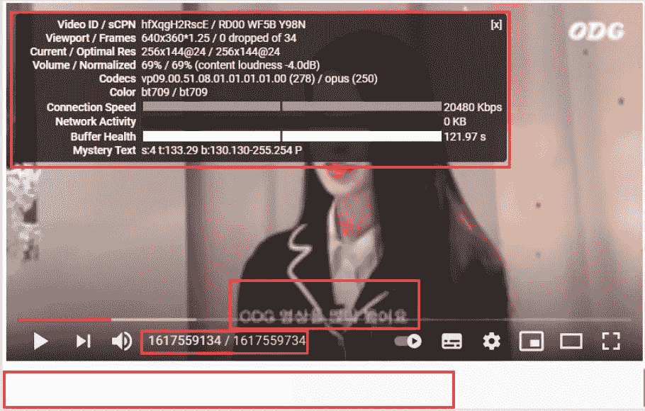
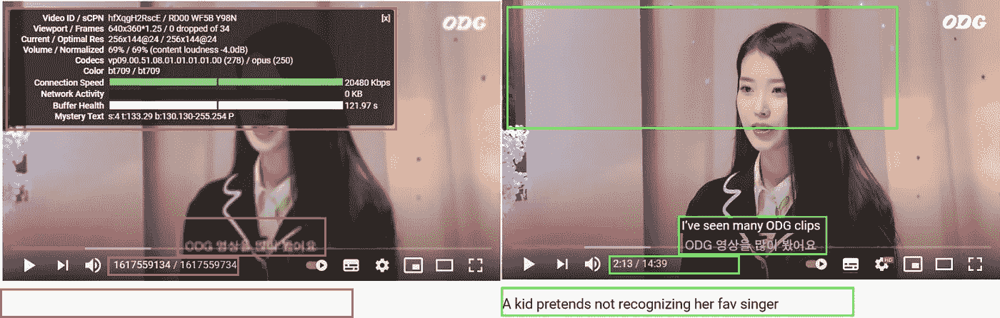
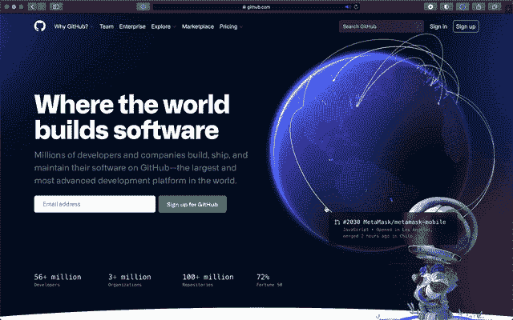

# 如何有效地可视化数据

> 原文：<https://towardsdatascience.com/how-to-visualize-data-usefully-5d32e9531c56?source=collection_archive---------35----------------------->

## 一个好的数据可视化应该是什么样的？首先，它应该是有用的

图片由作者提供，截图来自[https://youtu.be/hfXqgH2RscE?t=132](https://youtu.be/hfXqgH2RscE?t=132)

## 有用的数据可视化应该服务于一个目的

对于有用的东西，它应该有一个目的。

如果我们在创建一些图表或表格时头脑中没有一个目的，**它们注定是没有用的**，因为你从未期望它们做任何事情。这些生成的图表只是图表库的 API 调用输出。

我能想到图表/表格的三种常见用途:

1.  **探索**:了解数据集，发现规律
2.  **解释**:突出一个模式，提出一个理论，提示一个行动
3.  **打动**:逗人开心，激起好奇心

如果我们想让数据可视化对不同的目的有用，需要注意不同的事情。

# 目的 1:探索

如果我们可视化的目的是探索数据，**让自己轻松**是你应该关心的最重要的事情。我们正在可视化的数据集很可能是我们不太熟悉的数据集，目标是发现我们不知道的东西，或者找到我们怀疑为真的一些想法的证据。

如果你不能**轻松地**从不同角度研究数据集，你就不会。

## 有用地探索数据的 3 个原则

1.  **做得又快又脏**
    做得又快又脏意味着我们不需要太担心“外观”(例如数字格式、跨支线剧情的轴一致性、清晰的标签)，只要它不会“挫败目的”，即从一个不熟悉的数据集中发现模式。微软 Excel 是最受欢迎的选择，现在是 Jupyter 笔记本/实验室。都抱着这种又快又脏的心态。
    也就是说，如果它变得太脏，你不再明白你的图表在显示什么，那么它就不再有用。所以需要在速度和干净之间取得平衡(例如，使用变量名、数字格式、复制图表的容易程度)。
2.  使用支持生成交互式图表的图表库。使用交互式图表浏览数据比静态图表“更快”，因为您可以通过放大/缩小交互式图表来创建另一个静态图表，或者通过取消选中图例来排除某些组。Plotly 是这方面的一个很好的库。

使用交互式图表库加速数据浏览。来源:图片由作者提供，截图来自[https://plotly.com/](https://plotly.com/)

3.**显示更多相关字段**

主图表区通常最多显示 3 到 4 个维度(通过 x 轴、y 轴、颜色、大小)，但是数据集通常有比这多得多的列。当我们浏览数据集时，在一个视图中查看更多维度的数据可以帮助我们更容易地发现模式。在工具提示中显示这些额外的维度(即当鼠标悬停在数据上时弹出的窗口)会很有用。在 Plotly express(Plotly 的高级包装器)中，我们可以通过传入 **hover_data** 参数在工具提示中显示额外的数据字段。

使用工具提示在上下文中添加额外数据。来源:图片由作者提供，截图来自[https://plotly.com/](https://plotly.com/)

# 目的 2:解释

如果我们可视化的目的是解释，那么**让其他人容易理解**是关键。当你探索数据时，我们可能已经发现了一些模式/想法，现在我们希望其他人看到相同的模式/想法并同意你，让那些人成为你的老板/媒体读者。

为此做一个有用的可视化， [**不要让你的观众认为**](https://amzn.to/3fGlosB) 。

这意味着你的视觉化应该是*“不证自明、显而易见、不言自明的。读者应该能够“理解”它——它是什么以及如何阅读它——而不需要花费任何精力去思考它。”[2]*

## 如何不通过可视化数据来分享想法

假设你的朋友分享了一个 Youtube 视频给你，你点击了链接，视频看起来是这样的:

图片由作者提供，截图来自[https://youtu.be/hfXqgH2RscE?t=132](https://youtu.be/hfXqgH2RscE?t=132)

您很难观看该视频，因为它:

*   没有标题
*   字幕:韩语(假设你不懂韩语)
*   展示了很多你不懂的视频统计数据，还挡住了被采访女士的脸
*   视频分辨率:144p
*   时间格式:1617559134 / 1617559734(奇怪的 Unix 时间戳格式)

创建一个类似上面 Youtube 视频的图表非常容易。**通常使用默认设置就可以了。**

## 一个好的图表应该像 Youtube 视频一样

如果你不想让你的解释性图表在你的观众面前看起来像那个奇怪的视频，记住:

*   给标题**帮助观众理解**图表是关于什么的
*   添加注释，使用观众**能够理解的语言**
*   删除隐藏你想法主题的不必要的细节
*   使其**视觉清晰**
*   使用观众**无需大脑额外处理就能理解的数字格式**

可视化:坏与好。图片由作者提供，截图来自[https://youtu.be/hfXqgH2RscE?t=132](https://youtu.be/hfXqgH2RscE?t=132)

尽一切努力消除混淆，让观众在视觉上和精神上容易阅读。

# 目的 3:留下深刻印象

Github 登陆页[3]里的地球仪看起来很酷吧？

[https://github.com/home](https://github.com/home)，来源:图片来自[https://github . blog/2020-12-21-how-we-build-the-github-globe/](https://github.blog/2020-12-21-how-we-built-the-github-globe/)

这是一个 three.js 可视化视图，显示 Github 中的 pull 请求活动，蓝色尖峰表示打开的 pull 请求，粉色弧线表示合并的 pull 请求。

没有人会查看这个登录页面来发现世界各地的拉请求模式，也没有人试图告诉我们 github 用户如何使用该网站的理论。因此，即使没有脚注来解释蓝色尖峰和粉色弧线是什么也没关系。在某种程度上，如果它是可视化的硬编码数据，甚至是假数据，我也没问题[4]。

最重要的是，它确实达到了目的——给人留下深刻印象。**好看**。如果你不是 Github 的用户，你可能会注册来了解这个网站上发生了什么。你还能从登录页面上要求什么呢？

## 摘要

要实现有用的数据可视化:

1.  在头脑中有一个**目的**用于可视化(3 个常见目的)
2.  请注意，不同目的的可视化会有**不同的事情需要关注**
3.  试着设身处地为观众着想。这个观众可能是你自己，也可能是其他人，这取决于可视化的目的。

— — — — — — — — — —

笔记

[1]这篇文章的灵感来自保罗·格拉厄姆的随笔 [*如何写出有用地*](http://www.paulgraham.com/useful.html) 。重要+新颖+正确+有力，是一篇好文章的秘诀

[2]摘自史蒂夫·克鲁格的《不要让我思考》，这是一本关于网络和移动可用性的必读书籍。购买该书的附属链接:[https://amzn.to/3fGlosB](https://amzn.to/3fGlosB)

[3] Github 做了一个博客解释了这个可视化的背景和技术细节，见[https://Github . blog/2020-12-21-how-we-build-the-Github-globe/](https://github.blog/2020-12-21-how-we-built-the-github-globe/)

[4]当然不是，但也不是实时数据，见[https://github . blog/2020-12-21-visualizing-githubs-global-community/](https://github.blog/2020-12-21-visualizing-githubs-global-community/)

Youtube 上的视频是 https://www.youtube.com/watch?v=hfXqgH2RscE 的，我刚刚得知 Youtube 上有 4k 视频。