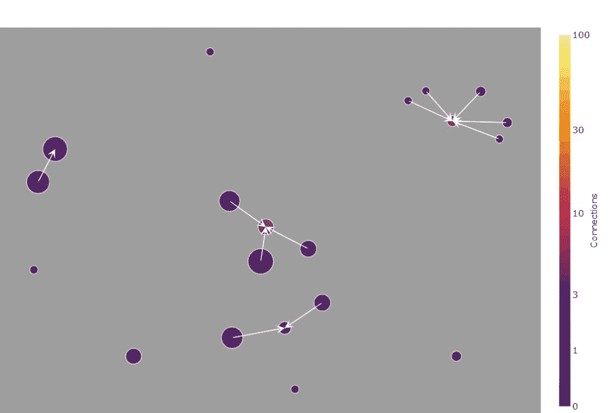

# 如何在 Python 中将数据库可视化为网络图

> 原文：<https://towardsdatascience.com/how-to-visualize-databases-as-network-graphs-in-python-2ce3851f8458?source=collection_archive---------6----------------------->

## [实践教程](https://towardsdatascience.com/tagged/hands-on-tutorials)

## *构建一个 Dash web 应用程序，以交互方式探索数据库结构。*

geralt ( [Pixabay](https://pixabay.com/de/photos/netzwerk-erde-blockchain-globus-3524352/) )原创图片。由作者编辑。

在工作中，我最近面临的挑战是，必须分析一个 SQL 数据库的数据模型，该数据库由 500 多个表和数千个关系组成。在这个比例下， *phpMyAdmin* 内置的可视化功能不足以深入了解结构。我需要的是一个工具，在这个工具中，我可以应用各种过滤器(例如，表和列的名称、行数、连接数)，然后以一种易于理解的可视化方式查看过滤后的表及其关系。所以，我决定用 Python 来构建这样一个工具。

注意，为了简洁和关注重点，我没有在这里提供完整的代码(大约 1000 行)。此外，我删除了注释行，以保持代码部分简短。

# 获取数据

为了可视化数据库的结构，我们首先需要获得表和列名以及主键和外键的数据。幸运的是，SQL 数据库提供了一个非常好的信息源:信息模式。这是一个元数据库，即描述其他数据库的数据库——不是它们的内容，而是它们的结构、约束、数据类型等等。它由许多表格组成，但我们只需要其中的三个:

*表*:从这里我们得到所有表的名称、它们所属的数据库(模式)、它们的行数以及描述这些表的可选注释。

*列*:这个表告诉我们所有表中每一列的列名，以及它属于哪个数据库和表。此外，我们可以获得数据类型、默认值和描述列的注释。

*KEY_COLUMN_USAGE* :对于我们的目的来说，这是最重要的表。它告诉我们这些表是如何连接的，也就是说，对于从一列到另一列的每个引用，它都包含一条记录。此外，它还标识主键列。

我决定使用我对数据库的 *phpMyAdmin* 访问以 JSON 格式导出这三个表。当然，您也可以直接访问信息模式(例如使用 *sshtunnel* 和 *sqlalchemy* )，但是我想要一个离线工作的解决方案。以下代码将信息模式表中的数据加载到 *pandas* (作为`pd`导入)数据框中。

由于 JSON 导出的结构(该文件包含我们不感兴趣的标题)，我们需要提取数据列并删除空行。然后，我们用数据帧的第一个单元中包含的数据制作一个新帧。结果数据框包含的数据与 JSON 文件被传递给函数`load_from_json`的信息模式表中的数据相同。

现在我们使用这个函数从上面描述的信息模式表中获取表、列和引用的数据。我们从*表*表开始。

通过 *pandas* 数据框的`iterrows`函数，我们循环遍历所有行，每一行都给我们一个表的名称、数据库(模式)、注释和行数。最后两行值得解释一下:`information_schema`是一个模块，我在其中定义了存储表、列及其关系的结构。使用`information_schema.Table(...)`，我们创建了一个对象，收集特定表上的所有数据，最后一行代码将该表添加到一个`TableCollection`对象中，如下所示:

在这个表集合中，表对象存储在一个字典中，该字典使用一个由数据库(模式)名和表名组成的元组作为键(同一个表名可能在多个数据库中使用)。

现在我们已经拥有了`TableCollection`结构中的所有表，是时候添加关于列的信息了，我们从信息模式的*列*表的 JSON 导出中加载这些信息。

同样，我们遍历所有的行，每一行都描述一个表的一列，我们已经加载了该表的名称等。在最后两行中，我们创建了一个存储特定列属性的对象，然后将这个`information_schema.Column`对象添加到它所属的表中，方法是将它传递给属于表集合中适当字典条目的函数。

现在我们在`TableCollection`对象中有了关于表及其列的信息。仍然缺少的是关于主键和外键的信息，我们从信息模式的 *KEY_COLUMN_USAGE* 表中获得这些信息。

在 *KEY_COLUMN_USAGE* 的“CONSTRAINT_NAME”列中，作为其所属表中主键的列由值“primary”标记。我们使用这个信息来设置`Column`对象的相应属性`is_primary`。如果列是外键，则引用的数据库、表和列在“REFERENCED_TABLE_SCHEMA”、“REFERENCED_TABLE_NAME”和“REFERENCED_COLUMN_NAME”中指定。这些数据被添加到上面代码最后一行的`Column`对象中。

# 创建图表

如果你不熟悉[图论](https://en.wikipedia.org/wiki/Graph_theory):图是一种数学结构，由一组对象(节点)和这些对象之间的一组连接(边)组成。这样的结构正是我们探索数据模型所需要的:表将是图的节点，表之间的引用将是图的边。

我们将使用 [*networkx*](https://networkx.org/) 包来创建图形，这需要四个步骤:

1.  导入包:`import networkx as nx`
2.  初始化一个图形对象，例如:`g = nx.Graph()`
3.  使用`g.add_node(node)`添加节点，其中`node`可以是除`None`之外的任何可散列对象。我们还可以传递被解释为节点属性的关键字参数。
4.  使用`g.add_edge(node_1, node_2)`在节点之间添加边，也可以选择使用包含边属性的关键字参数。请注意，原则上可以跳过第 3 步，因为如果边不存在，节点会自动与边一起创建。

但是我们还没有完成图表的构建。我们还想在以后操作它(记得我处理了 500 多个表，需要应用过滤器)，为此我们编写了`GraphManipulator`类:

在实例化一个`GraphManipulator`对象时，一个图形对象被创建。注意，我们在这里使用`DiGraph()`(*networkx*包作为`nx`导入)，这创建了一个有向图，也就是说，当创建一条边时，两个连接节点的顺序很重要。我们这样做是为了以后可以绘制从引用表指向被引用表的箭头。

`load`函数将我们的`TableCollection`对象作为参数，因此`GraphManipulator`对象可以访问我们从信息模式中获得的数据。然后，由名称以下划线开头的三个函数构建图形，最后保存图形对象的副本，以便在使用过滤器后恢复它(稍后将详细介绍)。让我们来看看构建图形的三个函数。

我们从节点开始:

上面的代码遍历所有表，这些表的信息存储在`TableCollection`对象中(这里是`self.tables`)。函数`_build_node_id`只是返回一个由数据库名和表名组成的字符串。该字符串对于每个表都是唯一的，并用作节点对象。使用`tab.get_foreign_keys()`,我们得到了表中充当外键的列的列表，也就是说，它们引用了其他表的主键列。

接下来，我们遍历列表`f_keys`中的所有外键，为每个外键在列表`references`中添加一个字符串。该字符串包含被引用列的数据库(模式)、表和列名。最后，我们将所有感兴趣的属性(比如我们刚刚编译的引用列表)放入`attributes`字典，并在我们的图中添加一个附加了这些属性的节点。请注意，两个方向上的边数(字典中的最后两个条目)是稍后设置的。

现在我们有了所有的节点，是时候给我们的图添加边了。

同样，我们遍历所有的表，并对每个表遍历所有包含的列。最里面的循环查看一个列的所有引用(一个列可能引用几个其他列)。上面代码的最后一行向 graph 对象添加了一条从引用列指向被引用列的边(记住，这里有一个有向图)。

我认为在节点属性中同时包含给定表对其他表的引用数和其他表对该表的引用数会很有用。

我将这些属性命名为`N_edges_downstream`和`N_edges_upstream`，并使用 graph 对象的`number_of_edges`函数获取它们的值，如上所示。正如您在代码中看到的，访问节点属性很容易:`graph.nodes[name_of_node]['name_of_attribute']`。现在我们的图表完成了，我们可以把它可视化了。但在此之前，我们先简单谈谈过滤。

# 按节点属性过滤

正如我在本文开头所说的，我正在处理一个包含 500 多个表的数据库。显然，对于大多数人脑来说，这些信息太多了，无法一次全部吸收。因此，我为我的 Python 脚本配备了过滤选项。原理很简单，包括以下步骤:

1.  将我们在构建图表后保存的图表备份复制到图表对象，如下:`self.graph = self.graph_backup.copy(as_view=False)` 这是必要的，因为我们想要将过滤器应用到原始图表，而不是已经过滤的图表。
2.  遍历图中的所有节点。
3.  将节点属性与您的过滤标准进行比较，如果有任何比较表明节点不符合标准，那么使用`graph.remove_node(node)`将其删除。

在这个过程之后，只有符合过滤标准的表将作为节点留在图中。它们之间的边保持不受影响，而将它们连接到已删除节点的边不再是图的一部分。我实现了以下过滤器:

*   数据库(模式)、表和列的名称(带通配符的字符串比较)。
*   行数。
*   列数。
*   连接数，即引用其他表或从其他表引用。

有时过滤某些表是有用的，例如，所有表的名称中都有一个给定的字符串，然后还显示与过滤后剩下的那些表相连接的所有表。为此，我编写了以下函数。

整数参数`depth`决定了这个连接扩展到什么程度。案例`depth = 1`对应于我上面所说的，而`depth = 2`不仅包括连接的表，还包括连接到这些表的表，等等。换句话说，将保留离过滤节点不超过`depth`条边的所有节点(`self.graph.nodes`)。

我们通过遍历过滤图中的所有节点并将它们及其相邻节点添加到要保留的节点列表中来实现这一点。注意，对于一个有向图，`DiGraph.neighbors(node)`和`DiGraph.predecessors(node)`将分别给出一个节点的后继节点和前趋节点，即它在两个方向上的邻居。对于一个无向图，你只能使用`Graph.neighbors(node)`。一旦我们有了要保留的节点列表，我们只需用未过滤的备份覆盖我们的图表，然后删除列表中没有的所有节点。如果`depth`大于 1，新的迭代将从`self.graph`开始，包含我们刚刚放入保留列表的所有节点。

# 在 web 应用程序中可视化图表

*networkx* 包提供了基本的[可视化功能](https://networkx.org/documentation/stable/reference/drawing.html)，但这并不是它的优势所在。我决定使用 [*破折号*](https://dash.plotly.com/) 开发一个 web 应用程序，因为这样可以对数据库结构进行交互式探索。如果你不熟悉 Dash，看看它的文档，并查看一下[*plottly*](https://plotly.com/python/)可视化示例，了解一下你能用它做什么。你也可以在 Medium 上找到一些关于使用*破折号*的有用文章。

出于可视化网络图和应用过滤器的目的，我发现这些*破折号* / *特性特别有用:*

*   您可以构建一个 web 应用程序(也可以在本地运行),而无需大量编码。
*   你不需要编写 HTML 或 JavaScript 代码，除非你想将你的应用程序扩展到 Dash 提供的范围之外。
*   您不需要为您的可视化重新发明轮子，因为 *plotly* 已经提供了缩放、平移、在鼠标悬停事件时显示注释等功能，以及以 PNG 格式保存绘图的能力。

关于如何使用*破折号*构建 web 应用程序的详细信息，请点击我上面提供的链接。在这里，我将只给出应用程序的简要概述，然后讨论有趣的部分，即可视化图形的代码。以下是创建 web 应用程序的基本步骤:

1.  导入您需要的模块，在本例中是用于创建应用程序和添加控件的`dash`、`dash_core_components`(作为`dcc`)、`dash_bootstrap_components`(作为`dbc`)和`dash_html_components`(作为`html`)。因为我们想在回调函数中访问控件的内容，我们还需要这个:
    `from dash.dependencies import Input, Output`
2.  创建一个 Dash 应用程序对象，像这样:
    `app = dash.Dash(...)` 在这一行中，你可以通过向函数传递参数来做很多事情。例如，您可以通过指定 CSS 文件来更改 GUI 的外观。
3.  创建所有的控件(文本标签、输入字段、下拉列表等。)你需要。使用[*dash _ bootstrap _ components*](https://dash-bootstrap-components.opensource.faculty.ai/docs/quickstart/)您可以轻松地将它们排列成行和列，以创建一个响应式布局。绘图区域是一个`dash_core_components.Graph`对象(不要和我们的网络图混淆)。
4.  这些控件组(行中的列)被收集在一个容器对象中，并被插入到我们的 Dash 应用程序对象的`layout`属性中:
    `app.layout = html.Div(dbc.Container([...]))`
5.  最后，我们使用`@app.callback`装饰器将函数链接到我们的控件，如这里的[所述](https://dash.plotly.com/basic-callbacks)。

现在来说说网络图怎么画。当“更新图形”按钮的回调被触发时，相应的代码被执行。这个回调函数的返回值是一个`plotly.graph_objs.Figure`对象，其输出设置为绘图区域的`'figure'`属性(`dash_core_components.Graph`对象)。

在实际绘制之前，我们需要计算网络图中节点的位置。幸运的是， *networkx* 包可以为我们完成繁重的工作，因为它包含了以有用的方式排列节点的布局函数。我在 GUI 中添加了一个下拉菜单，允许用户选择他们想要应用的布局功能。我实现了以下选项( *networkx* 被导入为`nx`):

*   `pos = nx.layout.planar_layout(graph)`
    该函数试图定位节点，使得所有的边都可以画出而没有交叉，从而创建一个整洁的可视化。如果这是不可能的，它会引发一个错误。
*   `pos = nx.layout.shell_layout(graph, nlist=node_list)`
    这将根据`nlist`(节点列表的列表)的内容将节点排列成同心圆(壳)。我选择根据节点的边数将节点分配给壳(连接最多的节点放在中间)。当要显示的节点数量很少而边数很多时，这对于获得概览很有用。
*   `pos = nx.layout.spring_layout(graph)`
    应用此布局功能创建一个力导向布局，即边像弹簧一样活动，节点互相排斥。通过为节点指定权重属性，可以单独更改弹簧的吸引力(否则，所有节点的值都相同)。我发现这种布局对于在所有节点都有相似边数的非平面图中创建顺序非常有用。
*   `pos = nx.layout.kamada_kawai_layout(graph)` Kamada-Kawai 算法也产生力导向布局，但考虑了每对节点的图形距离(最短路径中的边数)。这对于识别强连接节点的集群是有用的。

通过调用一个布局函数计算出节点位置后，这些位置被传递给图形对象，如下所示:`nx.set_node_attributes(graph, name='pos', values=pos)`

现在我们有了作为节点属性的节点位置，我们可以开始绘图了。我们将从边缘开始。

上面的代码创建了散点图对象`edge_trace`(在将`plotly.graph_objs`导入为`go`之后)，我们向其传递了一个描述用于绘制边缘的线型的字典。然后，我们遍历图中的所有边，并通过访问我们刚刚分配的`'pos'`属性来提取相应的开始和结束节点的坐标对(分别为索引 0 和 1)。这些位置被添加到散点图对象内的坐标数据中。因为我们希望箭头从引用指向被引用的表节点，所以我们创建了列表`annotations`。对于每条边，我们在这个列表中添加一个条目，这是一个描述我们想要绘制的箭头的字典。

接下来，我们处理节点(所有元素的实际绘制发生在最后)。

我决定用颜色来表示一个节点拥有的连接数。上面的代码创建了一个对数颜色条，当有许多连接很少的表和有许多连接的表时，这个颜色条很有用。列表`conn_ticks`包含 *N* 的值，我们希望在这些值处标记分笔成交点。由于有节点的 *N* = 0，我们将使用 log( *N* + 1)来分配颜色，并相应地选择放置刻度标签的值`tick_vals`。字典`marker`定义了节点的外观，利用了我们刚刚设置的颜色条和 *plotly* 内置的“地狱”色标。

正如我们处理边一样，我们创建了一个散点图对象，现在必须用描述每个节点的数据填充它。

上面显示的代码遍历图中的所有节点，并访问感兴趣的节点属性。这些属性被编译成字符串`node_info`，该字符串在代码的最后一行被设置为鼠标悬停文本。正如我们对待边缘一样，我们提取节点位置(线`x, y = ...`)并将其添加到散点图对象`node_trace`的坐标数据中。如果要显示表名，必要的数据(包含文本和位置的字典`node_annot`)被添加到注释列表中，我们之前使用该列表来添加箭头。使用`node_trace['marker']['color']`属性，根据我们的对数颜色条设置节点颜色。节点大小是根据其行数设置的(取最小值的对数)。

我们现在需要做的最后一件事是构建实际的图形对象。

上面的代码设置了绘图区域周围的边距，并定义了 x/y 轴(`axis_props`)和颜色轴(`c_axis_props`)的属性；关闭色彩范围自动缩放)。边距和轴字典与我们的注释列表(箭头和节点名)一起被传递给布局对象。最后我们创建了`plotly.graph_obs.Figure`对象,“更新图形”按钮的回调函数将该对象返回给绘图区域的`'figure'`属性。

这是我们所有努力的结果:

web 应用程序的 GUI。

上图显示了对名称中包含字符串“auth”的所有表进行搜索并将深度设置为 1(包括连接到搜索结果表的表)后的 web 应用程序。请注意，出于数据保护的原因，我在这里更改了一些名称。

下面的屏幕截图演示了鼠标悬停功能，该功能允许快速检查网络图中表的最重要属性(在示例中，选择了 Kamada-Kawai 布局，这通常有助于识别集群)。还要注意右上角的菜单栏，这是 *plotly* 的内置功能，允许缩放、平移和将图像保存为 PNG 文件。

鼠标悬停功能是 plotly 的内置功能。

是时候总结一下了，给你一个快速总结。在本文中，您学习了如何:

*   从数据库的信息模式中获取表、列和引用的详细信息。
*   使用 *networkx* 包创建一个(有向)图，并将表表示为节点，将它们的连接(引用)表示为图的边。
*   向节点添加有用的属性，比如外键和表的行数。
*   通过创建图形对象的副本并删除其属性不符合过滤条件的所有节点来应用过滤器。
*   使用 *networkx* 的布局功能排列图形的节点。
*   使用 *plotly* 绘制图形，信息编码在节点的颜色和大小中。
*   添加包含最重要节点数据的鼠标悬停文本。