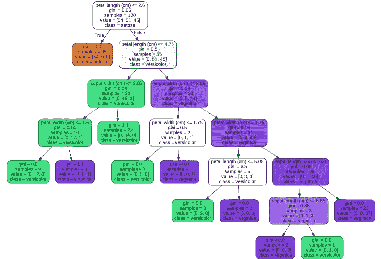

# 如何从随机森林模型中可视化决策树？

> 原文：<https://towardsdatascience.com/how-to-visualize-decision-tree-from-a-random-forest-model-ca563c75811c?source=collection_archive---------18----------------------->

## 决策树模型解释


图片由[皮克斯拜](https://pixabay.com/?utm_source=link-attribution&amp;utm_medium=referral&amp;utm_campaign=image&amp;utm_content=3127287)的 Gerd Altmann 提供

**随机森林**或随机决策森林是一种监督集成机器学习技术，用于训练分类和回归模型。随机森林的训练算法使用 bagging 或 bootstrap 聚集技术，使用决策树作为基学习器。随机森林使用随机化来减少决策树模型中的偏差。

## 什么是决策树？

决策树是一种受监督的机器学习技术，其中数据根据某个参数进行分割，并形成树状结构。可以使用决策节点和树叶来解释该树。

## 模型的可解释性有多重要？

在训练一个健壮的模型并评估模型的性能之后，问题出现了，预测的原因是什么。当谈到预测建模时，您需要权衡，这是业务需求，只是获得预测或预测的原因。

模型可解释性包括观察模型的内部，找出哪些特征对做出预测很重要。有各种模型解释技术来解释预测的原因。

# 随机森林模型解释:


图片由 [Pixabay](https://pixabay.com/?utm_source=link-attribution&amp;utm_medium=referral&amp;utm_campaign=image&amp;utm_content=2592628) 的[stock snap](https://pixabay.com/users/stocksnap-894430/?utm_source=link-attribution&amp;utm_medium=referral&amp;utm_campaign=image&amp;utm_content=2592628)/a>提供

随机森林使用 bagging 技术来减少其基础学习者(即决策树)的偏差。随机森林模型可以被认为是一个黑箱模型，因为预测的原因很难解释。为了解释一个随机森林模型，你需要理解它的基础学习者的工作。

> 数据集:我们将使用 Iris 数据集来演示随机森林树的可视化

***n_estimators*** 参数在随机森林分类器中决定了树的数量，该模型将已经作为基学习器。

为了可视化一个随机森林模型的多个决策树，我们将使用`**export_graphviz**` 库。这个库用于以点格式导出决策树，并生成决策树的 GraphViz 表示。

要可视化随机目录林的决策树，请按照下列步骤操作:

*   加载数据集
*   用 n_estimator 参数作为若干个基学习器(决策树)训练随机森林分类器模型。
*   model.estimators_:拟合子估计器的集合或决策树分类器列表及其定义的参数。
*   使用`**export_graphviz**` 库将每个决策树模型保存为一个点文件以创建可视化。
*   打印每个决策树的可视化效果

## 实施:

(作者代码)

## 如何读懂决策树的可视化？



(作者图片)，决策树的可视化

```
For each node of the tree:
**1st line** represents the condition (example: petal_length≤2.6)
**gini:** gini score 
**samples:** total number of samples from all three classes
**value:** distribution of samples amongst each target class
**class:** most probable prediction of target class label for that node
```

从上面的可视化中，我们总结出以下几点:

*   花瓣长度是最重要的特征，并且花瓣长度≤2.6，导致 setosa 类标签。
*   树节点被分成左(真条件)和右(假条件)节点，直到我们得到叶节点。

# 结论:

随机森林模型可以被认为是一个黑箱模型，因为它很难解释预测的原因。在本文中，我们讨论了如何可视化构成随机森林模型的多个决策树。

然而，有一个限制，如果决策树的数量很大，那么可视化每一个都很困难。对于决策树数量较少的随机森林模型，这种技术最适合向业务人员解释模型。

# 参考资料:

[1]导出 Graph Viz 文档(sci kit-learn):[https://sci kit-learn . org/stable/modules/generated/sk learn . tree . Export _ graphviz . html](https://scikit-learn.org/stable/modules/generated/sklearn.tree.export_graphviz.html)

> 感谢您的阅读