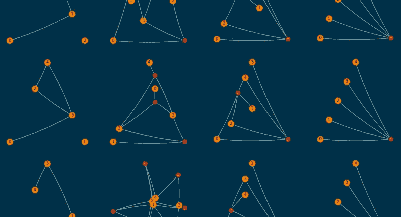
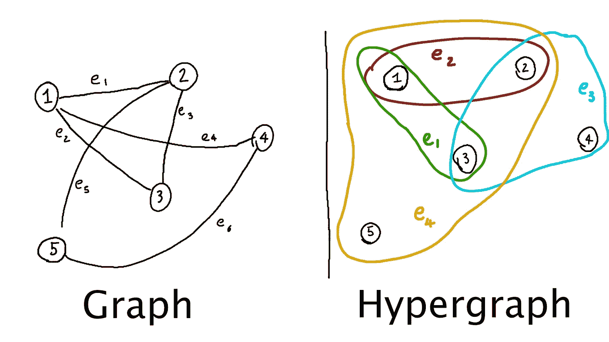
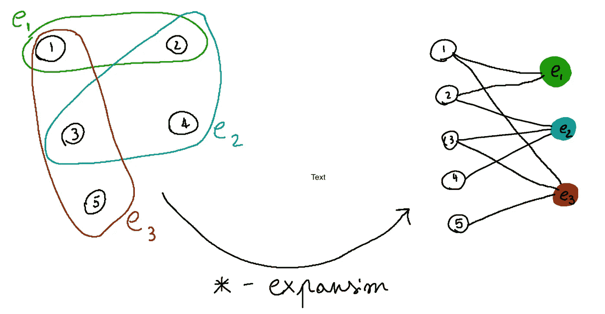
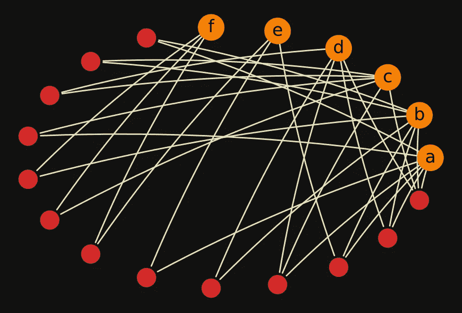
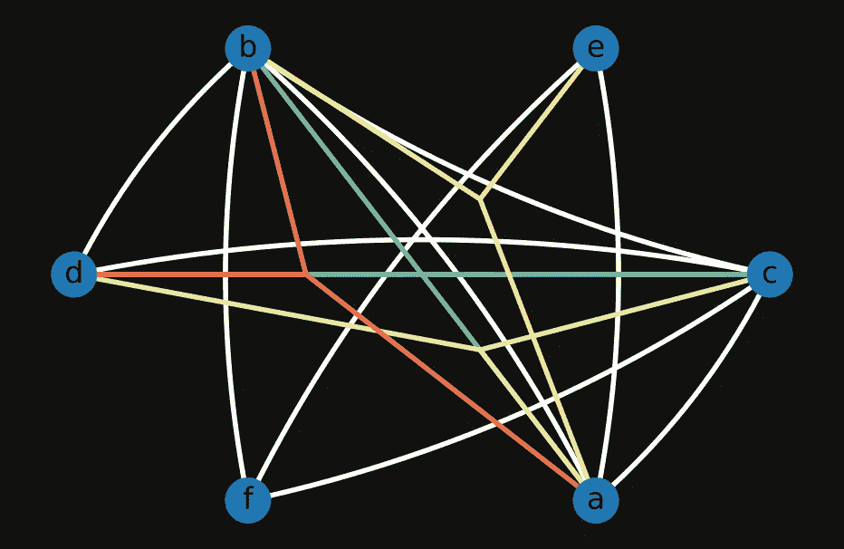
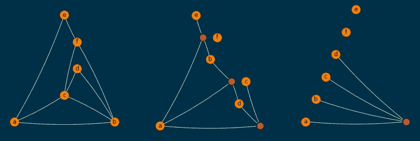
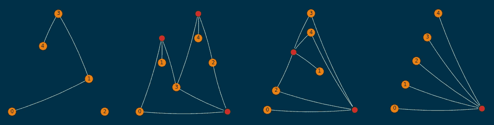
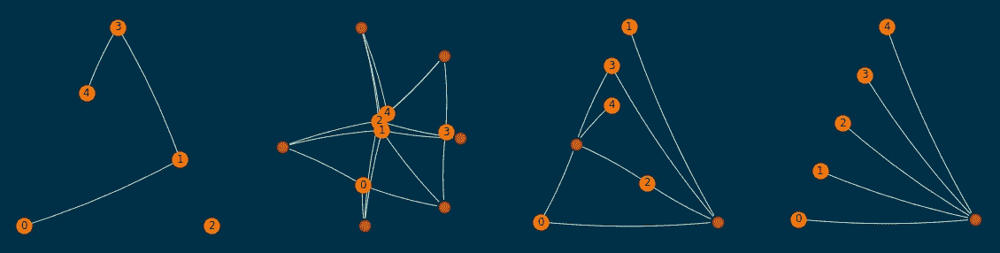
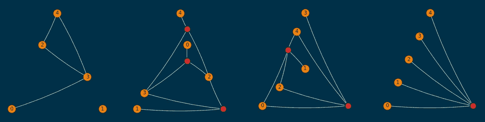

# 如何用 Python 和 networkx 可视化超图——简单的方法

> 原文：<https://towardsdatascience.com/how-to-visualize-hypergraphs-with-python-and-networkx-the-easy-way-4fe7babdf9ae?source=collection_archive---------18----------------------->

## [实践教程](https://towardsdatascience.com/tagged/hands-on-tutorials)

## 一种通过标准图形可视化库绘制超图的简单方法。



本文所述程序的最终结果——图片由作者提供

图很牛逼，超图超牛逼！超图是图的一种推广，它放宽了边只连接两个节点的要求，允许边连接多个节点。它们是一个非常自然的框架，在这个框架中，从遗传学到社会科学、物理学等等，在广泛的领域中制定和解决问题！但是尽管有很多成熟的 Python 库来处理和可视化图形，超图却不是这样。



图形与超图——作者图片

我最近需要可视化一些超图，但找不到任何令我满意的库；此外，据我所见，他们都是通过欧拉图来表示超图的(例如，就像上面手绘的超图)。不幸的是，这种方法并没有为我的用例产生好的图形；我最终做的是将一个超图表示为一组图形，并通过令人敬畏的`networkx`库绘制它们。

我决定写下我绘制超图的方法，因为它为我最近正在查看的数据类型生成了非常有趣的图(本质上是 [Ising 模型](https://en.wikipedia.org/wiki/Ising_model)，但也包含许多身体交互)，并且，经过一些调整，它可能对其他努力完成超图可视化任务的人有一些帮助。

# 最初的想法和尝试

我们将从用 Python 表示一个 hypergraph 开始，代码如下:

注意，这只是一个非常基本的方法，因为边应该是 Python `frozenset`的，这样它们的集合也可以是`set`，节点集也应该是`frozenset`或`set`。如果我们开发一个超图算法库，一个更好的模式会对我们有很大帮助，但是在这篇文章中，为了简单起见，我决定保留上面的简单模式。

首先，我们可以注意到，任何超图都可以通过所谓的星形扩展转换成图，即，我们创建一个新的图，其节点集是原始超图的节点和边，边由原始超图中的关联关系给出(如果节点 n 是超图中边 e 的一部分，则在新的图中 n 和 e 之间应该有一条边)。

这远没有听起来那么复杂，如下图所示:



超图的星形展开——作者图片

在许多应用程序中，绘制超图的星形展开图可能就足够了。例如，`test_hypergraph`(如上定义)的星形展开看起来如下



test_hypergraph 的星形展开—作者图片

通过进行一些编辑，例如只扩展连接三个或更多节点的边，并为额外的节点选择不同的布局，也可以像这样绘制`test_hypergraph`:



改进的 test_hypergraph 图——作者图片

例如，在上面的图中，我们可以从连接`a`、`b`和`d`的三条红线中看到边缘`(a,b,d)`。

虽然由部分星形扩展引起的更少的额外节点使得第二个图稍微更可读，但是上面的两个图仍然非常不令人满意。我对这些可视化的主要问题(以及我在试验这个主题时产生的类似问题)如下:

1.  一幅图像上有太多的信息，以及太多的重叠线条；这使得情节难以阅读，并可能毫无用处。
2.  人们可以选择用来绘制图形的嵌入可以极大地帮助理解图形本身的结构；通过进行星型扩展，这种情况通常不再存在，因为节点与超边缘混杂在一起。

解决#2 是非常具有挑战性的，并且很可能严重依赖于你想要可视化的那种超图。我发现了一个策略，它很好地解决了第一个问题，如果按照基数分割超图的边是有意义的，我将在下面解释我的方法。

# 将一个超图分解成许多图

关键的想法是，我们将按照超图包含的节点数量来分解超图的边，这种方式完全类似于物理学家所说的 2 体相互作用、3 体相互作用等等，并分别绘制超图的这些不同的“组件”。

为了按照边的基数分解超图的边集(假设一个类似于我们在上面的`test_hypergraph`中使用的模式),我们可以写

例如，`test_hypergraph`的`decomposed_edges`字典如下所示

```
{
  2: [('a', 'b'), ('b', 'c'), ('c', 'd'), ('a', 'c'),
      ('b', 'f'), ('f', 'c'), ('e', 'f'), ('a', 'e'),
      ('b', 'd')],
  3: [('a', 'c', 'd'), ('a', 'b', 'e'), ('a', 'b', 'd')],
  4: [('a', 'b', 'c', 'd')]
}
```

那么接下来，我们可以尝试为每个边序 I 绘制由原始图的节点集给定的超图的星形展开，连同边集`decomposed_edges[i]`(除了 i = 2，这里我们将只绘制图而不进行星形展开)，看看它看起来像什么。实现这一点的代码如下:

将`plot_hypergraph_components`函数应用于`test_hypergraph`会产生以下图形:



test_hypergraph 的最终结果—作者提供的图片

这个脚本应该很简单，但如果你想进一步澄清什么，请告诉我。我不得不做出的一个奇怪的选择是让`g`成为`networkx.DiGraph`，因为如果`g`改为`networkx.Graph`，我就不能通过`connectionstyle`的参数画出曲线。

事实上，红色的节点(通过星际扩张获得的额外节点)在每个子情节中都有相同的顺序，这使得这个情节非常容易阅读。它仍然不完美，但可以说比我们早期的尝试可读性更好。例如，从最右边的子图可以明显看出，4 阶只有一条边，它是`(a,b,c,d)`，从中间的子图可以很容易地看出，3 阶仅有的边是`(a,b,e)`、`(a,b,d)`和`(a,c,d)`。

# 随机超图的其他例子

我们还可以通过从一组节点开始并在它们之间随机添加边来生成一些随机超图，直到我们达到指定的数量，即，

其中一个示例(`order=5`和`size=10`)如下所示:根据经验，我发现它们足够易读，即使是在平面布局无法实现的情况下。



通过`plot_hypergraph_components` 功能可视化的随机超图——作者图片

# 结论

上述程序对通过`networkx`绘制超图很有帮助。特别是在量子物理、统计力学等超边的顺序很重要的环境中，这可能是一个有用的可视化。

所提出的方案的缺点可能是，在每个子情节中，节点的位置通常可以变化；这可以通过任意修改`plot_hypergraph_components`代码中的`pos`参数来轻松解决，但是特定于问题的属性可能有助于做出有意义的选择。

如果你做到了这一步，感谢你的阅读:-)