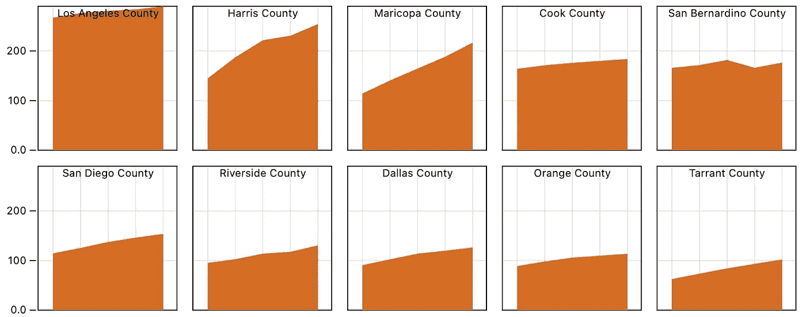
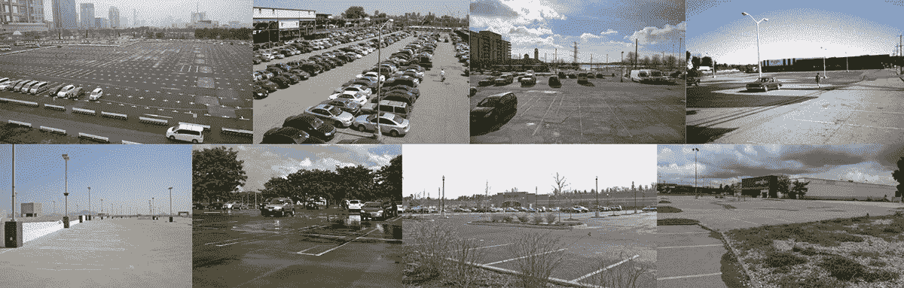
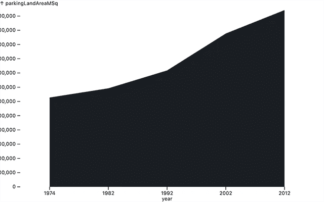
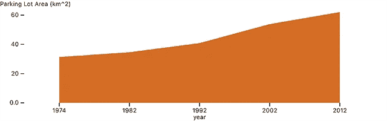
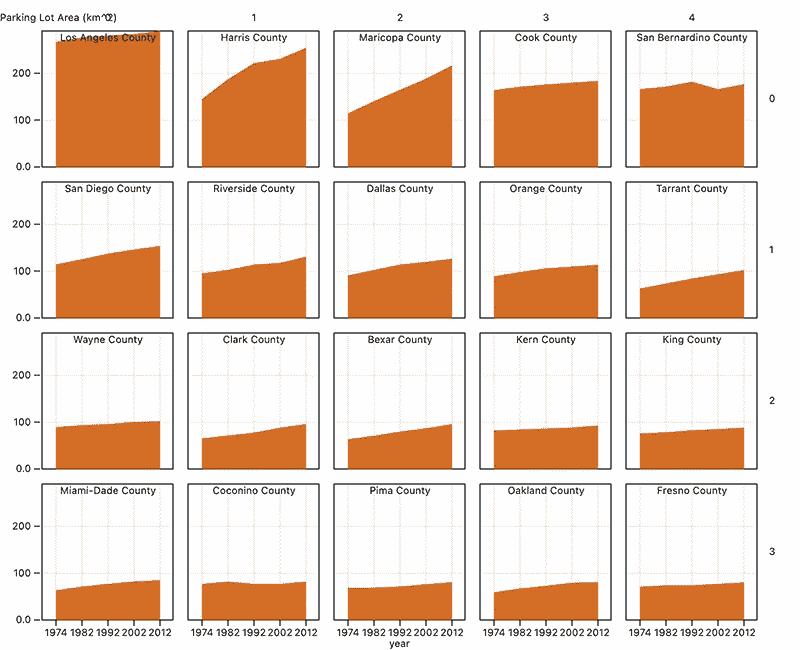

# 如何:使用可观察的绘图可视化“小倍数”图表

> 原文：<https://towardsdatascience.com/how-to-visualize-small-multiples-charts-with-observable-plot-d13b9730eb74?source=collection_archive---------35----------------------->

## 关于可观察的地块(和停车场)，我们能了解到什么？

显示美国各县停车场面积的图表。

让我们探索两件事:

1.  Observable 的新绘图库用于快速数据可视化和探索性数据分析。
2.  停车蔓延这个小问题。

[可观察剧情](https://observablehq.com/@observablehq/plot)是 ***伟大*** 的几个原因:

*   制作“足够好”的图表和图形是超级快速且相对不需要动脑的。如果您需要一些新奇的东西，d3 仍然是一个合理的选择，但是对于基本的条形图、折线图、分布图等。，它以最小的忙乱完成了这个任务。
*   该 API 直观、简洁，并且使用了大多数 d3 数据可视化开发人员依赖的定制 dataviz 的惯例。
*   我们将在这里探讨的分面概念，可以很容易地将同一数据集的许多不同维度并行可视化为多个小图表。

停车场最差*的几个原因:*

*   *车祸。20%的车祸发生在停车场(每年导致 6 万人受伤， [src](https://www.cbsnews.com/news/parking-lot-accidents-distracted-drivers-national-safety-council/) )。*
*   *房价。停车多→住房少。在纽约市，最低停车要求提高 10%会导致住房密度降低 6%。*
*   *污染。停车多→汽车尾气多( [src](https://www.scientificamerican.com/article/reducing-parking-cut-auto-emission/) )。*
*   *它们太丑了。*

**

*丑陋停车场拼贴(鸣谢:各种)*

# *停车数据集的土地使用*

*让我们从一个数据集开始。请注意，Plot 是根据“整齐的数据”构建的，这是它干净和表格化的另一种说法。可观察的定义:*

*   *每个变量都必须有自己的列。*
*   *每个观察必须有自己的行。*
*   *每个值必须有自己的单元格。*

*所以我在这里整理了一个县停车区数据集[。它结合了这项研究的结果，该研究模拟了美国的停车场土地使用和美国人口普查国家县地名索引文件，该文件有关于县的基本事实，如人口规模和土地面积。它大约有 16k 行，每行有 6 个字段:](https://gist.githubusercontent.com/elibryan/0bc177106babf67c1bf446d81fc6e5c9)*

*   *`geoid`:FIPS 州+县的县代码*
*   *`countyName`:一个人可读的县名*
*   *`landAreaMSq`:土地面积平方米*
*   *`parkingLandAreaMSq`:停车场用地面积，平方米*
*   *`year`:与停车场测算相关联的年份。*

*我们可以通过以下方式提取数据:*

*那我们来做一些图表吧！*

# *单个城市的停车场分布有多少？*

## *可观察图中的简单面积图*

*让我们从简单的开始，只看一个城市的增长。比如说北卡罗来纳州的罗利。*

*首先，让我们只取出与 Raleigh 相关的行:*

*然后我们将创建一个简单的面积图，只显示 Raleigh 时间序列。*

**

*我们从下面的片段中得到上面的图:*

*这大致可以解释为“给定这些整洁的数据，给我一个合理的面积图，其中 X 是“年份”字段，Y 是“停车场面积”。当然，结果很难看，但这是一个简单明了的函数调用。*

*这引入了 Plot 的“标记”概念在这种情况下,“标记”是描述数据的任何可视编码的抽象术语。Plot 为所有您喜欢的数据可视化提供内置标记(例如，条形、线条、点、区域等)。*

**

*我们从下面的片段中得到上面的图表:*

## *结论:*

*   *Plot 给出了(*接近* ) 1-liner 图，用于在 Javascript 中可视化(愚蠢的)数据*
*   *自 1974 年以来，罗利的用于丑陋停车场的面积增加了一倍多*

# *停车场在多个城市中分布有多广？*

## *可观察图中的小倍数图表*

*让我们画出专用于停车场的土地使用面积最大的 20 个县。*

**

*我们从下面的代码片段中获得了上面的图表:*

*我们正在做几件事:*

*   *首先，我们提取停车场面积最大的 20 个县*
*   *然后，我们通过稍微侵入 Plot 的刻面系统来绘制它们*

## *结论:*

*   *洛杉矶县有很多停车场。截至 2012 年，面积为 290 平方公里(111 平方英里)。也就是说，洛杉矶县的停车面积是曼哈顿的 5 倍。*
*   *Plot 的刻面非常适合显示按维度划分的数据集的小倍数图表。*
*   *停车场是最糟糕的。*

*我是谁？不，不，*你是谁？！**

*嗨！我是伊莱·霍德。我的公司 [3iap 帮助客户设计和开发有效的 javascript 数据可视化和定制分析产品](https://3iap.com)。如果你是一名创始人、创客、讲故事者、非营利行善者或商业领袖，正在思考数据、设计和用户心理的交集，我很乐意联系并聆听你的故事。*

*你可以发电子邮件到 eli@3isapattern.com 给我，或者在推特上关注我。*