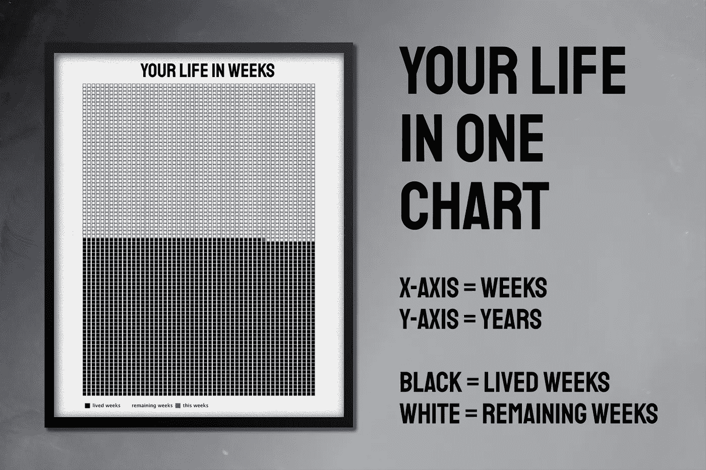
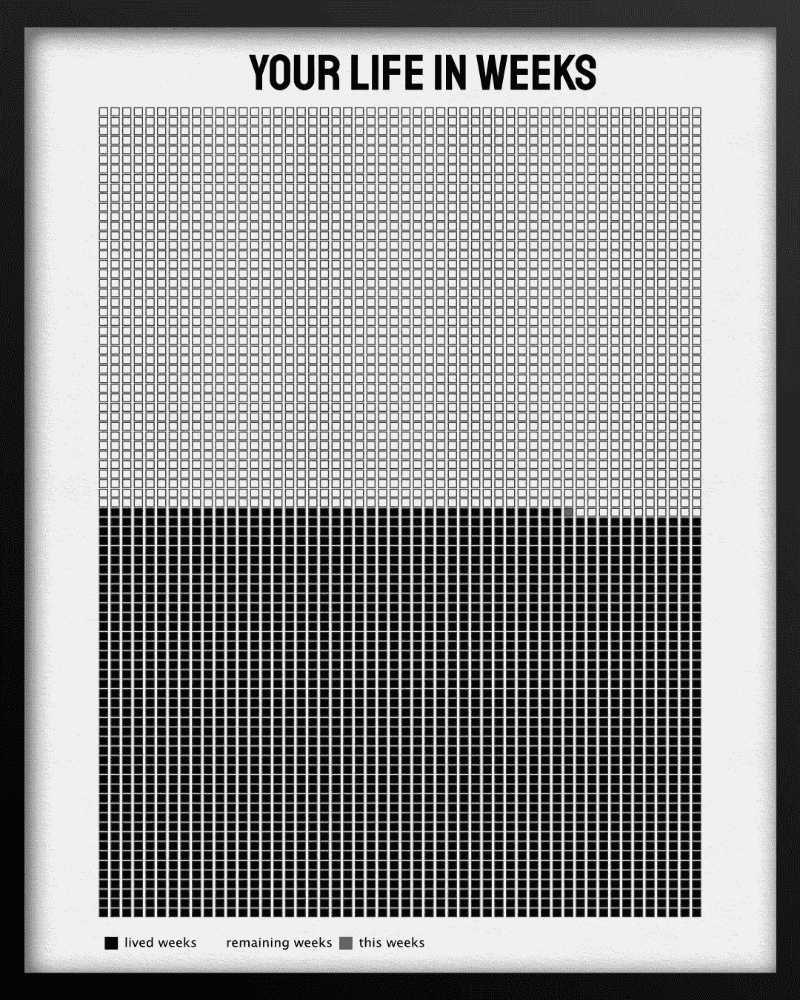
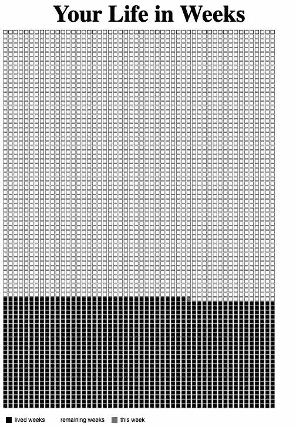

# 如何想象你的余生

> 原文：<https://towardsdatascience.com/how-to-visualize-the-rest-of-your-life-28f943b1f70b?source=collection_archive---------13----------------------->

作者图片

## 教程-PYTHON-ALTAIR

## 一步一步的教程来创建一个数据 Viz 图表与你的生活在几周内使用 Python 和 Altair

# 1.介绍

对于这篇文章，我尽量不要过于哲学化。然而，最近我看到有人展示了一张海报，描绘了他在几周内的生活。过去的所有几周都以黑色显示，而他生命中剩下的几周则以白色显示。这多少引起了我的共鸣。作为数据科学家，我们分析和可视化数据以创建视角，发现隐藏的信息，得出结论，并对新生成的信息采取行动。

我看到的那张海报符合我的所有要求。所以我尝试用 Python 和 Altair 来生成这样的可视化。我主要使用 Altair，因为我想更熟悉它，并使用 ggplot2 和 plotnine 打破我的舒适区。

在下一节中，我将与您分享我的技术设置。在第三部分，我将解释我如何构建这个可视化，以及你如何使用它。最后，我来总结一下这篇文章。

结果可视化，用 Affinity Designer 进一步处理(图片由作者提供)

# 2.设置

如果你想知道我是如何构建我的代码的，它被称为**方法链**或管道(在 R 社区中)。我在我的另一篇文章中解释了[的基础知识。](/the-flawless-pipes-of-python-pandas-30f3ee4dffc2)

您可能知道，我使用 R 开始了我的数据科学职业生涯[，因此，我非常熟悉](/nine-years-on-linkedin-in-data-b34047c77223) [ggpot2](https://gscheithauer.medium.com/how-to-add-number-of-observations-to-a-ggplot2-boxplot-b22710f7ef80) 。随着我在客户项目中越来越频繁地使用 Python，我开始寻找类似的 Python 可视化包。我很高兴地说，有了 [Plotnine](/data-visualization-in-python-like-in-rs-ggplot2-bc62f8debbf5) 就有了一个极好的选择。

然而，由于我喜欢尝试新事物，特别是可视化软件包，我想尝试一下 [**Altair 软件包**](https://altair-viz.github.io/) 。Altair 是一个 Python 数据可视化包，它遵循一种[声明式方法](https://codeburst.io/declarative-vs-imperative-programming-a8a7c93d9ad2)，就像 ggplot2 和 [Plotnine](/data-visualization-in-python-like-in-rs-ggplot2-bc62f8debbf5) 一样。

# 4.创建可视化

首先，我们需要了解你一点。当然，那是你的预期寿命。还有你的生日。

然后我创建三个日期对象。一个是当前日期，你出生的那一天，最后是死亡的那一天。

接下来，下一个代码计算从你出生到现在的天数，以及从现在到死亡的天数。基于这些天的变量，我计算年和周。

最后，我创建了三个数据框来保存每周的信息，不管是已经过去的一周、当前的一周还是未来的一周。我承认，这可能不是创建数据的最优雅的方式。如果你有更高效的方法，欢迎分享。谢谢你。

最后，我创建图表。我使用了 Altair 的 [mark_square](https://altair-viz.github.io/user_guide/marks.html) 功能。我还把两个[标记方块](https://altair-viz.github.io/user_guide/marks.html)放在彼此的上面，以便创建一个黑色边框的效果。否则我无法创建它。

最后，我配置标题并保存图表。

如果您想应用您的预期寿命和您的出生日期，您只需要在代码的开头更改这些变量。

可视化结果(图片由作者提供)

# 5.结论

在这篇文章中，我向你展示了如何创建一个可视化来显示你的生活周。我解释了如何使用 Python 和 Altair 来实现这一点，以及如何基于数据生成可视化。

如果你觉得这篇文章有帮助，请告诉我。此外，如果您能分享任何关于如何改进此解决方案的想法，我将不胜感激。谢谢大家！