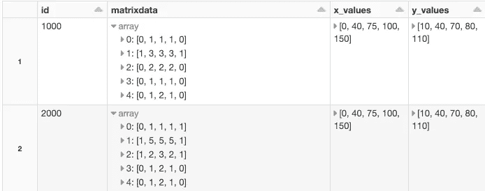
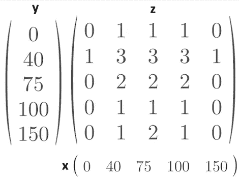
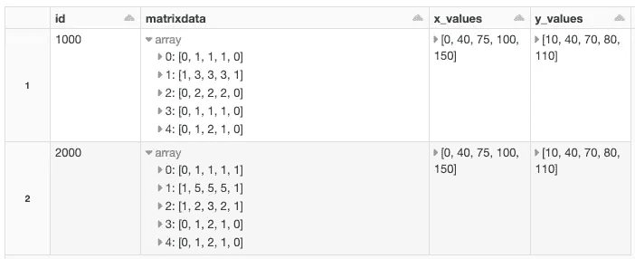
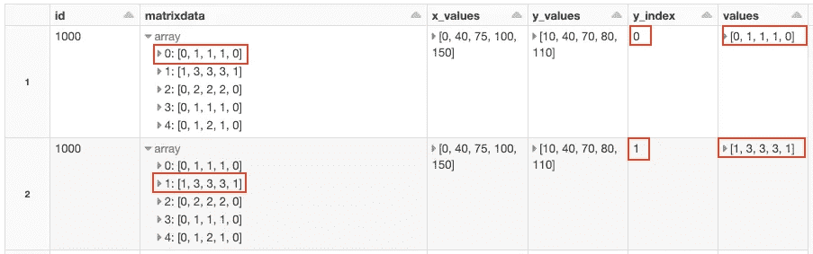
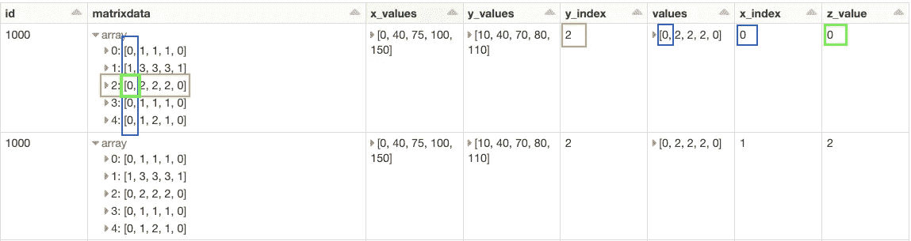
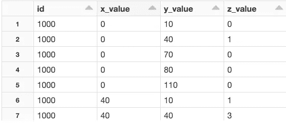
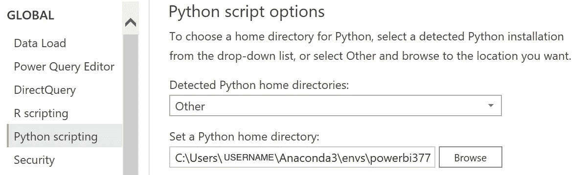
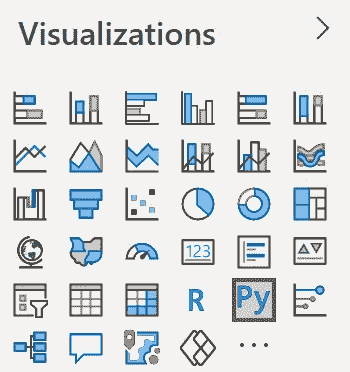
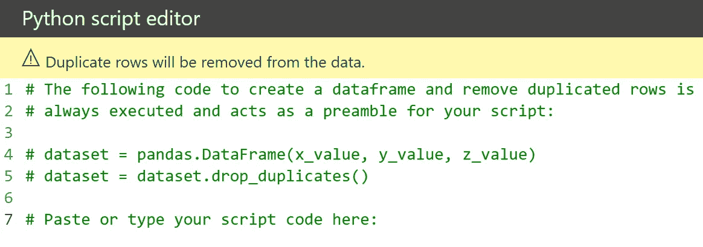
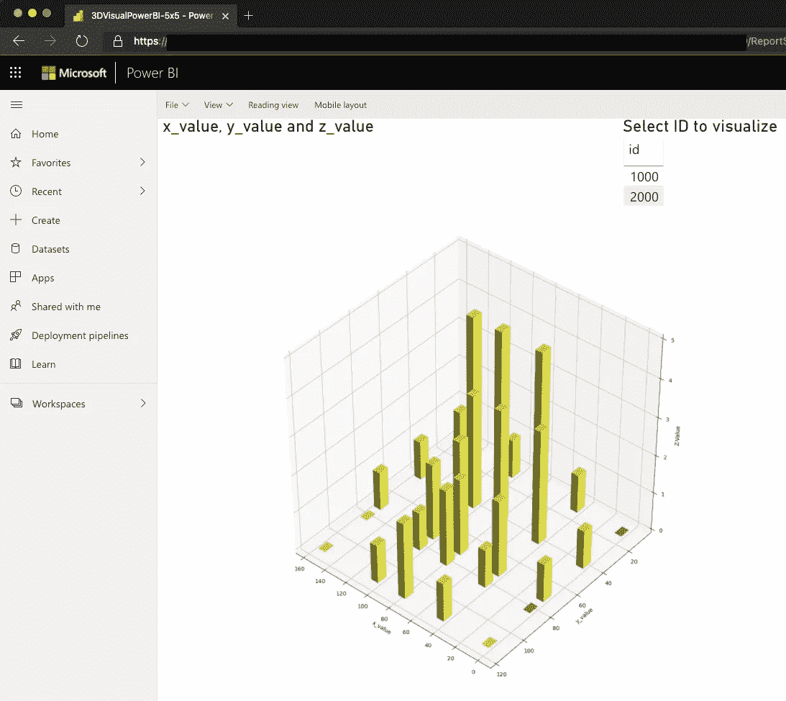

# 如何使用 Spark 和 Power BI 以 3d 方式可视化您的嵌套物联网数据

> 原文：<https://towardsdatascience.com/how-to-visualize-your-nested-iot-data-in-3d-using-spark-and-power-bi-5a2be7c18e7f?source=collection_archive---------30----------------------->

## 使用 Azure Databricks、Spark、Python 和 Power BI python 脚本可视化


作者图片

# A.介绍

时不时地，你会遇到新的独特问题需要解决。这一次是客户端获取嵌套的物联网数据。存储和可视化物联网数据通常是一项标准任务，但将嵌套的物联网数据作为每条消息的“矩阵”以及相应的向量并不像通常那样简单。

在这篇文章中，我们将学习:

*   如何以可扩展的方式转换嵌套的物联网数据
*   如何在 Power BI 中创建定制的 python 可视化
*   非技术最终用户如何通过 web 浏览器消费和可视化数据

我们将使用 Spark、Python 和 Power BI 通过一些简单的步骤来解决我们的问题。

# B.数据结构

首先，让我们看看来自物联网设备的数据是什么样的:



spark 数据帧中的物联网数据结构示例。图片作者。

在上图中，我们可以看到物联网数据的一个子集，我们将重点解决每个消息/行的“矩阵”类型数据的具体问题。物联网数据包含许多标准类型的其他列，但在本文中我们将只研究如何处理复杂类型。

“矩阵”中的每个位置和值都连接到特定的 x 值和 y 值。见下图。



对于每个 x 和 y 值，都存在一个 z 值。图片作者。

```
z = f(x,y)
1 = f(0,40)
3 = f(40,40)
2 = f(100,75)
```

这是我们从物联网设备获取原始数据的方式。实际上，矩阵要大得多，但是为了简单起见，我们在这里使用大小为 5x5 的矩阵。我们将使用的方法也适用于较大的矩阵。

对于 x 和 y 的每个组合，我们都有一个 z 值。我们的任务是转换数据，以便可以在 Power BI 中使用和可视化。BI-tools 无法使用我们从物联网设备接收的压缩形式的原始数据。BI-tools 通常需要表格数据。因此，我们希望创建一个如下所示的常规表:

```
[id ][X-value] [y-value] [z-value] [any meta-data-column(s)]
1000    0        10         0            meta-data
1000   20        30         2            meta-data
... 
```

# C.转换数据

我们希望转换原始源数据，其中每一行都包含:

*   z 值的矩阵
*   x 值的数组
*   y 值数组

放入由唯一行组成的常规表中，这些行构成了数据的所有可能组合。

## C0。关于火花的一个注记

在本例中，我们将使用有限的数据。在生产环境中，我们通常有数 TB 的数据，因此我们希望使用一种可随传入的物联网数据扩展的技术。因此，我们将看看如何使用 Spark 来解决这个问题。

我们将使用 [Azure Databricks](https://azure.microsoft.com/en-us/services/databricks/) 和 Spark 来转换数据。我们将在 Spark 数据框架中保存数据。从上面我们可以看到，矩阵是作为 Spark 数据帧中的数组存储的。

## C1。生成测试数据

让我们生成一些测试数据来使用。

这给了我们一个火花数据帧，看起来像这样:



用物联网数据火花数据框。图片作者。

我们以如上所述的 Z = f(x，y)的紧凑形式获得物联网数据，但 Power BI 不理解这种形式，因此我们需要创建一个常规的数据表。Spark 有内置的功能来帮助我们。在这种情况下，我们追求的功能是:

```
posexplode(col)
```

简而言之, *posexplode* 将创建一个包含展开数据的新列以及我们选择展开的列的附加行。此外，我们将获得一个额外的列，其中包含原始数据结构中分解的位置/索引。在这里看文件[。](https://spark.apache.org/docs/latest/api/python/pyspark.sql.html?highlight=explode#pyspark.sql.functions.posexplode)

我们需要将“矩阵”的每一个值放在它自己的行上，并带有 x 和 y 坐标的索引，这样我们就可以将正确的 z 值与正确的 x 和 y 值匹配起来。



我们将每个数组分解成一个名为“值”的新列。我们也存储索引。图片作者。

正如我们在上面第一个 posexplode 的显示中看到的，我们已经在一个名为“values”的新列中展开了列“matrixdata”的第一个数组。我们还将从“矩阵”的哪一行展开的数据存储在名为“y_index”的列中。我保留了“matrixdata”列，以便更容易理解，尽管从技术上讲我们不再需要这个列了。

接下来，我们需要对结果值进行位置分解:



展开值列的 posexplode。保留 x_index。图片作者。

所以，最后我们用 x_index 和 y_index 得到 z_value。最后一部分是将 x_index 与 x_values 列中的相同索引相匹配，将 y_index 与 y_values 列中的相同索引相匹配。



功率 BI 中消耗的最终表。图片作者。

现在，我们有了一个包含数据的常规表，可以由 Power BI 使用。

# D.导出数据

## D0。导出到数据湖

让我们将数据作为 CSV 文件导出到我们的存储帐户。我们将使用 Pandas 将 Spark 数据帧导出到一个命名的 CSV。对于大量的数据，我们将直接使用 Spark。变量 *path_export* 在我们的数据湖中保存挂载的路径。稍后我们将从 Power BI 加载 CSV 文件。

当我们使用[单节点库](https://docs.databricks.com/data/databricks-file-system.html#local-file-apis)和本地文件 API 时，我们需要在挂载路径前面加上/dbfs/

## D1。替代本地出口

如果我们没有数据湖帐户，出于测试目的，我们可以将 CSV 导出到我们的本地计算机，并将 CSV 从本地文件导入到 Power BI。Azure Databricks 附带了一个 DBFS 文件系统，包含在每个工作区中。我们可以将 CSV 导出到 DBFS，并使用 Databricks CLI 从 DBFS 文件系统下载 CSV 文件。参见[此处](https://docs.microsoft.com/en-us/azure/databricks/dev-tools/cli/)如何安装 Databricks CLI。然后，我们可以使用 CLI 命令将文件下载到本地计算机，如下所示:

```
# Usage: databricks fs cp [OPTIONS] SRC DSTdatabricks fs cp dbfs:/path_we_exported_to/heatmap_from_spark.csv destinationpath
```

之后，我们可以[将 CSV 文件](https://docs.microsoft.com/en-us/power-bi/connect-data/desktop-connect-csv)加载到 Power BI 桌面。

## D2。关于熊猫的笔记

我们没有任何“大数据”矩阵和数组，所以我们允许使用 Pandas 将我们的 Spark 数据帧导出为一个命名的 CSV。我们可以以可伸缩的方式直接从 spark 导出 CSV 格式的数据，但是我们会得到以 Spark 命名的 CSV 文件，这需要在 Power BI 中加载数据之前做一些额外的工作。所以我们选择在这里使用熊猫，因为它满足了我们的需求。此外，如果我们有大量的数据，我们不会导出 CSV 格式的数据。在这种情况下，我们可以通过从 Power BI 到 Databricks 的直接查询来直接使用数据。(Databricks 和微软已经优化了 Power BI 和 Databricks 之间的连接，因此现在的性能比以前好得多。此外，通过 [SSO](https://docs.microsoft.com/en-us/azure/databricks/integrations/bi/power-bi#access-azure-databricks-using-the-power-bi-service) 的穿越认证也是支持的，但这超出了本文的范围。)

# E.电力商业智能中的可视化

我们现在有了表格形式的数据，并希望在 Power BI 中可视化这些数据。我们可以直接从 Power BI 的 Data Lake Gen 2 帐户加载数据。然后，我们可以使用内置的可视化工具或下载额外的插件来可视化数据。在这个例子中，我们将使用 Power BI 中的 python 脚本可视化。这允许我们使用 Python 以我们想要的方式创建一个自定义的可视化。

## E0。让 python 可视化在 Power BI 中工作

从 Power BI 内部使用 python 的想法很简单。我们将一个熊猫数据帧放入我们的脚本，然后我们可以使用选定的 python 库来可视化我们的数据。还可以将我们的报告与 python 可视化一起发布到 Power BI 服务在线。

设置 Power BI desktop 以使用 python 视觉效果:

*   1.只有在您使用非 Windows 计算机(如 MAC 或 Linux)时，才需要这一步。在虚拟机上安装 Windows 或确保您能够访问 Windows 安装，因为 Power BI desktop 需要 Windows。
*   2.如果需要，安装 Power BI desktop。可以从微软商店安装[。](https://powerbi.microsoft.com/en-us/downloads/)
*   3.确保您拥有符合 Power BI python 需求的正确 python 环境。这里列出了 python 版本和支持的软件包版本:[https://docs . Microsoft . com/en-us/power-bi/connect-data/service-python-packages-support](https://docs.microsoft.com/en-us/power-bi/connect-data/service-python-packages-support)
    在 VM 上设置 Python 时(我是在使用 MAC 时设置的),我注意到 NumPy 和 Windows 10 的一个[问题](https://developercommunity.visualstudio.com/content/problem/1207405/fmod-after-an-update-to-windows-2004-is-causing-a.html),它迫使我使用 32 位版本的 Python，作为一种解决方法，让它工作。
*   4.使用上面链接中推荐的版本，并使用 [anaconda](https://www.anaconda.com/) 创建 python 环境。

```
conda create —name powerbi377 python=3.7.7
activate powerbi377
pip install pandas==1.0.1
pip install matplotlib==3.2.1
```

*   5.将 Power BI 指向我们的 python 环境。
    启动电源 BI。
    选择文件- >选项和设置- >选项- > Python 脚本
    设置我们创建的 anaconda 环境的路径。



设置 Power BI python 主目录。图片作者。

```
Detected home directories: OtherSet Python Home Directory: C:\Users\YOURUSERNAME\Anaconda3\envs\powerbi377
```

现在，我们已经准备好在 Power BI 中进行一些 python 编码，只需简单地删除 python 可视化:



Power BI 中内置的 python visual。图片作者。

到画布上。您将获得一个脚本编辑器，其中的数据是一个名为 dataset 的熊猫数据帧。您决定使用表中的哪些字段。在我们的例子中，我们将 x 值、y 值和 z 值放到画布 Py-script 上。



我们用我们选择的列得到一个熊猫数据框架。图片作者。

现在，我们可以使用 python 和 [Matplotlib](https://matplotlib.org/) 来可视化我们的数据。下面是一个将我们的数据绘制成 bar3d 可视化的例子，但是你可以选择你喜欢的可视化。

我们在 Power BI 桌面客户端中使用，但是我们希望最终用户能够在浏览器中在线使用数据。为此，我们可以[向 Power BI 服务发布](https://docs.microsoft.com/en-us/power-bi/create-reports/desktop-upload-desktop-files)我们的报告，并让我们的最终用户在浏览器中使用该报告:



使用 Power BI 服务发布浏览器内 python 脚本可视化。图片作者。

# E.结论

当我们拥有物联网数据的嵌套结构时，我们可以使用内置的 Spark 可扩展转换来获得我们需要的数据。

我们可以在 Power BI 中使用转换后的数据，方法是将数据导出到一个数据湖中，然后加载到 Power BI 中，或者使用直接查询。

如果我们希望在 Power BI 中以内置可视化或第三方扩展不支持的方式可视化我们的数据，我们可以使用 python 脚本可视化来可视化我们的数据。

我们需要仔细设置我们的 python 环境，以匹配 Power BI 服务中支持的版本。

我们可以将我们的自定义 python 可视化发布到 Power BI 服务并与其他人共享，这样他们就可以使用 web 浏览器在线使用这些报告。

一个笔记本(。ipynb)与上面的源代码可以在这里找到[。](https://github.com/blendax/Databricksnotebooks/blob/master/notebooks/Blog%20IoT%20Matrix%20Matrices%20Posexplode%20explode.ipynb)