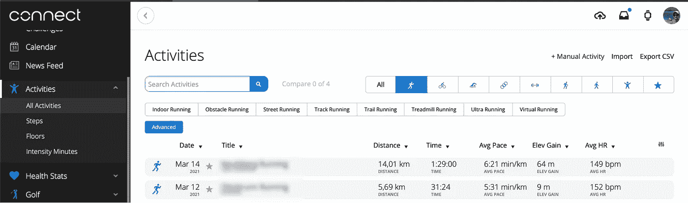
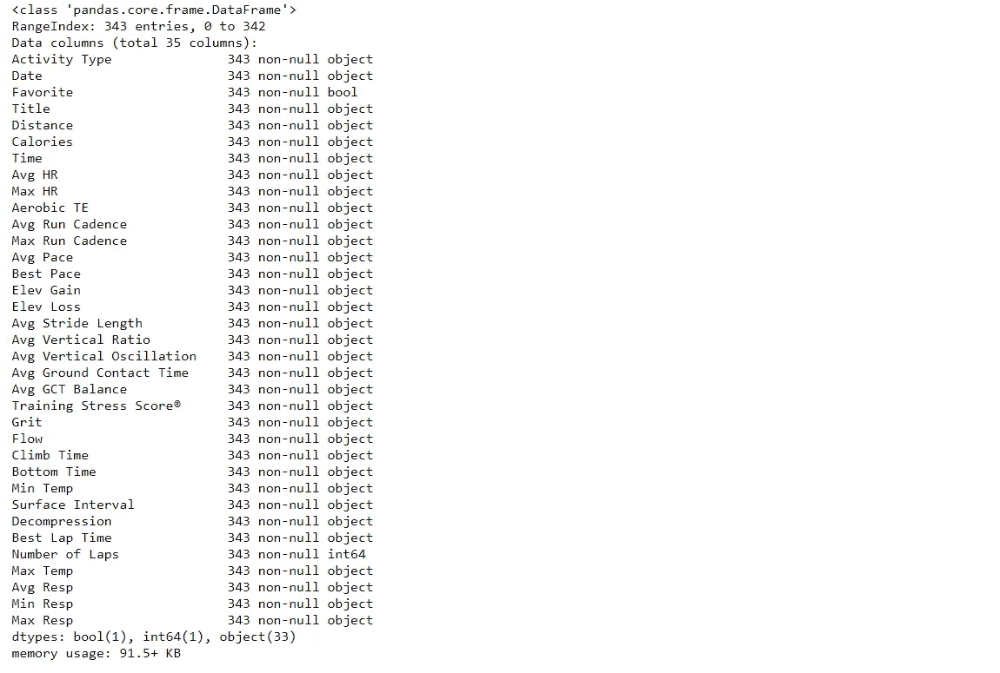
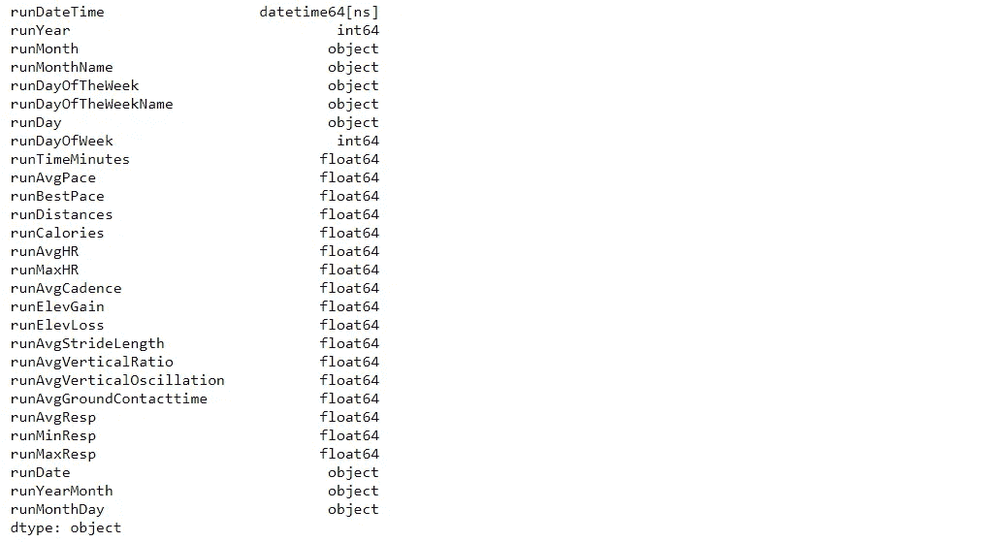
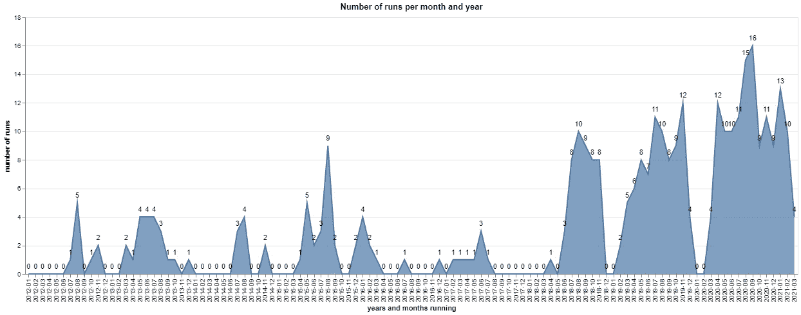
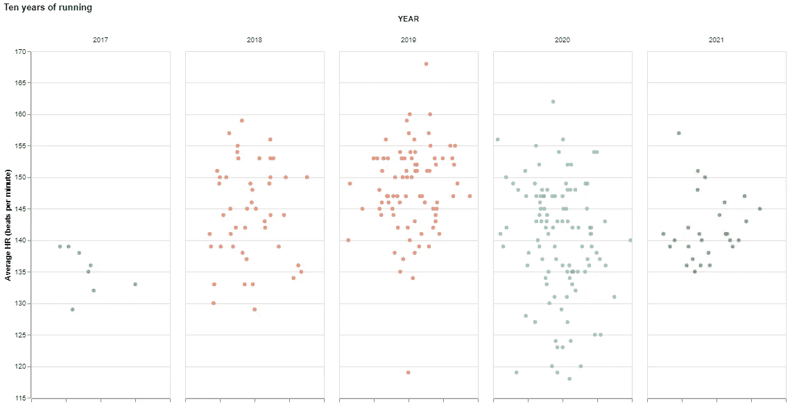
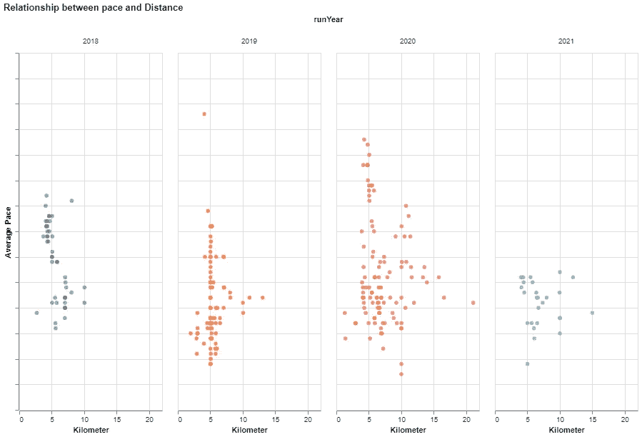

# 如何用 Python 和 Altair 可视化你的跑步者的 High

> 原文：<https://towardsdatascience.com/how-to-visualize-your-runners-high-with-python-and-altair-45dde7803141?source=collection_archive---------19----------------------->

[布鲁诺·纳西门托](https://unsplash.com/@bruno_nascimento?utm_source=medium&utm_medium=referral)在 [Unsplash](https://unsplash.com?utm_source=medium&utm_medium=referral) 上拍照；作者略有改动

## 教程 PYTHON 运行

## 使用 Python 和 Altair 检索和可视化运行数据的分步指南

## 1.介绍

大家好，我是 Gregor，一名数据科学家，一名充满激情的非竞赛跑步者。我才知道，十年前我就开始在手机上用跑步 app 了。那时候，我只记录 GPS，开始和结束时间。我没有办法记录节奏、心率、海拔等等。我记得我是一个糟糕的跑步者——跑得慢而且容易上气不接下气。我刚完成博士学位，在办公桌前工作太多了。所以我决定以跑步者的身份开始这段旅程。

十年是一段很长的时间，我想知道在这段时间里我的跑步发生了什么变化。我变得更健康、更快或更冷静了吗？我在哪一级训练？虽然大多数健身平台提供了一些报告，但我在过去的 10 年里错过了这些报告。尤其是我对同比比较感兴趣。

在本文中，我将向您展示(1)如何从 [Garmin](https://medium.com/u/3a39196977e6?source=post_page-----45dde7803141--------------------------------) [connect](https://connect.garmin.com/modern/) 中导出您的运行数据，(2)如何使用 Python [Pandas](/the-flawless-pipes-of-python-pandas-30f3ee4dffc2) 清理数据，以及(3)如何使用 [Altair](https://altair-viz.github.io/index.html) 可视化数据。

## 2.从 Garmin Connect 导出数据

首先，前往 [Garmin Connect](https://connect.garmin.com/modern) ，特别是[“所有活动”页面](https://connect.garmin.com/modern/activities)。最好通过点击右上角的跑步图标来过滤你的跑步活动。

Garmin Connect 活动页面；作者图片

**在您点击**导出按钮之前，向下滚动您的跑步活动列表很重要。只能导出列表中显示的那些活动。完成后，按右上角的“导出 CSV”按钮。这将把文件`Activities.csv`下载到您的计算机系统上。数据包括日期、距离、步速、心率、海拔等信息。

## 3.使用 Python Pandas 清理数据

数据相当干净，我们只需要关注以下几个方面:

1.  将日期信息转换成各种有用的功能
2.  将配速信息转换为分钟数
3.  将数字转换成数字类型
4.  处理缺失值

下面你会发现我用来实现这一点的代码。如果你想了解更多关于日志记录的知识，我推荐这篇文章:“[如何为 Python](/how-to-setup-logging-for-your-python-notebooks-in-under-2-minutes-2a7ac88d723d) 设置日志记录”，如果你想了解更多关于我编写代码的方式，请考虑阅读“[Python 的完美管道](/the-flawless-pipes-of-python-pandas-30f3ee4dffc2)”。

runs_raw.info()的输出；作者图片

请注意，我使用函数`assign()`来创建额外的变量。这样做的好处是不会为以后的测试覆盖值，并且您可以为命名列实现自己的命名约定。然而，通过函数`filter(like = "run")`，我删除了所有旧的变量。请参见下面的结果列名。

清洗过程的结果；作者图片

最后一步是将清理后的数据保存到系统中。

## 4.用 Altair 实现数据可视化

您可能知道，我使用 R 开始了我的数据科学生涯[，因此，我非常熟悉](/nine-years-on-linkedin-in-data-b34047c77223) [ggpot2](https://gscheithauer.medium.com/how-to-add-number-of-observations-to-a-ggplot2-boxplot-b22710f7ef80) 。随着我在客户项目中越来越频繁地使用 Python，我开始寻找类似的 Python 可视化包。我很高兴地说，有了[剧情](/data-visualization-in-python-like-in-rs-ggplot2-bc62f8debbf5)就有了一个很好的替代方案。

 [## Python 中的数据可视化，如 R 的 ggplot2

### 一步一步的教程如何创建一个基本的图表到一个出版就绪的 dataviz 图表

towardsdatascience.com](/data-visualization-in-python-like-in-rs-ggplot2-bc62f8debbf5) 

然而，由于我喜欢尝试新事物，特别是可视化软件包，所以我想尝试 Altair 软件包。Altair 是一个 Python 数据可视化包，它遵循一种[声明式方法](https://codeburst.io/declarative-vs-imperative-programming-a8a7c93d9ad2)，就像 ggplot2 和 [Plotnine](/data-visualization-in-python-like-in-rs-ggplot2-bc62f8debbf5) 一样。

请跟随接下来的段落，在那里我评估我的一些运行数据。也许你可以学到一些如何使用 Altair 的知识。

**设置**

过去十年(105 个月)我跑了多少？

每年运行次数；作者图片

每月运行次数；作者图片

我每年训练的距离是多少？

按年计算的距离；作者图片

**我每年训练的心率是多少？**

每年的平均人力资源；作者图片

**我每年以什么速度跑多少距离？**

每年每段距离的平均配速；作者图片

## 5.结论

在本文中，我向您展示了如何从 Garmin connect 获取您的跑步数据，如何使用 Pandas 清理数据，以及如何使用 Altair 分析数据。

你可能已经观察到了，我的跑步在 2018 年开始变得稍微严重了一点。在那之前，我的工作需要经常出差。一个阻碍我跟上跑步的事实。

对我来说，这次锻炼是值得的，可以对我的跑步数据进行年度比较。这在 Garmin connect 上是不可能实现的。此外，它让我对 Altair 软件包有了更多的了解。因为我更习惯于使用 Plotnine，所以目前我将坚持使用 [Plotnine](/data-visualization-in-python-like-in-rs-ggplot2-bc62f8debbf5) 。但是如果一个项目需要互动图表，我强烈推荐你去看看 Altair。

如有任何问题和意见，请随时联系我。谢谢你。**点击此处查看更多我的文章**:

1.  [了解我如何为媒体设计文章](https://medium.com/technical-excellence/article-pipeline-management-with-notion-app-template-13e83635ed1)
2.  [了解如何为您的 Python 代码设置日志记录](/how-to-setup-logging-for-your-python-notebooks-in-under-2-minutes-2a7ac88d723d)
3.  [了解如何使用链接(或管道)在 Python 中编写干净的代码](https://medium.com/technical-excellence/article-pipeline-management-with-notion-app-template-13e83635ed1)
4.  [学习如何使用 R 分析你的 LinkedIn 数据](/nine-years-on-linkedin-in-data-b34047c77223)
5.  [学习如何使用图形语法在 Python 中以描述性的方式创建图表](/data-visualization-in-python-like-in-rs-ggplot2-bc62f8debbf5)

Gregor Scheithauer 是一名顾问、数据科学家和研究员。他专门研究流程挖掘、业务流程管理和分析。你可以在[**LinkedIn**](https://www.linkedin.com/in/gscheithauer/)[**Twitter**](https://twitter.com/gscheithauer)上和他联系，或者在 [**Medium**](https://gscheithauer.medium.com/) 上这里。谢谢大家！