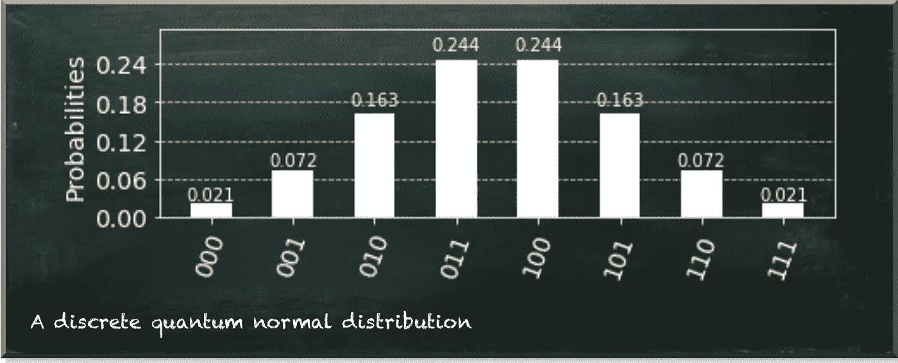
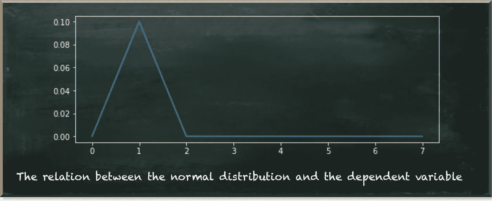
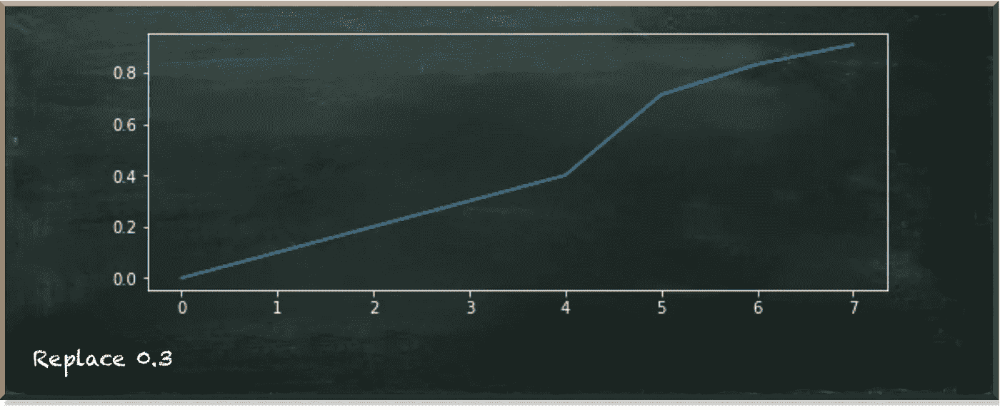
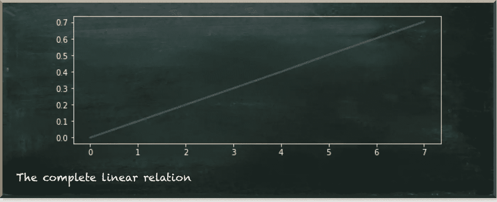
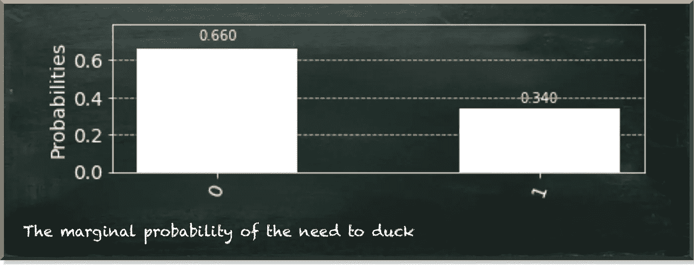

# 如何使用量子正态分布

> 原文：<https://towardsdatascience.com/how-to-work-with-a-quantum-normal-distribution-170ccc4e2da2?source=collection_archive---------30----------------------->

## 量子机器学习实用指南

量子机器学习要不要入门？看看 [**动手量子机器学习用 Python**](https://www.pyqml.com/page?ref=medium_worknormal&dest=/) **。**

如果我想开个玩笑，我会说，“就像你处理经典正态分布一样。”从内容相关的角度来看，我是正确的。正态分布是一种对称的概率分布，接近平均值的数据比远离平均值的数据更有可能出现。量子正态分布也是如此。

当然，在使用任何量子电路时，我们都需要迎合量子位的特殊性。在之前的一篇文章中，我们在量子贝叶斯网络中使用了量子 Multinoulli 分布。由于(离散的)正态分布是一个多对数分布，我可以就此打住。

如果我那样做，我将表明我既不理解正态分布的目的，也不理解量子电路的特性。

先说正态分布。为什么我们首先要使用它？

让我猜猜！你会说我们用它是因为它代表了我们的观察。这是我们做实验时常见的结果。不管我们看的是什么特征，我们几乎可以肯定，这个特征取决于我们实验中无法控制的其他因素。这些因素干扰了实验的结果。我们测量的是特性的实际值加上许多干扰的总和。但是所有这些扰动的大小和方向都不同。一些增加，而另一些减少我们测量的价值。只有当许多扰动共享同一个“方向”时，我们才会看到大的偏差。即使不太可能，但有时也会发生。因此，我们认为小扰动比大扰动更有可能发生。

但是说实话。没有实验是完全正态分布的。然而，我们仍然使用正态分布。

为什么我们使用正态分布，即使我们的数据告诉我们一些(稍微)不同的东西？首先，我们假设偏离完美的正态分布是测量误差。第二，我们使用正态分布，因为它很方便。只需比较一下指定一个精确的多元分布和指定一个正态分布的努力。

假设分布有一个结构，比指定每个点的精确值要容易得多。

量子电路的特性呢？

简单的问题是，我们没有多少量子位，现有的容易出错。所以，我们和他们打交道越少越好。在前面提到的文章中，我们“选择”了一个多元分布的每个值，并模拟了它对因变量的影响。由于值(状态)的数量随着我们用来模拟分布的量子位的数量呈指数增长，这种方法似乎并不实用。

此外，我们需要知道并指定所有这些单独的影响，以便正确地对它们建模。这不是一种很方便的工作方式。

正态分布不列出分布的单个值。相反，它提供了分布的一般描述。如果我们不用这些知识，我们就是傻瓜！

让我们来看看量子正态分布的结构。下图描绘了使用三个量子位的正态分布。

我们可以看到一组有序的量子态。量子位值形成了决定每个状态位置的位串。左侧(底部)的数字表示最高量子位的测量值，右侧(顶部)的数字表示最低。

所以，有了三个量子位，我们就有了八种状态。内部的 011 (=3)和 100 (=4)比外部的 000 (=0)和 111 (=7)更有可能。

当我们看这样一个抽象的分布时，我们很容易忽略一个重要的点。这就是我们排序这些值是有原因的。

通常，我们将一个可测量的特征归于 X 轴上的点，例如身高、智力或身体质量指数。通常，我们说彼此靠近的点比另一个极端的点更相似。例如，当一个人身高 2 米(6.6 英尺)或 2.1 米(6.9 英尺)时，我们说这个人很大。这是因为这两个人比一个身高只有 1.5 米(4.9 英尺)的人有更多的相似之处。所以，举个例子，身材高大的人更有可能要低头，但是他们会碰到厨房的上层。

一般来说，正态分布的 X 轴上的两个点越接近，我们预计它们对另一个变量的影响就越相似。

例如，八个量子位状态表示人的高度，状态 000 代表最小的人，111 代表最高的人。我们希望对另一个变量的影响进行建模，这个变量告诉我们这个人在一天中需要躲避的可能性有多大。我们假设这种关系是线性的，如下图所示。

最小的人根本不需要闪避(状态 000 或位置 0)。相反，最高的人(状态 111 或位置 7)需要以 0.7 的概率闪避。

显而易见的问题是，我们如何建立这种关系的模型？首先，当然，我们可以用“多种方式”来做。然后，我们将使用 X 个门选择每个状态，并指定各自对因变量的影响。

例如，我们可以使用下面的代码模拟状态 001(或 1)的效果。

首先，我们用一个 4 量子位`QuantumRegister`创建`QuantumCircuit`。前三个量子位持有我们在上面第一张图中看到的`NormalDistribution`。激动人心的部分发生在那之后。我们通过翻转位置 1 和 2 的量子位来选择状态 001。因为我们从 0 开始计数，所以我们翻转代表正态分布的上面两个量子位。`mcry`门是一个多控 RY 门。只有当所有控制量子位(正态分布的所有三个量子位)都为 1 时，它才会旋转目标量子位(不属于正态分布的量子位)。这是原始状态 001 的情况，因为我们现在把它翻转为 111。

我们使用了函数`prob_to_angle`,将输入概率转化为相应的量子位旋转角度。

当我们运行电路时，我们可以获得以下测量概率。

我们看到上量子位(位串的左手边)只有一次是 1——当只有正态分布的下量子位是 1 时。但它的概率连 0.1 都不到。当然不是。在其他量子位为 001 的情况下，它只有 1，概率为 0.1。但是这个状态总共有 0.071 的概率。

所以，我们来看看这是不是真的 0.1。我们为此编写了几个小的助手函数。对，我们在`relation`函数内部定义了`select`函数。

关系函数将执行量子电路的结果作为输入参数。它返回正态分布的所有状态之间的比率列表，其中因变量除以状态的总概率。

给定因变量(`a`)的值和正态分布(`b`)中的点，`select`子函数准备位串。

所以，我们来看看输出。

这看起来不太糟，是吗？

我们看到，当人的身高为 1 时，因变量(需要闪避)的概率为 0.1。因此，我们可以为正态分布的每个点准备因变量。

但是，这种方法效率不高。我们将使用八个多控制量子位元闸和许多闸来选择每个状态。

那么，让我们看看如何更有效地指定关系。

我们知道，量子位元态的位元串越高，闪避的机率就越高。而且我们知道，量子位的位置越高，效果就越高。因此，举例来说，较低的量子位将概率增加 0.1，中间的量子位增加 0.2，而较高的量子位增加 0.4。所以，如果三个量子位都是一，整体概率是 0.1+0.2+0.4=0.7。

让我们用这种方式来描述我们的量子电路。

在这段代码中，我们像往常一样创建了一个三量子位正态分布的量子电路。然后，我们使用一个单控 RY 门，三个量子位中的每一个作为控制量子位，第四个量子位(在位置 3)作为目标量子位。最后，我们使用对应于各自概率的角度。

我们看到只有状态 0、1、2 和 4 的值是正确的。这些状态中只有一个量子位是 1 (000=0，001=1，010=2，100=4)。所有其他状态都超过了我们指定的概率。

问题在于`prob_to_angle`-函数中角度θ的计算。我们将角度计算为目标概率平方根的反正弦。让我们仔细看看这个函数。下图描绘了 f(x)=arcsin(sqrt{x})的形状

首先要注意的是，函数是在 0 和 1 之间的区间内定义的。对于负值，不定义平方根。对于大于 1 的值，不定义反正弦。

第二个要注意的是函数的曲线。`prob_to_angle`-函数假设量子位处于基态|0⟩.𝜃—that 是我们计算的角度，是向量|𝜓⟩—that 和基态向量|0⟩—that 之间的角度，我们从基态开始。如果我们从另一个态开始，我们需要把这个态包含在𝜃.的计算中我们需要从曲线上各自的点开始。如果在曲线的起点(有一个高梯度)计算一个台阶，在曲线的中间计算一个台阶，就有区别了。

我们试图通过将 0.1 和 0.2 的概率相加，得出点 0.3 的概率。但是，当然，这是不行的。

所以，我们需要用代表 0.3 的角度来“替换”代表 0.1 和 0.2 的概率之和的角度。但是，只有当两个量子位都适用时，我们才需要这样做。

我们可以通过这样一个多重控制的𝑅𝑌门来实现。

来看看效果吧。

我们看到，我们修复了位置 0.3 处的故障。但是我们还没有修复从位置 5 开始的图表。因此，当量子位 0 和 2 为 1 或量子位 1 和 2 为 1 时，我们需要额外的门来进行组合。

7 号位怎么了？突然，它减少了。这是因为，在这种状态下，所有三个量子位都是 1。因此，我们刚刚实现的三个规则都适用。但是我们可以通过再次添加相应的旋转来快速解决这个问题。下面的代码片段描述了完整的代码。

结果表明，这在正态分布的值和因变量之间产生了线性关系。

现在，我们准备利用这种关系。所以，我们来看看一个人需要闪避的整体概率。这包括人的高度是正态分布的事实，并且闪避的需要随着人的尺寸而增加。

总的来说，一个人需要以 0.34 的概率闪开。

为了得到这个结果，你需要在电路中增加一个经典寄存器，并测量位置 3 的量子位。

我们使用七个门实现了这种依赖性。不过，优势在于，只有一个门是具有三个控制量子位的多控制门。三个门有两个控制量子位，三个门只有一个控制量子位。

相比之下，Multinoulli 方法需要 8 个门，每个门有 3 个控制量子位。结果，它会产生一个更容易出错的纠缠不清的系统。

正态分布不仅在自然界普遍存在。但是使用起来也很方便。

量子机器学习要不要入门？看看 [**动手量子机器学习用 Python**](https://www.pyqml.com/page?ref=medium_worknormal&dest=/) **。**

在这里免费获得前三章。