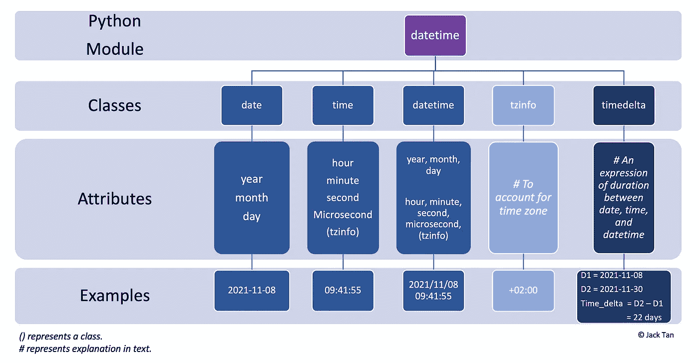
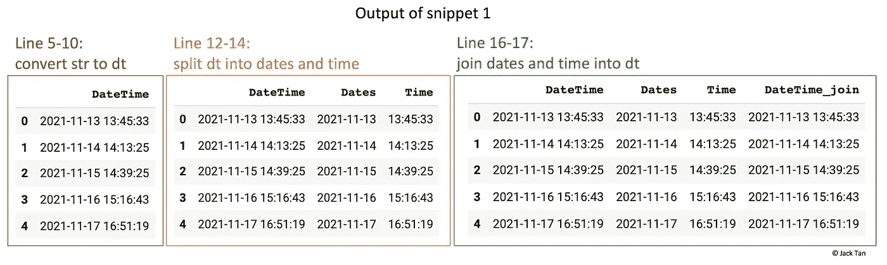
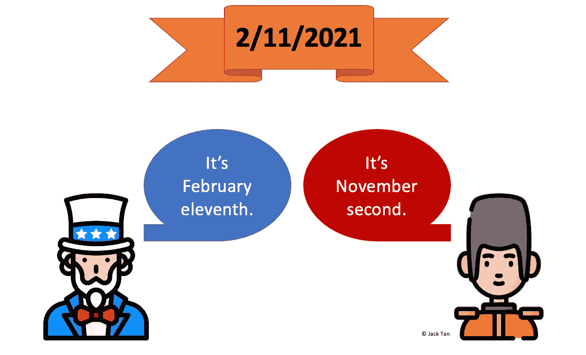
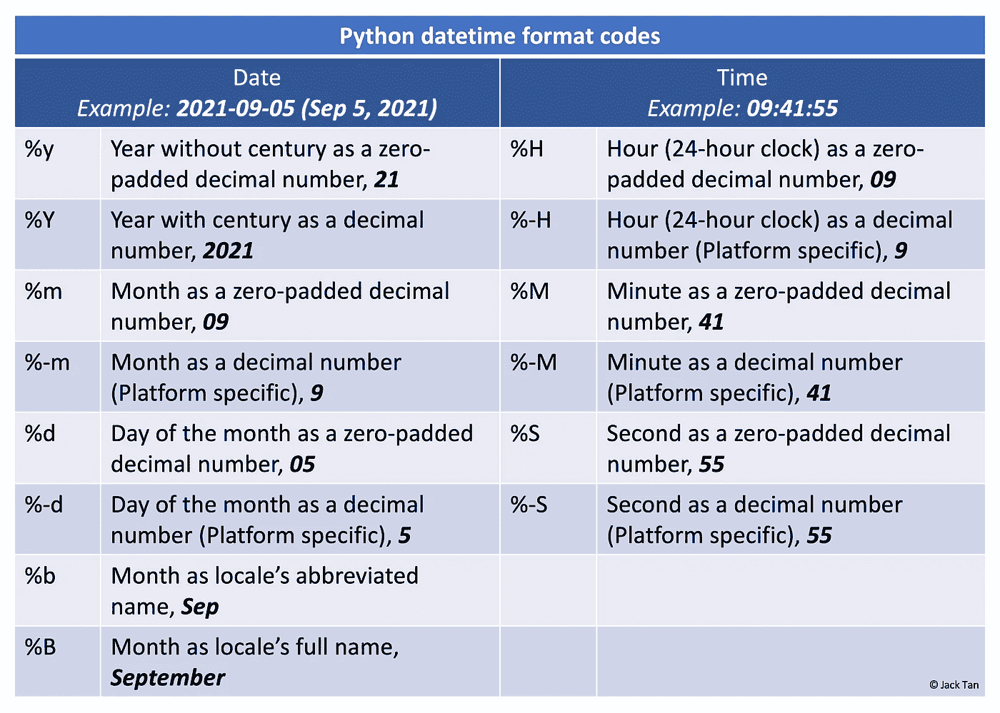
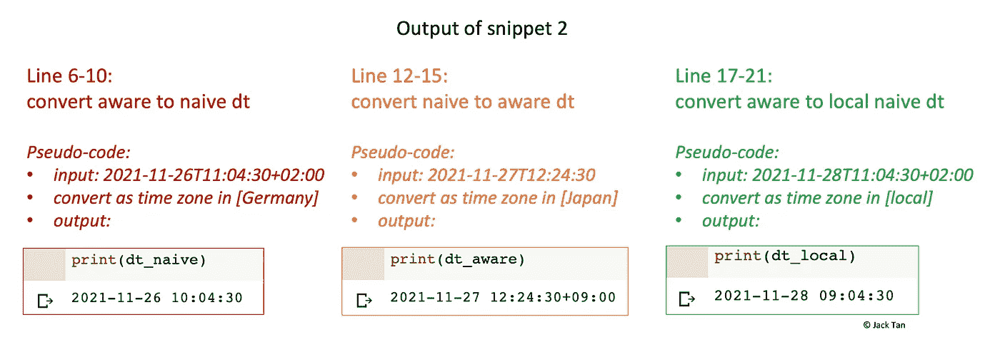
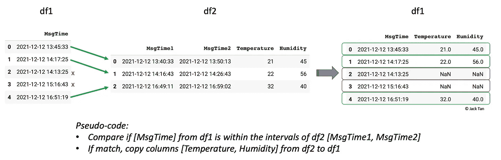
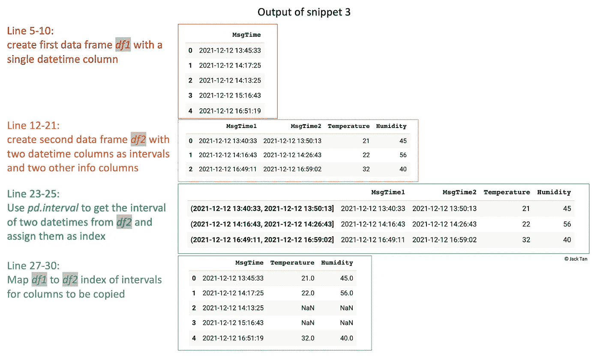

# 如何在 Python 中使用 DateTime

> 原文：<https://towardsdatascience.com/how-to-work-with-datetime-in-python-26d4092dc484?source=collection_archive---------20----------------------->

## 5 分钟内 3 个有用的片段。


Elena Koycheva 在 [Unsplash](https://unsplash.com?utm_source=medium&utm_medium=referral) 上拍摄的照片

> 时间是金。

这句与时间的重要性有共鸣的谚语当然不会过时。在初始阶段，所有数据都会自动分配一个“出生日期”。因此，在某些时候处理数据时，不可避免地会遇到日期和时间数据。本教程将带你浏览 Python 中的`datetime`模块，并利用一些外围库，如`pandas`和`pytz`。

# 基础知识

在 Python 中，任何与日期和时间有关的事情都由`datetime`模块处理，该模块进一步将模块分为 5 个不同的类。类只是对应于一个对象的数据类型。下图总结了 Python 中的 5 个`datetime`类以及常用的属性和示例。



用 Python 解释日期时间类的插图。作者自我图解。

# 3 个有用的片段

# **1。将字符串转换成** `**datetime**` **格式**

也许使用`datetime`最常见的情况是从正确的格式开始。将日期和时间解析为 Python 通常会被解释为字符串，因为它们具有字母数字的性质。在这一节中，我们将介绍如何将字符串列表解析为`datetime`格式，以及如何将日期和时间数据拆分和组合到数据帧的各个列中。



代码片段 1 的打印输出。作者自我图解。

但是如果一个`datetime`以一种不寻常的或者不明确的方式被格式化了呢？一个常见的问题是美国和欧洲写作方式的区别。在美式格式中，月份在前面，而在欧式格式中，日子在前面。



美国人和欧洲人解释日期的方式。作者自我图解。

默认情况下，`pandas`中的`to_datetime`通过将前 12 位以下的数字(< 12)解析为月份，将对象转换为`datetime`。例如，2021 年 2 月 11 日将被解析为 2021–02–11，而 2021 年 13 月 11 日将被解析为 2021–11–13。但是，有一个`format`参数允许您以其他方式定义格式。

```
import pandas as pd
dt = "02-11-2021"dt1 = pd.to_datetime(dt)
dt1
#output# Timestamp('2021-02-11 00:00:00')dt2 = pd.to_datetime(dt, format = "%d-%m-%Y")
dt2
#output# Timestamp('2021-11-02 00:00:00')
```

或者，`strftime()`方法有助于在返回字符串之前格式化`datetime`。在下面的示例中，原始`datetime`之间的破折号(-)被替换为齿隙(/)，数字月份(02)被替换为缩写的英语术语(Feb)。

```
import pandas as pddt = pd.to_datetime("02-11-2021")dt3 = dt.strftime('%b/%d/%Y')
dt3#output# 'Feb/11/2021'
```

由于有多种方法来解释日期(日、月、年)和时间(时、分、秒)，所以理解不同的格式代码是非常重要的。下表是常用格式代码的备忘单。有关格式代码的完整列表，请参考`[strftime.org](https://strftime.org/)`。



Python 中 DateTime 的常用格式代码。作者自我图解。

# **2。使用时区**

没有时区信息的`datetime`对象被称为“naive ”,有时区信息的对象(通常以+HH:MM 结尾，对应于 GMT)被视为“aware”。`[pytz](https://pypi.org/project/pytz/)`可能是 Python 中最全面的库之一，它简化了时区计算的任务，并考虑了夏令时结束时的模糊时间。

下面的代码片段将向您展示如何在“天真”和“意识到”`datetime`对象之间进行转换，并有可能使用不同的时区。代码的最后一部分还演示了如何将给定的`datetime`对象转换成本地时区。这个例子显示了日本和德国的时区代码，对于其他地区，你可以参考这里的。



代码片段 2 的打印输出。作者自我图解。

# **3。使用区间**有条件地比较两个 `**datetime(s)**`

**不可避免的是，有时候我们不得不有条件地对`datetime`的两个数据帧进行比较。假设您有两个数据帧，第一个数据帧仅由一列`datetime`组成，第二个数据帧由两列组成，这两列表示间隔和其余列中的其他信息。您的目标是从第一个数据帧中找到匹配的`datetime`，如果它落在第二个数据帧的区间内，如果是，复制其他列。**

****

**使用伪代码解释条件的图示。作者自我图解。**

**实现这一点的一种方法是使用`pd.Interval`压缩两个`datetime`的间隔，然后将它们指定为数据帧的索引，该索引稍后可用于有条件地比较和映射`datetime`。如果满足时间条件，可以使用一个`for`循环来复制感兴趣的列。**

****

**代码片段 3 的打印输出。作者自我图解。**

# ****结论****

**完整的 Python 笔记本可以在 [Github](https://github.com/jackty9/DateTime_Python) 上找到。**

**概括来说，这 3 个片段涵盖了 Pythonic】中的 3 个主要功能:**

*   **代码片段 1:将字符串转换成`datetime`，反之亦然，带有代码格式化选项。**
*   **代码片段 2:使用不同的时区，包括在 aware 和 naive 之间转换`datetime`。**
*   **代码片段 3:有条件地将一个`datetime`间隔与来自不同数据帧的另一个`datetime`进行比较，如果发现匹配，就做一些事情。**

**感谢阅读这篇文章。如果你喜欢我的工作，请考虑加入 Medium 来支持我。谢谢大家！😊**

**[](https://jackyeetan.medium.com/membership) [## 通过我的推荐链接-谭施敏加入媒体

### 作为一个媒体会员，你的会员费的一部分会给你阅读的作家，你可以完全接触到每一个故事…

jackyeetan.medium.com](https://jackyeetan.medium.com/membership)**