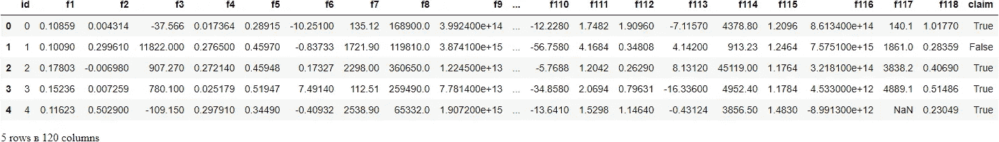
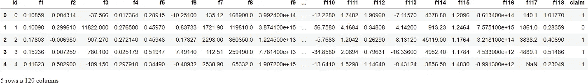
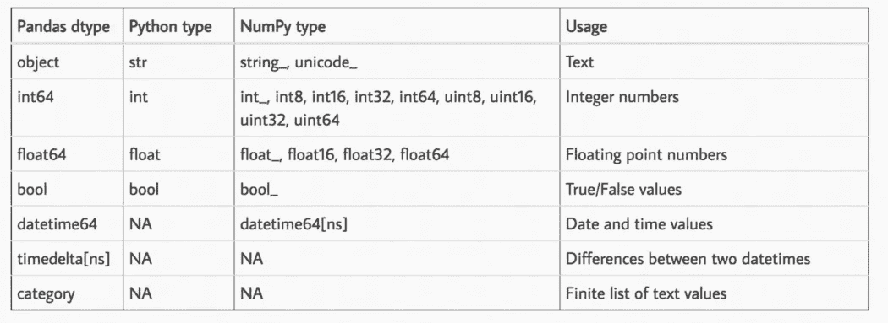
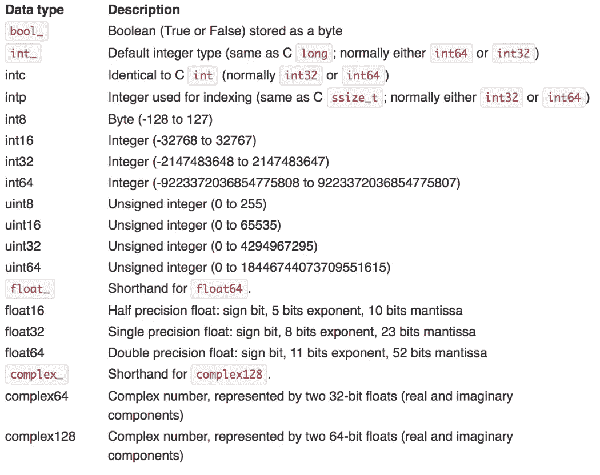
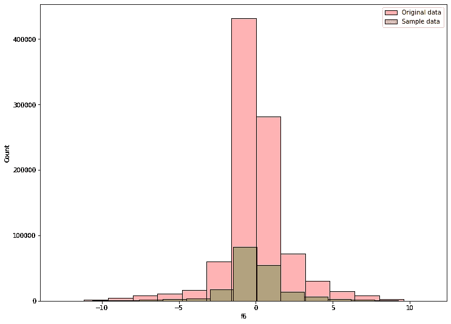

# 如何像专家一样处理百万行数据集

> 原文：<https://towardsdatascience.com/how-to-work-with-million-row-datasets-like-a-pro-76fb5c381cdd?source=collection_archive---------2----------------------->

## [理解大数据](https://towardsdatascience.com/tagged/making-sense-of-big-data)

## 是时候卸下你的训练轮了

**图片由**[**Artem Beliaikin**](https://www.pexels.com/@belart84?utm_content=attributionCopyText&utm_medium=referral&utm_source=pexels)**上的** [**像素组成。**](https://www.pexels.com/photo/aerial-photo-of-woman-standing-in-flower-field-1657974/?utm_content=attributionCopyText&utm_medium=referral&utm_source=pexels) **除特别注明外，所有图片均为作者所有。**

# 介绍

在我的学习旅程中，最困难的一个阶段是克服我对大规模数据集的恐惧。这并不容易，因为处理百万行的数据集与在线课程不断给我的小玩具数据集完全不同。

今天，我在这里分享我学到的概念和技巧，以应对具有数百万甚至数十亿行的千兆字节大小的数据集的挑战。最终，他们会让你觉得就像处理爱丽丝或者泰坦尼克号一样自然。

这篇文章的笔记本可以在 Kaggle [这里](https://www.kaggle.com/bextuychiev/how-to-work-w-million-row-datasets-like-a-pro)或者从[这个](https://github.com/BexTuychiev/medium_stories/tree/master/2021/september/4_mln_row_datasets)回购上找到。

<https://ibexorigin.medium.com/membership>  

获得由强大的 AI-Alpha 信号选择和总结的最佳和最新的 ML 和 AI 论文:

<https://alphasignal.ai/?referrer=Bex>  

# 读入海量数据

您的第一个担忧始于加载数据时——将数据集读入工作环境所需的时间可能与您训练模型的时间一样长。在这个阶段，不要使用熊猫——有更快的替代品。我最喜欢的包之一是`datatable`包，它读取数据的速度可以快 10 倍。

例如，我们将使用`datatable`和`pandas`加载约 1M 行[ka ggle TPS 2021 年 9 月](https://www.kaggle.com/c/tabular-playground-series-sep-2021/data)数据集，并比较速度:

来源: [Kaggle TPS 九月赛](https://www.kaggle.com/c/tabular-playground-series-sep-2021/data)

7 倍加速！用于操作数据的`datatable` API 可能不如`pandas`直观——因此，在读取数据后调用`to_pandas`方法将其转换为 DataFrame。

除了`datatable`，还有`Dask`、`Vaex`或`cuDF`等。它读取数据的速度比熊猫快好几倍。如果你想看一些实际的例子，请参考 Kaggle 大师 Rohan Rao 关于阅读大数据集的笔记本。

# 减少内存大小

接下来，我们有记忆问题。在进行复杂计算时，即使是 200k 的行数据集也可能耗尽 16GB 的 RAM。

这个第一手*我在上个月 Kaggle 上的 TPS 比赛中经历过两次*。第一次是当使用 UMAP 将训练数据投影到 2D 时——我用完了 RAM。第二次是在用 XGBoost 为测试集计算 SHAP 值时——我用完了 GPU VRAM。令人震惊的是，训练集和测试集只有 250k 和 150k 行，包含 100 个特性，而我使用的是 Kaggle 内核。

我们今天使用的数据集有大约 96 万行，包含 120 个要素，因此更有可能出现内存问题:

在带有`deep=True`的数据帧上使用`memory_usage`方法，我们可以得到每个特性消耗多少 RAM 的精确估计值——7 MBs。总体来说接近 1GB。

现在，你可以使用一些技巧来减少高达 90%的内存使用。这些技巧与尽可能将每个要素的数据类型更改为最小的子类型有很大关系。

Python 以独特的类型表示各种数据，如`int`、`float`、`str`等。相比之下，pandas 对每种 Python 都有几种 NumPy 替代方案:

**来源:**[【http://pbpython.com/pandas_dtypes.html】T21](http://pbpython.com/pandas_dtypes.html)

数据类型旁边的数字指的是以该格式表示的单个数据单元消耗多少位内存。为了尽可能减少内存，请选择最小的 NumPy 数据格式。这里有一个很好的表格来理解这一点:

**来源:**[**https://docs . scipy . org/doc/numpy-1 . 13 . 0/user/basics . types . html**](https://docs.scipy.org/doc/numpy-1.13.0/user/basics.types.html)

上表中，`uint`指无符号，仅正整数。我发现了这个方便的函数，它可以根据上表减少熊猫数据帧的内存(大声喊出[这个 Kaggle 内核](https://www.kaggle.com/somang1418/tuning-hyperparameters-under-10-minutes-lgbm?scriptVersionId=11067143&cellId=10)):

基于*数字*列的最小值和最大值以及上表，该函数将其转换为可能的最小子类型。让我们将它用于我们的数据:

70%的内存减少令人印象深刻。但是，请注意，在大多数情况下，内存减少不会加快计算速度。如果内存大小不是问题，您可以跳过这一步。

关于非数值数据类型，永远不要在 Pandas 中使用`object`数据类型，因为它消耗最多的内存。如果特征中的唯一值很少，使用`str`或`category`。事实上，使用`pd.Categorical`数据类型可以将速度提高 10 倍，同时使用 [LightGBM 的默认分类](/how-to-beat-the-heck-out-of-xgboost-with-lightgbm-comprehensive-tutorial-5eba52195997?source=your_stories_page-------------------------------------)处理程序。

对于其他数据类型，如`datetime`或`timedelta`，使用`pandas`中提供的本地格式，因为它们支持特殊的操作功能。

# 选择数据操作库

到目前为止，我主要提到了`pandas`。它可能很慢，但广泛的数据处理功能使它比竞争对手有越来越大的优势。

但是它的竞争对手能做什么呢？先从`datatable`(再次)说起吧。

`[datatable](https://datatable.readthedocs.io/en/latest/start/index-start.html)`支持对高达 100 GBs 的数据集进行多线程预处理。在这样的规模下，`pandas`开始抛出内存错误，而`datatable`谦逊地执行。你可以阅读[Parul Pandey](/an-overview-of-pythons-datatable-package-5d3a97394ee9)的这篇优秀文章来了解这个包的介绍。

另一个替代方案是`[cuDF](https://docs.rapids.ai/api/cudf/stable/)`，由 RAPIDS 开发。这个包有很多依赖项，可以在极端情况下使用(想想几千亿)。它支持运行分布在一个或多个 GPU 上的预处理功能，这是当今大多数数据应用程序的要求。与`datatable`不同，它的 API 与`pandas`非常相似。阅读来自 NVIDIA 博客的[这篇文章](https://developer.nvidia.com/blog/pandas-dataframe-tutorial-beginners-guide-to-gpu-accelerated-dataframes-in-python/)了解更多信息。

您也可以查看提供类似功能的 [Dask](https://dask.org/) 或 [Vaex](https://vaex.io/docs/index.html) 。

如果你对`pandas`死心塌地，那么继续阅读下一节。

# 对数据进行采样

不考虑任何速度技巧或 GPU 类固醇包，太多的数据，嗯，太多了。当您有数百万行时，很有可能可以对它们进行采样，以便保留所有的特征分布。

这样做主要是为了加快计算速度。取一个小样本，而不是对所有数据进行实验、特征工程和训练基线模型。通常，10–20%就足够了。以下是熊猫是如何做到的:

作为证明，我们可以根据样本和原始数据绘制单个特征的直方图:

如您所见，分布大致相同——您甚至可以比较方差进行检查。

现在，您可以使用这个示例进行快速原型制作、实验、构建模型验证策略等等。

# 使用矢量化代替循环

每当你发现自己渴望使用一些循环函数，如`apply`、`applymap`或`itertuples`——停止。请改用矢量化。

首先，开始将 DataFrame 列视为巨大的 n 维向量。如你所知，向量运算同时影响向量中的每个元素，消除了数学循环的需要。矢量化是对数组而不是单个标量执行操作的过程。

Pandas 拥有大量的矢量化函数。事实上，几乎任何能够影响数组中每个元素的函数和操作符在 pandas 中都是向量化的。这些函数比任何循环都要快几个数量级。

还可以定义自定义的矢量化预处理函数，将整个数据帧列作为向量而不是标量接受。这方面令人毛骨悚然的细节超出了本文的范围。你为什么不看看这个很棒的导游？

# 为基线模型或原型选择机器学习库

机器学习是一个迭代的过程。当处理大型数据集时，您必须确保每次迭代都尽可能快。您想要构建基线，开发一个验证策略，检查不同的特性工程思想是否改进了基线，等等。

在这个阶段，不要在 Sklearn 中使用模型，因为它们是 CPU 专用的。从 XGBoost、LightGBM 或 CatBoost 中选择。这里有一个令人惊讶的事实——XGBoost 比其他两个要慢得多，即使在 GPU 上也是如此。

比 LightGBM 最多慢 10 倍[。CatBoost 击败了这两个库，并且随着数据集大小的变大，速度差异迅速增长。在准确性方面，它也经常胜过他们。](/how-to-beat-the-heck-out-of-xgboost-with-lightgbm-comprehensive-tutorial-5eba52195997?source=your_stories_page-------------------------------------)

当您运行多个实验、交叉验证或超参数调整时，这些速度差异会变得更加明显。

# 杂项提示

使用 cy thon(C Python)——通常，它比纯 Python 快 100 倍。查看熊猫文档的这一部分。

如果你真的必须循环，在安装 [Numba](https://numba.pydata.org/numba-doc/latest/index.html) 后用`@numba.jit`修饰你的自定义函数。JIT (just-in-time)编译将纯 Python 转换为本机机器指令，使您能够获得类似 C、C++和 Fortran 的速度。再次检查文档中的本节。

搜索除 CSV 文件之外的存储替代文件。像 feather、parquet 和 jay 这样的文件格式速度很快——如果存储在这些文件中，只需几秒钟就可以加载十亿行数据集。

阅读关于[增强性能](https://pandas.pydata.org/pandas-docs/stable/user_guide/enhancingperf.html)和[扩展到大型数据集](https://pandas.pydata.org/pandas-docs/stable/user_guide/scale.html)的 Pandas 文档。

# 正在总结…

以下是这篇文章的摘要:

1.  仅使用像`datatable`、`cuDF`或`dask`这样的库加载数据。他们总是比熊猫快。
2.  通过将每一列转换为尽可能小的子类型，可以减少高达 90%的内存消耗。
3.  选择一个你熟悉的或者基于你需要的数据操作库。
4.  抽取 10-20%的数据样本进行快速分析和实验。
5.  用向量思考，使用向量函数。
6.  选择像 CatBoost 这样的快速 ML 库来构建基线和进行特征工程。

感谢您的阅读！

# 您可能也会感兴趣…

</kagglers-guide-to-lightgbm-hyperparameter-tuning-with-optuna-in-2021-ed048d9838b5>  </how-to-beat-the-heck-out-of-xgboost-with-lightgbm-comprehensive-tutorial-5eba52195997>  </tired-of-cliché-datasets-here-are-18-awesome-alternatives-from-all-domains-196913161ec9>  </love-3blue1brown-animations-learn-how-to-create-your-own-in-python-in-10-minutes-8e0430cf3a6d> 