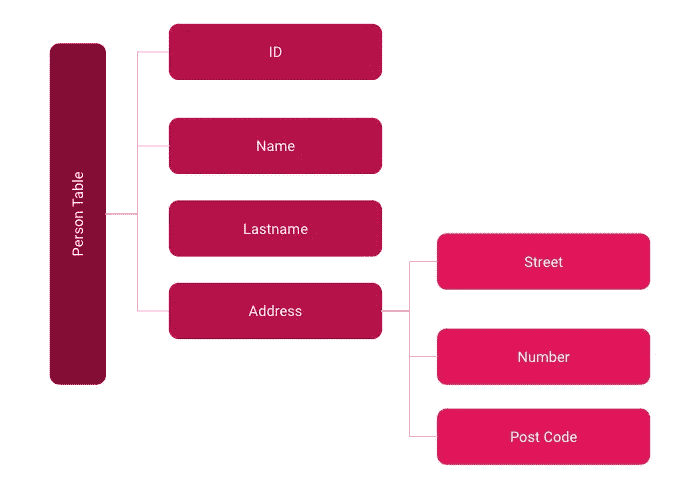
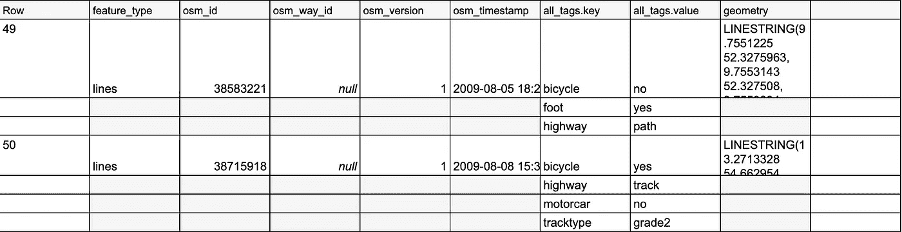
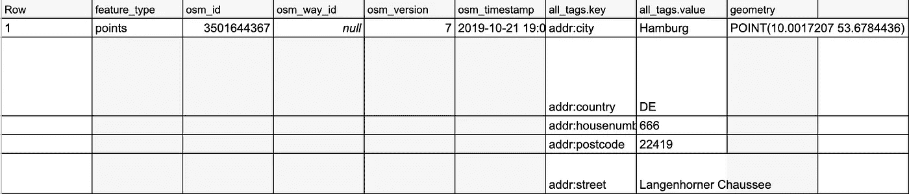
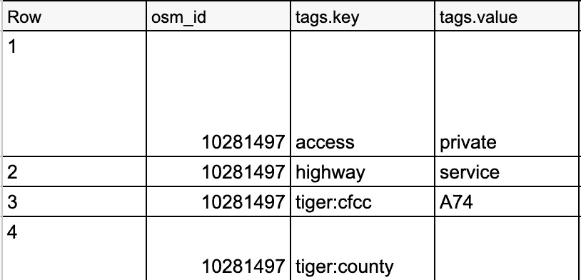
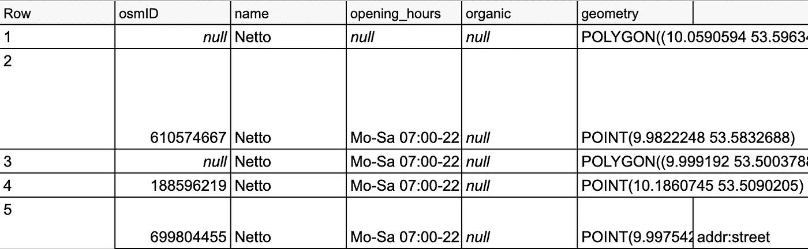

# 如何在 BigQuery 中使用嵌套数据

> 原文：<https://towardsdatascience.com/how-to-work-with-nested-data-in-bigquery-84f15646b0b1?source=collection_archive---------18----------------------->

## 关于嵌套数据你必须知道的


[冰茶](https://unsplash.com/@magicetea?utm_source=unsplash&utm_medium=referral&utm_content=creditCopyText)在 [Unsplash](https://unsplash.com/s/photos/pine?utm_source=unsplash&utm_medium=referral&utm_content=creditCopyText) 上拍摄的照片

云数据湖和仓库正在兴起——谷歌的 BigQuery 就是一个例子。BigQuery 对于非规范化数据是最强大的。您应该对数据进行非规范化处理，并使用嵌套列和循环列，而不是使用传统的模式，如星型模式或雪花模式。这些列可以保持关系，而不会像关系模式或规范化模式那样降低性能[1]。

## 什么是嵌套数据？

BigQuery 支持从支持基于对象的模式(例如 JSON)的源格式中加载和查询嵌套和循环数据。



嵌套和重复数据的图示-按作者分类的图像

地址列包含一个值数组。数组中的不同地址是重复出现的数据。每个地址中的不同字段是嵌套数据。

## 真实的例子

对于使用 BigQuery 的示例演练，我在 *geo_openstreetmap* 数据集*中使用了开放数据集 *planet_features* 。*在这里，数据是以嵌套格式存储的，所以我们来看看:

```
SELECT * FROM `bigquery-public-data.geo_openstreetmap.planet_features` LIMIT 1000
```

这是以下输出中的结果:



结果乍一看还不错。与传统的关系数据库不同，我可以使用数组并保存额外的列。此外，整件事的效果非常好。现在，我想在德国找一家超市，应该使用简单的 where 子句，对吗？差不多了。在这里，你需要 ***Unnest、*** 的魔力

```
SELECT * 
FROM   `bigquery-PUBLIC-   data.geo_openstreetmap.planet_features` 
WHERE  'Netto' IN 
       ( 
              SELECT value 
              FROM   unnest(all_tags)) 
AND    ( 
              'addr:country', 'DE') IN 
       ( 
              SELECT (KEY, value) 
              FROM   unnest(all_tags)) 
AND    ( 
              'addr:city', 'Hamburg') IN 
       ( 
              SELECT (KEY, value) 
              FROM   unnest (all_tags));
```

这导致了期望的输出:



输出—按作者分类的图像

利用 ***功能，您还能够*** 展平**数据并由此输出查询结果:**

```
SELECT osm_id,tags
FROM bigquery-public-data.geo_openstreetmap.planet_features,
UNNEST(all_tags) as tags limit 100
```



拼合数据—按作者排列的图像

当在 BigQuery 中处理嵌套数据并想要查询一些数据时，这可能是您必须知道的最重要的事情。但是，如果您想将数据用于进一步的 ETL 过程，将数据存储在关系数据库中，或者需要键值对作为分类器的属性，该怎么办呢？这里，您不希望数据变平，因为这将导致重复的行，这里您希望数组中的键值对作为新列:

```
SELECT 
       ( 
              SELECT osm_id) osmid, 
       ( 
              SELECT value 
              FROM   **Unnest**(all_tags) 
              WHERE  KEY = "Address") AS address, 
       ( 
              SELECT value 
              FROM   **Unnest**(all_tags) 
              WHERE  KEY = "name") AS NAME, 
       ( 
              SELECT value 
              FROM   **Unnest**(all_tags) 
              WHERE  KEY = "opening_hours") AS opening_hours, 
       ( 
              SELECT value 
              FROM   **Unnest**(all_tags) 
              WHERE  KEY = "organic") AS organic, 
       ( 
              SELECT geometry) AS geometry, 
FROM   bigquery-PUBLIC-data.geo_openstreetmap.planet_features 
WHERE  ( 
              'Edeka' IN 
              ( 
                     SELECT value 
                     FROM   unnest(all_tags)) 
       OR     'Rewe' IN 
              ( 
                     SELECT value 
                     FROM   unnest(all_tags)) 
       OR     'Netto' IN 
              ( 
                     SELECT value 
                     FROM   unnest(all_tags))) 
AND    ( 
              'addr:country', 'DE') IN 
       ( 
              SELECT (KEY, value) 
              FROM   unnest(all_tags)) - 
AND   ( 
              'addr:city', 'Hamburg') IN 
       ( 
              SELECT (KEY, value) 
              FROM   unnest(all_tags));
```



嵌套和重复出现的列数据—按作者分类的图像

## 结论

在我第一次接触嵌套数据之后——我必须承认，我起初不知道该怎么处理它，并且可能有着和电影*The occurrence*中马克·沃尔伯格一样的面部表情。

GIF by [GIPHY](https://giphy.com/gifs/confused-huh-mark-wahlberg-zjQrmdlR9ZCM/links)

但我意识到，在新的世界里，这样的数据格式是正常的，也是通向非结构化数据世界的方式。新系统通过基于列的数据库提供极高的计算能力和快速的结果。通过上面的例子，您应该能够很好地查询和处理大多数嵌套数据用例。

## 资料来源和进一步阅读

[1]谷歌，[指定嵌套和重复的列](https://cloud.google.com/bigquery/docs/nested-repeated?hl=en)