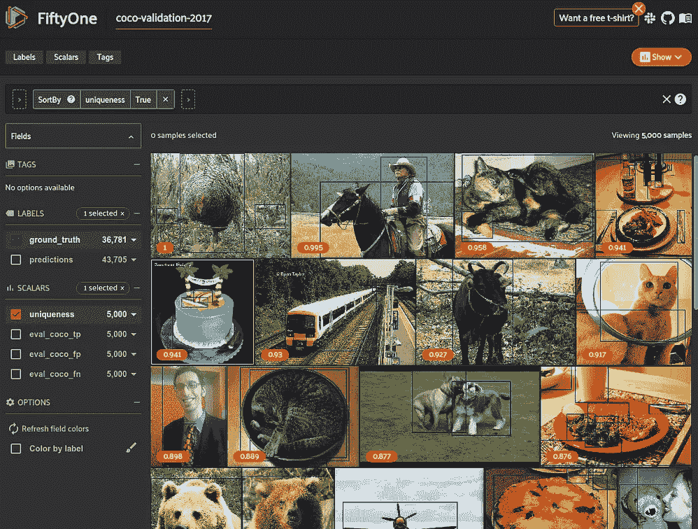
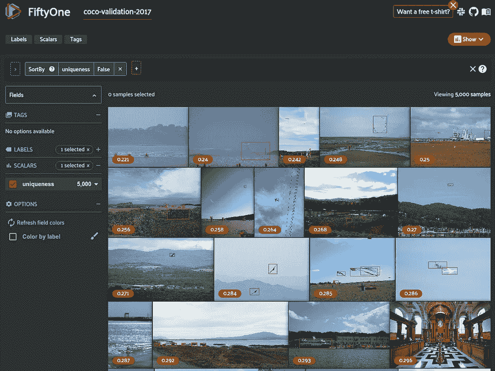
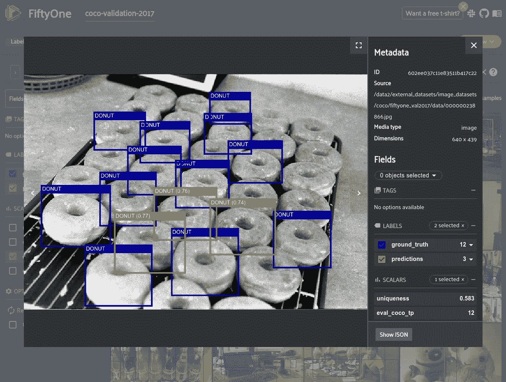

# 如何使用 COCO 格式的对象检测数据集

> 原文：<https://towardsdatascience.com/how-to-work-with-object-detection-datasets-in-coco-format-9bf4fb5848a4?source=collection_archive---------0----------------------->

## [入门](https://towardsdatascience.com/tagged/getting-started)

## 使用 FiftyOne 以 COCO 格式定义、加载、探索和评估对象检测数据集的综合指南

[](https://fiftyone.ai)

来自[可可数据集](https://cocodataset.org/)的图像 001298.jpg 在[五十一](https://fiftyone.ai)中可视化(图片由作者提供)

微软的通用对象上下文数据集( [COCO](https://cocodataset.org/) )是目前最流行的对象检测数据集。它被广泛用于测试计算机视觉方法的性能。

由于数据集的流行，COCO 用来存储注释的格式通常是创建新的自定义对象检测数据集时的首选格式。虽然 COCO 数据集也支持其他任务的注释，如分段，但我将把它留到以后的博客文章中。**现在，我们将只关注对象检测数据**。

> “ [COCO 格式](https://cocodataset.org/#format-data)”是一种特定的 JSON 结构，规定了如何为图像数据集保存标签和元数据。

许多博客文章描述了 COCO 的基本格式，但是它们通常缺少加载和处理 COCO 格式数据的详细例子。这篇文章将带你了解:

*   [COCO 文件格式](https://voxel51.com/docs/fiftyone/user_guide/dataset_creation/datasets.html#cocodetectiondataset)
*   [将现有数据集转换为 COCO 格式](https://voxel51.com/docs/fiftyone/recipes/convert_datasets.html)
*   [加载 COCO 数据集](https://voxel51.com/docs/fiftyone/user_guide/dataset_creation/index.html)
*   [可视化并探索您的数据集](https://voxel51.com/docs/fiftyone/user_guide/app.html)
*   [从目标检测模型生成预测](https://voxel51.com/docs/fiftyone/user_guide/model_zoo/index.html)
*   [评估 COCO 数据集上的模型图](https://voxel51.com/docs/fiftyone/user_guide/evaluation.html#coco-style-evaluation-default)

为了做到这一切，我将使用我一直在开发的开源机器学习开发工具 [FiftyOne](https://fiftyone.ai/) 。它旨在让研究人员和工程师轻松处理和可视化图像和视频数据集，并以各种格式存储注释和模型预测。

您可以通过 pip 轻松[安装 51 个](https://voxel51.com/docs/fiftyone/getting_started/install.html):

```
pip install fiftyone
```

[](https://voxel51.com/docs/fiftyone/integrations/coco.html)

COCO 2017 验证分裂在[五十一](https://fiftyone.ai/)可视化(图片由作者提供)

# 更新:与 COCO 合作的新方式

截至 2021 年 6 月 29 日:[在 COCO 团队](https://cocodataset.org/#home)的支持下，COCO 已经[集成到 51 个](https://voxel51.com/docs/fiftyone/integrations/coco.html)中，使[易于下载](https://cocodataset.org/#download)和[在数据集上评估](https://cocodataset.org/#detection-eval)。现在，您可以指定并下载您想要的数据集的确切子集，将您自己的 COCO 格式的数据加载到 FiftyOne 中，并使用由 FiftyOne 的可视化功能增强的 COCO 风格的评估来评估您的模型。

详见[本帖](https://medium.com/voxel51/the-coco-dataset-best-practices-for-downloading-visualization-and-evaluation-68a3d7e97fb7)或[本文档](https://voxel51.com/docs/fiftyone/integrations/coco.html)！

# COCO 文件格式

如果您是物体检测领域的新手，并且任务是创建一个新的物体检测数据集，那么遵循 [COCO 格式](https://cocodataset.org/#format-data)是一个不错的选择，因为它相对简单并且用途广泛。本节将解释 COCO 格式的对象检测数据集的文件和文件夹结构实际上是什么样子。

在高层次上，COCO 格式准确地定义了你的**注释**(边界框、对象类等)和**图像元数据**(如高度、宽度、图像源等)在磁盘上的存储方式。

## 磁盘上的文件

COCO 数据集的文件夹结构如下所示:

```
<dataset_dir>/
    data/
        <filename0>.<ext>
        <filename1>.<ext>
        ...
    labels.json
```

数据集存储在一个目录中，该目录包含原始图像数据和一个单独的`json`文件，该文件包含所有注释、元数据、类别和您可能想要存储的关于数据集的其他信息。如果您有多个数据分割，它们将存储在不同的目录和不同的`json`文件中。

## JSON 格式

如果你要从他们的网站下载 [COCO 数据集，这将是`instances_train2017.json`和`instances_val2017.json`文件。(注意:官方测试集注释对公众不可用)](https://cocodataset.org/#download)

```
{
    "info": {
        "year": "2021",
        "version": "1.0",
        "description": "Exported from FiftyOne",
        "contributor": "Voxel51",
        "url": "https://fiftyone.ai",
        "date_created": "2021-01-19T09:48:27"
    },
    "licenses": [
        {
          "url": "[http://creativecommons.org/licenses/by-nc-sa/2.0/](http://creativecommons.org/licenses/by-nc-sa/2.0/)",
          "id": 1,
          "name": "Attribution-NonCommercial-ShareAlike License"
        },
        ...   
    ],
    "categories": [
        ...
        {
            "id": 2,
            "name": "cat",
            "supercategory": "animal"
        },
        ...
    ],
    "images": [
        {
            "id": 0,
            "license": 1,
            "file_name": "<filename0>.<ext>",
            "height": 480,
            "width": 640,
            "date_captured": null
        },
        ...
    ],
    "annotations": [
        {
            "id": 0,
            "image_id": 0,
            "category_id": 2,
            "bbox": [260, 177, 231, 199],
            "segmentation": [...],
            "area": 45969,
            "iscrowd": 0
        },
        ...
    ]
}
```

*   **信息**-关于数据集的描述和版本信息。
*   **许可证** —具有由您的图像指定的唯一 id 的许可证列表。
*   **类别** —每个类别都有一个唯一的 ID。可选地与可以跨越多个类别的超级类别相关联。这些类别可以是您想要的任何东西，但是请注意，如果您想要使用 COCO 上预先训练的[模型，您需要遵循](https://voxel51.com/docs/fiftyone/user_guide/model_zoo/models.html#centernet-hg104-512-coco-tf2)[COCO 类](https://cocodataset.org/#explore)(或者遵循其他[数据集类别以使用其他模型](https://tfhub.dev/google/faster_rcnn/openimages_v4/inception_resnet_v2/1))。
*   **图像** —数据集中的图像列表和相关元数据，包括唯一的图像 ID、文件路径、高度、宽度和可选属性，如许可证、URL、捕获日期等。
*   **注解** —注解列表，每个注解都有一个唯一的 ID 和与之相关的图像 ID。在我们的例子中，您将在这里存储边界框信息，或者为其他任务存储分段/关键点/其他标签信息。这也存储了包围盒区域和`iscrowd`,表示一个大的包围盒，包围着用于评估的相同类别的多个对象。

# 创建 COCO 格式的数据集

本节将概述如何获取原始或带注释的数据集，并根据您当前拥有的数据及其格式将其转换为 COCO 格式。

## 案例 1:我有带注释的数据

在这种情况下，您已经有了一个包含图像和注释的数据集，但是想要将其转换为 COCO 格式。

如果你的数据集碰巧遵循一种不同的通用格式，这种格式被 FiftyOne、[如 CVAT、YOLO、KITTI、Pascal VOC、TF Object detection 或其他](https://voxel51.com/docs/fiftyone/user_guide/dataset_creation/datasets.html#supported-formats)所支持，那么你可以在一个单独的命令中将其加载并转换为 [COCO 格式。](https://voxel51.com/docs/fiftyone/cli/index.html#convert-dataset-formats)

```
*# Convert a COCO detection dataset to CVAT image format*
fiftyone convert \
    --input-dir /path/to/cvat-image-dataset \
    --input-type fiftyone.types.CVATImageDataset \
    --output-dir /path/to/coco-detection-dataset \
    --output-type fiftyone.types.COCODetectionDataset
```

如果您的数据不是以支持的格式存储的，那么使用 Python 将其加载到 FiftyOne 并以 COCO 格式导出仍然很容易。想法是将每个图像和相关联的标签作为[51 个样本](https://voxel51.com/docs/fiftyone/user_guide/using_datasets.html#samples)加载，并将它们添加到[51 个数据集](https://voxel51.com/docs/fiftyone/user_guide/using_datasets.html#datasets):

然后，您可以用一行代码[以 COCO 格式导出](https://voxel51.com/docs/fiftyone/user_guide/export_datasets.html#exporting-fiftyone-datasets)该数据集:

现在你知道了！`/path/to/coco-detection-dataset`现在包含 COCO 格式的图片和标签。查看下一节，了解如何轻松地将其加载回 Python。

## 案例 2:我只有原始图像数据

如果您只有未标记的图像，那么您将首先需要生成对象标签。您可以使用注释工具或提供者(如 [CVAT](https://github.com/openvinotoolkit/cvat) 、[标签框](https://labelbox.com/)、 [MTurk](https://www.mturk.com/) 或许多其他工具之一)生成基础事实标签，或者使用现有的预训练模型生成预测标签。

例如，如果您使用 CVAT 注释您的原始数据，那么您现在可以使用 FiftyOne 命令将其转换为 COCO 格式，就像上一节中一样:

```
*# Convert a COCO detection dataset to CVAT image format*
fiftyone convert \
    --input-dir /path/to/cvat-image-dataset \
    --input-type fiftyone.types.CVATImageDataset \
    --output-dir /path/to/coco-detection-dataset \
    --output-type fiftyone.types.COCODetectionDataset
```

或者，如果您想要使用模型来生成预测，您可以将未标记的数据加载到 51 中，并使用[51 模型动物园](https://voxel51.com/docs/fiftyone/user_guide/model_zoo/index.html)生成预测，然后以 COCO 格式保存数据集。

# 将 COCO 数据集加载到 Python

本节假设您已经收集了图像并对其进行了注释，以 COCO 格式存储了您的数据集，或者遵循上一节，或者通过自定义脚本手动构建标签 JSON。

为了加载 COCO 格式的数据集，您可以为 JSON 标签文件编写一个解析器，但实际上您应该使用各种工具中的一种来加载它。两个最好的工具是官方可可 API 和 [**五十一**](https://fiftyone.ai/) 。

有[官方 COCO API](https://github.com/cocodataset/cocoapi)用于 Python、Lua 和 Matlab。这些 API 是常用的，它们提供了在数据集上加载和计算数据集范围的评估的基本功能。

如果您正在使用 Python，我建议尝试一下 [FiftyOne](https://fiftyone.ai/) ，因为它提供了与 [cocoapi](https://github.com/cocodataset/cocoapi) 相似的功能，以及专门设计的强大 api 和 GUI，使您尽可能轻松地探索、分析和处理数据。

如果您的数据集正确遵循了前面几节中概述的 COCO 格式，您可以使用一个命令将其加载到 Python 中的 51 个数据集:

# 可视化和探索

现在，您的数据集处于 Python 中，您可以使用 FiftyOne API 轻松访问与您的数据相关联的所有不同信息和标注，并在应用程序中对其进行可视化。

要可视化数据集，请启动 [FiftyOne 应用程序](https://voxel51.com/docs/fiftyone/user_guide/app.html):


COCO 2017 验证分裂在[第五十一](https://fiftyone.ai/)中可视化(图片由作者提供)

通过 API，您可以使用[聚合](https://voxel51.com/docs/fiftyone/user_guide/using_aggregations.html)来获得关于您的数据集的统计数据，比如每个类别的[检测数量](https://voxel51.com/docs/fiftyone/user_guide/using_aggregations.html#count-values):

与数据集交互的主要方式是通过[视图](https://voxel51.com/docs/fiftyone/user_guide/using_views.html?highlight=bbox%20area#dataset-views)。您进行的每个查询都会为您的数据集提供不同的视图，例如按包含最多对象的样本排序:


在[第五十一](https://fiftyone.ai/)中可视化最多对象的样本(图片由作者提供)

您还可以创建一个视图，根据更复杂的值(如小边界框区域)过滤标签字段:


在第五十一张中看到的小物体视图(图片由作者提供)

[51 大脑](https://voxel51.com/docs/fiftyone/user_guide/brain.html)包含各种方法，允许你分析你的地面真相数据的质量。例如，您可以在数据集中找到最[独特的样本](https://voxel51.com/docs/fiftyone/user_guide/brain.html#image-uniqueness)，这可以帮助您更好地了解应该添加哪种附加数据:



最独特(**左**)和最不独特(**右**)的样本在[第五十一](https://fiftyone.ai)中可视化(图片由作者提供)

其他大脑方法可以帮助你找到[可能的注释错误](https://voxel51.com/docs/fiftyone/user_guide/brain.html#label-mistakes)和[识别你可能想要训练的硬样本](https://voxel51.com/docs/fiftyone/user_guide/brain.html#sample-hardness)。所有这些都将帮助您训练更好的模型，因为更好的模型通常来自更好的数据。

# 生成模型预测

您想要创建 COCO 格式的数据集的主要原因是使用它来训练和测试模型。

如今，大多数模型都依赖于将数据加载到 Python 中。尤其是当你使用 [TensorFlow](https://www.tensorflow.org/) 或 [PyTorch](https://pytorch.org/) 时，因为这些库主要是基于 Python 的。例如，使用 COCO API 或 FiftyOne 将数据集导入 Python 使得编写 PyTorch 数据加载器比自己解析标签 JSON 要容易得多。实际上，在你的数据上训练一个模型超出了这篇文章的范围，但是有很多例子可以帮助你进行 [PyTorch 对象检测训练](https://pytorch.org/tutorials/intermediate/torchvision_tutorial.html)甚至 [TensorFlow 对象检测 API](https://github.com/tensorflow/models/tree/master/research/object_detection) 。

如果您刚刚开始，并希望了解一些预训练模型在您的数据集上的表现，生成一些预测的最简单方法是使用[51 模型动物园](https://voxel51.com/docs/fiftyone/user_guide/model_zoo/models.html#centernet-hg104-512-coco-tf2)。它包含 70 多个模型，其中许多是对象检测模型。

```
fiftyone zoo models list
```

***注*** *:* [*如果你厌倦了配置 TensorFlow/PyTorch 模型来使用你的 GPU，可以看看我在 Conda*](/guide-to-conda-for-tensorflow-and-pytorch-db69585e32b8) *上的博文。*

由于你的数据是以 COCO 格式存储的，所以可以[加载到第五十一](https://voxel51.com/docs/fiftyone/cli/index.html#create-datasets)中，[可以在上面生成](https://voxel51.com/docs/fiftyone/user_guide/model_zoo/api.html#generating-embeddings-with-zoo-models)模型预测，然后在 [App](https://voxel51.com/docs/fiftyone/user_guide/app.html) 中可视化:


在[五十一应用](https://voxel51.com/docs/fiftyone/user_guide/app.html)中查看地面实况和模型预测(图片由作者提供)

# 评估模型图

目标检测模型的主要评估度量是平均精度(mAP)。这是一个相当复杂的指标，在其他文章中会有更详细的解释。总之，其计算方法如下:

1.  如果预测检测与地面真实对象重叠超过某个交集/并集(IoU)值，则将预测检测与地面真实对象进行匹配
2.  计算每个类别的所有检测的真阳性、假阳性和假阴性的数量
3.  使用这些 TP/FP/FN 来生成精确召回曲线
4.  计算每个类别的平均精度
5.  取所有类别平均精度值的平均值

COCO 评估协议引入了一个额外步骤:map 在 10 个 IoU 阈值范围内求平均值。此外，COCO 对象检测评估还包括计算小、中和大边界框等事物的地图，以及每个图像的检测的变化阈值。

***注:*** *当评估对象检测模型时，预测的类别必须与数据集的类别相匹配。这意味着您必须遵循 COCO 数据集的标签来使用在 COCO 上训练的现成模型，或者您必须微调数据集上的模型，以便它可以预测您的自定义类别。*

这个 COCO mAP 值可以用 [COCO API](https://github.com/cocodataset/cocoapi/blob/master/PythonAPI/pycocoEvalDemo.ipynb) 或 [FiftyOne](https://voxel51.com/docs/fiftyone/user_guide/evaluation.html#coco-style-evaluation-default) 来计算。假设您有一个 COCO 格式的数据集，模型预测存储在该数据集的`predictions`字段中，下面将计算 51 中的 COCO 地图:

尽管 mAP 是用来比较模型性能的最流行的单个值，[这一指标也有缺点](/iou-a-better-detection-evaluation-metric-45a511185be1)。如果你真的想知道你的模型执行的有多好，你需要挖掘你的数据并查看单个样本的模型预测。

对你的模型的表现建立直觉的最好方法是通过观察那些它有信心但却错了的预测。有了 51，这很容易。例如，让我们创建一个数据集视图，查看假阳性最多的样本:



缺少注释(作者图片)

上面的例子是在这个视图中，显示了一群没有在地面实况中标注的误报对象！在 COCO 格式中，地面真实对象可以有一个`iscrowd`属性，指定围绕一群对象绘制边界框。这是这个`iscrowd`框丢失或标签不正确导致误报的众多例子之一。

仅仅通过查看模型图是不可能发现这一点的，这表明了样本级分析对于了解数据集质量的重要性。

# 关于体素 51

高质量、有针对性的数据对于训练优秀的计算机视觉模型至关重要。在 [Voxel51](https://voxel51.com/) ，我们拥有超过 25 年的 CV/ML 经验，非常关心如何让社区将他们的 AI 解决方案带入生活。这就是为什么我们开发了 [FiftyOne](https://voxel51.com/docs/fiftyone) ，这是一个帮助工程师和科学家构建高质量数据集和模型的开源工具。

想了解更多？请在 [fiftyone.ai](http://fiftyone.ai/) 查看我们的网站。