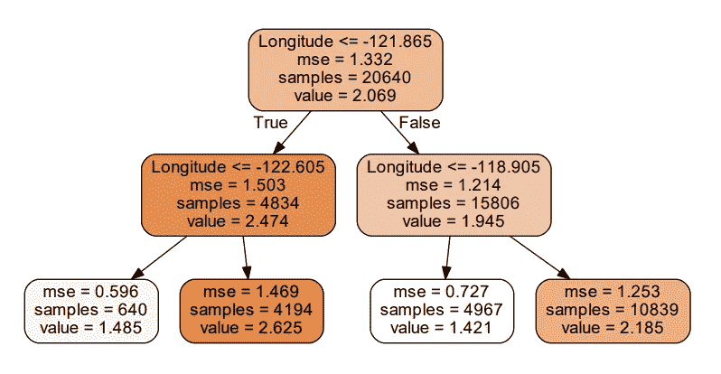
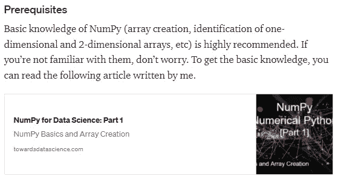
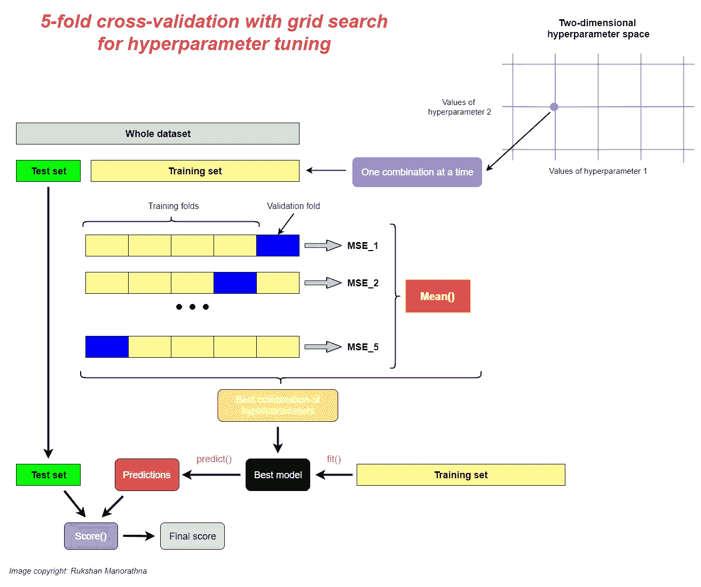

# 如何写一篇大家都能看懂的数据科学帖子

> 原文：<https://towardsdatascience.com/how-to-write-a-data-science-post-everyone-can-understand-2129cb5eb939?source=collection_archive---------26----------------------->

## 即使对于一个非技术人员来说，解释数据相关事物的六个有用的指南


克里斯多夫·伯恩斯在 [Unsplash](https://unsplash.com/?utm_source=unsplash&utm_medium=referral&utm_content=creditCopyText) 上拍摄的照片

我经常写关于数据科学和机器学习的博客。我的本意是写这样的内容，让大家都能看懂。从课题研究到内容定稿，我都尽全力达成自己的意图。我仔细选择对我的读者有用，但很少或在互联网上找不到的主题。因此，我的读者可以通过阅读我独特的内容来学习一些新的东西。

当写一个特定的主题时，内容的组织是非常重要的。我经常以内容效率接近 100%的方式组织我的内容。这可以定义为:


(图片由作者提供)

这不是一个数学公式。然而，你可以从中获得一些直觉:很明显，通过让你最大限度地吸收知识，可以提高内容效率。为此，在撰写数据科学帖子时，我经常在脑海中记住以下六条准则。

# 1.解释算法背后的直觉

在一篇数据科学文章的开头，大多数人试图描述太多特定算法或过程的数学知识。读者可能不理解他们，并跳过阅读你的内容。我的建议是，你应该从解释特定算法背后的直觉开始，然后转移到数学部分。例如，这里有一部分对椭圆包络技术的解释，直接摘自我在 2021 年发表的《[你应该知道的两种离群点检测技术》一文。](/two-outlier-detection-techniques-you-should-know-in-2021-1454bef89331)

> 椭圆形信封背后的直觉非常简单。我们根据一些标准在数据点周围绘制一个椭圆，并将椭圆内的任何数据点分类为内点(绿色的)，将椭圆外的任何观察结果分类为离群点(红色的)——由作者确定


椭圆形信封背后的直觉(图片由作者提供)

这即使对一个初学者来说也能理解。在这里，我并不试图从数学上解释“如何围绕数据点画椭圆”。相反，我解释了技术背后的直觉。现在，我的读者有了一个想法，使用椭圆包络技术来检测可能的异常值。

**关键要点:***直觉*和*相关图*的组合是解释一个算法或过程的好方法。

# 2.不要打开(解释)黑箱模型

在数据科学和机器学习的背景下，黑盒模型是指一种算法的内部结构，在这种结构中，我们无法看到或理解它是如何工作的。我们只能看到给定输入的输出。神经网络模型就是一个很好的例子。如果我们试图打开(解释)这样一个模型，我们的时间将被浪费，因为很难理解引擎盖下的复杂机制。

与之相反的是白盒模型，在白盒模型中，我们可以看到或理解算法的内部机制。白盒模型是透明的。这种模型的一个例子是决策树。



决策树的一部分:白盒模型(图片由作者提供)

在决策树中，我们可以很容易地解释内部节点如何被划分以产生最终输出。标准非常明确。你可以解释诸如决策树是如何产生这种特定输出的等等。

**要点:**知道何时以及如何使用一个算法比理解其内部机制更重要。所以，不要试图打开(解释)黑箱模型。另外，请注意，打开白盒模型是可选的。

# 3.注意模型的可解释性和可解释性

在数据科学和机器学习的背景下，区分*可解释性*和*可解释性*可能是有用的。这两个术语可以互换使用。然而，有一个明显的区别。

> 当我们试图 ***解释*** 一个 ML 模型时，我们试图解释它的含义、约束(限制)、假设和预测的有效性。 ***可解释性*** 主要处理的是透明性。在这里，我们试图解释模型的内部工作原理(黑盒模型是不可能的！)通过更加关注模型训练过程和模型性能改进—作者

为了解释这一点，我使用以下简单的线性回归模型。

```
y = 𝛽0 + 𝛽1xy = Height(cm)
x = Age(years)
```

想象一下，上面的模型代表了一个人的年龄和身高的关系。上述模型的**可解释性**具有以下要素。

*   人们可以画一个散点图来看年龄和身高之间的关系(线性/非线性，正/负)的本质。
*   如果关系是线性的，可以计算和解释皮尔逊相关系数来测量关系的强度。
*   人们可以计算并解释 **R 平方(R )** 值，以查看模型捕捉到了多少高度可变性。
*   人们可以解释𝛽0 和𝛽1 系数。𝛽0 是新生儿的身高(当 x=0 时)。𝛽1 是年龄每增加一个单位，身高增加的厘米数。
*   人们可能会提到该模型的局限性。例如，一个人可以说，在一个特定的年龄点后，一个人的身高不会增加。
*   人们可以解释和验证模型的假设。

这是解读部分。现在，我们进入可解释部分。上述模型的**可解释性**有以下要素。

*   人们可以解释如何找到𝛽0 和𝛽1 系数的最佳值。人们可以解释找到最优值的成本函数和梯度下降过程。人们可以解释如何选择学习率α。
*   可以解释用于模型评估的交叉验证程序。人们可以解释折叠的大小和数量的选择。
*   可以解释用于从几个模型中找出最佳可能模型的超参数调整过程。
*   如果模型过度拟合数据，可以应用并解释某种正则化(L1、L2 或 L1 和 L2)。

**关键要点:**所有模型都需要可解释性。但是，可解释性可能仅限于白盒模型，并且是可选的。

# 4.给出一个动手的方法

这是我在撰写数据科学帖子时考虑的另一个关键问题。我的大部分帖子都给你亲身体验:**你通过做**来学习。为此，我包含了所有代码示例和数据集。你可以用它们来练习你所学的东西。

# 5.提及先决条件

提及先决条件将对你的读者有所帮助。建议你把自己的内容也包括进来，作为前提内容。我的许多帖子都与其他帖子相关。基本上我都是从基本面入手，往深里走。当我写高级内容时，我通常会包含指向我自己的基本前提内容的链接。这里有一个例子:



(图片由作者提供)

# 6.使用一些图像和图表

> 一幅画胜过千言万语——亨利克·易卜生

数据科学和机器学习也是如此。在这里，一张图片不是统计图或类似的东西。这只是一个简单的图表，但对于向读者解释复杂的理论和过程来说却足够强大。这里有一个例子:



(图片由作者提供)

我在这篇文章的[中创建了这个图表来解释网格搜索的超参数调整过程。](/k-fold-cross-validation-explained-in-plain-english-659e33c0bc0)

# 结论

你的责任是为你的观众设计有价值和可理解的内容。你可以考虑今天讨论的这些指导方针。你也可以通过考虑读者的反馈找到一些其他的方法。无论哪种方式，您的目标都是最大化前面定义的内容效率。

今天的帖子到此结束。我的读者可以通过下面的链接注册成为会员，以获得我写的每个故事的全部信息，我将收到你的一部分会员费。

<https://rukshanpramoditha.medium.com/membership>  

非常感谢你一直以来的支持！下一个故事再见。祝大家学习愉快！别忘了看看我的一些热门榜单:

[](https://rukshanpramoditha.medium.com/list/addressing-overfitting-868959382d1d)

(作者截图)

[](https://rukshanpramoditha.medium.com/list/dimensionality-reduction-146045a5acb5)

(作者截图)

特别感谢 Unsplash 网站上的 **Christopher Burns** 、**T3，他为我提供了一张很好的封面图片。**

[鲁克山·普拉莫蒂塔](https://medium.com/u/f90a3bb1d400?source=post_page-----2129cb5eb939--------------------------------)
**2021–10–06**