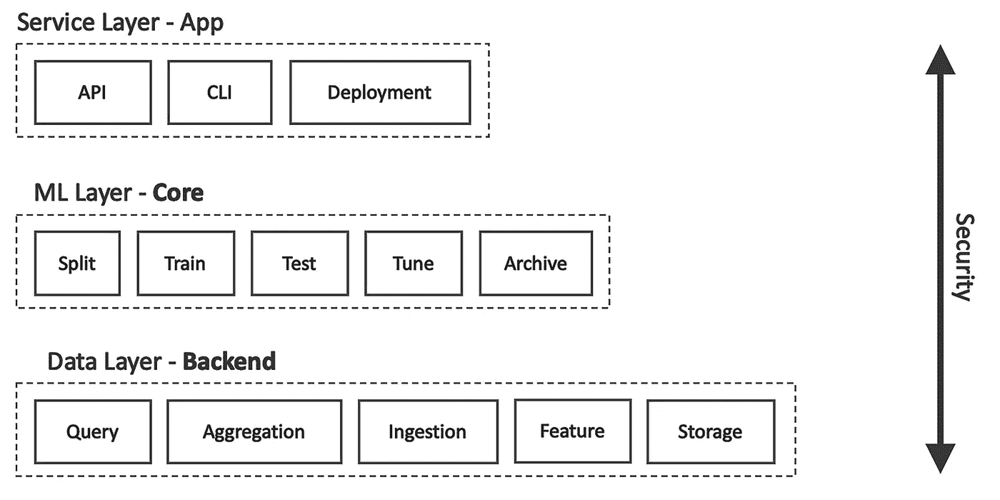

# 如何为专业人士撰写一份出色的数据科学家简历

> 原文：<https://towardsdatascience.com/how-to-write-a-great-resume-as-a-data-scientist-for-professionals-98359ab19a6e?source=collection_archive---------15----------------------->

## [地面零点](https://pedram-ataee.medium.com/list/ground-zero-e79c47975d14)

## 通过描述高级数据科学家必备的三项技能

照片由[宣阮](https://unsplash.com/@darthxuan?utm_source=medium&utm_medium=referral)在 [Unsplash](https://unsplash.com?utm_source=medium&utm_medium=referral) 上拍摄

我最近写了一篇关于[如何为初学者写一份数据科学简历](/how-to-write-a-great-resume-as-a-data-scientist-for-beginners-139a8ad4191e)的文章，受到了社区的好评。我决定将那篇文章扩展到那些更有经验但仍需要润色简历和技能才能进入高级数据科学职位的人。这可能会帮助你们中的一些人找到一些问题的答案，如“作为一名高级数据科学家，我应该如何向潜在雇主展示自己”或“我应该获得什么技能才能在公司的数据科学阶梯上向上爬？”请注意，无论你是否具备所需的技能，你都必须修改你的简历，让自己看起来像你一样有技能。你必须在简历中三大技能下描述你的技能:**软件架构**、**深度学习**、**大数据**。

# —软件架构

如果你想参加数据科学高级职位的面试，你必须完全了解软件开发的标准实践。我在[上一篇文章](/how-to-write-a-great-resume-as-a-data-scientist-for-beginners-139a8ad4191e)中简单解释了一下。除此之外，您必须知道如何为数据科学项目设计一个易于理解和维护的可扩展架构。在这种情况下，每个人都可以为项目做出贡献，并帮助您保持项目正常运行。现在，问题是如何向潜在雇主展示你拥有这些技能。

一个简单但不是最好的办法，就是在简历上强调**你知道各种** [**设计模式**](/3-great-design-patterns-for-data-science-workflows-d3bf162d74e6) **和** [**软件架构**](/10-common-software-architectural-patterns-in-a-nutshell-a0b47a1e9013) **，尤其是数据科学项目**。了解不同的设计模式有助于您编写更高效的查询，而了解各种软件架构有助于您构建可伸缩的架构。例如，如果您使用分层模式开发一个数据科学项目，您可以删除不必要的依赖关系，让不同的团队参与项目。

数据科学项目的分层模式—作者图片

作为一名面试候选人的人工智能主管，我希望看到这些技能的运用。因此，我建议使用这些技术开发您的示例项目，即您在 Github 或 Bitbucket 上托管的项目。当我审查一个代码库时，我可以很容易地识别出一个经过深思熟虑的架构。我确信你未来的雇主也能做到这一点。查看候选人的 Github 账户已经成为审查他们简历的标准程序。

# —深度学习

这时，你必须意识到知道如何开发和维护一个 ML 管道的重要性。但是，作为高级角色的候选人，你必须知道深度学习等**高级机器学习技术** **。你必须掌握与你申请的工作岗位相关的最佳深度学习架构。例如，如果你想从事自然语言处理方面的工作，你一定要了解 BERT 或 GPT3。你可以在下面的文章中读到更多关于伯特的内容。**

 [## 如何使用 BERT 和 Word2Vec 计算句子相似度

### 以及防止计算句子嵌入时常见错误的一些见解

towardsdatascience.com](/how-to-compute-sentence-similarity-using-bert-and-word2vec-ab0663a5d64) 

另外，你的简历必须表明你有使用深度学习开发解决方案的实践经验。例如，它必须表明你知道以下问题的答案:

*   培训过程中如何管理**衔接**机制？
*   如何将**迁移学习**应用在一个预先训练好的网络上？
*   如何最小化**冗余计算**？
*   如何降低一个深度学习技术的**灵敏度**？

注意，虽然深度学习是机器学习的一个子集，但它的具体细节是不同的。

火花—来源: [giphy](https://giphy.com/gifs/fireworks-qHyNwshIEVysU)

# —大数据

传统的数据处理技术在非常大的数据集上失败了，也就是大数据。例如，当你需要在计算机内存中加载数据时，你会受到内存大小的限制。如今，由于大多数数据集很容易超过这个限制，**分布式数据处理技术**如**Apache Spark**已经变得流行起来。在单台计算机无法做出相应响应的情况下，它们也有助于处理实时数据流。

作为一名高级数据科学家，你必须拥有这些技术的实践经验，并在简历中明确提到这一点。例如，人们可以这样写:*“使用 Spark ML 和 PySpark 开发了一个 ML 流水线”*或*“使用 Spark 和 Databricks 构建了一个高效的数据处理流水线”*。这些陈述简要展示了您对 Spark 技术以及 **Databricks** 的了解，Databricks 是一个基于云的统一平台，用于存储和处理大数据。

近年来引进了许多技术；然而，你只需要知道当前使用的是哪一个。所以，我建议不要在简历上填写各种大数据技术的清单。最好选择一个，并解释你用它做了什么。

# 临终遗言

为了能够参加高级数据科学家职位的面试，你必须在简历中展示以下技能:

*   如何创建一个可扩展且易于维护的软件架构？
*   如何实现高级算法，例如深度学习？
*   如何搭建一个高效的管道来存储和处理大数据？

请注意，没有什么是可以保证的，但是你可以通过记住这些笔记来增加你的机会。

# 感谢阅读！

如果你喜欢这个帖子，想支持我…

*   *跟我上* [*中*](https://medium.com/@pedram-ataee) *！*
*   *在* [*亚马逊*](https://www.amazon.com/Pedram-Ataee/e/B08D6J3WNW) *上查看我的书！*
*   *成为* [*中的一员*](https://pedram-ataee.medium.com/membership) *！*
*   *连接上*[*Linkedin*](https://www.linkedin.com/in/pedrama/)*！*
*   *关注我* [*推特*](https://twitter.com/pedram_ataee) *！*

 [## 通过我的推荐链接加入 Medium—Pedram Ataee 博士

### 作为一个媒体会员，你的会员费的一部分会给你阅读的作家，你可以完全接触到每一个故事…

pedram-ataee.medium.com](https://pedram-ataee.medium.com/membership)