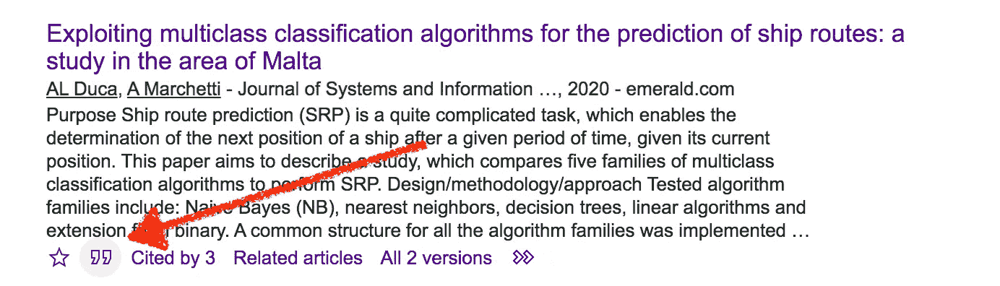

# 如何根据数据科学项目撰写科学论文

> 原文：<https://towardsdatascience.com/how-to-write-a-scientific-paper-from-a-data-science-project-62d7101c9057?source=collection_archive---------11----------------------->

## [实践教程](https://towardsdatascience.com/tagged/hands-on-tutorials)，学习

## 关于如何将数据科学项目转化为精彩的科学论文的一些提示。

[斯科特·格雷厄姆](https://unsplash.com/@homajob?utm_source=medium&utm_medium=referral)在 [Unsplash](https://unsplash.com?utm_source=medium&utm_medium=referral) 上拍照

撰写科学论文通常与学者和研究人员联系在一起。事实上，工业和其他人也可以从科学生产中受益，因为:

*   从概念的角度来看，发表到期刊或会议记录中会使你的工作更加严谨
*   出版一部科学著作会让你成为某个研究领域的专家
*   科学出版物可以添加到公司/个人**课程或文件夹**

如果你仍然想知道写科学论文的好处，你可以阅读下面的文章:[在同行评审期刊上发表研究论文的 8 个理由](https://www.drluzclaudio.com/blog/5857503#:~:text=Having%20a%20robust%20body%20of,merit%20of%20research%20funding%20requests.)。

希望我已经说服您写一篇科学论文，在本文的剩余部分，我将描述如何将一个数据科学项目转化为精彩的科学出版物，提交给一些期刊或会议。

照片由[安德鲁·尼尔](https://unsplash.com/@andrewtneel?utm_source=medium&utm_medium=referral)在 [Unsplash](https://unsplash.com?utm_source=medium&utm_medium=referral) 上拍摄

# 1 定义主题

首先你要明确**你的项目解决了**哪个问题，比如*如何提高产品销量*，或者*从评论中提取情绪。你可以为你的项目写一个简短的总结，最多 200 字。这是你论文摘要的初稿。*

现在你可以把你的总结缩短成一句话。这是你论文的临时标题。

然后你可以把你的摘要分成 3-4 个关键词。我建议你包括非常常见的关键词，如机器学习，自然语言处理或数据可视化。

一旦写好了摘要，你就可以搜索关注你的主题的期刊或会议。你可以在 [Wiki 上搜索关于你的主题的会议论文征集](http://www.wikicfp.com/cfp/)。

> 会议可以分为不同的等级，从 A 级(最有声望)到 C 级(不太有声望)，一直到没有等级的会议。

我强烈建议从 B-C 级别的会议开始，因为如果你还没有写任何文章，很难在 A 级会议上发表。

如果你想为一个期刊写作，你可以在[Scimago Journal&Country Rank](https://www.scimagojr.com/)网站上查看期刊列表，那里提供了一个搜索栏，你可以在那里搜索你的主题。一个好的期刊表现为高 h 指数，以及高四分位数(典型的是 Q1 或最大 Q2)。

一旦选择了适合你的主题的期刊/会议，**你应该深化期刊/会议的目标，并重写你的摘要以适应它**。我强烈建议你下载会议/期刊**论文模板**并在写论文时使用。

# 2 研究文献

现在你已经准备好环顾四周:其他人在相同的话题上做什么？换句话说，**你应该搜索类似的论文**。这部分是最难的，因为它需要学习。

你可以利用一些网站来搜索类似的论文，比如[谷歌学术](https://scholar.google.com/)或者 [IEEE Xplore](https://ieeexplore.ieee.org/Xplore/home.jsp) 。你应该搜索至少 8-10 篇类似的论文，可能是最近的论文。如果你没有找到任何论文，也许你没有用正确的方法搜索。你应该再试一次，也许改变关键词，直到你找到最少数量的论文。

现在你可以研究阅读过的论文了。迈克尔·伯克写了一篇有趣的文章描述如何阅读科学论文。

你可以通过查看你所在领域的顶级会议记录来搜索其他文章，比如本文中的文章。

当你阅读这些文章时，我强烈建议你**为每篇文章写一个摘要**。或者，您可以将相似的文章分组，并描述它们相似的方法。

> 你也应该注释其他文章和你的文章之间的区别，以及相对于艺术水平，你的作品的附加值是什么。

在阅读结束时，你可以扩展你的摘要，也包括最后一个方面，也就是你作品的附加价值。

现在是建立书目初稿的时候了。检查期刊/会议所要求的风格，并根据它格式化你的参考文献。您可以利用每篇论文下的谷歌学术引文选项来导出参考书目，如下图所示:

作者图片

# 3 写介绍

你准备好扩展你的论文了。再次提取摘要，并尝试扩展它，以便为你的项目提供更多细节。**你不需要添加技术细节，但你应该对你的工作进行深入概述**。你也应该给你的作品添加一个背景，比如这个想法是从哪里来的。这一新段落是导言的草稿。这个部分的长度是可变的。但是，我建议至少 1 页，最多 2 页。

简介应概述:

*   你作品的背景
*   你工作的目标
*   实现目标所采用的方法
*   取得的成果

引言的所有部分都应该保持平衡，因此你应该给它们保留相同的段落数，或多或少。

照片由 [NeONBRAND](https://unsplash.com/@neonbrand?utm_source=medium&utm_medium=referral) 在 [Unsplash](https://unsplash.com?utm_source=medium&utm_medium=referral) 上拍摄

# 给你的论文一个结构

到目前为止，你已经写好了摘要和引言以及相关工作部分的草稿。你已经准备好给你的论文一个结构了。我强烈建议你再看一遍引言，并把它分成几个段落。然后，您可以为每个段落添加一个部分。

> 提醒一下，在写论文的时候，你可以添加、删除或修改任何你已经写好的部分。

该文件或多或少应包含以下部分:

*   摘要(已经写好)
*   介绍(已经写好)
*   相关作品(已写)
*   方法学
*   实验
*   结果/讨论
*   结论和未来工作。

## 4.1 方法

在这里，你应该描述你的项目背后的**理论，而不是描述所采用的技术或数据集。例如，您可以描述项目的架构，包括机器学习管道，或者执行机器学习任务所采用的算法。**

## 4.2 实验

在本节中，您应该说明数据、数据结构、数据的存放位置、数据集的大小以及是否对其进行了清理或丰富。您还可以添加数据样本，以更好地描述您的数据集。此外，如果你的数据覆盖了一个时间段，你描述它。

一旦描述了你的数据源，你应该描述你如何将数据集分成训练集和测试集，训练阶段有多长，以及其他类似的东西。

然后你可以描述你如何**衡量**你的结果的好坏，如果适用的话。例如，你可以给出准确度、精确度、召回率或其他使用的度量标准的简短定义。最后，您可以描述所采用的技术，比如 Python 库(`scikit-learn`或其他)。

概括地说，本节可分为以下几个小节:

*   数据描述
*   指标描述
*   采用的技术

## 4.3 结果/讨论

*这一部分旨在证明你到目前为止所描述的是真实的。*因此，在这一部分，你应该描述你的发现。可以用**表**和**图**。你不必把所有生产的数字，但只有那些有趣的。本节的附加价值可能是与其他工作的比较。

一个好的讨论不应该描述数字，但它可以讲述一个故事。**因此，你可以将这部分转化为一个故事。**

## 4.4 结论和未来工作

在这里，你应该概述一下所展示的工作，以及它的局限性，对社会、行业和研究的影响。此外，你应该加上**未来的工作**，比如扩展你的数据集，调优一些你在本文中没有考虑到的参数以及其他类似的东西。

# 5.审阅并提交论文

一旦你完成了你的论文，休息一天左右。然后，回到你的论文上再读一遍。当然，你会发现很多东西需要修改。因此，当你读这篇论文时，你可以改正它。**至少把整篇文章读 4-5 遍**。

如果可能的话，请一些朋友或同事阅读你的论文。根据他们的建议修改论文。

最终，你的论文可以提交了！您可以在期刊/会议的提交系统中创建一个帐户并发送它！

照片由[布鲁克·卡吉尔](https://unsplash.com/@brookecagle?utm_source=medium&utm_medium=referral)在 [Unsplash](https://unsplash.com?utm_source=medium&utm_medium=referral) 上拍摄

# 摘要

在本文中，我举例说明了一些将您的数据科学项目变成精彩的科学出版物的指导方针。

总结:

*   首先写摘要和标题
*   搜索相似的工作，并写出相关的工作部分
*   写介绍
*   编写其他部分
*   回顾论文
*   提交论文。

# 相关著作

</how-to-build-a-narrative-from-data-85e327940c13>  <https://alod83.medium.com/how-to-design-a-data-journalism-story-b2e421673b6e>  </dataset-manipulation-with-open-refine-a5043b7294a7>  

# 新到中？您可以每月订阅几美元，并解锁无限的文章— [点击此处](https://alod83.medium.com/membership)。