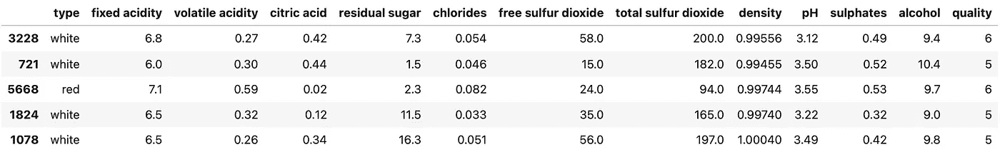
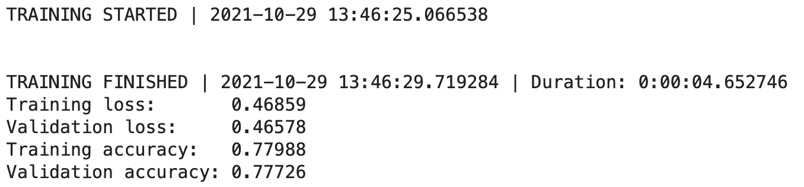
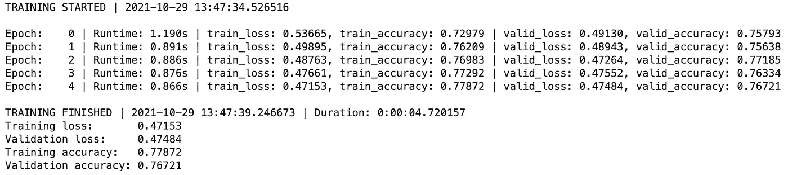
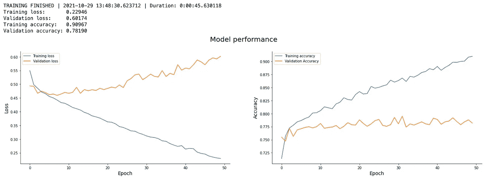

# 如何编写自定义 TensorFlow 回调——简单的方法

> 原文：<https://towardsdatascience.com/how-to-write-custom-tensorflow-callbacks-the-easy-way-c7c4b0e31c1c?source=collection_archive---------33----------------------->

## 你觉得内置 TensorFlow 回调有局限性吗？这是您一直在寻找的解决方案

西蒙·艾布拉姆斯在 Unsplash[拍摄的照片](https://unsplash.com/?utm_source=unsplash&utm_medium=referral&utm_content=creditCopyText)

你发现[内置 TensorFlow 回调](/tensorflow-callbacks-how-to-monitor-neural-network-training-like-a-pro-f02cb4e477d0)有局限性吗？您很幸运，因为今天您将从头开始学习如何编写自定义 TensorFlow 回调！当您想修改默认回调的工作方式或者想做一些疯狂的事情时，它可能会派上用场。

今天，您将编写一个定制的回调函数来重新设计训练循环，在训练完成后在测试集上打印评估指标，并绘制每个时期的训练损失与验证损失以及训练精度与验证精度的关系图。

不想看书？请观看我的视频:

你可以在 [GitHub](https://github.com/better-data-science/TensorFlow) 上下载源代码。

# 使用的数据集和数据预处理

我今天不打算花太多时间处理数据。我们将使用与前几篇文章相同的数据集——来自 Kaggle 的[葡萄酒质量数据集](https://www.kaggle.com/shelvigarg/wine-quality-dataset)。它是在数据库内容许可证下许可的开源数据集:

图片 1——来自 Kaggle 的葡萄酒质量数据集(图片由作者提供)

您可以使用以下代码将其导入 Python，并随机打印几行:

我们忽略警告并更改默认的 TensorFlow 日志级别，这样我们就不会被输出淹没。

以下是数据集的外观:

图 2——葡萄酒质量数据集的随机样本(图片由作者提供)

数据集基本上是干净的，但默认情况下不是为二元分类(好酒/劣酒)而设计的。取而代之的是，葡萄酒是按等级来评定的。我们现在将解决这个问题，还有许多其他问题:

*   **删除缺失值** —它们为数不多，所以我们不会在插补上浪费时间。
*   **处理分类特征**——唯一的一个是`type`，指示葡萄酒是白还是红。
*   **转换为二分分类任务**——我们将把任何 6 分及以上的葡萄酒宣布为*好*，任何低于*的为差*。
*   **训练/测试拆分**——经典的 80:20 拆分。
*   **缩放数据** —预测值之间的比例差异很大，因此我们将使用`StandardScaler`来拉近数值。

下面是完整的数据预处理代码片段:

同样，如果你想更详细地了解数据预处理背后的逻辑，请参考[上一篇文章](/how-to-train-a-classification-model-with-tensorflow-in-10-minutes-fd2b7cfba86)。

现在，让我们看看如何在 TensorFlow 中声明回调。

# 编写一个模型训练函数

让我们通过编写一个构建、编译和训练模型的函数来使我们的生活变得稍微容易一些。没有它也可以继续，但是您需要多次复制/粘贴模型训练代码，这并不理想。

该函数允许您指定回调列表，并更改模型将训练的时期数。默认情况下，历元数设置为 5。其他一切都是硬编码的，包括训练集、验证集和详细度参数。最好将其设置为 0，因为我们的回调会生成自己的训练进度语句。

下面是该函数的代码:

如果你了解 TensorFlow 的基础知识，应该感觉很熟悉。解决了这个问题，让我们写第一个回调函数。

# 编写一个基本的自定义 TensorFlow 回调

每个自定义 TensorFlow 回调类都必须扩展`tf.keras.callbacks.Callback`类。它让你可以访问许多类方法，但是我们在这一节只讨论两个。这些是`on_train_begin()`和`on_train_end()`。TensorFlow 的开发团队确实确定了函数名，因此没有必要进一步解释它们的功能。

与任何 Python 类一样，您可以声明一个构造函数。我们的将包含模型开始和结束训练的时间戳。我们最初将两者都设置为`None`。

`on_train_begin()`函数将当前时间设置为构造函数中的开始时间戳，并打印训练开始的时间。

`on_train_end()`函数将当前时间设置为构造函数中的时间结束时间戳，计算并打印训练持续时间，并打印训练损失、训练准确度、验证损失和验证准确度的值。

代码如下:

简单吧？当然，但是开始定制训练日志输出就足够了。您可以使用以下代码为模型定型五个时期(默认):

下面是您将看到的输出:

图 3 —自定义 TensorFlow 回调 v1(图片由作者提供)

这是一个不错的开始，但我们看不到每个时期会发生什么。接下来让我们改变它。

# 使用自定义 TensorFlow 回调修改纪元行为

您可以用同样的方式修改每个时期开始和结束时发生的事情。我们将打印历元号、历元持续时间、训练损失和准确度，以及验证损失和准确度。

让我们从向构造函数添加一个额外的变量开始— `time_curr_epoch` —它将在每次新的纪元开始时被覆盖。

`on_epoch_begin()`函数将当前时间的值设置为构造函数中的`time_curr_epoch`变量。

`on_epoch_end()`函数将计算历元持续时间，并从历元日志中获取训练损失、训练精度、验证损失和验证精度。然后它会使用 Python 的 f-string 魔法将它们打印出来。

代码如下:

让我们测试一下——记住，除了之前的内容之外，您应该会看到每个时期都打印了新的一行:

以下是输出结果:

图 4 —自定义 TensorFlow 回调 v2(图片由作者提供)

整洁，对不对？故事并没有到此结束。接下来，让我们看看如何在培训完成后直观显示模型性能。

# 通过自定义 TensorFlow 回调可视化模型性能

绘制训练和验证度量会立即告诉您模型是否停滞或过度拟合，以及何时是停止训练的正确时间。这就是我们现在要做的。我们将声明一个可视化模型性能的辅助函数，然后在训练完成后调用它。

首先，向构造函数添加几个变量。您将需要在训练集和验证集上跟踪历元数、损失和准确性。

`_plot_model_performance()`函数将创建一个 1 行 2 列的图表，在左边显示训练和验证损失，在右边显示训练和验证准确性。

在`on_training_end()`里面只调用`_plot_model_performance()`下面的一切。

在`on_epoch_end()`中，增加历元数，将训练损失、训练精度、验证损失和验证精度的值追加到构造函数的列表中。

代码如下:

就是这样！现在让我们来测试一下——我们将训练 50 个时期的模型，这样图表就可以显示更多的数据:

培训结束后，您将看到以下内容:

图 5 —自定义 TensorFlow 回调 v3(图片由作者提供)

简而言之，用当前的架构和参数训练模型 50 个时代是没有意义的。验证损失大约在第 5 个历元之后开始增加，同时验证准确度或多或少处于平稳状态。

不过，这是你需要手动可视化的一件事。

# 结论

这就是 TensorFlow 自定义回调的基础。我们只介绍了可用功能的一小部分，所以请务必浏览官方文档以获得更多资源。写得真的很好，你会发现关于编写自定义*提前停止*和*学习率调度器*回调的例子。

在从头开始编写自定义回调之前，请确保您需要的功能尚未内置到 TensorFlow 中。你可以查看我的前一篇文章，关于我在每个深度学习项目中使用的四个内置回调，以帮助你开始。

请继续关注即将到来的文章，因为我们将从下面的文章开始深入研究 TensorFlow 和计算机视觉以及卷积神经网络。

*喜欢这篇文章吗？成为* [*中等会员*](https://medium.com/@radecicdario/membership) *继续无限制学习。如果你使用下面的链接，我会收到你的一部分会员费，不需要你额外付费。*

<https://medium.com/@radecicdario/membership>  

# 保持联系

*   注册我的[简讯](https://mailchi.mp/46a3d2989d9b/bdssubscribe)
*   订阅 [YouTube](https://www.youtube.com/c/BetterDataScience)
*   在 LinkedIn 上连接