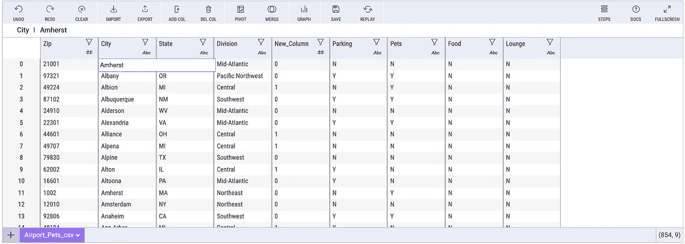

# 如何用 Python 编写类似 Excel 的公式

> 原文：<https://towardsdatascience.com/how-to-write-excel-like-formulas-in-python-4bdacab75a53?source=collection_archive---------8----------------------->

## 关于如何使用 Python 中的米托包编写类似 Excel 的公式的简短教程


乔安娜·科辛斯卡在 [Unsplash](https://unsplash.com?utm_source=medium&utm_medium=referral) 上的照片

M 任何 Python 用户都在从电子表格过渡，因为 Python 包允许用户使用类似 Excel 的语法。这是一个用于 JupyterLab 的电子表格环境，可以帮助您进行 Python 分析。

认识一下米托——一个将交互式电子表格初始化到 JupyterLab 环境中的 Python 包。对于您在电子表格中所做的每一次编辑，米托都会生成生产就绪的 Python 代码。也是免费使用。

通过阅读这篇文章，你将学会:

*   如何在 Python 中执行基本的类似 Excel 的操作
*   如何用 Python 编写类似 Excel 的公式

如果你错过了我之前关于这个主题的文章，请参见[米托——一个生成 Python](https://romanorac.medium.com/list/mito-a-spreadsheet-that-generates-python-1df29fc67dff) 的电子表格。

# Python 中的 Excel 语法

使用米托 2.0 进行数据切片

要使用 Excel 语法，首先使用以下命令初始化 Mitosheet:

```
import mitosheet
mitosheet.sheet()
```

这将呈现交互式电子表格，您可以:

*   从本地文件传入数据集
*   或者，您可以传入笔记本中现有的数据帧作为 Mitosheet 调用的参数:

```
mitosheet.sheet(df))
```


将本地文件导入米托表单(图片由作者提供)

## 以防你还没有安装米托

要安装米托，请运行以下命令:

```
python -m pip install mitoinstaller
python -m mitoinstaller install
```

这里是完整的[安装说明。](https://docs.trymito.io/getting-started/installing-mito)

# 添加一列米托


在米托表单中添加新列(图片由作者提供)

要添加列，请单击 Mitosheet 顶部工具栏中的“添加列”按钮。使用新列，您可以使用电子表格函数和公式。

当您添加一个列时，它会在 Mitosheet 下面的代码单元中生成等效的 Python。

## 用米托重命名列

要重命名某个列，只需双击该列的标题，然后键入您想要的新标题。

# 使用 Excel 函数

在新列的单元格中，您可以分配一个公式。

在新的专栏中，您可以使用普通的类似 Excel 的函数，米托将生成等效的 Python 代码。

当您开始键入函数时，下面的菜单中将显示一个可供选择的函数建议列表。


用米托工作表编写类似 Excel 的公式(图片由作者提供)

上图中使用的函数生成了等效的 Python(这是自动记录的)。

```
Airport_Pets_csv['New_Column'] = IF(Airport_Pets_csv['Division'] == "Central", 1, 0)
```

米托有许多不同类型的 Excel 函数可以在工作表中使用。您可以使用:

*   日期操作
*   统计分析
*   数据清理
*   还有更多。

有关所有支持的类似 Excel 的公式，请参见公式[参考页](https://docs.trymito.io/how-to/interacting-with-your-data/mito-spreadsheet-formulas)。


米托公式参考页面(由[https://docs . try mito . io/how-to/interactive-with-your-data/mito-spread sheet-formulas](https://docs.trymito.io/how-to/interacting-with-your-data/mito-spreadsheet-formulas)页面作者截图)

# 直接编辑数据

米托允许用户选择数据框中的任何单元格并更改特定值——就像在电子表格中一样。这对于快速数据编辑和数据验证来说是一个重要的特性。



编辑米托表单中的列(图片由作者提供)

此编辑会生成等效的代码:

```
# Set column City at index 0 in Airport_Pets_csv to Amherst
Airport_Pets_csv.at[0, 'City'] = "Amherst"
```

# 其他类似 Excel 的功能

米托还为用户提供了一个熟悉的电子表格环境来完成其他常见的 Python 任务。

用户可以在交互式设置中创建数据透视表，并让这些数据透视表自动生成等价代码:


用米托旋转表格(作者可视化)

用户可以生成图形和等价代码:


与米托一起制作情节(作者视觉化)

米托还支持常见的分析功能，例如:

*   [过滤](https://docs.trymito.io/how-to/filter-data)
*   [排序](https://docs.trymito.io/how-to/sort-data)
*   [汇总统计](https://docs.trymito.io/how-to/summary-statistics)
*   [合并数据集](https://docs.trymito.io/how-to/merging-datasets-together)
*   [宏](https://docs.trymito.io/how-to/save-and-repeat-analyses#save-analyses)
*   导出到 CSV

# 结论


由 [Lenstravelier](https://unsplash.com/@lenstravelier?utm_source=medium&utm_medium=referral) 在 [Unsplash](https://unsplash.com?utm_source=medium&utm_medium=referral) 上拍摄

对于那些希望从 Excel 或 Google 电子表格环境过渡到 Python 的人来说，米托是一个强大的工具。

neet 米托的一个特点是它展示了如何计算某些运算。所以你可以边点击分析边学习。

作为一名经验丰富的 pandas 用户，我使用米托进行初步的探索性数据分析。对于米托，我避免一遍又一遍地写同样的熊猫指令。

# 在你走之前

*如果你喜欢看这些故事，为什么不成为* [***中等付费会员***](https://romanorac.medium.com/membership) *？每月 5 美元，你可以无限制地阅读 10000 个故事和作家。**[***如果你用我的链接***](https://romanorac.medium.com/membership)**注册，我会赚一小笔佣金。***

****

**照片由 [Alexas_Fotos](https://unsplash.com/@alexas_fotos?utm_source=medium&utm_medium=referral) 在 [Unsplash](https://unsplash.com?utm_source=medium&utm_medium=referral) 上拍摄**