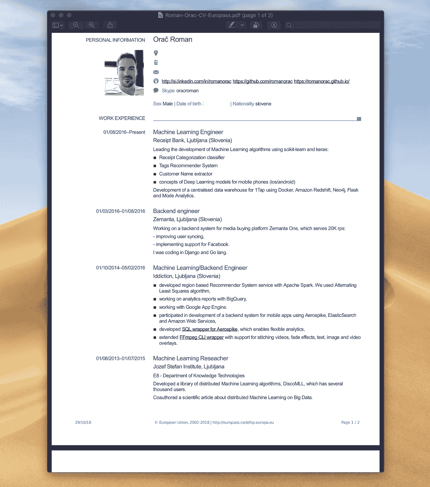
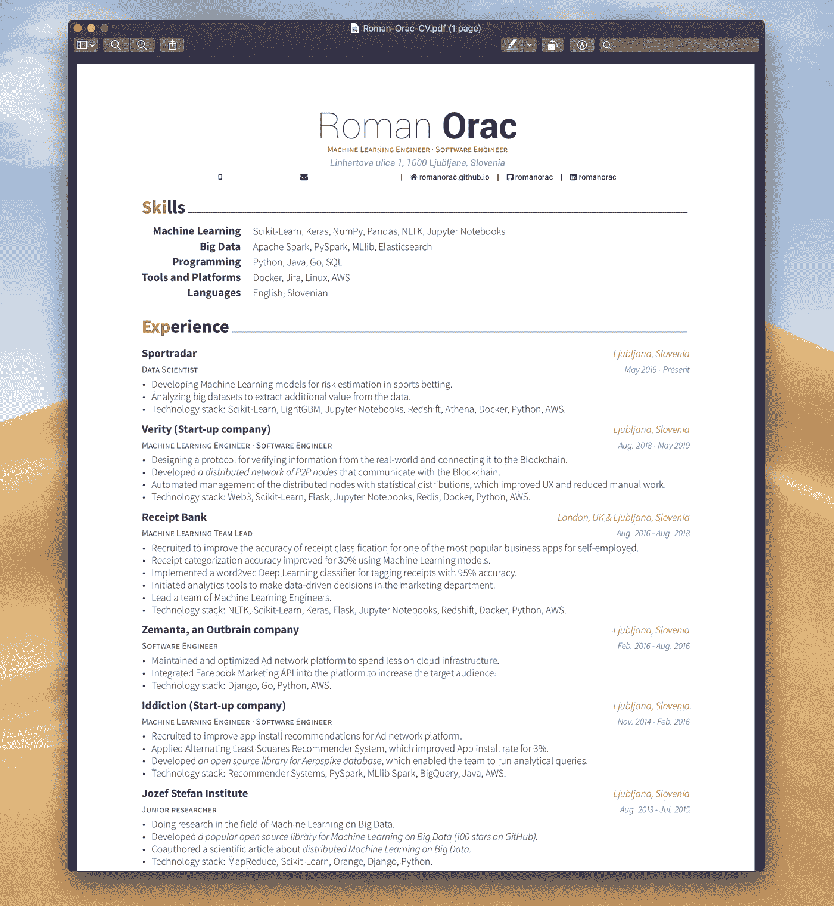
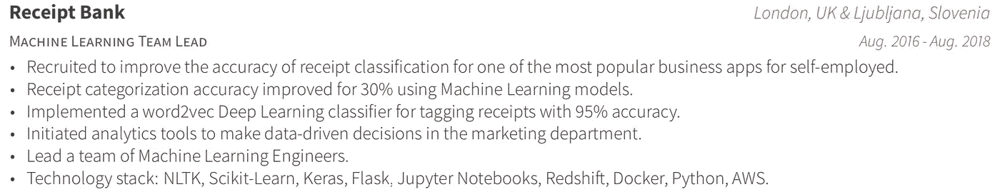

# 如何写出完美的数据科学简历

> 原文：<https://towardsdatascience.com/how-to-write-the-perfect-data-science-cv-72213d546ebf?source=collection_archive---------10----------------------->

## 这些提示也适用于软件工程师。在你的简历上做一些改变，获得那份工作！


克里斯蒂娜@ wocintechchat.com 在 [Unsplash](https://unsplash.com?utm_source=medium&utm_medium=referral) 上的照片

写一份好的简历可能是求职中最艰难的挑战之一。

大多数雇主在将每份简历放入“是”或“否”栏之前，只花几秒钟浏览一下。

这里有 5 个技巧可以增加你的简历获得通过的几率。

## **这里有几个你可能会感兴趣的链接:**

```
- [Complete your Python analyses 10x faster with Mito](https://trymito.io/) [Product]- [Free skill tests for Data Scientists & ML Engineers](https://aigents.co/skills) [Test]- [All New Self-Driving Car Engineer Nanodegree](https://imp.i115008.net/c/2402645/1116216/11298)[Course]
```

您愿意阅读更多这样的文章吗？如果是这样，你可以点击上面的任何链接来支持我。其中一些是附属链接，但你不需要购买任何东西。

# 1.漂亮的设计


照片由 [Neven Krcmarek](https://unsplash.com/@nevenkrcmarek?utm_source=medium&utm_medium=referral) 在 [Unsplash](https://unsplash.com?utm_source=medium&utm_medium=referral) 上拍摄

你的简历应该反映你未来的潜力。

我一直认为一份设计精美的简历并不重要——我们不是设计师，所以没有人会期待一份来自数据科学家的精美简历，对吗？

嗯，我错了！

当你申请一个偏远的职位或者一个有成千上万份申请的大公司的职位时，一份精致的简历变得很重要。

在欧洲，我们有一个标准化的简历模板，叫做 [Europass](https://europass.cedefop.europa.eu/) 。虽然它有一个在线编辑器和令人惊讶的良好用户体验，但最终结果并不令人满意。



我的 2 页欧洲通行证简历。

Europass CV 枯燥的设计并不能吸引眼球。并不能体现你未来的潜力。

## 引人注目的简历



我用 [Awesome-CV](https://github.com/posquit0/Awesome-CV) 模板写了我的简历。

写一份吸引眼球的简历不需要设计技巧。

[Awesome-CV](https://github.com/posquit0/Awesome-CV) 是一个漂亮的 CV 模板，在里面你只需要改变内容。您也可以根据自己的喜好改变颜色，使其个性化。

这个漂亮的简历模板是用 LaTeX——一个高质量的排版系统制作的。LaTeX 是科学文献交流和出版的事实标准。

用 [Awesome-CV](https://github.com/posquit0/Awesome-CV) 创建 CV 的先决条件是在你的电脑上安装 [LaTeX](https://www.latex-project.org/) 。

完成编辑后，您需要用 LaTeX 编译 CV，它会输出一个 PDF。

# 2.少即是多


照片由[普拉蒂克·卡蒂亚尔](https://unsplash.com/@prateekkatyal?utm_source=medium&utm_medium=referral)在 [Unsplash](https://unsplash.com?utm_source=medium&utm_medium=referral) 拍摄

许多申请人会写一份长达数页的简历。

雇主没有时间审查长格式的简历，所以很多人会自动把它们放在“不”的那一堆。

不相信我？

看一看 Joseph Redmon 的简历——YOLO(统一的实时物体检测引擎)背后的想法。

这是一份一页长的简历，看起来像是来自一部漫画。但它引人注目。

我建议写一页纸的简历，因为它会迫使你浓缩你的工作经验。

# 3.针对申请者跟踪系统进行优化


由 [Kelly Sikkema](https://unsplash.com/@kellysikkema?utm_source=medium&utm_medium=referral) 在 [Unsplash](https://unsplash.com?utm_source=medium&utm_medium=referral) 上拍摄的照片

像谷歌和苹果这样的大公司每个职位空缺都会收到成千上万份申请。招聘人员不能有效地审查所有人，所以他们使用申请人跟踪系统(ATS)。

ATS 是一款扫描和分析你简历的软件。招聘人员只看到你简历的记分卡，这是扫描的最终结果。

简历中包含与你申请的职位相关的关键词是很重要的。

大数据工程师职位的重要关键词是大数据、Hadoop、Spark、Redshift 等。

# 4.将最重要的成就放在首位


由[福赞·萨里](https://unsplash.com/@fznsr_?utm_source=medium&utm_medium=referral)在 [Unsplash](https://unsplash.com?utm_source=medium&utm_medium=referral) 拍摄的照片

把自己放在招聘者的角色中。你会如何审阅一份简历？

你很可能会浏览每个要点的前几个词。

招聘人员也是这样做的。

确保首先列出你最重要的成就。把繁琐的工作放在最后。

不要写你做的工作，而是描述你得到的结果。写下你的工作对商业的影响。

如果你能量化你所做的工作就更好了。使用“降低成本”、“自动化流程”、“优化”等句子

例如:

*   启动分析工具，在营销部门做出数据驱动的决策，
*   具有统计分布的分布式节点的自动化管理，
*   维护和优化广告网络平台，以减少在云基础设施上的支出。

# 5.不要太深入细节


照片由[屋大维丹](https://unsplash.com/@octadan?utm_source=medium&utm_medium=referral)在 [Unsplash](https://unsplash.com?utm_source=medium&utm_medium=referral)

当描述你的项目时，不要太详细——只列出最重要的细节。

简要描述这个项目是关于什么的，它解决了什么问题，提到有趣的事实，比如“我们的应用程序是英国‌the iPhone‌商业应用程序月”。

描述你在项目中的角色、面临的挑战和解决方案。被招募来提高一个最受欢迎的自由职业者商业应用分类的准确性。

尝试量化结果:使用机器学习模型，分类准确率提高了 30%。

用你用过的技术添加一个技术栈:Python，sklearn 等。



一个好的项目描述的例子。

# 结论


安德烈·格林克维奇在 [Unsplash](https://unsplash.com?utm_source=medium&utm_medium=referral) 拍摄的照片

拥有一份精致的简历会增加你被雇主看到的机会。你会脱颖而出的。

希望这些建议能帮你找到那份工作！如果你有其他建议，请在评论中告诉我。

# 在你走之前

在 [Twitter](https://twitter.com/romanorac) 上关注我，在那里我定期[发布关于数据科学和机器学习的](https://twitter.com/romanorac/status/1328952374447267843)消息。


照片由[Courtney hedge](https://unsplash.com/@cmhedger?utm_source=medium&utm_medium=referral)在 [Unsplash](https://unsplash.com/?utm_source=medium&utm_medium=referral) 上拍摄