# 如何用 Python 编写用户友好的命令行界面

> 原文：<https://towardsdatascience.com/how-to-write-user-friendly-command-line-interfaces-in-python-cc3a6444af8e?source=collection_archive---------2----------------------->

## 让人们喜欢你的应用程序的第一步


[沃洛德梅尔·赫里先科](https://unsplash.com/@lunarts)在 [Unsplash](https://unsplash.com/) 上的照片

你在 Python 101 课程中学到的最重要的技能之一是如何使用命令行界面(CLI)运行 Python 代码，这实质上是你的 Python 之旅的起点。命令行应用程序最大的优点是它可以灵活地与其他应用程序结合，并且可以在大多数操作系统中运行。

当我们设计一个命令行应用程序时，我们花了大部分时间考虑应用程序的核心功能，这使得我们有时忽略了 CLI 设计的重要性。过去，我会根据“*常识”*或我写的一些文档，假设我的用户知道他们应该向 CLI 提供什么。直到我被一些设计糟糕的命令行界面弄糊涂，我才意识到用户友好的重要性。

在本文中，我想解释用户友好的重要性*(展示你的同情心)*以及我们如何使用 Python 中的 5 个不同库创建用户友好的 CLI。我相信这会让你的用户更开心。

## 为什么我需要设计一个用户友好的界面？

在进入实现之前，让我们先回答这个问题:为什么我甚至关心接口？`python xx.py`还不够吗？如果你想让你的用户动态配置你的程序，答案是否定的。假设你的程序需要处理一个文件。比起在代码中硬编码 filepath，更明智的解决方案是允许用户将 filepath 传递给命令行接口:`python read_file.py --file_path f.txt`，这样用户就可以同时处理多个文件，而不用修改代码。所以经验法则是**如果你想让你的用户配置你的程序，那么请考虑创建一个 CLI** 。不过，有一点需要注意的是，您应该避免像命令注入这样的漏洞，我稍后会谈到这一点。

## 用户友好是什么意思？

本文中提到的原则遵循[命令行界面指南](https://clig.dev/)，这是一个关于通用 CLI 设计的令人敬畏的指南。当我们创建 Python CLI 时，我们关心这些方面:

*   **易于发现**:不要假设用户知道或记得他们应该做什么。当出现错误时，可发现的 CLI 提供大量帮助文本、示例和建议。
*   **健壮性**:CLI 应该期待来自用户的意外输入。应该优雅地处理错误，而不是抛出可怕的回溯。有时，根据具体情况，运算也应该是幂等的。
*   **提供足够的信息:**提供过多和过少信息之间的平衡。这也是在不让人迷路和不使代码过于复杂之间的权衡。

在下面的例子中，我们将坚持这些原则，并给出不同的实现细节。

## 用例语句

为了便于比较不同的方法，我们将在本文中使用同一个例子。我们将为您生成一个*接种二维码*。CLI 将要求并验证用户输入，并调用 [QR 码生成器 API](https://goqr.me/api/) 来生成 QR 码。

> 我们都知道这只是一个例子，对吗？不要把这个二维码给任何权威人士看。:)

简单来说，用户需要提供*姓名*、*出生日期*、*疫苗生产商*、*接种日期。*用户可以提供 1 条以上的接种记录。

这是代码的核心功能。我还在 dataclass 中做属性验证。你可以看看我的一篇关于用 Python 验证类属性的多种方法的文章。

[主要功能](https://gist.github.com/highsmallxu/5479d6dc72f4d1d2a9b6fa6c9901f441)

## 默认解决方案 argparse

在[命令行界面指南](https://clig.dev/)中的第一个基本指南是**使用命令行参数解析库，在那里你可以**。让我们来看看 Python 中的内置解决方案: [argparse](https://docs.python.org/3/library/argparse.html) 。

[arg parser 的示例](https://gist.github.com/highsmallxu/4eeb19e2a024e5cfc795ad1d031737ce)

在这段代码中，我们做了很多事情。我们创建了一个带有程序描述的`ArgumentParser`。然后我们向解析器添加许多参数。基本上有两种类型的参数:位置参数和可选参数。

位置参数是必需的，它们的位置定义了它们的功能。当参数的顺序很重要时，这很有用。例如，您想将一个文件从源位置复制到目标位置，那么将源路径放在目标路径前面是有意义的。

但是在这个例子中，参数的顺序根本不重要，所以我们可以使用可选参数。然而，这些参数都不是真正可选的。都是二维码要求的。我们可以通过给每个参数加上`required=True`来迫使它们成为强制性的。您还可以通过添加整数参数更需要的`type`来强制进行类型检查。`help`包含对论点的描述。如果论点期望某种格式或任何种类的限制，你可以在`help`中提及。

另一个方便的参数是`choices`。在这个例子中，有一个被认可的疫苗制造商的列表。您当然可以像我最初做的那样在`Vaccination`类中验证它，但是您也可以将它添加到解析器中，以便尽快向用户发出信号。

本例中关于参数的最后一个好特性是`nargs`，这是应该使用的参数数量。`nargs`将不同数量的参数与单个动作相关联。当用户需要提供项目列表时，这很有用。它支持[多值](https://docs.python.org/3/library/argparse.html#nargs)，在本例中，我们使用`+`，意味着必须至少有一个元素存在，否则将会产生一个错误消息。除了这个最小长度检查，我们还检查`manufacturer`和`date`的长度，如果它们不匹配，立即返回出口 1。请记住，CLI 应该在成功时返回零退出，在失败时返回非零退出。

说到这里，这里是你如何使用不同语法的 CLI，得到不同的结果。如果你不知道你应该提供什么，你可以输入`--help`来打印出所有的参数和它们的描述。

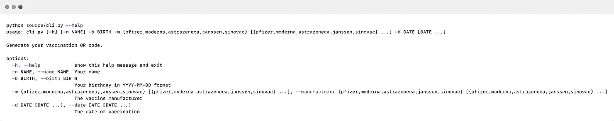

—帮助(由[高](https://medium.com/u/2adc5a07e772?source=post_page-----cc3a6444af8e--------------------------------)创建)

这是正确调用 CLI 的方法。您可以使用较短的名称或较长的时间，参数的顺序并不重要。

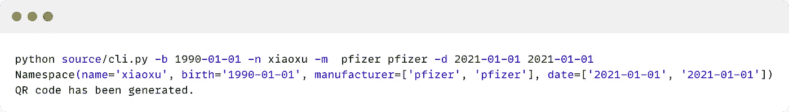

正确格式:使用参数的简称(由[高](https://medium.com/u/2adc5a07e772?source=post_page-----cc3a6444af8e--------------------------------)创建)

下一部分是错误处理。按照指南，错误应该被捕获并以人类可读的格式重写。如果有意外的错误，提供更多的信息(例如回溯)和关于如何提交 bug 的说明。

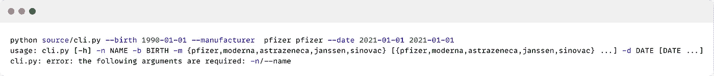

Miss name 参数，由 argparser 处理(由[高](https://medium.com/u/2adc5a07e772?source=post_page-----cc3a6444af8e--------------------------------)创建)

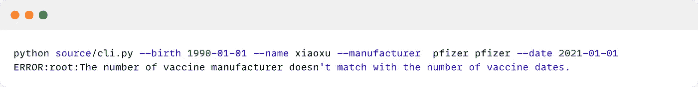

这里错过一个日期，由自定义验证处理(创建者[高](https://medium.com/u/2adc5a07e772?source=post_page-----cc3a6444af8e--------------------------------))

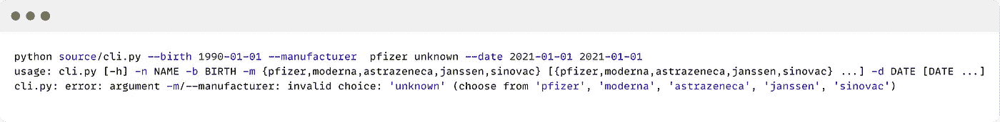

无效制造商，由 argparser 处理(由[高](https://medium.com/u/2adc5a07e772?source=post_page-----cc3a6444af8e--------------------------------)创建)

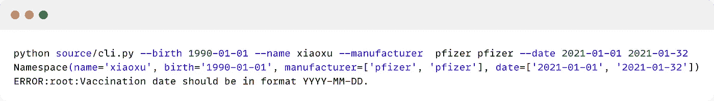

无效的日期格式，由自定义验证处理(由[高](https://medium.com/u/2adc5a07e772?source=post_page-----cc3a6444af8e--------------------------------)创建)

事实上，还有更多。argparser 提供了更多的特性。例如，您可以使用`action="append"`来允许类似`-m pfizer -m pfizer`的重复参数，这将导致名称空间对象中的`manufacturer=[['pfizer'],['pfizer']]`。您还可以使用`default`为缺少的参数分配默认值。

像往常一样，看看这篇来自 RealPython 的关于 argparse 的伟大文章。

<https://realpython.com/command-line-interfaces-python-argparse/>  

## 基于装饰的解决方案—单击

[Click](https://click.palletsprojects.com/en/8.0.x/) 是一个第三方 Python 包，用于以可组合的方式用尽可能少的代码创建 CLI。我最喜欢 Click 的地方是它基于 decorator 的解决方案，它使代码看起来非常干净，并且去掉了一些样板代码。我也觉得这比 argparse 更人性化*(我是说对开发者)*。

这就是如何使用 Click 完成同样的操作。你先从`@click.command`开始，让函数变成点击命令行工具。然后使用`@click.option()`添加一系列选项。Click 附带了许多方便的功能。例如，您可以使用定制逻辑通过`callback`来验证一个参数。在这个例子中，`birth`和`date`可以使用相同的`validate_date()`功能。而且，`click.Choice`可以和`case_sensitive=False`不区分大小写。

[点击](https://gist.github.com/highsmallxu/a820246c0707b9d635b44627207f58ba)的例子

这是帮助信息。

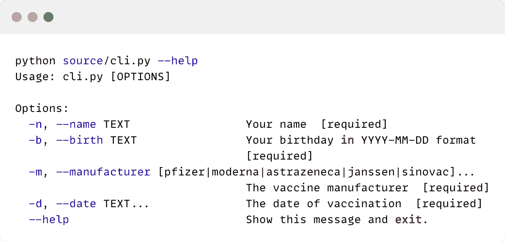

—帮助(由[高](https://medium.com/u/2adc5a07e772?source=post_page-----cc3a6444af8e--------------------------------)创建)

以及验证错误的结果。

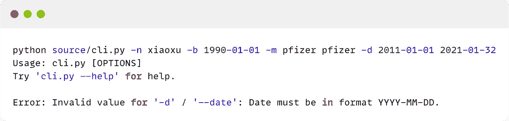

失效日期(创建人[高](https://medium.com/u/2adc5a07e772?source=post_page-----cc3a6444af8e--------------------------------))

Click 的另一个超级好看的功能是[提示](https://click.palletsprojects.com/en/8.0.x/options/#prompting)。你只需要给每个选项加上`prompt="<Your message>"`就可以了。这是添加 prompt 后的样子。

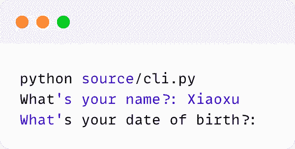

启用点击提示(由[高](https://medium.com/u/2adc5a07e772?source=post_page-----cc3a6444af8e--------------------------------)创建)

这个例子不能展示 Click 所有的[好特性](https://click.palletsprojects.com/en/8.0.x/why/#why-click)。除了这些基本功能，Click 还支持从环境变量中加载值的**。从某种意义上说，它是完全可组合的，你可以**链接多个命令**并将一个命令的结果发送给下一个命令。还有一堆[高级模式](https://click.palletsprojects.com/en/8.0.x/advanced/)和[实用程序](https://click.palletsprojects.com/en/8.0.x/utils/)，使得交互更加用户友好。**

## 站在打字者的肩膀上

[Typer](https://typer.tiangolo.com/) 是一个基于 Click 的酷库。它没有使用 decorator，而是利用 Python 中的**类型提示**来配置和验证参数。例如，要定义一个应该从一组预定义的值中获取的参数，您可以创建一个 Python `Enum`对象。

这是 Typer 的示例代码。正如您所看到的，一切都是在类型中管理的，因此您可以专注于主函数中的业务逻辑，而不是编写许多包装器和样板代码。

[打字者的例子](https://gist.github.com/highsmallxu/7cd989b4e257969ebcd5299f949c8269)

## 文档驱动的解决方案— Docopt

Docopt 使用了与以前的工具完全不同的方法。它充分利用了 Python 脚本中的 docstring。根据 [PEP 257](https://www.python.org/dev/peps/pep-0257/) ，脚本的 docstring 应该可以作为它的“用法”消息放在脚本的顶部。Docopt 将解析 docstring 并自动生成帮助消息来描述命令行界面。

在某种程度上，我喜欢这种方法，因为它从需求(文档)开始，然后是实现。但是另一方面，docstring 应该如何编写是非常严格的。它不像 Click 那么灵活，错过了许多开发者友好的特性，如回调函数、数据验证等。一般来说，它没有其他工具那么程序化。

但是我们还是来看看如何在我们的例子中使用 Docopt。

[doc opt 的例子](https://gist.github.com/highsmallxu/3ff84e8d9729a3796d428819a11003eb)

如您所见，Docopt 成功解析了参数。`[`表示可选元素，`(`表示必需元素。在本例中，制造商和日期应该至少有一个参数。但是除了解析文档之外，它什么也不做。我们需要提供自定义函数来从不同的角度验证输入(例如，类型检查、值检查等)。我跳过这一部分，因为这不是本文的重点。但就个人而言，我喜欢这部分尽可能由 CLI 库处理，以保持代码看起来整洁。

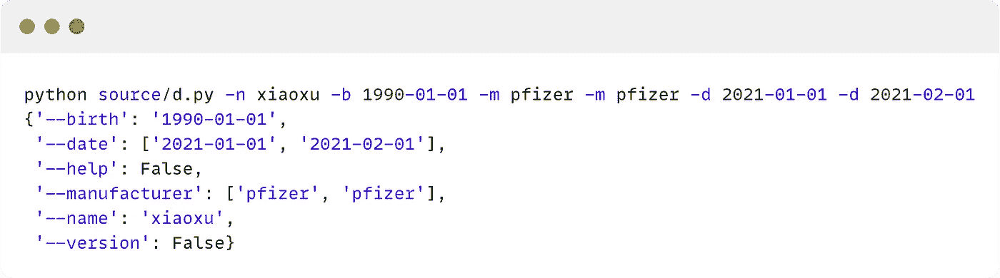

参数是如何存储在 Docopt 中的(由[高](https://medium.com/u/2adc5a07e772?source=post_page-----cc3a6444af8e--------------------------------)创建)

## 从任何 Python 对象构建 CLI—Fire

最后，另一个有趣的 Python CLI 库叫做 [Fire](https://github.com/google/python-fire) ，由 Google 开发。Fire 的主要特点是可以灵活地从任何 Python 对象生成 CLI，这不仅意味着函数，还意味着类、模块、对象、字典、列表等。在我看来，就程序如何接受输入参数以及如何调用和组合命令而言，它比其他 CLI 库更有创意。但另一方面，它没有为回调函数、验证等提供现成的解决方案，比如 Click 和 Typer。

让我们检查代码。Fire 没有提供很多选项来配置参数本身，这意味着验证需要包含在主函数中，有点像 Argparser 示例。但是它实际上可以解析函数的 docstring，并在你做`--help`的时候显示出来。

[火灾示例](https://gist.github.com/highsmallxu/421fbbf431d2352a487d1c211b912807)

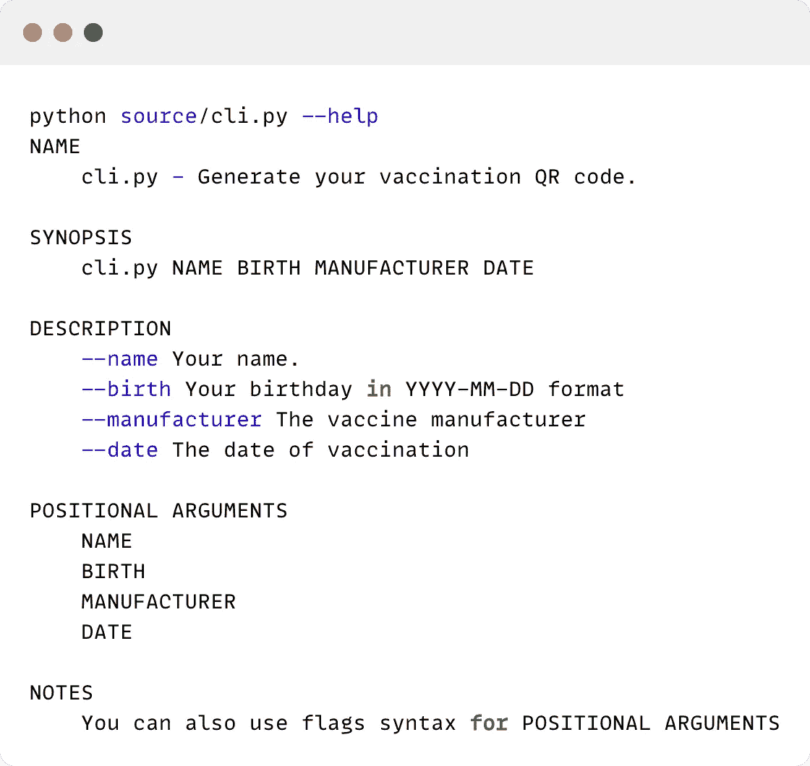

—火中取栗(由[高](https://medium.com/u/2adc5a07e772?source=post_page-----cc3a6444af8e--------------------------------)创造)

让我们来看看 Fire 的酷功能，它创建了一个基于类的 CLI。在这个例子中，我们有类`QRCode`。但是 Fire 似乎不支持像`Vaccination`这样的复杂数据类型，所以我们必须改变类来接收原始数据类型。另一个问题是，我们希望提供疫苗制造商列表和疫苗日期列表。这在这个基于对象的解决方案中也是不可能的，因为你不能有 2 个`*vargs`。你能做的是像`--vaccine "["pfizer","pfizer"]"`一样传递一个字符串形式的列表，并在代码中解析它，但这不是一个非常优雅的解决方案。

下面是命令。方法名也是命令名。可以添加更多类似`validate()`或`print()`的方法(命令)。

```
python source/cli.py generate --name xiaoxu --birth 1990-01-01 --vaccine pfizer --date 2021-01-01
```

一个类调用多个命令并不是强制性的。您也可以使用基于[函数的方法](https://github.com/google/python-fire/blob/master/docs/guide.md#version-1-firefire-1)，其中每个函数名都是一个命令，不指向`fire.Fire()`中的任何特定函数。另一个很好的特性是你如何在 Fire 中把[命令](https://github.com/google/python-fire/blob/master/docs/guide.md#grouping-commands)组合在一起。与 Click 不同，Fire 基本上使用一个新的类将不同的类/功能粘合在一起。总的来说，它很好地集成了不同类型的 Python 对象。

## 避免命令注入

正如本文前面提到的，当我们创建 CLI 时，我们必须非常小心地处理用户输入，因为用户可以键入任何内容，包括可执行代码。我们应该避免命令注入，类似于 SQL 注入的注入攻击。危险在于恶意代码被发送到您的应用程序并破坏您的环境。[命令注入](https://www.imperva.com/learn/application-security/command-injection/)本身就是一个大话题，在任何编程语言中都可能发生。

这是任意命令注入的一个例子。它使用`eval`来动态评估用户的输入。想象一下用户输入`rm -rf /`，那么你的环境就真的完蛋了。`eval()`在 bandit 中被标记为[不安全函数](https://bandit.readthedocs.io/en/latest/blacklists/blacklist_calls.html#b307-eval)。尽量避免。

[命令喷射](https://gist.github.com/highsmallxu/45ecda0e22984f2859a42eeb2241c043)

再比如上传文件。如果您的 CLI 允许用户上传文件，这些文件可能包含恶意代码。确保读取文件的库是安全的，例如，使用`yaml.safe_load()`而不是`yaml.load()`。

经验法则是避免动态评估用户的输入。如果不可避免，应对用户输入进行严格验证，以降低风险。

## 结论

到目前为止，我已经向您展示了创建 Python CLI 的 5 个不同的库。每个图书馆都有自己的特色。这里有一点总结:

*   Argparse: Python 内置包。这是整个分析的基准。虽然与其他很酷的库相比，它可能看起来很乏味，但它仍然是您在构建 CLI 时需要学习的第一个库。它可以涵盖 CLI 应用程序的大多数基本要求，但是您可能需要围绕参数创建许多包装器来满足某些要求。
*   Click:一个非常酷的基于装饰器的 CLI 库。所有的参数都可以通过 decorators 来配置，这使得主代码非常干净。它还提供了许多开发人员友好的实用程序，如回调函数、区分大小写的设置、组命令等。
*   Typer:基于类型提示的 CLI 库，依赖于 Click。它充分利用 Python 中的类型来实现与 Click 类似的功能。
*   Docopt:这个 CLI 库通过解析脚本 docstring 来理解参数。我不得不承认这不是我喜欢的，因为它真的限制了你应该如何写文件，而且在将规则应用于论点时，它不太灵活，也不太直接。但是如果您是一个习惯于编写适当的 docstring 的人，您可能会喜欢它。
*   Fire:一个非常有创意的 CLI 库，可以基于任何 Python 对象创建 CLI。老实说，如果你不告诉我，我不会知道这是一个构建 CLI 的库，因为它没有任何显式的 CLI 语法。它与 Python 对象很好地集成在一起，例如创建一个单独的类来将命令分组在一起。但是它在参数验证方面没有那么强大。

哪一个是你最喜欢的？对我来说，我更喜欢 Typer 和 Click，因为它们功能丰富，而且与主要业务逻辑无关。请在评论中告诉我你的偏好！

## 参考

<https://realpython.com/comparing-python-command-line-parsing-libraries-argparse-docopt-click/#packaging-click-commands>  <https://codeburst.io/building-beautiful-command-line-interfaces-with-python-26c7e1bb54df>  <https://www.stackhawk.com/blog/command-injection-python/> 