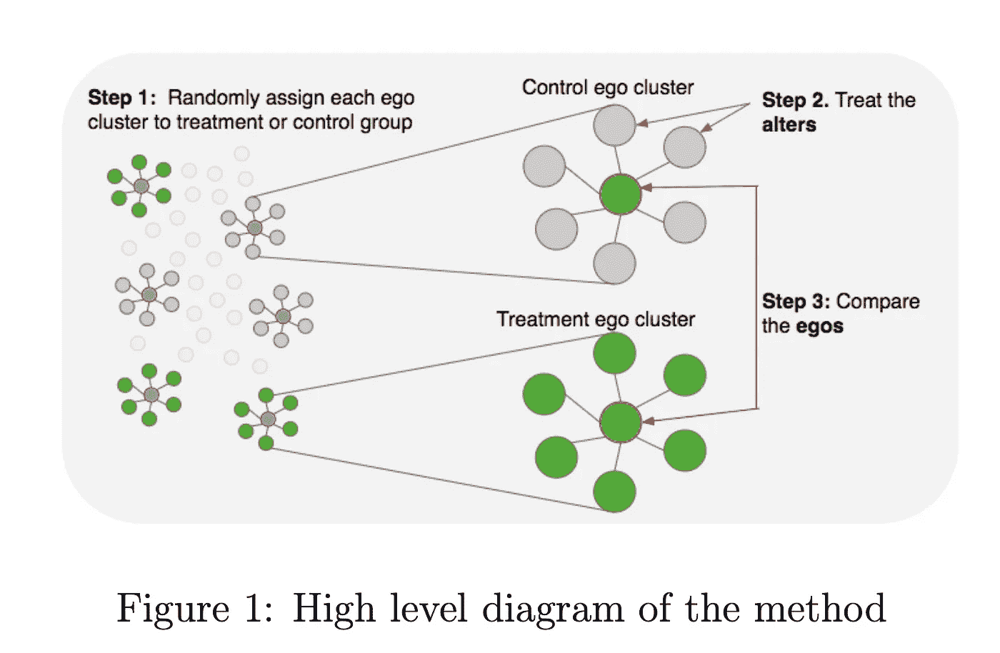
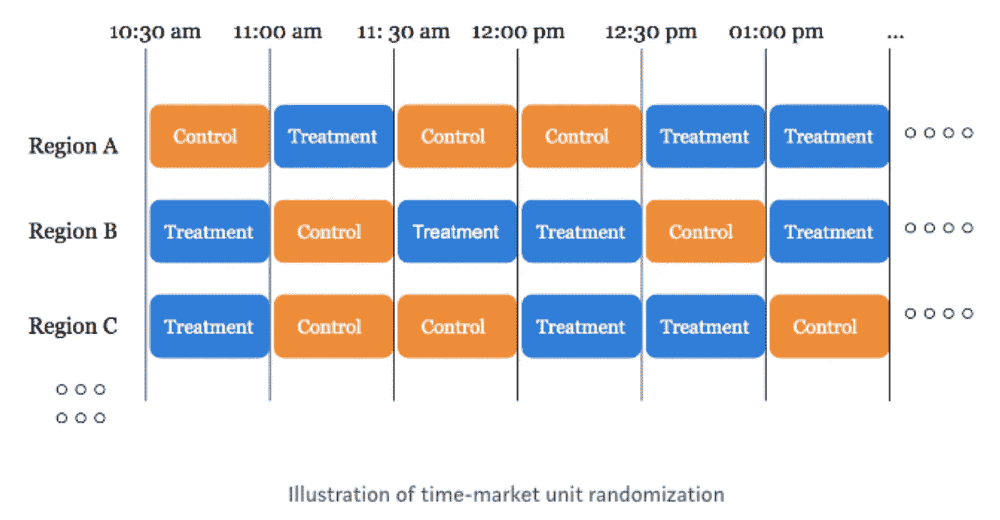

# 用户的干扰是如何搞乱你的 A/B 测试的

> 原文：<https://towardsdatascience.com/how-user-interference-may-mess-up-your-a-b-tests-f29abfcfccf8?source=collection_archive---------23----------------------->

## [行业笔记](https://towardsdatascience.com/tagged/notes-from-industry)，实验和因果推断

## 来自 Lyft、LinkedIn 和 Doordash 的三个解决方案

由[托姆·霍姆斯](https://unsplash.com/@thomholmes?utm_source=unsplash&utm_medium=referral&utm_content=creditCopyText)在 [Unsplash](https://unsplash.com/s/photos/spill?utm_source=unsplash&utm_medium=referral&utm_content=creditCopyText) 上拍摄的照片

# 介绍

一个严格的 A/B 测试过程会产生与产品成功直接相关的消费者行为的宝贵见解。通常情况下，项目经理采用迭代的方法来优化产品:A/B 测试变体→找到赢家→推出赢家→新一轮 A/B 测试→...

> 有疑问的时候，A/B 测试一下！

在过去的一年里，全球疫情大大增加了消费者的在线存在，使得大规模跟踪和分析消费者行为数据变得更加容易。难怪公司会将注意力转向在线用户行为，并花费大量资源试图建立自己的实验平台。目标是从实验数据中更好地了解客户。

**然而，许多新公司并不具备该领域的专业知识和多年的经验来建立成功的测试。**

在之前的一篇文章中，我讨论了让你的商业实验失败的 8 个常见错误。如果你没有机会，请看看。

</online-controlled-experiment-8-common-pitfalls-and-solutions-ea4488e5a82e>  

今天的帖子分享了在个人层面上简单的 A/B 测试导致有偏见的估计并可能导致错误决策的场景。更重要的是，它讨论了大型科技公司(Lyft、LinkedIn 和 Doordash)解决这一问题的三种策略。

# 什么是用户干扰？为什么它很重要？

为了从 A/B 测试中做出有效的推断，我们要求*一个单元的潜在结果不应该受到其他单元*的特定分配的影响，也就是。[稳定单位处理值假设，](https://en.wikipedia.org/wiki/Rubin_causal_model#Stable_unit_treatment_value_assumption_(SUTVA))[(](https://en.wikipedia.org/wiki/Rubin_causal_model#Stable_unit_treatment_value_assumption_(SUTVA))鲁宾，1978，1980)；否则，如果假设被违反，我们会得到有偏差的估计。

这里有一个简单的例子。

脸书的 Messenger 团队试图了解新产品功能(例如，新的表情符号)对用户参与度的影响，通过应用程序上的时间来衡量。一个简单的随机化策略在用户层面将一半人口分配到治疗组，另一半分配到对照组。

由于用户在平台上联系在一起，随着他们的治疗朋友增加(或减少)参与度，未治疗组增加(或减少)在应用上花费的时间。由于用户干扰，最初的分配策略没有如预期的那样工作，这明显违反了 SUTVA 假设。

(为了解决这种类型的网络干扰，我们可以应用下面描述的第二种和第三种解决方案。)

用户干扰无处不在，并导致对治疗大小及其方向性的有偏估计。具体来说，它会导致高估或低估真实的治疗效果。实证研究和模拟表明，干扰的偏差范围从 1/3 到与处理效果相同的大小(Blake 和 Coey，2014；霍尔茨等人，2020；弗拉德金，2019)。

此外，它打乱了治疗的方向，例如，将积极的效果变成消极的；反之亦然。

汤姆·霍尔姆斯在 [Unsplash](https://unsplash.com/s/photos/spill?utm_source=unsplash&utm_medium=referral&utm_content=creditCopyText) 上拍摄的照片

# 如何在用户干扰下进行 A/B 测试？

用户干扰的存在不会使 A/B 测试无效。相反，它要求更仔细的设计规划和思考。谈到解决方案，公司已经根据干扰的性质提出了几种策略。没有一个“万能”的解决方案能神奇地一次解决所有类型的干扰。

> 好吧，一个好的开始是探索干扰的本质和随机化的水平。

在接下来的章节中，我将分享科技公司最常用的策略。

## 解决方案 1:更粗糙的随机化水平

一家拼车公司(如 [Lyft](https://eng.lyft.com/experimentation-in-a-ridesharing-marketplace-b39db027a66e) )希望检验一种新的匹配算法是否能提高用户留存率。是否可以将骑手随机分配到治疗/非治疗条件下，并比较组均值？

不会，因为同一地理位置的骑手共享同一个司机池，并且由于司机池有限，一个组中的任何用户变化都会影响另一个组。

如图所示，干扰是由聚集在特定地理位置的单元造成的。因此，解决方案也在于操纵位置。**我们可以在更粗略的级别(如城市、地区)管理随机化流程，而不是在个人用户级别。**

然而，权衡是存在的。粒度越粗，研究的单位就越少，方差就越大，因此与粒度更细的随机化(在个体水平)相比，检验的统计功效更低(Kohavi 等人，2020)。

为了增加其有效性，我们必须将其与其他准实验设计(如[差异](/does-minimum-wage-decrease-employment-a-difference-in-differences-approach-cb208ed07327?sk=9b4ec9afcef8bee1041720945cd0dd7d)或观察设计(如[匹配](/an-ultimate-guide-to-matching-and-propensity-score-matching-644395c46616?sk=e05b5a1a5bc741a2664159b599b56003))相结合。

根据经验，我们将数据聚合到这样的粒度级别，即每个单元不会相互影响，并且仍然有足够数量的观察值。

*延伸阅读:*

<https://eng.lyft.com/experimentation-in-a-ridesharing-marketplace-b39db027a66e>  <https://netflixtechblog.com/quasi-experimentation-at-netflix-566b57d2e362>  

## 解决方案 2:自我-集群随机化

LinkedIn 想知道一项新功能的性能如何。

他们能 A/B 测试一下吗？

不，原因与上述脸书的例子相同。

对于社交媒体公司来说，互联用户之间存在高度干扰。给人 A 和 A 的所有关系人治疗也将被治疗，不管他们最初的治疗状态如何。因此，简单的 A/B 测试是不可能的。在这种情况下，干扰不是由地理位置引起的，而是由连接的网络引起的。

例如，我的 LinkedIn 连接遍布世界各地，无法按照地理位置进行聚类。因此，如解决方案 1 所建议的，更粗糙的随机化水平不会有任何帮助。

LinkedIn 提出了一种新的策略，称为自我-聚类随机化，它将一个焦点人物(" ***自我*** *"* )和她的直系亲属(" ***alter*** ")视为一个聚类，然后在聚类级别随机化处理分配。

结果，整个集群将被分配到相同的实验条件(处理或控制)，而集群之间没有高干扰。

[圣雅克等人，2019](https://arxiv.org/pdf/1903.08755.pdf)

代价是它需要一个高度专业化的工程团队，这是许多公司所缺乏的。

<https://arxiv.org/abs/1903.08755>  <https://www.unofficialgoogledatascience.com/2018/01/designing-ab-tests-in-collaboration.html>  

## **解决方案 3:转回设计**

[Doordash](https://medium.com/@DoorDash/switchback-tests-and-randomized-experimentation-under-network-effects-at-doordash-f1d938ab7c2a) 想要测试动态定价(即高峰时段的额外费用)会如何影响客户体验，这是通过用户保留率来衡量的。

为什么用户级别的 A/B 测试不起作用？

在一个地理位置的消费者中有很高的网络效应。消费者共享相同的 Dasher 车队，在个人层面的随机化过程是不可行的。

如果我们随机将一半人口分配到治疗组，另一半分配到对照组，治疗组只能看到供应平衡的一半好处，而对照组仍然获得部分好处，而没有额外的成本(Kastelman 和 Ramesh，2018 年)，这违反了 SUTVA 假设。

为了减轻网络干扰，Doordash 选择了更高水平的分析，并在不同的地理位置和时间窗口(如下)随机化处理，这被称为折返设计。它在不同的地理-时间级别上打开和关闭治疗，并检查目标指标(用户保持率)的变化。

[卡斯特尔曼和拉梅什，2018 年](https://medium.com/@DoorDash/switchback-tests-and-randomized-experimentation-under-network-effects-at-doordash-f1d938ab7c2a)

与更精细(个体)水平的标准 A/B 测试相比，Switchback 设计具有更少的观察单位，这使得估计不太精确，并且对变化不太敏感。为了提高度量灵敏度，该公司应用了一种称为控制的方法，使用预测作为协变量(CUPAC)，以减少方差并增加转回设计的统计功效( [Tang et al. 2020](https://www.researchgate.net/profile/Yixin-Tang-5/publication/345698207_Control_Using_Predictions_as_Covariates_in_Switchback_Experiments/links/5fab109b458515078107aa8b/Control-Using-Predictions-as-Covariates-in-Switchback-Experiments.pdf) )。

> 在转回设计中，随机化的单位是地理时间窗口。
> 
> 在 A/B 测试中，随机化的单位是个人。

与 A/B 测试不同，Switchback 设计假设集群内部相互依赖，而集群之间相互独立。在个体水平上，相同区域-时间单位内的高度相关性大大低估了使用传统 t 检验的方差，这导致了高假阳性率。为了正确说明组内相关性，建议使用组稳健标准误差( [Tang 和 Huang](https://doordash.engineering/2019/09/11/cluster-robust-standard-error-in-switchback-experiments/) )。

*延伸阅读:*

<https://doordash.engineering/2019/09/11/cluster-robust-standard-error-in-switchback-experiments/>  <https://medium.com/@DoorDash/switchback-tests-and-randomized-experimentation-under-network-effects-at-doordash-f1d938ab7c2a>  <https://doordash.engineering/2020/06/08/improving-experimental-power-through-control-using-predictions-as-covariate-cupac/>  

# 外卖食品

*   您的 A/B 测试中是否存在用户干扰？
*   如果是，分析/随机化的单位是什么？
*   关于粒度级别的争论是在保持足够高的统计能力的同时最小化干扰之间的拉锯战。
*   有三种行业解决方案可供部署:更高的随机化、自我-集群随机化和转回设计。

*Medium 最近进化出了自己的* [*作家伙伴计划*](https://blog.medium.com/evolving-the-partner-program-2613708f9f3c) *，支持像我这样的普通作家。如果你还不是订户，通过下面的链接注册，我会收到一部分会员费。*

<https://leihua-ye.medium.com/membership>  

# 参考

t .布莱克和 d .科伊，2014 年 6 月。为什么市场实验比看起来更难:测试控制干扰的作用。第十五届 ACM 经济学和计算会议论文集*(第 567-582 页)。*

弗拉德金，2015 年。搜索摩擦与在线市场的设计。*工作。Pap。，质量。本月的技术*。

霍尔茨博士、罗贝尔博士、利斯科维奇博士和阿拉尔博士，2020 年。减少在线市场定价实验中的干扰偏差。arXiv 预印本 arXiv:2004.12489 。

Kohavi，r .，Tang，d .和 Xu，y .，2020。*可信的在线控制实验:a/b 测试实用指南*。剑桥大学出版社。

李，h，赵，g，乔哈里，r .和温特劳布，G.Y .，2021。双边市场实验中的干扰、偏差和差异:平台指南。 *arXiv 预印本 arXiv:2104.12222* 。

鲁宾博士，1978 年。因果效应的贝叶斯推断:随机化的作用。*统计年鉴*，第 34–58 页。

鲁宾博士，1980 年。实验数据的随机化分析:费希尔随机化检验评论。*美国统计协会杂志*， *75* (371)，第 591–593 页。

圣雅克，g，瓦什尼，m，辛普森，j 和徐，y，2019。在 LinkedIn 使用自我聚类测量网络效应。 *arXiv 预印本 arXiv:1903.08755* 。

Tang，y .，Huang，c .，Kastelman，d .和 Bauman，j .在转回实验中使用预测作为协变量进行控制。

# 喜欢读这本书吗？

> 请在 [LinkedIn](https://www.linkedin.com/in/leihuaye/) 和 [Youtube](https://www.youtube.com/channel/UCBBu2nqs6iZPyNSgMjXUGPg) 上找到我。
> 
> 还有，看看我其他关于人工智能和机器学习的帖子。