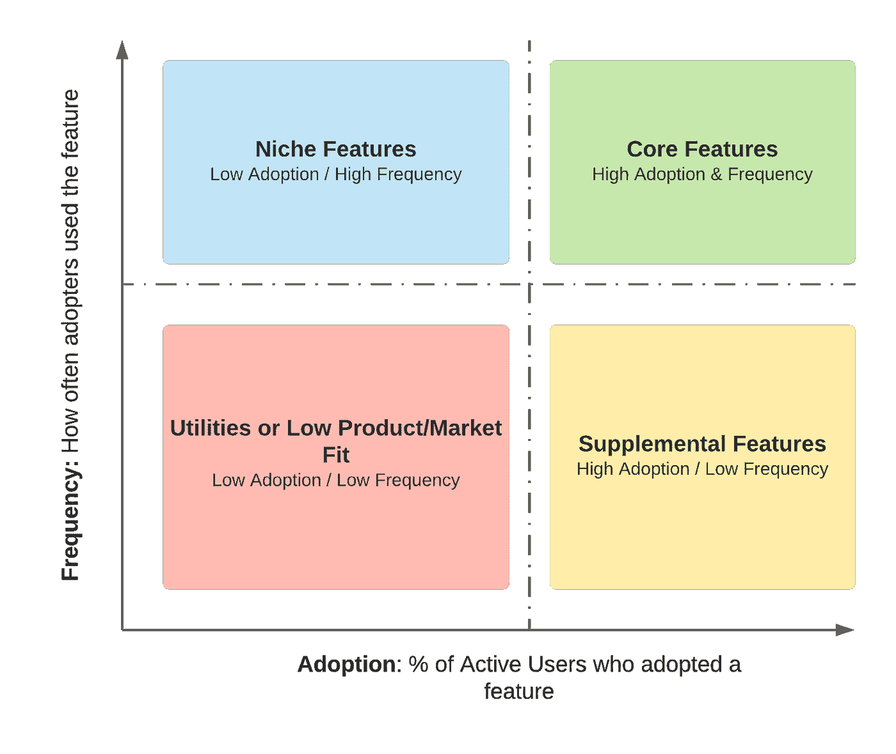
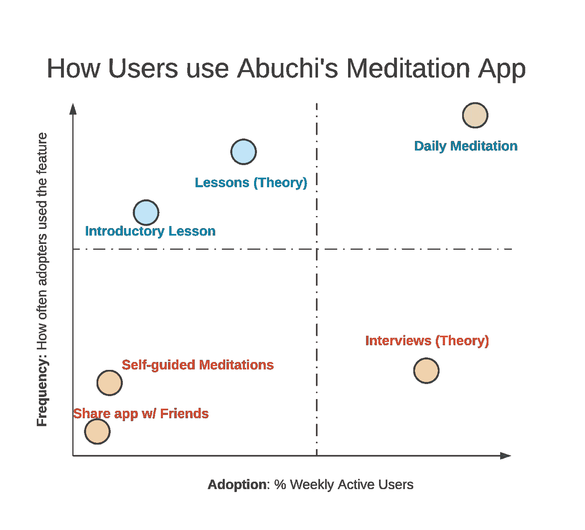

# 用户觉得你产品的特性有多大价值？

> 原文：<https://towardsdatascience.com/how-valuable-do-users-find-your-apps-features-64ddecc92e06?source=collection_archive---------49----------------------->

照片由 [Unsplash](https://unsplash.com?utm_source=medium&utm_medium=referral) 上的[诺里斯尼曼](https://unsplash.com/@norrisniman?utm_source=medium&utm_medium=referral)拍摄

## 引入一个框架来减少噪音，并确定哪些功能需要增长，哪些功能需要停止。

阿布奇正处于一个岔路口:她发现自己是一个成功的冥想应用程序的创造者，该应用程序已经有机地发展到数十万活跃用户。她听取了这些用户的意见，随着时间的推移，给这个应用程序添加了各种功能。然后她被卡住了——她下一步该怎么办？阿布奇知道每个应用程序的功能有多少用户。但是她怎么能告诉她的用户发现哪些功能最有价值，哪些功能她应该取消，哪些功能应该重新开始呢？

这是大多数消费者应用程序生命周期中的一个常见问题，有许多分析可以帮助提供答案(哪些可以有效地货币化？什么会给新用户带来最大的保留率提升？).今天，我们将看看一个框架和可视化，它有助于向应用程序的用户展示一个特性的内在**价值**。

像 Abuchi 一样，大多数团队倾向于跟踪单个功能的采用情况，要么以原始用户的形式，要么以参与率(使用该功能的应用程序活跃用户的百分比)的形式。但采用只讲述了故事的一半:它在衡量广泛的吸引力方面很棒，但将它与使用频率配对是涡轮增压它的价值。

频率是多少？这是对某个特性的采用者在过去几天内使用它的频率的衡量。使用频率高的特性对使用它们的人来说显然是有价值的。

**将采用率和频率绘制在一起**对于所有的应用程序中的特性是它们的**相对值的强大可视化，**并且是在相同的尺度上相互比较它们的有用方式。

这是图表的样子。特征通常属于 4 个部分之一:

特征分割图。作者图片

1.  **核心特性**:这些具有广泛的吸引力，并且一直在使用。在很多情况下，这些特性是用户开始使用你的产品的原因，或者至少会带来大量的流量。他们有明显的产品/市场契合度。对于像亚马逊这样的电子商务网站，搜索他们的目录可能是一个核心功能。
2.  补充功能:这些功能同样具有广泛的吸引力(在某些情况下，甚至更广泛)——但用户并不经常使用它们。补充这个词可能会让这些特性听起来像是可选的，但它们不是。对于亚马逊来说，这很可能是下订单——一个关键的用户行为，推动他们的经济引擎和用户价值。
3.  **小众功能:**对于产品用户群的一部分来说，这些功能非常重要。不是每个人都使用它们，但是那些使用它们的人总是会回到它们那里*。*拥有多样化和庞大用户群的产品往往会表现出这种行为。在亚马逊上购买维生素——不是每个人都这样做，但那些这样做的人可能会偶尔重复他们的订单。
4.  **实用程序或低产品/市场契合度特性:**你可能想赶紧把这些作为需要更多工作的失败品扔在一边。是的，你可能是对的，尤其是如果这个故事片是为了服务广大的观众。但是，对产品功能至关重要的重要实用程序和设置也在这里。社交媒体应用上的隐私选项:不是每个人都需要担心，但对那些担心的人来说，这很重要。访问这些设置的人不需要一直切换它们。

现在，这个**特征分割图**对于 Abuchi 的冥想应用会是什么样子？让我们来看看:

一个冥想应用的虚构特征分割图。作者图片

1.  每日冥想是**的核心特征**。很好——这款应用与冥想者有很强的产品/市场契合度。
2.  介绍性课程是一个特色。这很有意义——它们是为新用户设计的。这些比日常冥想用得少，可能是因为新用户比那些已经升级到日常冥想的用户更不容易坚持。
3.  课程也是一个小众特色。也许只有真正专注的冥想者才会被课程所吸引——但是那些听课程的人往往非常喜欢它们，以至于他们一直在使用它们。事实上，课程甚至可能是他们使用应用程序的主要驱动力；把它们拿走，你可能会完全失去这些用户。
4.  另一方面，面试是一个补充功能。许多用户听它们，也许是因为它们很有趣，但并不经常听。阿布奇意识到，她的应用程序今天没有太多的采访，但这是一个很好的理由，开始在这一领域投入更多。
5.  在**公用事业和低产品/市场契合度特性中**:
6.  分享应用程序肯定属于这里:用户不太可能需要经常这样做，但用户增长方面的好处是值得的。
7.  另一方面，Abuchi 打算让更多的用户使用自我指导冥想。是什么阻碍了它？不难发现:Abuchi 已经确保这个功能在应用程序的主屏幕上有突出的房地产。也许她可以重新利用这个空间来推动更有前景、更高频率的功能的更强采用——比如课程。

阿布奇很兴奋！这张特征划分图给了她很多想法，但在她匆忙做出改变之前，她列出了接下来的步骤:

1.  通过用户研究验证这些发现。虽然强烈的产品意识有助于理解为什么特性表现出这种相对重要性的模式，但与用户交谈是验证这种直觉的一种强有力的方式。也许用户真的想要自我引导的冥想，但正是这个功能的设计让他们放弃了，这是一个很容易解决的问题。
2.  **种植有潜力的作物。**小众功能是考虑增长的一个很好的选择——它们在现有的采纳者中有产品/市场契合度，但其他人可能没有使用它们，因为他们不知道它们的存在。
3.  **杀死无用的东西。**如果 Abuchi 在长时间认真研究后确信某个功能不能解决任何用户问题，她会考虑牺牲它，让她的应用程序更容易使用。

在现实世界中执行这种分析时，您可能需要考虑其他因素:您可以将一些功能组合到图表上的一个点，或者考虑重要的用户人口统计差异(例如国家)。

现在你知道了！

# 概括一下:

**为什么要进行特征分割分析？**了解一个应用内不同特性的*相对* *值*，而不仅仅是跟踪特性的顶线采用情况。测量采用情况和使用频率*一起*讲述一个更完整的故事，并可以帮助识别哪些功能符合产品/市场，哪些功能需要更多工作，以及哪些功能给用户体验增加了不必要的复杂性。

**你应该如何测量频率？**

许多指标可以捕捉频率。以下是几个选项:

1.  使用该功能时活动天数的比例(即，如果用户在过去 7 天中有 5 天是活动的，并且他们在这 5 天中的 4 天使用了该功能，频率= ⅘).
2.  粘性(MAUWAU 或 DAU/毛)
3.  新用户保留率(比如，2 周后保留某个功能的用户百分比)。虽然留存率通常用于衡量产品/市场契合度，但这一指标忽略了应用程序的终身用户(他们可能会表现出非常不同的行为)。