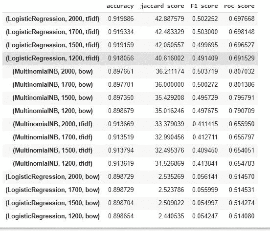

# 你认为你的社交媒体评论有多恶毒？😈

> 原文：<https://towardsdatascience.com/how-vicious-do-you-think-your-social-media-comments-are-204128141eab?source=collection_archive---------23----------------------->

## [实践教程](https://towardsdatascience.com/tagged/hands-on-tutorials)

## 预处理、单词嵌入、模型设计和评估、多标签文本分类

作者图片

该项目旨在建立一个[多标签分类](https://en.wikipedia.org/wiki/Multi-label_classification)模型，能够检测不同类别的毒性:“有毒”、“严重有毒”、“威胁”、“淫秽”、“侮辱”以及每个评论的“身份仇恨”。一条评论可以属于以上一个以上的类别，或者不属于以上任何一个类别。我使用 Regex(正则表达式)、NLTK lib、Bag-of-Words 和 TF-IDF 创建了一个 NLP 数据预处理管道，然后使用监督机器学习模型(如逻辑回归和朴素贝叶斯)对评论进行分类。

## 背景

很明显[人类的行为正在改变](https://scholarcommons.scu.edu/engl_176/2/)；我们的情绪越来越依赖于我们在社交媒体上收到的赞、评论和标签。我们得到好的和坏的评论，但每天在数字平台上看到仇恨的话语、诽谤和有害的想法，让它看起来很正常，而它本不应该如此。有毒评论的影响比我们想象的要灾难性得多。它不仅会伤害一个人的自尊或阻止人们进行有意义的讨论，还会煽动人们做出一些邪恶的行为，如最近美国国会的资本骚乱和对印度抗议农民的攻击。因此，如果我们想在社交媒体平台上维持一个文明的环境，以有效地促进对话，那么建立一个可靠的毒性标记系统是非常重要的。

## **数据集**

该项目中使用的数据集是为 Kaggle 毒性评论分类挑战提供的 [Jigsaw/Conversation AI 数据集](https://www.kaggle.com/c/jigsaw-toxic-comment-classification-challenge/data)。它包含了维基百科的评论，这些评论已经被人类评级员标记为六种类型的毒性。

数据集的快照如下所示:

图 1:数据示例

## **探索性数据分析**

*   评论总数:159，571
*   正派评论(负面类):143346
*   不体面的评论(正面类):16，225

这 16，225 条不体面的评论被贴上了六种不同类型的有毒标签，如图 2 所示。

图 2: *每个类别的评论数量*

请注意，注释可能被分配了多个标签，因此图 3 显示了注释的数量以及与它们相关联的标签数量。

图 3:带有标签数量的注释

该数据集非常不平衡，因为负类与正类的比例为 89.8:10.2。对于这种倾斜的数据集，该模型将在不学习任何东西的情况下，将评论分类为体面评论的默认准确率为 90%。出于同样的原因，在这种情况下，准确性不应该是模型性能的度量。我们需要更具描述性的性能指标。此外，多标签分类问题必须使用与单标签分类问题不同的性能测量来评估。多标签分类度量的一些例子是 k 处的精度、k 处的平均精度、Jaccard 相似性分数、汉明损失、采样 F1 分数等。我使用了 Jaccard 相似性评分，还检查了 F1 评分和 ROC 评分(AUC ),以便更好地评估和选择模型。

在我探索的这一点上，我弄清楚了问题的本质、数据集的统计数据和用于评估模型的评估指标。于是问题出现了——这些类别之间的关联是什么？我假设任何“严重有毒”、“淫秽”、“威胁”、“侮辱”或“身份仇恨”的评论都自动归入“有毒”类别。为了验证这一点，我将“有毒”类别的评论与其他五个类别成对进行了比较，图 4 显示所有 1，595 条严重有毒评论也被标记为有毒评论，证明了我的假设是正确的。

图 4:毒性和重度毒性比较

但是当比较图 5 中的“有毒”和“淫秽”类别时，有趣的是注意到在 8449 条淫秽评论中有 523 条是无毒的。在调查了一些评论后，我得出结论，当评论给人一种总体上负面的感觉，但不包含粗俗的词语时，人类评分者会将该评论标记为淫秽评论。然而，我也看到了被贴上有毒和淫秽标签的评论。对此有什么解释？

图 5:有毒和淫秽对比

接下来，图 6 显示总共有 478 条“威胁”评论，其中 29 条是无毒的。如果这个评论“ ***你会被屏蔽*** ”被贴上“威胁”而非“有毒”的标签是有道理的。但是**的评论*真好笑。你个人被冒犯了？所以写坏事的人会写你，你的名字等等，对吗？如果一个人被某个网站上的评论或绰号冒犯了，那么这个人至少要在精神上成长 500 年以上。如果一个人被前面的评论激怒了，那么这个人必须杀了他/她自己。保重！*** ”被贴上“威胁”而非“有毒”的标签，对我来说没多大意义。

图 6:毒性和威胁比较

当我检查所有 7，877 条侮辱评论时，我发现 533 条侮辱评论是无毒的(图 7)。在进一步的调查中，我发现“侮辱”评论如果不包含刺耳或粗俗的话，就不是“有毒”的。

图 7:毒性和损伤比较

最后，我检查了有毒和身份仇恨评论类别(图 8)，1405 条身份仇恨评论中有 103 条是无毒的，原因是这 103 条评论不包含污秽或粗俗的词语，但它们包含针对种族、肤色、种族、性取向、宗教仇恨等的词语。

图 8:毒性和身份仇恨对比

现在，让我们看看原始评论。

**df.comment_text[0]**

*“解释\ n 为什么在我的用户名“铁杆金属迷”下所做的编辑被恢复了？他们不是故意破坏，只是我在纽约娃娃 FAC 投票后关闭了一些煤气。请不要将模板从对话页面中删除，因为我现在已经退休了。89.205.38.27 "*

在这个例子中，我们看到原始评论有一些不必要的信息，如数字、标点符号和停用词。这些对模型进行预测是没有用的，所以我们在数据预处理中删除了它们。

## **数据预处理**

*   在 regex 库的帮助下，删除非字符、不需要的空格、数字，并将所有字母转换为小写。

这些是我在评论中注意到的模式:

让我们用这些替换来写一个清理文本的函数

*   使用 NLTK 完成词条满足、词干提取、标记化和停用词移除

通过这两个步骤，我们得到干净的注释。现在原始评论看起来像这样:

*“解释编辑做了用户名硬核金属迷还原故意破坏关闭气投纽约娃娃 fac 请删除模板对话页面，因为退休”*

最好是右边！！！

## 基于规则的模型

在转向机器学习模型之前，我想看看我是否可以通过检查评论中是否存在类别的最常用词来预测评论中的所有六个类别。

为此，按标签创建了六个数据集，然后将来自每个数据集的所有单词存储在它们各自的字典(词汇字典)中，并按照降序排列它们各自的出现次数。最后，通过检查字典中的前三个单词在评论中的出现情况来做出预测。

预测毒性、严重毒性、淫秽、威胁、侮辱和身份仇恨等级的基线模型精度为:

*   有毒:89.4%
*   重度毒性:88.2%
*   淫秽:96.3%
*   威胁:87.8%
*   侮辱:95.8%
*   认同 _ 讨厌:98.3%

基于这里实现的规则，基线分类器以 76.6%的准确度对体面和不体面的评论进行分类。现在我们必须看看基于人工智能的模型是否能提供比这更好的性能。

## **使用词袋或 TF-IDF 将评论转换成向量**

机器学习模型不接受文本格式的输入，因此我们需要将文本数据转换为矢量形式。这个过程被称为**单词嵌入**。单词嵌入可以大致分为:

1.  基于频率——最流行的技术是**[**TF-IDF**](https://en.wikipedia.org/wiki/Tf%E2%80%93idf)**
2.  **基于预测——最流行的技术是 **Word2vec** 和 **Glove****

**这里我将使用基于频率的单词嵌入。**

**结果嵌入是 NumPy 数组格式，如果我们观察嵌入，我们将看到高维稀疏数据。**

## ****机器学习模型****

**为了解决多标签分类问题，OneVsRestClassifier 与诸如逻辑回归和朴素贝叶斯的估计器一起使用。**

**逻辑回归是尝试的第一选择，因为它适用于高维稀疏数据。第二个选择是多项式朴素贝叶斯，因为它假设计数数据，这意味着每个要素代表某个事物的整数计数。在我们的问题中，整数计数代表一个单词在句子中出现的频率。**

**用于训练 OneVsRestClassifier 的代码:**

**在 train_model 函数中，我使用了 ***j_score*** 和 ***print_score*** 这些被定义为:**

## ****不同型号的培训结果****

**根据不同参数集训练的所有模型的性能摘要:**

****

**图 9:培训结果**

**从训练结果可以清楚地看出，逻辑回归在处理连续数据时表现良好(当使用“TF-IDF”计算特征时)，而*朴素贝叶斯*在处理离散形式的数据时表现良好(当使用“词袋”计算特征时)。通过比较这两个模型的 *Jaccard 评分*、*F1-评分*和 *ROC_AUC 评分*，我注意到朴素贝叶斯表现良好。我确信，随着逻辑回归中超参数的进一步微调，我们可以获得一个好的模型，但要获得与朴素贝叶斯相当的结果，在计算和训练时间方面是相当昂贵的。因此，我选择使用*朴素贝叶斯*，使用*“词袋”*嵌入技术，其中 *max_features* 计数为 2000。**

**这里要注意的另一件事是，该模型学习将相应类别中的频繁使用的词与相应的毒性类别相关联。例如，模型会将此评论*“我是一个美丽的黑人同性恋女性*”预测为“有毒”和“身份仇恨”，因为“黑人”和“同性恋”在数据集中的“有毒”和“身份仇恨”类别中被大量使用。为了避免这种意想不到的偏见，Jigsaw/Conversational AI 提出了另一个[数据集](https://www.kaggle.com/c/jigsaw-unintended-bias-in-toxicity-classification/data)，其中他们用身份属性标记了无毒评论的子集。**

## ****结论****

**我们看到机器学习模型击败了基于规则的基线。在未来，我想尝试像 LSTM，伯特先进的模式，但在这里我有一个问题给你的读者…**

*****当我发现数据集被弱标记时，我应该担心我的模型性能并尝试 LSTM 或伯特等高级模型，还是应该尝试新的数据集，看看我当前的模型是否能表现得更好？*****

**要试用此应用程序[，请点击此处](https://classifier-toxic-comment.herokuapp.com/)。期待听到大家的想法或评论。**