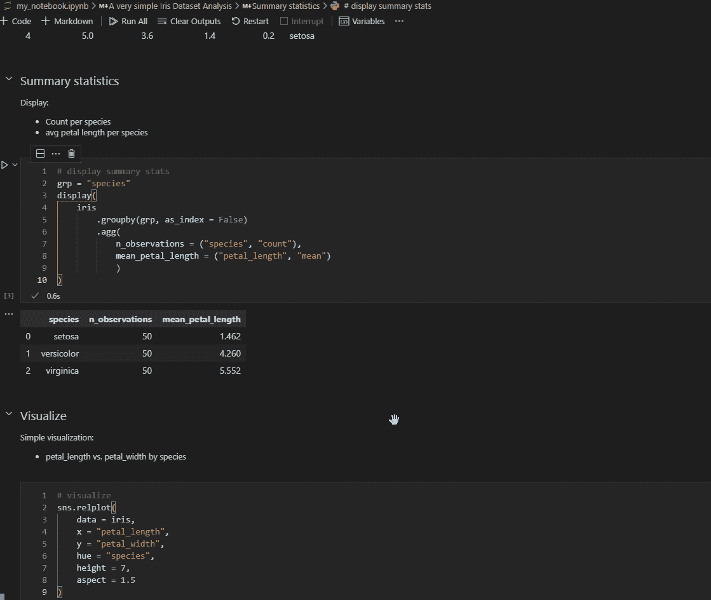
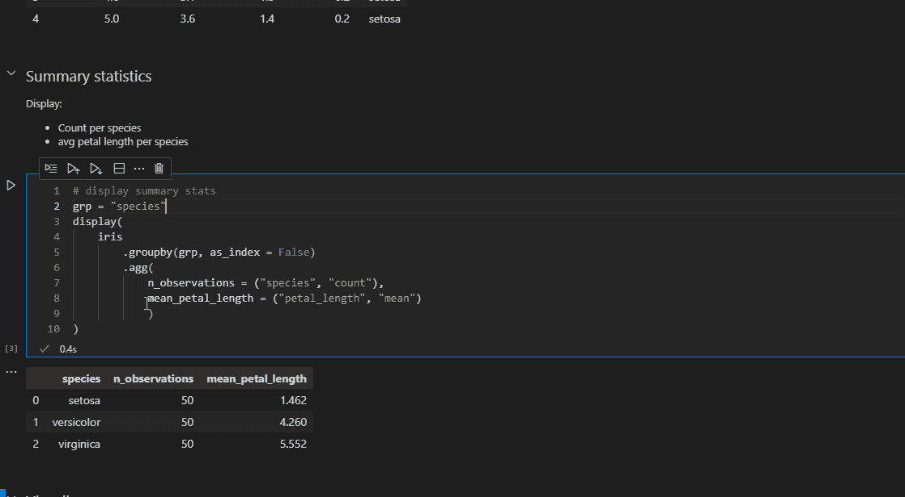
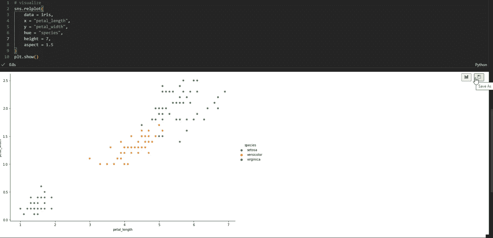
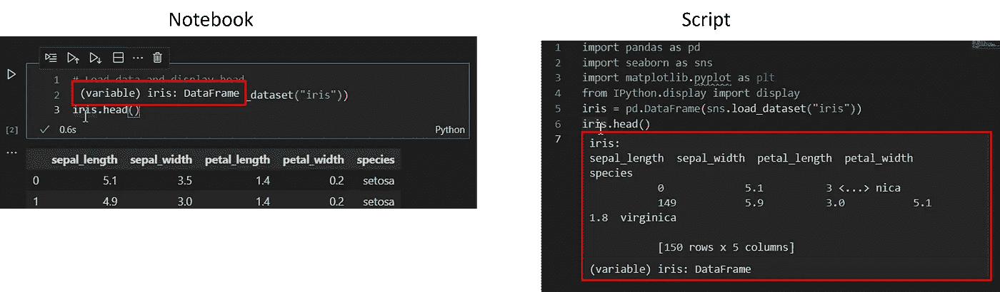
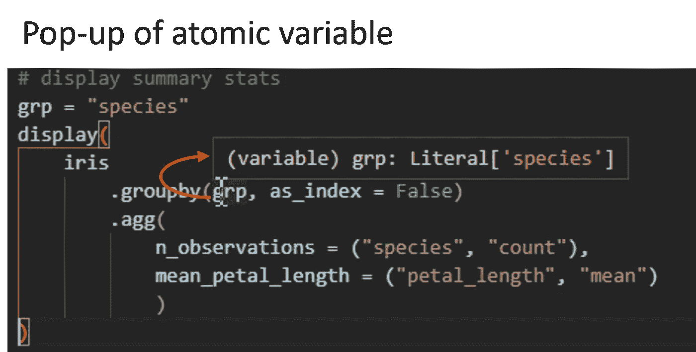
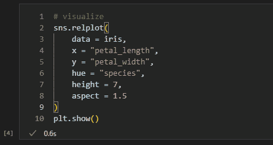
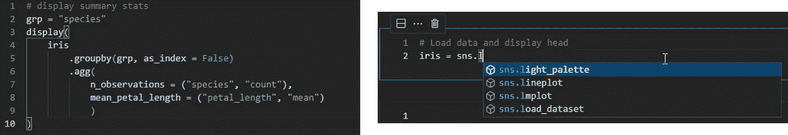
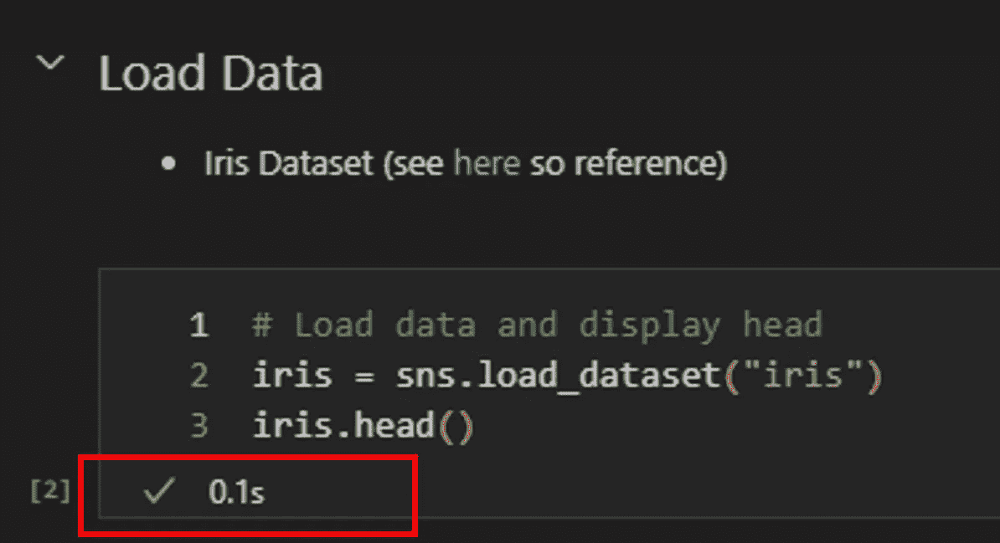
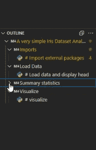
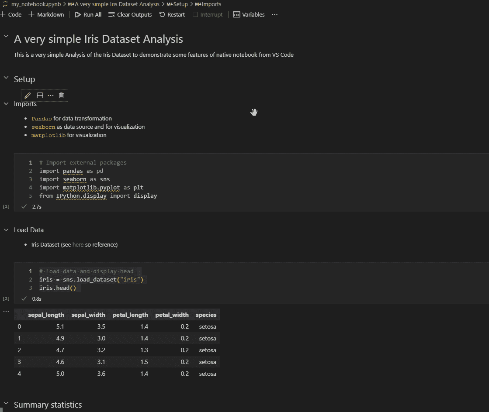

# VSCode 如何一跃成为 Jupyter 笔记本编辑器

> 原文：<https://towardsdatascience.com/how-vscode-has-leaped-forward-as-jupyter-notebook-editor-29bb688ae382?source=collection_archive---------6----------------------->

## 改进的笔记本 API 为 Jupyter 笔记本带来了 VSCode 在 Python 编辑方面的一些优势

使用(Jupyter)笔记本——Alejandro Escamilla 在 [Unsplash](https://unsplash.com?utm_source=medium&utm_medium=referral) 上拍摄的照片

在等待了半年多的“原生笔记本”之后，现在重新命名的笔记本 API 终于发布了标准的 VSCode 版本。我一直在不耐烦地等待我在 Jupyter 浏览器界面和 JupyterLab 中错过的这些变化，而它们已经在微软的多个 vlogs 中宣布，并且也在不稳定的状态下由 [Richard So](/vscode-jupyter-notebooks-are-getting-an-upgrade-cc9aaaefc744) 在 towardsdatascience 上进行了审查。Notebooks API 为 VSCode 带来了各种新的和改进的特性，其中一些已经在浏览器界面和 JupyterLab 中提供了，但还有一些没有。而那些在最新的 VSCode 版本中感觉更直观的。

就像[阿兰·琼斯](/why-im-using-vscode-for-jupyter-notebooks-abd2a6a157b9)解释他转换到 VSCode 作为笔记本编辑器的经历一样，我认为编辑 Jupyter 笔记本的门槛同样很低，而在使用浏览器界面或 JupyterLab 时编辑笔记本总是感觉不太好。当我从浏览器界面开始从 R 迁移到 Python 时，我被 RStudio 吸引住了，错过了我认为对数据分析来说必不可少的特性和可用性。继续，我在 JupyterLab 中也找不到这些特性。一切都感觉有点太费力了:打开*。ipynb* 文件通过命令行，而不是仅仅双击，变量探索只有代码，代码完成要么花了很长时间才出现，要么根本不工作。

与 Alan 相反，我不是偶然发现 VSCode 的。我一直在寻找一个更好的选择来使用 Jupyter 笔记本，最终选择了 VSCode。然而，使用 VSCode 的体验也并不完整。从 Python 脚本在 VSCode 中的工作方式来看，有几个特性在笔记本中无法正常工作。当我听说“原生笔记本”并开始等待的时候，我正处于重新开始寻找另一个工具的边缘。下面，我想简要介绍一下这些特性，它们不仅让我坚持使用 VSCode，还改进了我的工作流程和工作效率。

# 变量浏览器

让我们首先关注笔记本的内容。Jupyter 笔记本的流行很大程度上归功于数据科学的发展，这涉及到大量的数据探索和分析。虽然所有这些都可以通过代码来完成，但有时类似 excel 的过滤选项可能更高效、响应更快。

这就是变量浏览器的用武之地。这不是一个新功能，但对我这个前 RStudio 用户来说，这是一个巨大的卖点和基本要求。基本上，您可以在笔记本中浏览所有变量及其值。尤其是在数据框上，你甚至可以过滤和排序。它的速度确实有点慢，但当您想要探索数据集时，它可以完成工作。

使用变量资源管理器-按作者分类的图像

# 移动和复制单元格

使用 Jupyter 笔记本通常是非线性的，在您正在处理的单元格的上方和下方会引入变化和新的想法。我记得一个笑话是这样的“*”你能够确认并重现第二次运行笔记本的结果吗？*“这归因于这样一个事实，即在初始开发过程中运行单元的顺序与笔记本的结构几乎没有任何关系。JupyterLab 和浏览器界面似乎承认这一点，并且总是允许上下移动单元格。

在引入新的笔记本 API 之前，这是 VSCode 缺少的特性之一，您必须使用复制和粘贴。在 RStudio 中，你基本上是在一个可执行代码部分的 markdown 中工作，这是可以的。在基于 cell 的 Jupyter 笔记本中，这可能非常烦人，并导致我将整个笔记本转换为 Python 脚本来进行代码重构。现在，这些特性被纳入了 VSCode。你可以拖放单元格，拆分它们，也可以合并它们。

(顺便说一下，您可以使用 VS 代码将笔记本转换为 Python 脚本，结果脚本将笔记本的单元格结构保持为 markdown 单元格的代码块和注释块。这些块将以`# %% '开头，并被主要的 Python 编辑器(如 PyCharm、Spyder，当然还有 VSCode)解释为交互式终端的单元。)

移动和连接单元格—作者图片

# 将绘图保存到文件

与笔记本内容的一个交互通常只需要一行代码，就是将绘图保存到文件中。使用 VSCode 中的 Notebooks API，任何单元格的输出图都可以通过按一个按钮保存为文件。如果你愿意，它也可以通过按一个按钮来扩展。

一开始这听起来没什么大不了的。但是如果你曾经因为重新运行一个单元格或笔记本而覆盖了你需要的图，你会感激这一点。如果你曾经经历过有人在编辑一个情节的时候看着你的肩膀，他只是想要文件快点，你真的想要这个。有很多方法可以错误地输入“savefig ”,当有人不耐烦地观察你编码时，你会发现所有的方法。

此外，如果您重新打开笔记本并且在保存之前没有清除所有输出，保存绘图的选项仍然可用。如果通过代码保存图，则必须重新运行该笔记本的所有单元格，直到到达保存图的行。

在哪里可以找到“另存为”选项—作者图片

# 可变弹出窗口(提示和快速建议)

让我们从使用笔记本内容转移到使用编辑笔记本的 IDE。当您将光标悬停在某个变量上时，VSCode 会为您提供关于该变量的附加提示和建议。这包括变量的类型和它的一些内容。

然而，正如您在图中看到的，这个特性还没有完全实现。在 Python 脚本中，它在数据框上显示一些信息加内容，而笔记本中提供的唯一提示是“data frame”，*咄！*

可变弹出窗口笔记本(左)与脚本(右)-作者图片

它适用于原子变量，有时也适用于列表，当您在分析流程中使用一个设置在笔记本另一端的变量，并且您想要快速检查它的最新值时，这是非常有用的。用别人的笔记本工作的时候也是很大的帮助。

原子变量的弹出窗口-作者图片

# 多光标(和其他编程生活质量特性)

虽然上面提到的弹出窗口不一定是我从 IDE 中需要的功能，但我希望在现代 IDE 中有各种生活质量的功能。我选择在这里展示多光标，因为我用得最多。但是还有一些类似的其他特性是软件开发的标准。

你可以使用 Zen-Mode，有一个 git 集成，你可以通过一行一行地运行代码单元来调试，几乎所有的东西都可以分配一个可定制的键盘快捷键，当然，也可以并排打开各种标签左，右，上，下或者你想要的任何方式。

在笔记本中使用多光标—作者图片

# 扩展ˌ扩张

除此之外，VSCode 的体验还建立在一个几乎无止境的扩展生态系统之上。自从引入了笔记本 API 之后，大多数扩展也适用于笔记本。在提高生产力和减少错误的扩展中，有括号着色程序或智能感知，它们可以方便地安装在 VSCode 中，并在笔记本中提供。虽然我也将笔记本用作报告或演示工具，但我必须强调代码拼写检查器扩展，它在代码和 markdown 单元格中工作。

不幸的是，并不是所有的扩展都能发挥其全部功能或者没有错误。linter 有时会做非常奇怪的事情，但自从 2021 年 8 月更新以来，这种情况就不那么频繁了。我使用的 TODO Highlighter 扩展通常将所有标记的 TODO 放在一个列表中，可以通过侧边栏访问。但这并不适合。 *ipynb* 文件。

示例性扩展:括号着色(左)和智能(右)—作者图片

# 时机

最后，让我们转到在您的工作流程中使用笔记本。这些事情或多或少对我的工作效率产生了一些影响。对于较小的方面，首先是单元运行时间测量。默认情况下，单元格的执行时间将简单地显示在单元格下方。

自己创建这个特性并没有那么麻烦。您需要一个导入、一个赋值和一个打印语句来为 Python 中的单元格添加计时。但是通常情况下，你不会提前设置，尤其是当你需要的时候，因为一些事情花费的时间比预期的要长，你只需要知道花了多长时间。或者更确切地说，重新运行该单元需要多长时间。很方便，它现在就在那里。

单元格执行时间-作者图片

# 概述

对我的工作流程更有影响的是在你的笔记本上走动。如上所述，笔记本电脑通常以非线性方式发展和增长，导致在笔记本电脑的各个部分之间跳跃。大纲功能可以帮助您，因为它显示了笔记本目录的排序表。它选取第一行降价单元格和代码单元格(如果您在选项中启用了它),并根据基于降价的标题分层组织它们。

对我来说，在引入这个特性之前，代码单元的第一行在很多情况下都是注释。现在，这始终是一个有意义的评论，因为它使我寻找细胞的速度大大加快。这个特性基本上迫使我在设计单元时更加严格。

对于减价单元格中标题的用法，我的经验也是类似的。我有时使用标题，现在一直在使用。随着大纲的折叠和展开，我在笔记本中的定位变得更加有效，同时我的笔记本也有了更好的结构。

笔记本轮廓—按作者分类的图像

# 展开和折叠笔记本本身

对我的工作效率影响最大的是一个单元一个单元或一个部分一个部分地展开和折叠笔记本的能力。对于在单元格之间切换，折叠整个部分绝对有帮助，这样您需要的单元格只是您正在处理的单元格上方的一个短滚动条。

但这不仅提高了我的开发工作。通过完全控制笔记本中显示的内容，我可以带着它参加会议——当然不是每次会议，当然也不是在黑暗模式下。实际上，我可以带着折叠起来的笔记本，提前有更多的时间来做分析，而不是用尽时间来创建 PowerPoint 演示文稿。在会议中，我可以根据要求做一些小的调整。但是让我们现实一点，任何更大的调整都会停止会议，每个人都看着我编码，这不是高效编码的最佳条件。如果需要，我可以在会后根据会议中的问题和感兴趣的内容制作一份分发材料，并花时间对与利益相关方相关的内容进行提炼。

这可能只有我一个人在做，而且只是有时候，并且非常专注于隐藏所有的代码以不分散和迷惑涉众，但是当它工作的时候，它节省了时间。

当然，JupyterLab 提供了类似的目录、折叠和展开选项，浏览器界面至少部分通过扩展做到了这一点。然而，我个人认为 VSCode 实现更直观，我在本文中的重点是粗略地看一下 VSCode 为笔记本提供的体验的完整性，而不是直接的比较。

展开和折叠笔记本内容-按作者分类的图片

# 结论

虽然在一些功能上落后了很长时间，但 VSCode 不仅赶上了笔记本编辑器，而且还实现了飞跃。开发人员进一步表现出对持续改善笔记本体验的强烈兴趣，当错误和问题被推出编辑器时，更多的功能被推出。然而，对于 Jupyter 项目背后的开发人员来说，浏览器编辑器和 JupyterLab 也在不断改进。最终它归结为味道，但我希望我可能已经用这篇文章创造了一些胃口，在 VSCode 中尝试 Jupyter 笔记本。