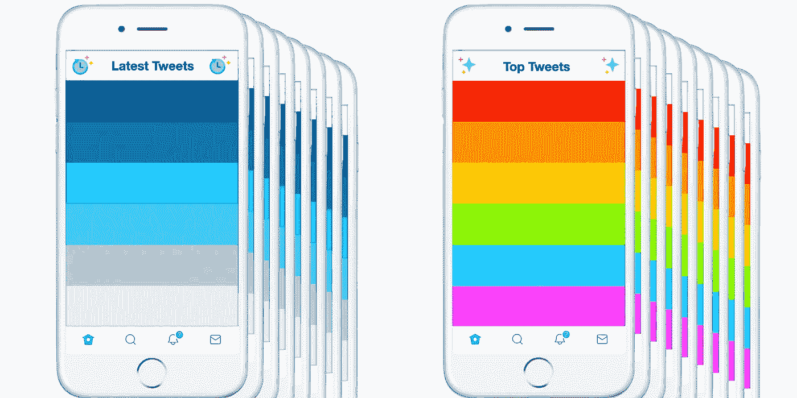
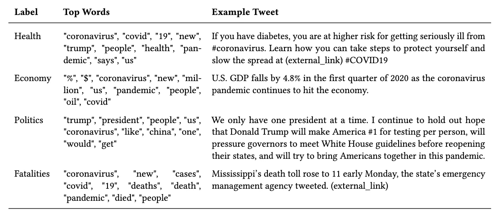

# 我们如何审计 Twitter 的时间线管理算法

> 原文：<https://towardsdatascience.com/how-we-audited-twitters-timeline-curation-algorithm-cb66bdd07e9f?source=collection_archive---------35----------------------->

*以下* [*的标记的例子*](https://themarkup.org/2020/02/25/editor-letter-julia-angwin) *，我把这个博客分成了* [*主要发现*](https://medium.com/technically-social/study-suggests-twitters-timeline-algorithm-buries-external-links-92cb5841082f) *和这个“展示你的作品”的板块。*

我们通过创建一组“傀儡”账户来测试 Twitter 的算法，然后将他们的“最新推文”时间表与他们的“热门推文”算法时间表进行比较。

这篇文章总结了我即将发表的论文《审核 Twitter 的时间线监管算法》中的技术细节。主要发现在本博客中[，全部细节在](https://medium.com/technically-social/study-suggests-twitters-timeline-algorithm-buries-external-links-92cb5841082f)[研究论文](https://jackbandy.com/files/twitter-audit-preprint-cscw2021.pdf)中，但这里我将总结如下:

*   🧦:我们如何设置“袜子木偶”账户来模仿典型用户
*   🦾我们如何运行自动时间线收集
*   🦠:我们是如何按主题对新冠肺炎的推文进行分类的
*   🟦 🟥我们如何为客户生成党派标签
*   💬其他常见问题

# 🧦设置袜子木偶

傀儡审计包括用自动化的“傀儡”账户模拟真实世界的原型账户。以下是我们用来在 Twitter 上寻找原型账户的四个步骤:

1.  定义潜在用户的初始池(在我们的例子中，所有在 Twitter 上关注美国国会议员的账户)
2.  检测用户群中的社区(使用[卢万算法](https://en.wikipedia.org/wiki/Louvain_method))
3.  从每个社区中选择一个原型用户(基于[度中心性](https://en.wikipedia.org/wiki/Centrality#Degree_centrality)
4.  验证原型用户不是机器人(在我们的例子中，使用[机器人计](https://botometer.osome.iu.edu))

2020 年 2 月，我收集了在 Twitter 上关注美国国会议员的所有账户，总共有 2000 万个账户。由于 Twitter API 的限制，我们在接下来的步骤中使用了 10，000 个账户的随机样本。

在这 10，000 个随机帐户中检测到社区后，我们将每个社区作为自己的网络，然后根据归一化的度中心性选择社区中最中心的用户。我们的目标是选择一个和其他用户关注许多相同账户的用户，而不仅仅是选择一个关注大量用户的账户。

一旦我们验证了原型用户不是机器人，我们就为每个人设置一个木偶，并使用与原型相同的帐号。一半的木偶模仿来自左倾社区的用户(例如，“[洛根左](https://twitter.com/logan_left)”)，另一半模仿来自右倾社区的用户(例如，“[丽贝卡右](https://twitter.com/right_rebecca)”)。

设置好这些账户后，是时候收集他们的时间表了。

# 🦾自动时间线收集

我写了一个自动化的 Python 脚本，使用 [Selenium](https://www.selenium.dev) 访问 Twitter、登录并收集时间线。所有木偶在一个月内每天收集两次时间线，每次收集按时间顺序排列的时间线中的前 50 条推文和算法时间线中的前 50 条推文。

我们的数据收集在 4 月 11 日失败了一次，当时 Twitter 要求对一个傀儡账户进行验证。我们从分析中排除了该数据点。

# 🦠聚类新冠肺炎推文

我们使用了一种叫做主题建模的方法来对我们收集的所有推文进行聚类。我们使用的算法被称为 [GSDMM](https://dl.acm.org/doi/abs/10.1145/2623330.2623715?casa_token=S5BZWg9ri5MAAAAA:aiorjUOhHbZeIw1UKFcDuAk7yRpwKLOIYp7upjabcRdzwPpP5rQNKu6wjt3rRszx_dF_7_zE5MgxQeA) ，这是标准 [LDA](https://en.wikipedia.org/wiki/Latent_Dirichlet_allocation) 方法的一种修改，更适合像 tweets 这样的短文档。

GSDMM 输出(微调参数后)是 134 个 tweets 集群，我手动检查并标记了这些集群，发现了四个与新冠肺炎相关的大集群。这是他们的样子:

论文中的表 5，详细描述了我们分析的四组推文

# 🟦 🟥制造党派标签

给党派贴标签是一项困难而复杂的任务，有许多不同的方法。在我们的案例中，我们最感兴趣的是曝光率，所以我们根据哪个社区关注(因此将会曝光)一个给定的帐户来标记帐户党派。

例如，我们的评分系统将本·夏皮罗和吉姆·乔丹标记为“右倾社区的影响者”，因为左倾社区很少关注他们的 Twitter 账户。出于类似的原因，皮特·布蒂吉格和卡玛拉·哈里斯被贴上了“左倾社区的影响者”的标签，因为右倾社区很少追随他们。

值得注意的是，像巴拉克·奥巴马、唐纳德·特朗普和希拉里·克林顿这样的账户在我们的评分系统中被贴上了“两党”的标签。这是因为在左倾社区和右倾社区都普遍遵循这些原则。基本上，因为我们的评分系统衡量右倾和左倾社区是否遵循这些帐户，它不一定反映这些人的政治。

# 💬常见问题解答

以下是我经常收到的(或预期会收到的)关于研究的一些问题的回答。

## 为什么只做了八个傀儡账户？

社区检测算法产生了八个主要社区，我们为每个社区创建了一个木偶。

## 八个账户的样本量太小了，对吧？

我们观察到的效果，包括更少的外部链接，大量的建议推文，以及增加的来源多样性，在八个木偶中是一致的。换句话说，我们有八个账户提供了影响的证据，零个账户提供了相反的证据。

我怀疑很多人会指出，八个账户不足以捕捉 Twitter 的宏观模式。但是这不是这项研究的目标。更确切地说，这更像是标记所称的“数字鞋革报告”，有点像是从 10 英尺处获得的视图，而不是从 10000 英尺处获得的视图。

即使从 10 英尺的角度来看，我们也为许多重要的模式提供了经验证据。理解这些模式如何推广到宏观模式需要不同的方法和更多的资源。

## 木偶们喜欢或点击推特了吗？

不，木偶们只是简单地每天滚动他们的时间线两次。Twitter 确实根据喜欢、点击和其他行为进行个性化，所以这是我们研究的一个局限。

## 为什么不查看所有推文，而不仅仅是前 50 条？

我们最初确实使用了被关注账户的所有推文作为基线(类似于[巴克西等人](https://science.sciencemag.org/content/348/6239/1130.full)在脸书算法研究中的“来自网络的潜力”基线)。然而，感兴趣的指标(例如外部链接率)在该基线和包含按时间顺序排列的时间线中最近 50 条推文的基线之间是不可区分的。此外，它还可以更恰当地比较 50 条按时间顺序排列的推文和 50 条按算法排列的推文。

## 为什么只收集了前 50 条推文，而不是 100 条或更多？

无论人们是在看搜索结果、广告还是社交媒体帖子，他们都倾向于关注顶部的项目。例如，在一项分析脸书算法的研究中， [Bakshy 等人](https://science.sciencemag.org/content/348/6239/1130.full)报告说，新闻提要中第一条的点击率约为 20%，但第 40 条的点击率下降到约 5%。这种现象被称为[位置偏差](https://doi.org/10.1145/1008992.1009079)我们决定将研究重点放在时间线中前 50 条推文的关键窗口，用户更有可能参与其中。

## 我还有一个问题…

请在评论中提问或给我发邮件！