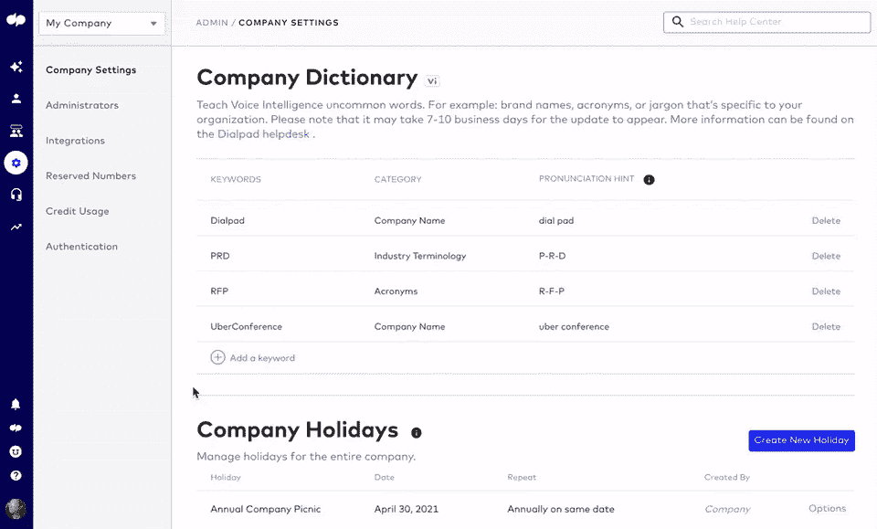
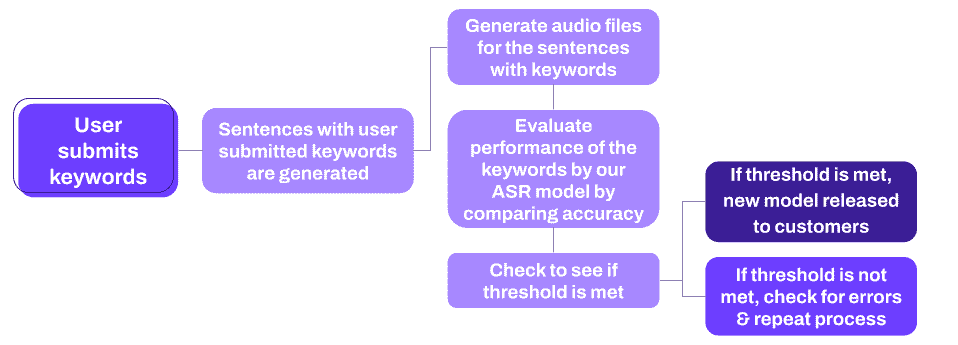

# 我们如何自动化我们的自动语音识别问答

> 原文：<https://towardsdatascience.com/how-we-automated-our-automatic-speech-recognition-qa-3c6d607c26ec?source=collection_archive---------40----------------------->

## 语言课程:ASR 系统自动化质量保证的逐步指南

Dialpad 能够不断提高我们转录准确性的方法之一是每周至少发布一个新的 ASR 模型。这些新模型是团队更新语言模型(LM)、声学模型(am)或向 Dialpad 字典添加新单词的结果。更多关于 LM、AM 和 dictionary 的信息，请查看我们的 [ASR 101 帖子](https://www.dialpad.com/blog/automatic-speech-recognition/)。

自然，这些更新将需要测试，以确保它们不会降低准确性或性能，并且它们实际上正在进行它们应该进行的更改。即使每个组件都没有更新，我们也会确保对它们进行测试，因为我们的 QA 流程关注的是这三个组件如何协同工作。但是这些模型的工作原理是将口头电话音频转换成文字形式的文本，你怎么能在不让我们的 QA 团队整天互相打测试电话的情况下测试呢？请继续阅读，了解我们如何能够真正实现这一过程的自动化！

**ASR 中的初步自动化每周 QA 流程**

**第一步——收集关键词**

Dialpad 客户可以访问一个名为“公司字典”的功能，他们可以在这里提交对他们的业务很重要的单词和短语，如行话、产品名称和竞争对手。这些条目允许我们的系统更好地识别我们的抄本中这些通常是独特的术语。每周我们都会提取收到的任何新条目，我们称之为关键短语，以及客户为其选择的类别(行话、竞争对手、产品等)。).从所有新的关键短语列表中，随机选择一个子样本在 QA 过程中进行测试。

图片由 Dialpad 提供

*dial pad 公司字典功能的实际应用。*

**步骤 2——测试关键短语**

使用实际的客户对话作为指导，我们为每个类别制定了一套 5 个模板句子，以模仿每个关键短语的真实用法。例如，公司关键短语的模板句子如下所示:

您好，感谢您致电*【公司】*，我是玛丽，有什么可以帮您的吗？

为了开始问答过程，我们将关键短语插入每个模板句子的相关部分。如上例所示,[company]将被替换为我们的关键短语列表中的实际公司名称。这将产生各种不同的句子，其中包含我们随机选择的子集中的每个关键短语。接下来，我们使用一种叫做文本到语音转换(TTS)的技术，这种技术正如它的名字所说的那样，它将文本转换成所讲单词的音频文件。对于子样本中每个随机选择的关键短语，我们将生成模板句子的 TTS 音频文件，从而为每个关键短语生成每个模板句子的音频文件。这些音频文件构成了我们本周的 QA 测试集。

**步骤 3——模型评估**

现在我们有了测试集，我们准备开始评估实际模型的性能。我们把我们的音频文件，并让我们的新旧模型转录它们。然后，我们可以计算结果转录的准确性，并将旧模型的准确性与我们想要发布的新模型的准确性进行比较。如果新模型比旧模型更精确，并且达到了可接受的基线精度，我们就可以把它发布给我们的客户！

另一方面，如果 QA 度量评估显示旧模型比新模型执行得更好，我们将首先尝试使用相同的测试集重新运行 QA 度量，并再次检查结果。如果我们发现旧型号的性能仍然比新型号好，我们将需要考虑其他因素来决定它是否适合发布。如果新模型:

*   拥有新的 LM/AM，并且他们的个人表现优于旧的 LM/AM，
*   与旧模型相比，新模型在额外的客户请求单词上被训练
*   集成后的所有其他功能都按预期工作，

…然后我们将继续发布新型号。幸运的是，两次没有通过这一部分的 QA 是非常罕见的，在过去的两年里只发生过几次。

下图显示了到目前为止的整个过程:

图片由 Dialpad 提供

**第 4 步——烟雾测试**

这是我们在部署模型之前在 QA 流程中执行的最后一步。完全公开，这一步还没有自动化，仍然需要手工操作。这是一个特别的步骤，我们将模型部署到试运行环境中，并执行一个测试呼叫来模拟类似客户的对话。在这一步中，我们将通过观察 ASR 模型产生的转录来了解它在产品中的表现，以及它与其他语音智能功能的表现，如[时刻](https://www.dialpad.com/blog/custom-moments-voice-intelligence/)和[通话后总结](https://www.dialpad.com/features/call-summary/)。

我们目前也在研究自动化这部分测试的选项！

**QA 自动化流程的未来更新**

随着我们将 ASR 扩展到不同的方言和其他语言，我们将一次部署多个模型。为了在自动化 QA 流程中适应多种 ASR 模型，我们计划:

1.  扩大句子模板的范围，以包括不同的方言和语言。
2.  为其他语言和方言更新我们的文本到语音转换技术。
3.  概括 QA 指标，以便相同的指标可以用于多种语言和方言。
4.  添加自动化集成和冒烟测试。