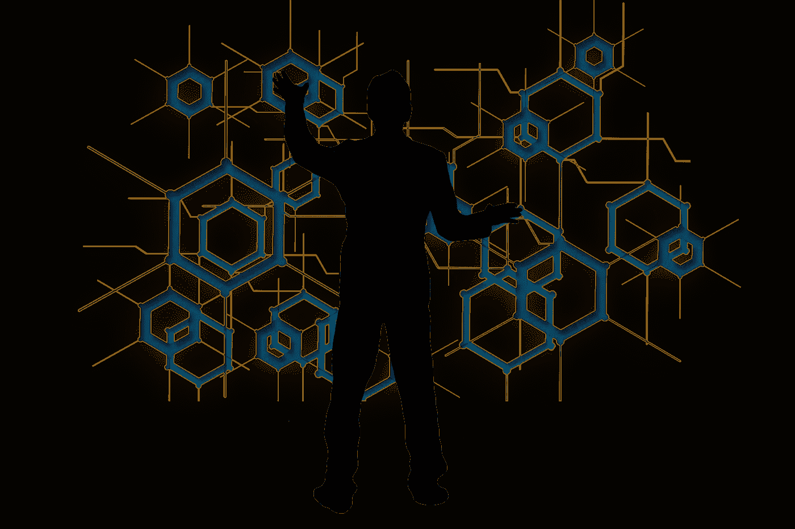
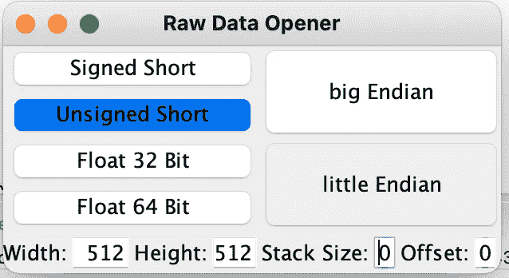
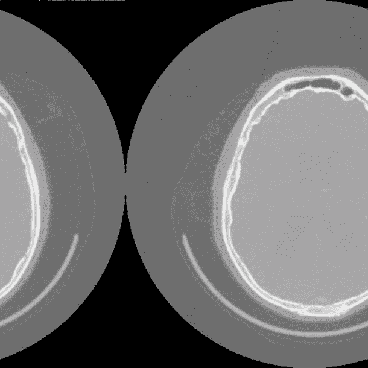
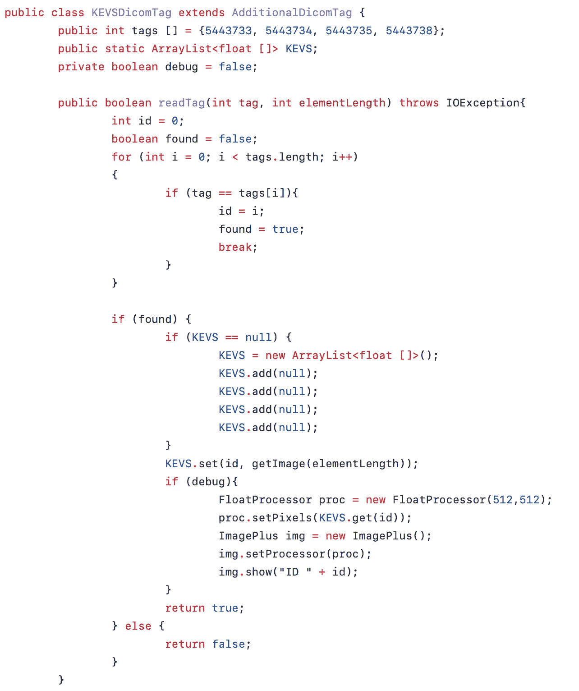
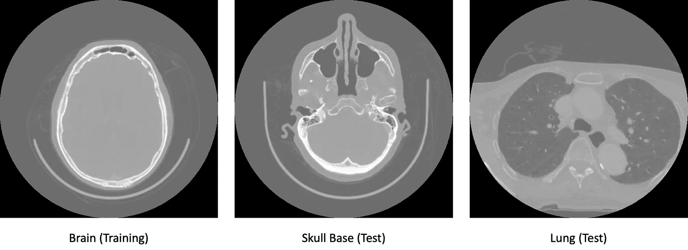
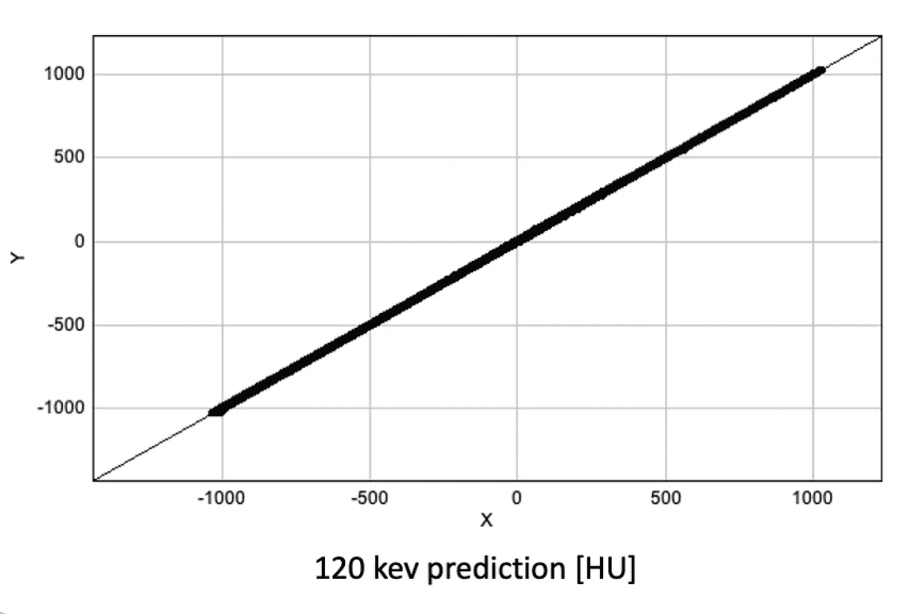
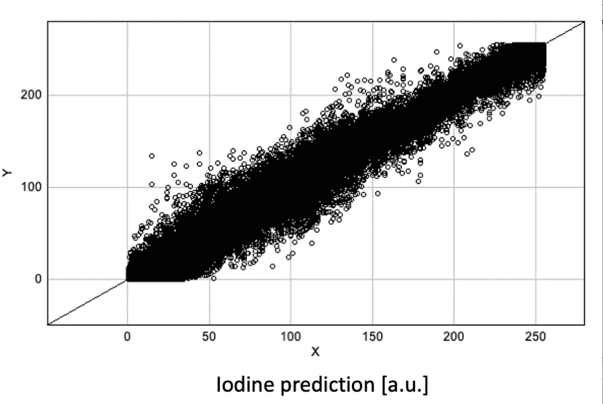

# 我们如何使用机器学习“入侵”商业图像处理软件

> 原文：<https://towardsdatascience.com/how-we-hacked-commercial-image-processing-software-using-machine-learning-38e9bbea3bb9?source=collection_archive---------27----------------------->

使用人工智能对算法进行逆向工程有多容易？图片来源: [Pixabay](https://pixabay.com/de/photos/hacker-angriff-maske-internet-2883632/)

## 机器学习和人工智能安全

## 标准 ML 工具允许逆向工程图像处理方法非常容易

机器学习提供了巨大的机会。它正在改变我们的世界，我们不得不重新思考我们当前的一些观点。例如，我们认为没有源代码的软件或多或少是安全的，不会被窃取。在这篇博文中，我将展示一些算法并不是这样。

特别是在[医学成像](https://link.springer.com/book/10.1007/978-3-319-96520-8)，设备制造商试图通过使用专有软件和图像格式来隐藏他们的软件是如何工作的。然而，在 ML 时代，这并不能提供足够的保护。在下文中，我将展示我们如何使用机器学习来理解商业医学图像处理方法的内部工作原理。请注意，我们使用 ML 保留设计的算法仅限于像素处理，这使得攻击特别容易。然而，如果可以访问输入和输出，同样的想法也适用于更复杂的图像处理方法。

如果能够访问正确的数据，逆向工程就变得非常容易。图片来源: [Pixabay](https://pixabay.com/illustrations/hexagon-blockchain-man-silhouette-6574882/)

在我们的例子中，我们可以访问基于 DICOM 的图像文件([医学成像的标准图像格式](https://en.wikipedia.org/wiki/DICOM))，其中包含输入数据以及算法的输出，同样是 DICOM 格式。一个主要问题是，标准图像查看器在输入文件中只会显示一个扫描/颜色通道。然而，我们从文献中得知[至少需要两个来计算处理后的图像。仔细观察输入文件的大小发现，它们比只包含一个颜色通道所需的大小大了大约 5 倍。](https://aapm.onlinelibrary.wiley.com/doi/abs/10.1002/mp.13317?casa_token=G1vzFIzG41sAAAAA:ZTm-XSBb1l9VYQ476DVeLozUj_QHajJ70HNYEIgKs-3XDTSh91WJPGx6NH_zaMv5JtwQ0OE94p5ILW-j)

第一步，我们使用了康拉德的原始数据打开器。它允许加载任何二进制文件，并解释为一个特定编码的图像。在我们的例子中，我们知道图像是 512x512 像素。

康拉德的原始数据开启器的屏幕截图。理解专有图像格式的好工具。图片由作者创建，并由 4.0 在 [CC 下发布](https://joinup.ec.europa.eu/licence/creative-commons-attribution-40-international-cc-40)

使用拖放功能，我们很快就找到了图像数据的编码。这将产生如下所示的图像。图像的偏移告诉您标题的大小和图像之间的位数(导致下一个图像的偏移更大)。

用原始数据打开器打开原始 DICOM 文件的结果。图像头被解释为图像内容，它将图像内容移动像素中的字节数。图片由作者创建，并由 4.0 在 [CC 下发布](https://joinup.ec.europa.eu/licence/creative-commons-attribution-40-international-cc-40)

这样，我们发现供应商在文件头中存储了 4 个额外的图像，这也解释了文件的大小。在下一步中，我们调整了 CONRAD 中的 DICOM 阅读器，以便从自定义 DICOM 标题中正确提取额外的图像数据。这可以用几行代码完成:

在 CONRAD 中读取新 DICOM 字段的代码示例。[点击这里查看 github](https://github.com/akmaier/CONRAD/blob/master/src/edu/stanford/rsl/conrad/io/KEVSDicomTag.java) 上的代码。图片由作者创建，并由 4.0 在 [CC 下发布](https://joinup.ec.europa.eu/licence/creative-commons-attribution-40-international-cc-40)

接下来，我们使用了康拉德的 ML 特性。它使用 [ImageJ 和 Weka 训练 ML 模型](https://imagej.net/plugins/tws/)。(我们训练的模型可以在这里找到。)为了证明 ML 能够多么容易地复制该算法，我们仅使用头部的单个切片图像来训练我们的模型。我们总共评估了三个不同的解剖区域:

在我们的例子中，只有一个图像用于训练(参见“大脑”)。测试在两个不同的身体部位进行。由作者创建并在 4.0 的 [CC 下发布的图片](https://joinup.ec.europa.eu/licence/creative-commons-attribution-40-international-cc-40)

对于单能图像的预测，我们在数值计算精度的范围内得到 ML 输出和 vendor 算法的相似性:

对于单能图像，预测是完美的。图片由作者创建，并由 4.0 在 [CC 下发布](https://joinup.ec.europa.eu/licence/creative-commons-attribution-40-international-cc-40)

此外，我们可以证明线性模型足以达到这种精度。通过与文献进行比较，我们可以非常精确地判断供应商实际上实现了哪种方法(在这篇博文中我们省略了这一点)。

在第二个攻击场景中，我们研究了一种非线性算法。在我们的例子中，这是一种物质分离方法。为了使任务更难，我们使用了一个参考，这个参考已经用附加软件处理过，包括重新缩放和裁剪。这意味着我们必须手动对齐输入和输出图像。由于重新缩放，完美的像素对齐不再可能，这给了我们一个更加真实的环境。尽管如此，我们仍然可以训练一个非线性 ML 模型，并实现惊人的相似性，即使是在看不见的解剖结构上。在所有情况下，结构相似性高于 0.98:

非线性方法也可以通过机器学习来学习。图片由作者创建，并由 4.0 在 [CC 下发布](https://joinup.ec.europa.eu/licence/creative-commons-attribution-40-international-cc-40)

我们的见解是，供应商使用非线性模型来解决任务。在接下来的步骤中，我们可以应用[奥卡姆剃刀](https://en.wikipedia.org/wiki/Occam%27s_razor)来识别具有最少参数的非线性模型，该模型最好地模仿供应商的模型。然而，如果我们只对复制/再现供应商的算法感兴趣，那么我们已经使用这个简单的 ML 方法完成了。

现在用机器学习逆向工程图像处理算法是儿戏吗？图片来源: [Pixabay](https://pixabay.com/photos/children-win-success-video-game-593313/)

显然，这些结果有一定的含义。如果您可以访问图像处理方法的输入和输出，您可以使用 ML 非常快速地创建一个副本。但是，出于文档目的，您可能需要像我们的医疗示例中一样披露这一点(根据医疗设备法律，使用电离辐射创建的图像必须在许多国家存储)。因此，任何竞争者都可以利用 ML 的力量非常容易地对你的软件进行逆向工程。

鉴于这些观察，我相信我们可能会重新考虑在许多应用中反对开源软件的原因。如果你的软件可以这么容易地被黑掉，为什么不直接开源呢？

你可以在我们的文章“[中阅读完整的故事。在机器学习的时代，专有软件还能提供知识产权保护吗？](https://arxiv.org/abs/2112.03678)”，最近在德国医学影像处理研讨会上接受。

如果你喜欢这篇文章，你可以在这里找到[更多的文章，在这里](https://towardsdatascience.com/@akmaier)找到更多关于机器学习的教育材料[，或者看看我们的](https://lme.tf.fau.de/teaching/free-deep-learning-resources/)[深度](https://www.youtube.com/watch?v=p-_Stl0t3kU&list=PLpOGQvPCDQzvgpD3S0vTy7bJe2pf_yJFj)学习 讲座。如果你想在未来了解更多的文章、视频和研究，我也会很感激关注 YouTube、Twitter、脸书、LinkedIn。本文以[知识共享 4.0 归属许可](https://creativecommons.org/licenses/by/4.0/deed.de)发布，如果引用，可以转载和修改。如果你有兴趣从视频讲座中生成文字记录，试试[自动博客](http://autoblog.tf.fau.de/)。